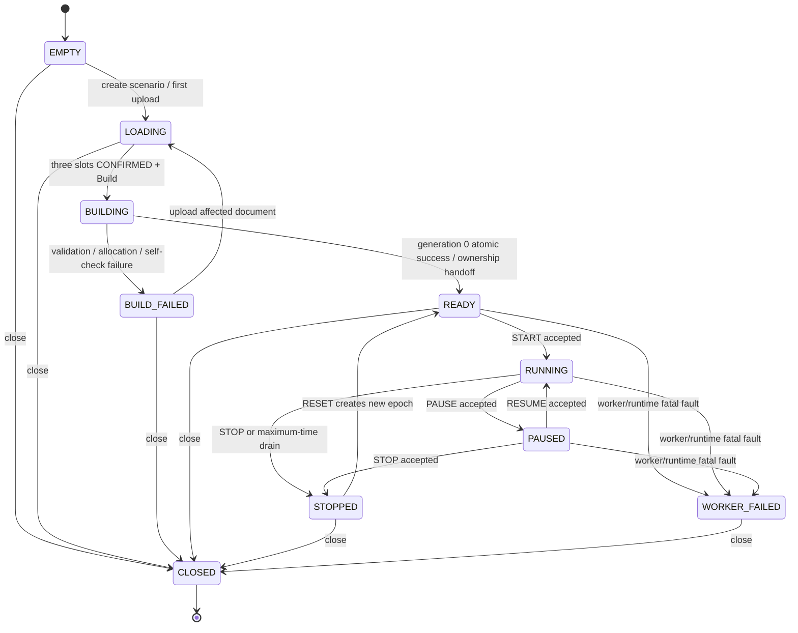
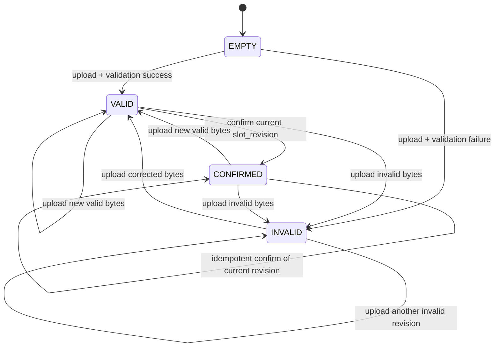
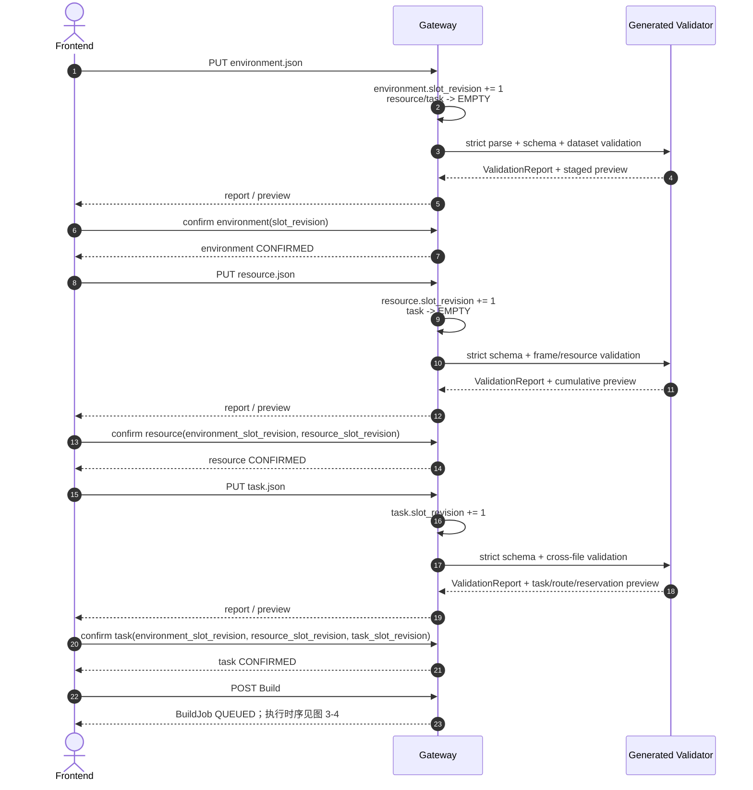
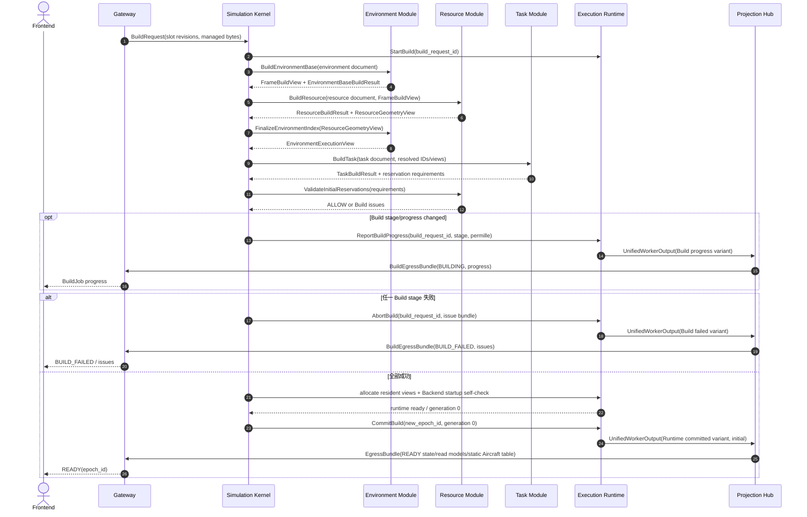
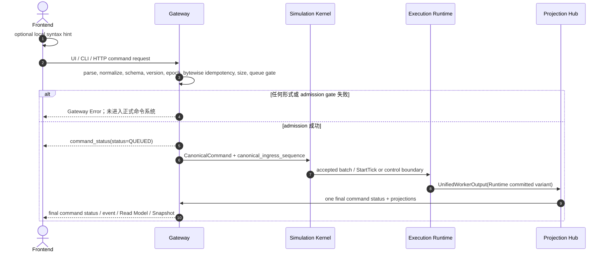
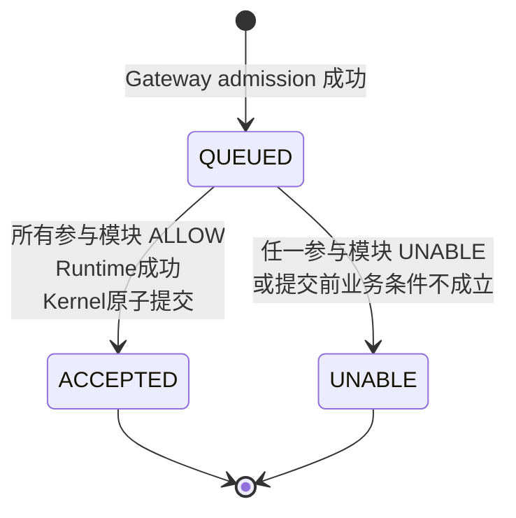
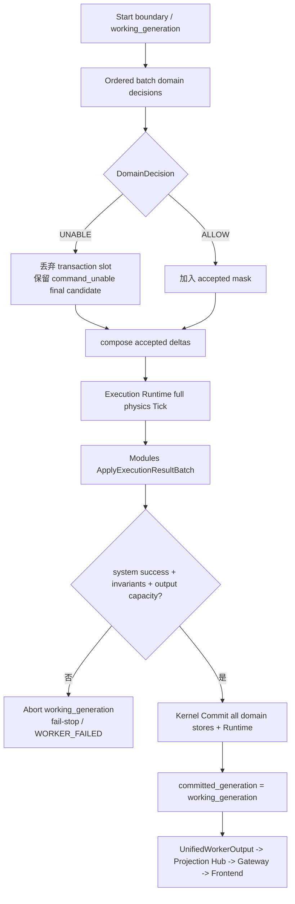
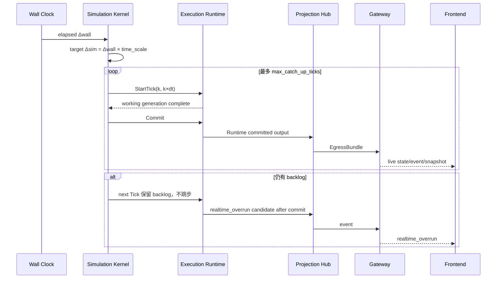

# Simulation Kernel

定义 Session 权威移交、DocumentSlot/Build、Gateway 边界、CommandStatus、operation routing、shadow transaction、generation、pacing、控制命令和 fault。

## 内容来源
- 设计：第 3 章（3. Simulation Kernel）

> 本文件是权威输入文档的分层视图。若拆分文本与源文档发生差异，以《LightBlueSky v8.0 统一设计规范》为系统设计与公开合同权威，以《HITL 大阶段切换规范》为当前项目阶段推进与人工验收权威。

## 规范正文

## 3. Simulation Kernel

### 3.1 模块目标

Simulation Kernel 是 Runtime 阶段 session、Tick、命令排序、模块路由、事务编排和原子提交的唯一权威协调者。Gateway 在 Build 成功前拥有 `EMPTY/LOADING/BUILDING/BUILD_FAILED`；generation 0 成功提交时，公开 SessionState 权威原子移交给 Kernel。

Kernel 只拥有：

```text
Runtime SessionState          # READY/RUNNING/PAUSED/STOPPED/WORKER_FAILED
epoch_id / tick_index / t_s
canonical_ingress_sequence
CanonicalReferenceDirectory（只读 ID 解析）
operation routing metadata
TransactionBindingSlot
transaction slot / working generation / committed generation
Tick pacing / backlog / overrun state
worker fault latch
```

Kernel 不负责：

- HTTP/CLI 解析、DocumentSlot 或外部 Schema 形式校验；
- TaskGraph、reservation、airspace 或 aircraft motion 的业务写入；
- event、Read Model、ViewerSnapshot 的投影；
- 直接向 Gateway 输出运行状态；
- 对 Warp working array 作公开查询；
- 实现 Task 或 Resource 业务规则。

### 3.2 Session 状态机

公开 `SessionState` 固定为：

```text
EMPTY
LOADING
BUILDING
BUILD_FAILED
READY
RUNNING
PAUSED
STOPPED
WORKER_FAILED
CLOSED
```

其中 `EMPTY/LOADING/BUILDING/BUILD_FAILED` 由 Gateway 权威拥有；`READY/RUNNING/PAUSED/STOPPED/WORKER_FAILED` 由 Kernel 权威拥有；worker teardown 完成后的 `CLOSED` 再由 Gateway 权威拥有。`LOADING` 由三个 DocumentSlot 的当前状态派生，不单独保存第二份可写状态。

**图 3-1　Session 状态机与所有权移交（权威）**



状态约束：

| State | 文档修改 | START | Mutation | Query | STOP | RESET |
|---|---:|---:|---:|---:|---:|---:|
| EMPTY/LOADING | 是 | 否 | 否 | staged preview only | 否 | 否 |
| BUILDING | 否 | 否 | 否 | build progress | 否 | 否 |
| BUILD_FAILED | 是 | 否 | 否 | issues/build report | 否 | 否 |
| READY | 否 | 是 | **否** | 是，tick 0 | 否 | 否 |
| RUNNING | 否 | 否 | 是 | 是 | 是 | 否 |
| PAUSED | 否 | 否 | 是；在下一次 RESUME 后首个 Tick apply | 是 | 是 | 否 |
| STOPPED | 否 | 否 | 否 | 是 | 否 | 是 |
| WORKER_FAILED | 否 | 否 | 否 | 最后缓存状态 | 否 | 否 |
| CLOSED | 否 | 否 | 否 | 否 | 否 | 否 |

READY query 读取 `tick_index=0,t_s=0` 的 Projection cache，不推进 Tick。未放置 Aircraft 的动态字段必须省略，不得使整个对象查询失败。

### 3.3 DocumentSlot 状态机

每个输入文件对应一个独立 `DocumentSlot`，固定状态：

```text
EMPTY
VALID
INVALID
CONFIRMED
```

**图 3-2　DocumentSlot 状态机（权威）**



每个 slot 只保存当前上传，不保存历史版本：

```text
slot_revision_u64
current_bytes?
current_validation_report?
state
```

规则：

1. 每次上传，无论 VALID 或 INVALID，先令该 slot 的 `slot_revision_u64 += 1`，再保存当前 bytes 并校验。
2. 不计算文档摘要，不保留历史revision或下游旧文档。
3. INVALID bytes 不得被猜测、修复或部分转换成可 Build 数据。
4. 上传 environment 后，resource slot 与 task slot立即重置为 `EMPTY`；上传 resource 后，task slot立即重置为 `EMPTY`。用户必须重新上传下游文件。
5. Confirm 请求必须携带目标 slot 当前 `slot_revision_u64` 和所有上游 slot 当前 `slot_revision_u64`；任一不一致返回 HTTP 409 `REVISION_MISMATCH`。
6. Scenario 维护独立的 `preview_revision_u64`。每次 upload、validation result、confirm、上游清空、Build progress/result或其他改变 staged UI 可见事实的操作都严格加 1。
7. Staged summary、collection、detail 和 issue page 都必须携带同一个 `preview_revision_u64`；客户端提供的 `expected_preview_revision_u64` 过期时返回 `PREVIEW_REVISION_CHANGED`，本轮分页结果全部丢弃并从 summary 重取。

### 3.4 三文件 staged loading

装载顺序固定为：

```text
environment -> resource -> task -> Build
```

- Environment 必须先确认，因为 Resource geometry 和 Task waypoint 依赖 FrameRegistry。
- Resource 必须在 Task 前确认，因为 Task 引用 Aircraft 和 Facility Resource。
- Task 确认后才能 Build。
- Build 成功后禁止热重载；必须关闭 session 并重新 staged loading。

**图 3-3　三文件 staged loading sequence（权威）**



Confirm body 的 binding 固定为：

```text
environment:
  environment_slot_revision_u64

resource:
  environment_slot_revision_u64
  resource_slot_revision_u64

task:
  environment_slot_revision_u64
  resource_slot_revision_u64
  task_slot_revision_u64
```

Warning仍必须展示并要求用户显式确认当前revision。任一 revision binding 不一致返回 `REVISION_MISMATCH`；存在 validation error 返回 `DOCUMENT_NOT_VALID`。

### 3.5 原子 Build

Build 输入必须是三个 exact confirmed `slot_revision_u64` 对应的当前 bytes。Build 在临时对象中依次完成：

```text
Environment base definition + FrameRegistry
Resource Registry + Aircraft catalog + ResourceGeometryView
Environment index finalization with ResourceGeometryView
TaskGraph + route occurrence + Ground Plan + initial reservation graph
StableIdRegistry + host layouts
Execution Runtime View + Backend allocation
Warp startup self-check
initial committed generation 0
Projection initial Read Model / static Aircraft table / ViewerSnapshot metadata
```

**图 3-4　Build sequence（权威）**



原子性：任何阶段失败不得留下可被下一次 Build 复用的半成品 ID、Arena row、reservation、device allocation、index 或 generation。BUILD_FAILED 修正后必须重新上传受影响文档及被清空的下游文档，并从三个当前 confirmed inputs 全量重建临时对象。

Build progress、failure 与 Runtime committed output 使用同一个 Worker egress tagged union。Build variant 不创建 CommandStatus、event、Read Model 或 ViewerSnapshot；READY 必须由 generation 0 的 Runtime committed variant发布。

### 3.6 Gateway 与 Kernel 边界

#### 3.6.1 Frontend 提示性形式校验

Frontend 可以检查：

```text
CLI 可解析性
必填参数是否填写
数字格式
枚举字面量
JSON 基本形状
```

该校验只用于即时提示，不是权威结论；其他 HTTP 客户端可以绕过 Frontend。

#### 3.6.2 Gateway 权威形式校验

Gateway 是外部请求的正式合同边界，负责：

```text
CLI 文本解析
UI/HTTP request 规范化
operation 是否存在
参数 Schema、字段类型、必填字段、字段组合
protocol/contract version
command_id / epoch_id
请求大小
canonical payload bytes
幂等记录直接字节比较
入口队列容量
CanonicalCommand 生成
```

形式或 admission 校验失败统一返回 **Error**。Error 表示请求没有进入正式命令系统，因此：

```text
不进入 Kernel
不分配 canonical_ingress_sequence
不创建 Command 状态记录
不产生 event
不产生 QUEUED
```

典型 Error：

```text
缺少必填参数
数字格式错误
未知 operation
Command Schema 不合法
epoch mismatch
同 command_id 不同 canonical payload bytes
payload 过大
command queue full
worker unavailable
```

#### 3.6.3 CanonicalCommand

```json
{
  "contract_version": "1.0.0",
  "command_id": "018f5ee1-6d47-7d6c-b559-8d59f6d3a042",
  "epoch_id": "018f5ed0-eceb-7b9a-8e5e-acde00000001",
  "operation": "set_selected",
  "args": {
    "aircraft_id": "AC101",
    "spd_mps": 45.0,
    "deg": 90.0,
    "alt_m": 160.0,
    "vs_mps": 2.0
  }
}
```

Gateway admission 后补充内部字段：

```text
operation_code_u16
operation_class_u8
participant_mask_u8
source_u8
canonical_ingress_sequence_u64
accepted_wall_time_utc
canonical_payload_bytes
```

`canonical_payload_bytes` 是规范化后的 CanonicalCommand public payload 的确定性 UTF-8 bytes。命令幂等不计算内容摘要，直接比较保存的 bytes。`source_u8` 只记录来源，不提供优先级。UI、CLI 和直接 HTTP 只要表达同一 operation，就使用同一参数合同、同一 admission gate 和同一 canonical ordering；不得给人工按钮、CLI 或任一客户端隐式插队。

`command_id` 是 UUID string；客户端可以提供，省略时 Gateway 生成 UUIDv7。普通命令 key 为 `(epoch_id,command_id)`：

- 相同 key + 完全相同 `canonical_payload_bytes`：返回原 receipt/当前状态，不重新执行；
- 相同 key + bytes 不同：Gateway Error `COMMAND_ID_REUSE_MISMATCH`；
- key miss：完成所有 admission gate 后才分配 ingress sequence。

RESET 使用进程期幂等索引 `(scenario_id, stopped_epoch_id, command_id)`。Gateway 对 RESET 的顺序固定为：

```text
parse / normalize / canonical payload bytes
-> lookup (scenario_id, request.epoch_id, command_id) before current-epoch comparison
-> matching stored bytes: return original receipt/final/result bytes
-> different stored bytes: Gateway Error COMMAND_ID_REUSE_MISMATCH
-> key miss: require request.epoch_id == current epoch and SessionState == STOPPED
-> allocate ingress sequence, QUEUED, execute RESET
```

成功 result 固定为 `{old_epoch_id,new_epoch_id,state:"READY"}`。该索引只服务 scenario 进程生命周期内的幂等性，不是 event history、持久化或 Replay 存储；Scenario CLOSED 后可以释放。新 epoch 使用新的普通 command table。

#### 3.6.4 Query 边界

`TIME`、`POS`、`SHOW_TASK`、`SHOW_ROUTE`、`LIST_TASKS`、`LIST_WARNINGS`、`VOL SHOW`、`VOL LIST`、`AXLS`、`RSRC` 和 `HELP` 属于 Query operation。它们由 Gateway 规范化为 `CanonicalQuery`，只读 Projection cache：

- 不进入 CommandStatus 状态机；
- 不分配 canonical ingress sequence；
- 不产生 command event；
- 不触发 GPU gather；
- 响应必须携带 freshness。

所有 Mutation 和 Control operation 均使用 `CanonicalCommand`、QUEUED 和最终 CommandStatus。

#### 3.6.5 Gateway admission sequence

**图 3-5　Gateway admission sequence（权威）**



Gateway Error 分支是唯一允许不经过 Kernel 和 Projection Hub 直接返回 Frontend 的分支。QUEUED 是 Gateway control message，不是 event，不分配 event sequence。命令一旦 QUEUED，最终 ACCEPTED/UNABLE 只能来自已提交输出，经 Projection Hub 和 Gateway 发布。

### 3.7 CommandStatus 与 DomainDecision

#### 3.7.1 CommandStatus

第一版只允许：

```text
QUEUED
ACCEPTED
UNABLE
```

**图 3-6　CommandStatus 状态机（权威）**



Gateway Error 不属于该状态机。QUEUED 由 Gateway 作为 `command_status` control message立即发送，不是 event；Projection Hub 只投影最终 ACCEPTED/UNABLE 及其 command event。

#### 3.7.2 DomainDecision

Task、Resource、Environment 只允许返回：

```text
ALLOW
UNABLE
```

ALLOW 表示该模块允许命令进入后续计算，并能提供 Candidate Delta 或 Runtime View。UNABLE 表示命令已正式进入系统，但不能提交。UNABLE 必须携带注册的 `reason_code` 和结构化 diagnostics。

典型 reason：

```text
ID_NOT_FOUND
TASK_TERMINAL
INVALID_TASK_PHASE
RESOURCE_NOT_FOUND
RESOURCE_OCCUPIED
RESOURCE_CLOSED
RESOURCE_BLOCKED
CAPABILITY_UNSUPPORTED
RESERVATION_CONFLICT
ROUTE_NOT_COMPLETE
GEOMETRY_INVALID
ROUTE_CONTEXT_INVALID
```

UNABLE 可以表示永久不可执行、当前条件不可执行、修改输入后可重试或等待状态变化后可重试；性质由 reason 和 diagnostics 表达，不增加状态枚举。

#### 3.7.3 系统故障

以下不得包装为业务 UNABLE：

```text
数组越界
运行时不变量破坏
内部协议损坏
CUDA runtime failure
worker crash
无法提交 authoritative output
candidate buffer authoritative overflow
```

这类问题进入 WORKER_FAILED/fail-stop。若last committed arrays仍可读，Execution Runtime只可按附录F.12生成`WORKER_FAILED_LATCH` fault repeat，经Projection Hub/Gateway通知Frontend；该buffer不得生成受影响命令的ACCEPTED/UNABLE。若无法形成该buffer，Gateway supervisor只发送transport-level failure notification，不伪造CommandStatus。

### 3.8 Operation Registry 与参与模块路由

每个 operation registry row 必须声明：

```text
operation_code_u16
canonical_name
primary_cli_spelling
operation_class             # MUTATION / CONTROL / QUERY
allowed_session_states
allowed_task/aircraft phases
participant_mask            # TASK / RESOURCE / ENVIRONMENT
orchestration_mode          # SINGLE / PARALLEL_TR / SEQUENTIAL_TR
argument_schema
result_schema
reason_allowlist
```

Kernel 严格按 registry 路由：

- Task-only：HOLD_TASK、REL_TASK、SEL、DCT、JNL、RTE、AT；
- Resource-only：RSRC SET；
- Environment-only：VOL ADD/RM/SET、AX SET；
- Task+Resource 并行：TKF、TAXI、CXL_TASK、LND；
- Task+Resource 顺序：ADD_TASK、SLOT、CHGRES、CHGAC、DIVERT、RSRCUSE END；
- Control：START、PAUSE、RESUME、RATE、STOP、RESET；
- Query 不进入 Kernel。

`ADD_TASK`、`TKF`、`TAXI`、`LND`、`DIVERT` 不再包含 Environment participant。EnvironmentExecutionView 仍长期驻留 Runtime，并在后续完整物理 Tick 中参与环境查询和碰撞。

T/R 并行 operation在同一轮分发两个 batch并等待两边决定。T/R 顺序 operation固定为：

```text
Kernel -> Task
Task -> Kernel:
  TaskCandidateHandle
  operation-specific ResourceRequirement

Kernel -> Resource:
  ResourceRequirement + TransactionBindingSlot
Resource -> Kernel:
  ResourceCandidateHandle
  operation-specific ResourceGrant
```

不建立 Task→Resource 直接接口，不进行第三次 Task 业务判定。Kernel 只绑定 handles、合成 accepted mask并执行 Commit/Abort，不实现领域规则。实现必须使用批量 Intent/Decision arrays，禁止逐命令 JSON 序列化、逐命令 IPC 或逐命令 CUDA synchronize。

### 3.9 命令排序与 shadow transaction

Kernel 维护全部 admitted pending command。每个 control/physics boundary先确定满足时间门禁的 eligible set，再按 `canonical_ingress_sequence` 严格递增处理；尚未满足门禁的命令保持 QUEUED，但不得造成 head-of-line blocking。前一条最终 ALLOW 的 Candidate Delta 对同一 boundary 后一条的 shadow preflight可见；前一条 UNABLE 的 Candidate Delta不可见。

普通 Mutation 的时间门禁通常为下一个物理 Tick。早于 `scheduled_takeoff_s` admission 的 `TKF` 保留原 ingress sequence，在第一个 `t_s >= scheduled_takeoff_s` 的物理 boundary才进入当前条件判定。STOP 按第 3.14 节将仍未 eligible/apply 的命令结束为 `SESSION_STOPPED_BEFORE_APPLY`。

每条命令分配：

```text
transaction_slot_u32
TransactionBindingSlot
```

Candidate Delta 写入隔离的预分配区域。流程：

```text
registry lookup
-> ordered shadow state
-> batch participant decision
-> for sequential T/R: bind Task candidate/requirement to Resource candidate/grant
-> accepted transaction mask
-> compose accepted deltas in ingress order
-> one complete physics Tick
-> module ApplyExecutionResultBatch
-> atomic generation commit
```

Execution Runtime 不参与业务 preflight，也不产生逐命令业务判定结果。失败命令不得消费 stable ID、route/ground occurrence serial、reservation row、capacity lane、Arena count 或 generation。

### 3.10 两阶段计算与原子 Commit/Abort

#### 3.10.1 Working generation

每 Tick：

```text
next_generation = committed_generation + 1
working_generation = next_generation
```

三个 Module 和 Execution Runtime 只写 working buffers。公开读取和 Projection Hub 只能读取 committed buffers。

#### 3.10.2 批量领域判定与执行结果应用

领域判定在 Runtime 计算前完成：

```text
Typed Intent batches
-> DomainDecision batches
-> accepted_transaction_mask
-> Compact Delta batches
```

Execution Runtime按 ingress sequence应用 accepted delta并执行一次完整物理 Tick，随后分别返回 `TaskExecutionResultBatch`、`ResourceExecutionResultBatch`、`EnvironmentExecutionResultBatch`。三个 Module以 Tick级 `ApplyExecutionResultBatch` 生成 Final Delta；不得逐命令往返，不得由 Runtime决定业务 ACCEPTED/UNABLE。

#### 3.10.3 Commit 条件

必须全部满足：

```text
所有 accepted transaction 的参与模块为 ALLOW
所有 domain Final Delta 通过 invariant check
Execution Runtime 完整计算成功
无 authoritative overflow
Task/Resource/Environment generation 一致
UnifiedWorkerOutput 可安全发布
```

**图 3-7　Commit / Abort 图（权威）**



Abort 必须使所有 working count/header/generation 回到上一个 committed 状态。不得只回滚某一 Store 而保留其他 Store 的新 generation。failed Mutation不得留下任何领域业务 event；`command_unable` 是该失败命令的合法最终 command event，不属于部分领域 mutation。

#### 3.10.4 完整 Tick sequence

第 3 部分的完整 Kernel Tick 时序直接引用图 2-2，不重复绘制第二张同义权威图。

### 3.11 Kernel 与 Execution Runtime 的窄控制线

`TickControlPort` 只允许窄生命周期/计算控制：

```text
StartBuild(build_request_id)
ReportBuildProgress(build_request_id, stage_code, progress_permille, summary_handle)
CommitBuild(new_epoch_id, generation=0)
AbortBuild(build_request_id, issue_bundle_handle)
StartTick(tick_id, t_s, dt_s, working_generation, accepted_transaction_mask)
Commit(working_generation, final_domain_delta_handles)
Abort(working_generation, fault_code)
SetPacingState(running|paused, time_scale)
ResetGeneration(new_epoch_id, generation=0)
GetRuntimeHealth()
```

该 Port 不传完整 Task、Resource、Environment 业务对象，不提供公开 query，不传 JSON，不允许 Kernel 直接读取 working arrays。Build progress/failure通过统一 Worker output 的 Build variant发布；运行输出使用 Runtime committed variant。

### 3.12 Tick pacing、wall time 与 backlog

实时 outer loop：

```text
target_sim_advance = wall_elapsed_s * active_time_scale

while simulated_advance < target and ticks < max_catch_up_ticks:
    run_one_tick()

if backlog remains:
    emit realtime_overrun candidate
    retain backlog for next wall iteration
```

不得跳过物理 Tick 追赶 wall time。默认 `max_catch_up_ticks=5`。第一版只有这一固定行为，不暴露策略选择字段；未来需要多策略时再进入第11章设计。

**图 3-8　仿真时间与 wall time 时间轴（权威）**



### 3.13 maximum simulation time 与 reservation 延误传播 drain

`maximum_simulation_time_s` 是 nominal horizon。达到 horizon 后：

1. 不再自动启动 `scheduled_takeoff_s > horizon` 的 Task；
2. 已在 horizon 前开始或因上游延误本应开始的 Task/reservation 继续；
3. reservation 延误在同资源、同 Task 和同 Aircraft 后续 Task 间的确定性传播、ground recovery、resource recovery 和 active Task 必须完成；
4. 以下条件全部满足后自动 STOPPED：

```text
t_s >= maximum_simulation_time_s
no active nonterminal Task whose scheduled_takeoff_s <= horizon
no reservation in PREPARE / IN_PROGRESS / OCCUPIED / RECOVERY
no propagation work item
no active managed ground/takeoff/landing flow
current generation committed
final EgressBundle published
```

实际结束时间可以超过 nominal horizon，不得直接截断受影响 Task。

### 3.14 START、PAUSE、RESUME、RATE、STOP、RESET

#### START

- 只允许 READY；
- READY 期间不允许任何 Mutation；
- 通过 TickControlPort 设置 RUNNING；
- 第一个物理 Tick 从 `tick_index=0,t_s=0` 的 committed state开始；
- final ACCEPTED 与 `runtime_started` 从首个相关 committed output统一投影。

#### PAUSE

- 只在 committed Tick boundary生效；
- 不推进 `tick_index/t_s`；
- PAUSED 中 Mutation 可以继续 QUEUED，但必须等 RESUME 后首个 Tick apply；
- Query 继续可用；
- 不接受 `RATE 0` 作为替代语法。

#### RESUME

- 只允许 PAUSED；
- 不携带 RATE 参数；
- 当前 resume rate由最近一次合法 RATE 决定；
- 不允许单步模式。

#### RATE

- 允许 RUNNING/PAUSED；
- 参数必须为正整数且属于当前场景 `allowed_time_scales`；
- RUNNING 中在下一个 control boundary生效；
- PAUSED 中只更新 resume rate，不隐式运行；
- `TS` 不是 alias，必须返回 unknown operation；
- `RATE 0` 非法，必须使用 PAUSE。

#### STOP

固定顺序：

```text
停止接收新的 Mutation admission
-> 等待当前 working Tick完成并提交，或在尚未启动时保持最后 committed generation
-> 将尚未 apply 的 QUEUED Mutation 按 ingress sequence结束为 UNABLE / SESSION_STOPPED_BEFORE_APPLY
-> 提交 STOP command final status
-> 输出最终当前状态和 event
-> SessionState = STOPPED
```

STOP 不执行任何历史落盘、artifact flush 或回放目录创建。

#### RESET

- 只允许 STOPPED；
- admission先按第 3.6.3 节查询旧 stopped epoch的 RESET 幂等索引，再比较 current epoch；
- 旧记录以 canonical payload bytes直接比较；
- 在旧 epoch输出 RESET command final ACCEPTED；
- 创建新 `epoch_id`、新的普通 command table、`tick_index=0,t_s=0,generation=0`；
- 从三个 confirmed current document bytes的 immutable Build basis重新初始化 mutable Task、Resource、Environment overlay和ExecutionState；
- 清除 runtime-added Task、VOL、AX、tombstone active set、destroyed/block latch；
- 不删除浏览器本地偏好；
- 不保留服务器历史事实。

### 3.15 Backend fault 与 WORKER_FAILED

可检测且仍能形成fault output的故障顺序：

```text
stop accepting new Mutation
-> Kernel latch SessionState=WORKER_FAILED
-> Abort uncommitted generation
-> publish WORKER_FAILED_LATCH through Projection Hub
-> stop Snapshot publication
-> retain last Projection cache as stale/read-only
-> release worker-owned IPC/device resources
```

若worker发生无法形成fault output的hard process loss，Gateway supervisor只更新独立transport `worker_status=FAILED`、拒绝新Mutation并发送transport-level notification；最后缓存的SessionState保持stale，不得由Gateway伪造为WORKER_FAILED，也不得伪造未提交Command final。

不得在 CUDA 运行中静默切换 CPU。第一版不提供 checkpoint restore、断点续跑或未 apply command 恢复。

### 3.16 本章状态所有权

Gateway唯一拥有 Build 成功前的公开Session状态和DocumentSlot；Kernel唯一拥有READY后的SessionState、epoch、Tick、ordering、TransactionBindingSlot、working/committed generation、pacing和fault latch。Kernel不拥有领域状态和输出投影。

### 3.17 本章接口与不变量

1. Gateway只通过 BuildRequest/CanonicalCommand进入Kernel。
2. READY期间只允许START和Query；Mutation只允许RUNNING/PAUSED。
3. Kernel与三个Module只通过固定Port和批量typed arrays交互。
4. Kernel与Execution Runtime只有TickControlPort。
5. Runtime不参与业务ALLOW/UNABLE。
6. 任一公开运行输出必须经Projection Hub。
7. 每Tick所有Store的committed generation必须相同。
8. UNABLE命令不得留下部分mutation；`command_unable`除外。
9. 系统故障不得伪装为业务UNABLE。

### 3.18 本章性能和验收要点

- ordered preflight 不得对每架 Aircraft 执行 Python object loop；
- command batch 容量默认 10,000/Tick；
- control boundary 不推进物理时间；
- p50/p95/p99/max Tick wall time必须分别报告；
- queue full、CRC、worker crash、CUDA failure、Abort rollback、STOP pending command 顺序均为 mandatory test。

---
