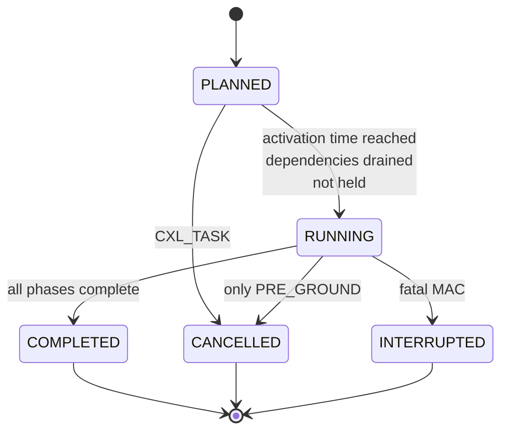
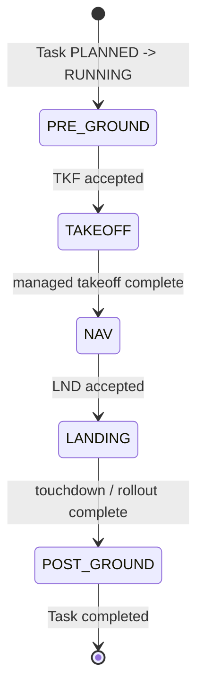
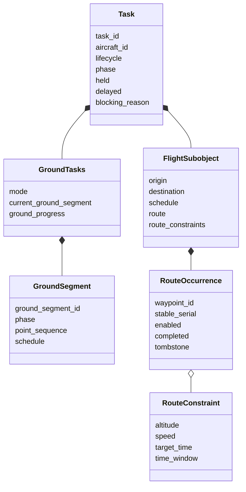
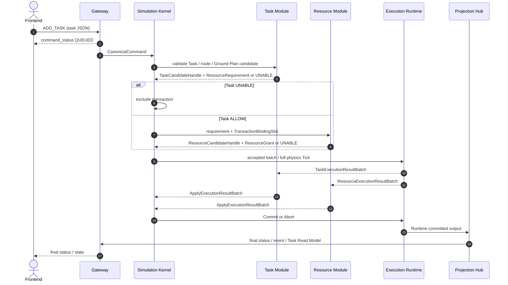
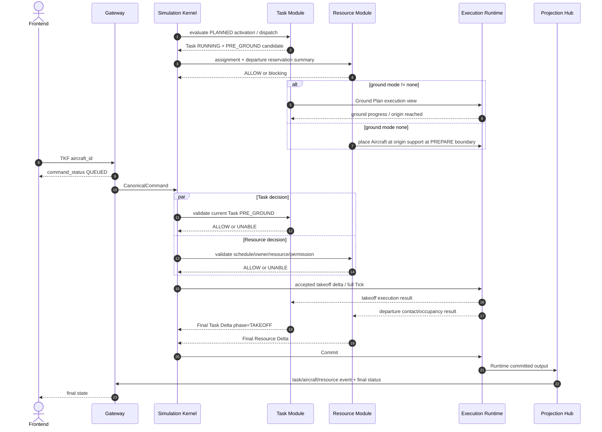
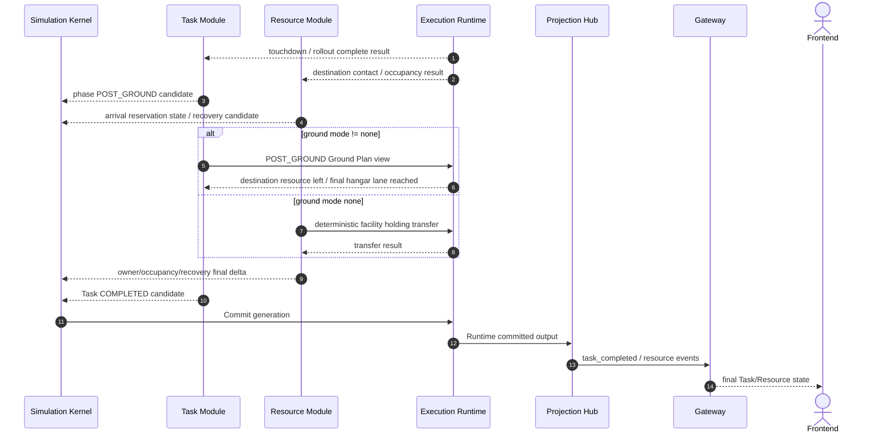
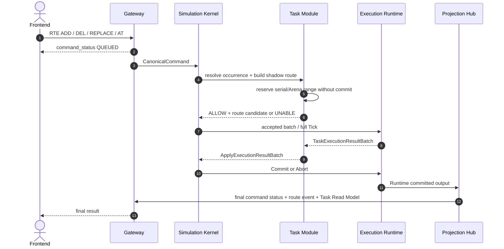

# Task Module

定义 task.json、TaskGraph、TaskLifecycle/TaskPhase、Ground Plan、route occurrence、Task CLI、Port、Execution View、Read Model 与 event source。

## 内容来源
- 设计：第 4 章（4. Task Module）

> 本文件是权威输入文档的分层视图。若拆分文本与源文档发生差异，以《LightBlueSky v8.0 统一设计规范》为系统设计与公开合同权威，以《HITL 大阶段切换规范》为当前项目阶段推进与人工验收权威。

## 规范正文

## 4. Task Module

### 4.1 模块目标

Task Module统一管理从地面准备到落地后流程的完整Task。它是TaskGraph、TaskLifecycle、TaskPhase、route、Ground Plan、schedule、dependency、held和blocking reason的唯一权威所有者。

Task Module不拥有：

- Aircraft注册、能力、assignment或destroyed latch；
- Hangar/Pad/Runway End的reservation、owner、occupancy、availability或permission；
- terrain、building、obstacle、airspace、VOL或AX；
- Aircraft位置、速度、controller或物理phase；
- reservation delay及`delayed`公开标志；该标志由Projection根据base/effective window派生；
- event、Read Model或ViewerSnapshot输出。

### 4.2 职责边界

Task Module负责：

```text
task.json strict typed model
TaskGraph / dependency
TaskLifecycle / TaskPhase
flight子对象
Ground Plan / ground segments / manual ground occurrence
route occurrence / constraint
ADD_TASK / HOLD_TASK / REL_TASK / CXL_TASK
route mutation / DIVERT / SLOT 的Task侧语义
连续Task的schedule和facility continuity
TaskExecutionView / TaskExecutionResultBatch
Task Read Model source delta
Task event candidate
```

所有跨模块协调由Simulation Kernel完成。Task Module不得直接调用Resource Module或Environment Module。

### 4.3 权威状态

```text
TaskStore
  task identity and metadata
  TaskGraph
  lifecycle
  public phase / internal NONE sentinel
  held
  blocking_reason
  current_ground_segment
  route cursor / occurrence tombstone
  remaining_route_count（派生只读缓存）
  schedule projection source
  origin / destination references
  aircraft assignment reference（事实由Resource Module确认）
```

Task Module使用公开`task_id`；Runtime使用`task_row`。不得建立独立顶层flight identity、flight lifecycle或flight owner。

### 4.4 仿真前 JSON：`task.json`

#### 4.4.1 顶层

```json
{
  "schema_version": "1.0.0",
  "waypoints": [],
  "tasks": [],
  "metadata": {}
}
```

| 字段 | 必填 | 默认 | 规则 |
|---|---:|---|---|
| `schema_version` | 是 | 无 | 固定 `1.0.0`。 |
| `waypoints` | 是 | 无 | scenario-level catalog，可为空。 |
| `tasks` | 是 | 无 | Task array，可为空。 |
| `metadata` | 否 | `{}` | 公共 metadata 规则见附录 A。 |

#### 4.4.2 waypoint catalog

真实地图：

```json
{
  "waypoint_id": "WP010",
  "position_wgs84": {"lon": 116.41, "lat": 39.91},
  "capture_radius_m": 50.0,
  "metadata": {}
}
```

沙盘：

```json
{
  "waypoint_id": "WP010",
  "position_enu_m": [1200.0, 350.0],
  "capture_radius_m": 50.0,
  "metadata": {}
}
```

规则：

1. 坐标分支必须与 `environment.json.frame.type` 匹配。
2. waypoint 只定义二维横向位置和 `capture_radius_m > 0`。
3. waypoint 不包含高度、速度或时间；这些属于 Task-local route constraint。
4. 一个 `waypoint_id` 永远映射到同一位置和 capture radius。
5. `waypoint_id` 不得包含 `@`。

#### 4.4.3 Task record

```json
{
  "task_id": "TASK001",
  "aircraft_id": "AC101",
  "flight": {
    "origin": {
      "type": "runway_end",
      "facility_id": "BJ-APT-001",
      "runway_end_resource_id": "RWY-END-09"
    },
    "destination": {
      "type": "pad",
      "facility_id": "BJ-VERT-002",
      "pad_id": "PAD-B"
    },
    "schedule": {
      "scheduled_takeoff_s": 300.0,
      "scheduled_landing_s": 900.0
    },
    "route": ["WP010", "WP020"],
    "route_constraints": []
  },
  "ground_tasks": {
    "mode": "none",
    "segments": []
  },
  "metadata": {}
}
```

| 字段 | 必填 | 规则 |
|---|---:|---|
| `task_id` | 是 | Task namespace 内唯一。 |
| `aircraft_id` | 是 | 引用 `resource.json.aircraft[]`。 |
| `flight` | 是 | Task 内部飞行阶段定义。 |
| `ground_tasks` | 否 | 默认 `{"mode":"none","segments":[]}`。 |
| `metadata` | 否 | 默认 `{}`。 |

#### 4.4.4 flight 子对象

`flight.origin` 和 `flight.destination` 只允许 Pad 或 Runway End reference。

Pad：

```json
{
  "type": "pad",
  "facility_id": "BJ-VERT-001",
  "pad_id": "PAD-A",
  "resource_use_override": {
    "prepare_duration_s": 45.0,
    "operation_duration_s": 40.0,
    "recovery_duration_s": 50.0
  }
}
```

Runway End：

```json
{
  "type": "runway_end",
  "facility_id": "BJ-APT-001",
  "runway_end_resource_id": "RWY-END-09"
}
```

Task只使用Runway End Resource引用。Override可以省略；若存在，至少出现一个字段，省略项继承Resource default，禁止null。

Schedule：

```json
{
  "scheduled_takeoff_s": 300.0,
  "scheduled_landing_s": 900.0
}
```

- `scheduled_takeoff_s >= 0`，必填；
- `scheduled_landing_s`可省略；若存在必须`> scheduled_takeoff_s`；
- 同一Aircraft存在后续Task时，相关前序Task必须提供`scheduled_landing_s`；
- schedule使用仿真绝对秒。

若未提供landing time，初始arrival anchor确定为：

```text
planned_arrival_anchor_s =
  scheduled_takeoff_s
  + max(60.0, horizontal_route_length_m / nominal_cruise_speed_mps)
```

并产生Build warning `ARRIVAL_TIME_DERIVED`。`horizontal_route_length_m`使用origin center→route occurrences→destination center；空route使用origin→destination直线。Nominal cruise对fixed-wing/hybrid使用wing cruise，对rotorcraft使用rotor cruise。

#### 4.4.5 route occurrence

输入 route 只保存 waypoint ID：

```json
{"route": ["WP010", "WP020", "WP010"]}
```

重复访问合法。系统按 `(epoch_id,task_id,waypoint_id)` 维护 append-only `next_serial_u64`，生成：

```text
WP010@1
WP020@1
WP010@2
```

规则：

1. 初始 Build 按 route 从左到右分配。
2. Runtime mutation 按 canonical ingress sequence 分配。
3. Serial 严格单调、稳定、永不复用。
4. 删除或替换形成 tombstone，不重编号。
5. occurrence reference 不创建或改变 catalog waypoint identity。
6. 失败事务不得消耗 serial。

#### 4.4.6 route constraints

```json
{
  "occurrence_ref": "WP010@2",
  "altitude_constraint_m": 160.0,
  "speed_constraint_mps": 45.0,
  "target_time_s": 300.0,
  "time_window_s": [290.0, 315.0]
}
```

至少包含 altitude、speed、target time、time window 之一。`target_time_s` 和 `time_window_s` 同时存在时，target 必须落在半开窗口内。

初始 JSON 在 Build 前尚无 runtime serial，因此还允许：

```json
{
  "route_index": 2,
  "altitude_constraint_m": 160.0
}
```

`route_index` 是零基索引，Build 后规范化为 occurrence reference；`route_index` 与 `occurrence_ref` 必须且只能出现一个。Runtime command 只接受 occurrence reference；基础 waypoint ID 仅在尚未完成候选唯一时可作 shorthand，多个候选时返回 UNABLE `OCCURRENCE_REQUIRED`。

#### 4.4.7 Ground mode

```text
none
auto
explicit
```

##### none

- `segments` 必须为空；
- PRE_GROUND 和 POST_GROUND 阶段仍存在；
- 系统负责 Aircraft 放置、Resource 交接和 facility holding；
- 不生成地面轨迹。

##### auto

```json
{
  "mode": "auto",
  "origin_hangar_id": "H01",
  "destination_hangar_id": "H02",
  "segments": []
}
```

`origin_hangar_id`、`destination_hangar_id`可省略。系统按以下顺序确定：

1. 若显式给出，必须存在、`initial_availability=OPEN`、compatible且属于对应facility；
2. 若省略，从对应facility的compatible OPEN Hangar按canonical resource key取第一个具有可用逻辑lane的项；
3. 以Hangar center→origin resource center和destination resource center→Hangar center生成直线Ground Plan；
4. U由terrain/resource support surface确定；
5. 生成的`ground_segment_id`固定为`<task_id>:PRE:0001`和`<task_id>:POST:0001`。

任一阶段无法自动生成完整可执行计划时：

- 初始Build整体失败，reason=`GROUND_AUTO_UNRESOLVED`；
- 动态ADD_TASK整体UNABLE，reason=`GROUND_AUTO_UNRESOLVED`；
- 不得降级为`none`，不得提交部分Task。

`GROUND_PLAN_INVALID`只用于显式或输入定义本身结构非法；用户确实不需要Ground Plan时必须显式指定`mode=none`。

##### explicit

```json
{
  "mode": "explicit",
  "segments": [
    {
      "ground_segment_id": "GS-PRE-001",
      "phase": "PRE_GROUND",
      "point_sequence": [
        {"type": "hangar", "facility_id": "BJ-VERT-001", "hangar_id": "H01"},
        {"type": "point_enu", "point_id": "GND-P01", "position_enu_m": [100.0, 50.0, 0.0]},
        {"type": "pad", "facility_id": "BJ-VERT-001", "pad_id": "PAD-A"}
      ],
      "scheduled_start_s": 200.0,
      "target_arrival_s": 290.0
    }
  ]
}
```

`phase` 只允许 PRE_GROUND/POST_GROUND。Point type 只允许 `hangar/pad/runway/point_enu/point_wgs84`；坐标点必须与 frame 匹配。

完整性规则：

1. PRE_GROUND 首点为 origin facility 的 Hangar/holding，末点是 flight origin；
2. POST_GROUND 首点是 flight destination，末点为 destination facility 的 Hangar/holding；
3. 同 phase 多 segment 首尾逐字节引用相等，形成连续路径；
4. 时间严格递增；
5. 每个 segment 至少两个 point；
6. 不允许跨 facility 瞬移；
7. Ground Plan 必须闭合到 flight resource；
8. 任意 `mode != none` 成功进入 Runtime 前必须已有完整可执行 Ground Plan。

Ground segment 不拥有独立公开生命周期。进度由 TaskPhase、current segment 和 point cursor 表达。

### 4.5 Build Validation

Task Build至少检查：

1. `task_id`唯一，`aircraft_id`存在；
2. origin/destination Resource存在、初始availability为OPEN、compatible；
3. fixed-wing不得使用Pad，non-runway-capable Aircraft不得使用Runway End；
4. Runway End reference能唯一解析到独立Resource及其共享Runway body；
5. route waypoint存在，route occurrence数`<=4096`；
6. constraint数`<=4096`，target occurrence合法；
7. schedule、Task window、同Aircraft Task不重叠；
8. 连续Task的facility continuity；
9. 有后续Task的前序landing time必填；
10. Ground Plan完整、连续、闭合；
11. auto Ground Plan能够完整生成，否则`GROUND_AUTO_UNRESOLVED`；
12. initial reservation candidate与capacity lane、runway exclusivity group、chronology、availability相容；
13. TaskGraph dependency无悬空引用；
14. Task数不超过`1,000,000`，ground segment每Task不超过`1,024`。

Build采用Candidate Graph：全部校验、route/ground serial、Ground Plan、reservation requirement和dependency edge成功后一次提交。

### 4.6 状态转换：TaskLifecycle

固定公开枚举：

```text
PLANNED
RUNNING
COMPLETED
CANCELLED
INTERRUPTED
```

**图 4-1　TaskLifecycle 状态机（权威）**



不存在公开`READY` lifecycle。Runtime可以维护临时`ready_mask`用于批量调度，但不得进入Schema、Read Model、event或ViewerSnapshot。

Task激活时间固定为：

```text
mode=auto / explicit:
  first PRE_GROUND GroundSegment.scheduled_start_s

mode=none:
  scheduled_takeoff_s
```

实际`PLANNED -> RUNNING`还必须满足该boundary之前所有上游Task/reservation依赖已由Kernel排空。`held=true`时不得启动；解除hold后在下一个Tick重新评估。

Terminal lifecycle一旦提交不可变。`COMPLETED`、`CANCELLED`、`INTERRUPTED`互斥。

### 4.7 TaskPhase

固定公开枚举：

```text
PRE_GROUND
TAKEOFF
NAV
LANDING
POST_GROUND
```

`NONE`只允许作为内部sentinel，表示Task当前不处于RUNNING；不得出现在公开Schema、Read Model或event。

**图 4-2　TaskPhase 状态机（权威）**



约束：

- RUNNING Task必须有五个公开phase之一；
- PLANNED或terminal Task内部phase sentinel必须为NONE；
- `held`和`blocking_reason`是独立字段；
- 不得创建组合状态枚举。

### 4.8 Task 数据模型

**图 4-3　Task 数据模型图（权威）**



### 4.9 TaskGraph 与连续 Task

TaskGraph edge类型：

```text
EXPLICIT_DEPENDENCY
SAME_AIRCRAFT_PREVIOUS_TASK
RESOURCE_DERIVED_BLOCKING（只投影，不复制Resource状态）
```

同一Aircraft的Task按`(scheduled_takeoff_s,task_id UTF-8)`稳定排序。必须满足：

```text
previous.scheduled_landing_s <= next.scheduled_takeoff_s
```

并满足destination/origin facility连续，或由explicit/auto Ground Plan连续连接。`ground_tasks.mode=none`只允许同一facility内通过facility holding原子转移，不允许跨facility瞬移。

**图 4-4　连续 Task 时间轴（权威）**

```mermaid
gantt
    title 同一 Aircraft 的连续 Task
    dateFormat X
    axisFormat %s

    section TASK-A
    PRE_GROUND  :a1, 0, 40s
    TAKEOFF     :a2, after a1, 20s
    NAV         :a3, after a2, 80s
    LANDING     :a4, after a3, 30s
    POST_GROUND :a5, after a4, 30s

    section TASK-B
    PLANNED / READY waiting :b0, 0, 200s
    PRE_GROUND              :b1, after b0, 30s
    TAKEOFF                 :b2, after b1, 20s
    NAV                     :b3, after b2, 80s
    LANDING                 :b4, after b3, 30s
    POST_GROUND             :b5, after b4, 30s
```



图中的`PLANNED / READY waiting`只是“PLANNED期间等待激活条件”的图示标签，不表示正式`TaskLifecycle.READY`状态。

后续Task只有在前序Task terminal、Aircraft Resource State回到AVAILABLE/ASSIGNED合法状态、facility continuity和reservation条件满足后才能启动。

### 4.10 仿真中 CLI 与 Task 业务语义

#### ADD_TASK

- args是单条Task record的strict JSON；
- 只允许RUNNING/PAUSED；
- `scheduled_takeoff_s >= apply t_s`；
- 重用与Build相同的Task/route/Ground Plan/capability/reservation validation；
- Task先产生`TaskCandidateHandle + ResourceRequirement`，Resource再产生candidate/grant；
- 任何失败均不得创建部分Task；
- auto Ground Plan生成失败为UNABLE `GROUND_AUTO_UNRESOLVED`；
-预声明Arena capacity不足为UNABLE `CAPACITY_EXCEEDED`。

**图 4-5　ADD_TASK 原子创建 sequence（权威）**



#### HOLD_TASK / REL_TASK

- 只允许PLANNED，或RUNNING且`TaskPhase=PRE_GROUND`；
- hold/release幂等ACCEPTED；
- hold时`blocking_reason=TASK_HELD`；
- reservation处于PLANNED时保持PLANNED，不取得owner，不允许后项越过stable lane order；
- reservation处于PREPARE时保持PREPARE和owner，暂停推进，effective window随等待确定性顺延；
- 其他Task phase返回UNABLE `INVALID_TASK_PHASE`；
- `REL_TASK`后在后续Tick自动重试；
- 长期阻塞由用户通过CHGRES或CXL_TASK处理。

#### CXL_TASK

- PLANNED：取消Task和未开始reservation；
- RUNNING/PRE_GROUND：允许普通取消；若Aircraft Resource State为EXECUTING，在同一事务中执行`EXECUTING -> AVAILABLE`；
- RUNNING的TAKEOFF/NAV/LANDING/POST_GROUND：UNABLE `INVALID_TASK_PHASE`；
- terminal Task：UNABLE `TASK_TERMINAL`；
- PREPARE reservation可以取消并释放owner；事故中止路径按Resource章节处理。

#### SLOT

`SLOT`可以原子修改六个计划字段：

```text
TKF             # departure anchor，绝对 simulation second
LND             # arrival anchor，绝对 simulation second
DEP_PREPARE     # departure prepare_duration_s
DEP_RECOVERY    # departure recovery_duration_s
ARR_PREPARE     # arrival prepare_duration_s
ARR_RECOVERY    # arrival recovery_duration_s
```

四个 PREPARE/RECOVERY 字段是非负持续时间，不是实际阶段结束时刻；`operation_duration_s`始终不可由CLI修改。实际提前或延后结束使用`RSRCUSE END`。字段级gate：

- `TKF`：departure reservation尚未处于PREPARE/IN_PROGRESS/OCCUPIED/RECOVERY，且Task未进入TAKEOFF；
- `LND`：arrival reservation尚未处于PREPARE/IN_PROGRESS/OCCUPIED/RECOVERY，且Task未进入LANDING；
- PLANNED reservation：对应operation的PREPARE/RECOVERY duration均可修改；
- PREPARE中：只允许修改当前operation的PREPARE duration；该修改只更新计划窗口和延误传播，不直接改写实际结束时刻；
- RECOVERY中：只允许修改当前operation的RECOVERY duration；该修改只更新计划窗口和延误传播，不直接改写实际结束时刻；
- 任一字段不满足gate，整条命令原子UNABLE。

SLOT先由Task重算schedule/candidate，再由Resource重算base window、lane、runway exclusivity和reservation延误传播。

#### CHGAC / CHGRES / DIVERT

- `CHGAC`只允许PRE_GROUND前，参数使用`task_id`；
- `CHGRES`只允许对应reservation尚未进入PREPARE；
- `DIVERT`只允许LANDING前，原子替换destination、从active occurrence起的route、arrival reservation和dependency；
- 三者均采用Task→Resource顺序编排；
- 失败不消耗occurrence serial，不改变原Task。

### 4.11 PRE_GROUND 到 TAKEOFF

**图 4-6　PRE_GROUND → TAKEOFF sequence（权威）**



### 4.12 LANDING 到完成

**图 4-7　LANDING → POST_GROUND → COMPLETED sequence（权威）**



Task completion必须等待：

```text
POST_GROUND完成
AND destination physical occupancy已安全转移/清除
AND Task所需Resource handoff已提交
```

Task进入COMPLETED时只发布`task_completed`，不额外发布终态phase变化event。Resource RECOVERY可以在Task completed后继续，但不得把Aircraft伪装为仍占用destination operation surface。

### 4.13 Route mutation

#### 4.13.1 统一 occurrence 解析

所有指向既有 occurrence 的命令：

- 唯一未完成候选时可以用基础 waypoint ID；
- 多个候选时必须使用 `@serial`，否则 UNABLE `OCCURRENCE_REQUIRED`；
- completed/tombstoned occurrence 不可作为 future mutation target。

#### 4.13.2 RTE ADD

- `WPT` 是基础 waypoint ID 或完整新 waypoint object；
- 禁止用户提供新对象的 `@serial`；
- 必须且只能提供 BEFORE 或 AFTER；
- BEFORE 只允许当前 active occurrence；成功后新 occurrence 成为 active target并从当前 Aircraft position 重建 guidance；
- 其他位置使用 AFTER；
- catalog identity 冲突为 UNABLE `WAYPOINT_IDENTITY_CONFLICT`；
- catalog 注册、serial 分配、route 插入、constraint/read-model 更新一个事务提交。

#### 4.13.3 RTE DEL

```text
RTE DEL AC101 WPT=WP010@2
RTE DEL AC101 WPT=WP010 ALL=true
```

- occurrence ref 精确删除一个 future occurrence；
- 基础 ID + ALL 删除 active 之后全部尚未完成同 ID occurrence；
- 不删除 active、completed history 或 catalog identity；
- occurrence ref 与 ALL 互斥；
- 删除形成 tombstone。

#### 4.13.4 RTE REPLACE

`RTE REPLACE`的作用范围从当前active occurrence开始，**包含active occurrence**。被替换的active及全部future occurrences全部tombstone；新sequence从左到右分配新serial。

`WPTS`允许为空数组：

```text
RTE REPLACE AC101 WPTS=[]
```

空数组表示清空active occurrence及其后全部remaining occurrences。提交后：

```text
remaining_route_count = 0
route_complete = true
```

此后LND可以通过route-complete gate。若后续执行RTE ADD，remaining count自然重新大于0，route恢复为未完成。不得新增`RTE CLEAR`。

#### 4.13.5 AT / DCT / JNL

- AT修改一个occurrence的Task-local constraint；
- DCT必须解析到明确未完成occurrence；
- JNL必须解析到一对明确、正向相邻、未完成occurrences；
- JNL可选`DEG`：先执行heading capture，误差绝对值小于固定`0.035 rad`后再进入blend；
- FlightCore几何、SplitMix64 blend常量和控制算法见第7部分。

**图 4-8　Route mutation sequence（权威）**



### 4.14 Kernel Port

`TaskPort`只允许：

```text
BuildTask(BuildTaskRequest) -> TaskBuildResult
EvaluateIntentBatch(TypedTaskIntentBatch, ShadowContext)
  -> TaskDecisionBatch + TaskCandidateHandles + ResourceRequirements
ApplyExecutionResultBatch(TaskExecutionResultBatch, generation)
  -> FinalTaskDeltaBatch
Commit(generation)
Abort(generation)
GetTaskProjectionSource(committed_generation)
```

`ShadowContext`由Kernel构造，只含必要的committed references、`CanonicalReferenceDirectory`结果和前序accepted candidate summaries；不得携带其他模块的可写Store。

### 4.15 Execution Port

`TaskExecutionPort`只允许：

```text
PublishTaskExecutionView(generation, view_handle)
PublishTaskCompactDeltaBatch(generation, delta_batch)
ReceiveTaskExecutionResultBatch(generation, result_batch)
```

TaskExecutionView包括：

```text
TaskSoA hot columns
route occurrence/constraint CSR
GroundSegment/GroundPoint Arena view
active task-to-aircraft mapping
held/blocking masks
time targets
remaining_route_count
```

每Tick不得复制完整TaskGraph或JSON。

### 4.16 Execution Result

`TaskExecutionResultBatch`至少包含：

```text
ground progress / point cursor / manual occurrence completion
takeoff managed completion
NAV entry
landing/touchdown/rollout completion
route occurrence capture
constraint actual values
fatal task rows
execution blocking flags
```

Execution Result是Tick级candidate fact，Task Module负责将其转换为TaskLifecycle/TaskPhase Final Delta。Runtime不得通过该result返回业务ALLOW/UNABLE。

### 4.17 Read Model 和 event

#### 4.17.1 TaskReadModel

```text
task_id
aircraft_id
lifecycle
phase?                       # 仅RUNNING时出现
held
delayed                      # Projection根据reservation base/effective window派生
blocking_reason?
flight {
  origin_resource_id
  destination_resource_id
  schedule {
    scheduled_takeoff_s
    scheduled_landing_s?
    planned_arrival_anchor_s
  }
  route_progress {
    completed_occurrences
    total_occurrences
    remaining_route_count     # RouteOccurrenceArena统计的派生只读计数器
    active_occurrence_ref?
    occurrences[] { occurrence_ref, waypoint_id, status }
    tombstoned_occurrence_refs[]
  }
  constraints[]
}
ground_tasks {
  mode
  segments[]
  current_ground_segment_id?
  point_cursor?
  progress_0_1?
  associated_resource_ids[]
}
completion_t_s?
cancelled_reason?
interrupted_reason?
```

新鲜度不嵌入TaskReadModel，统一由外层FreshResponse或control delta envelope携带。

#### 4.17.2 Task event

固定业务event：

```text
task_started
task_phase_changed
task_completed
task_cancelled
task_interrupted
```

发布规则：

1. Task首次进入RUNNING只发布`task_started`，不同时发布`task_phase_changed(NONE->PRE_GROUND)`。
2. `task_completed`、`task_cancelled`、`task_interrupted`是完整终态event，不伴随额外phase变化event。
3. 普通非终态phase变化才发布`task_phase_changed`。
4. Route event为：
   - `route_waypoint_added`
   - `route_waypoint_deleted`
   - `route_replaced`
   - `route_diverted`
   - `route_constraint_set`

Task Module只生成compact candidate；Projection Hub生成公开envelope和sequence。

### 4.18 不变量

1. `task_id`是唯一公开主ID。
2. flight不具有独立生命周期、状态机、owner或顶层API。
3. 公开TaskLifecycle不包含READY；terminal lifecycle不可逆。
4. RUNNING Task必须有公开phase；非RUNNING Task内部phase为NONE sentinel且公开省略。
5. `held/blocking_reason`不编码进lifecycle/phase；`delayed`由Projection派生。
6. Ground segment无独立公开生命周期。
7. mode!=none的Runtime Task必须有完整Ground Plan。
8. route和manual ground occurrence serial/tombstone在epoch内不复用。
9. failed mutation不消费ID/serial/Arena row。
10. 同一Aircraft不得同时RUNNING两个Task。
11. route complete由`remaining_route_count==0`派生。
12. LND只允许route complete。
13. Task Module不直接调用Resource/Environment。

### 4.19 本章状态所有权

Task Module唯一拥有TaskGraph、TaskLifecycle、TaskPhase、route、Ground Plan、schedule、held、blocking和Task terminal outcome；reservation delay与`delayed`显示值不由Task Module拥有。

### 4.20 本章接口与不变量

正式接口只有 TaskPort 与 TaskExecutionPort。Task 对资源和环境的要求只能作为 typed intent 交给 Kernel 路由；任何跨域结果必须通过 Kernel transaction 合并。

### 4.21 本章性能和验收要点

- Task capacity默认40,000，安全上限1,000,000；
- route occurrence/constraint每Task上限4,096；
- ground segment每Task上限1,024；
- Build与ADD_TASK必须验证atomic rollback；
- route mutation、empty RTE REPLACE、duplicate waypoint、occurrence ambiguity、serial non-reuse、连续Task、HOLD/PREPARE和cancellation phase是mandatory tests；
- Task hot view长期驻留Backend，每Tick只传Compact Delta Batch。
