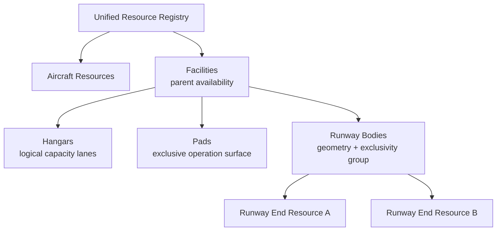
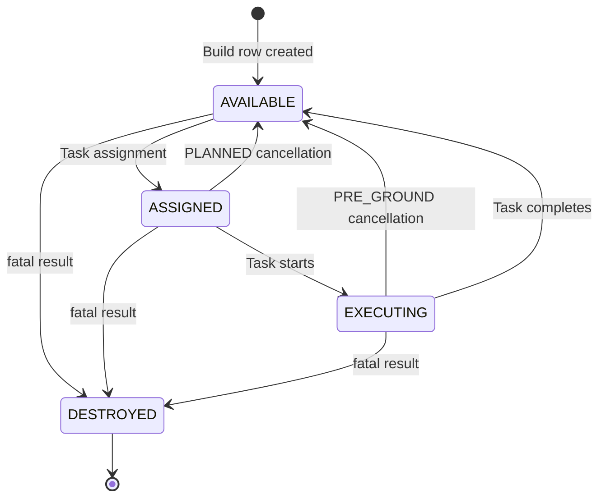
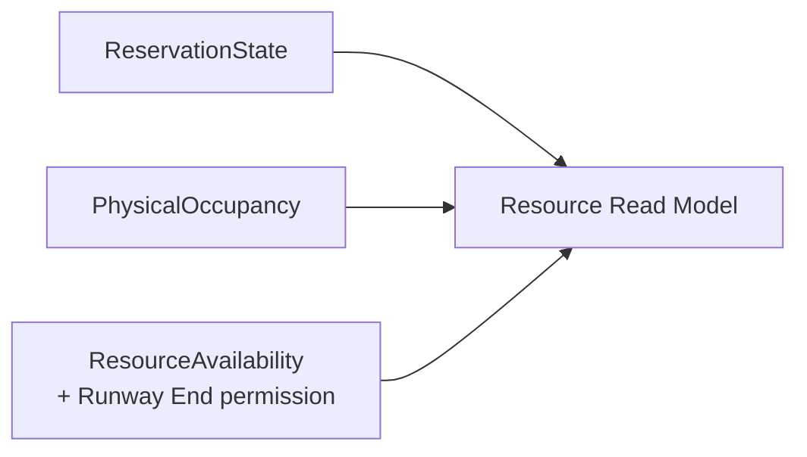
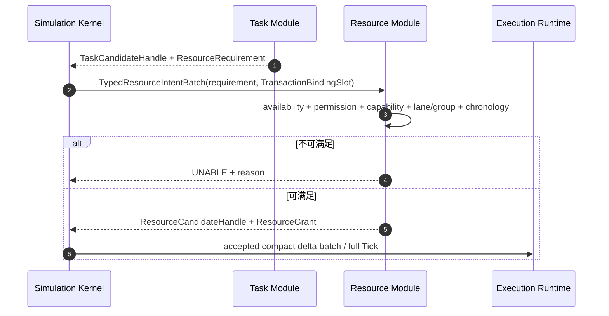

# Resource Module

定义 resource.json、Aircraft/Facility/Resource 层级、ReservationState、owner/occupancy/availability、延误传播、Resource CLI、MAC 原子后果。

## 内容来源
- 设计：第 5 章（5. Resource Module）

> 本文件是权威输入文档的分层视图。若拆分文本与源文档发生差异，以《LightBlueSky v8.0 统一设计规范》为系统设计与公开合同权威，以《HITL 大阶段切换规范》为当前项目阶段推进与人工验收权威。

## 规范正文

## 5. Resource Module

### 5.1 模块目标

Resource Module是Aircraft Resource与Facility Resource的统一管理门面。它唯一拥有Aircraft分配状态、Resource Registry、geometry、capacity、compatibility、reservation、owner派生缓存、PhysicalOccupancy、ResourceAvailability、Runway End operation permission、facility holding、reservation延误传播和事故BLOCKED latch。

Aircraft Resource、Facility、Hangar、Pad和Runway End共享Registry与Port，但不得压缩为一个笼统状态机。Runway本体是共享物理几何与internal exclusivity group，不建立第二条reservation。

### 5.2 职责边界

Resource Module负责：

```text
resource.json strict typed model
Aircraft catalog / capability cache / geometry
Aircraft Resource State / Task assignment
Facility / Hangar / Pad / Runway body / Runway End hierarchy
ResourceGeometryView
ReservationState / ResourceAvailability / operation permission
owner派生缓存 / PhysicalOccupancy / Hangar logical lane
reservation延误传播
resource compatibility / takeoff and landing handoff
MAC后Aircraft DESTROYED与Resource BLOCKED领域后果
Resource CLI / Read Model source delta / event candidate
```

Resource Module不拥有Aircraft位置/速度/Execution State，不拥有TaskLifecycle/TaskPhase，不拥有terrain/airspace，也不直接调用Task或Environment。

### 5.3 权威状态与仿真前 JSON：`resource.json`

#### 5.3.1 权威状态

```text
AircraftResourceState / assignment
Facility and FacilityResource Registry
Runway body geometry and exclusivity group
ReservationState / base/effective/actual time
ResourceAvailability
RunwayEndOperationPermission
ResourceOwnerCache
PhysicalOccupancy
Hangar logical lane / FacilityHolding
reservation dependency graph and deterministic propagation
BLOCKED latch
```

Aircraft motion与Execution State只作为committed summary输入，不是本模块可写状态。

#### 5.3.2 顶层

```json
{
  "schema_version": "1.0.0",
  "aircraft": [],
  "facilities": [],
  "metadata": {}
}
```

| 字段 | 必填 | 默认 | 规则 |
|---|---:|---|---|
| `schema_version` | 是 | 无 | 固定`1.0.0`。 |
| `aircraft` | 是 | 无 | Aircraft catalog，可为空。 |
| `facilities` | 是 | 无 | Facility array，可为空。 |
| `metadata` | 否 | `{}` | 附录A公共规则。 |

安全上限：Aircraft `<=100,000`，Facility `<=10,000`，Facility Resource总数`<=100,000`。Resource和Facility输入不使用`enabled`；malformed对象或非法availability直接使Build失败。

### 5.4 Aircraft catalog

#### 5.4.1 Aircraft record

```json
{
  "aircraft_id": "AC101",
  "profile_id": "fw-default",
  "display_name": "Default Fixed Wing",
  "model_type": "fixed_wing",
  "geometry": {},
  "collision": {},
  "wing_envelope": {},
  "runway": {},
  "takeoff_landing": {},
  "gain_provider": {},
  "metadata": {}
}
```

Aircraft输入只定义身份、机型、几何、能力和包线，不包含初始位置、注册flag、active flag或Task assignment。

#### 5.4.2 五类飞机模型

| `model_type` | 必须包含 | 禁止 |
|---|---|---|
| `multirotor` | geometry、collision、rotor_envelope、takeoff_landing、gain_provider | wing_envelope、transition、runway |
| `helicopter` | 同multirotor | 同multirotor |
| `fixed_wing` | geometry、collision、wing_envelope、runway、takeoff_landing、gain_provider | rotor_envelope、transition |
| `compound_wing` | geometry、collision、rotor_envelope、wing_envelope、transition、takeoff_landing、gain_provider | runway |
| `tiltrotor` | 同compound_wing | runway |

Capability由`model_type`派生并缓存为只读`capability_mask`：

| model_type | rotor | wing | hover | runway | transition | tilt |
|---|---:|---:|---:|---:|---:|---:|
| multirotor | 1 | 0 | 1 | 0 | 0 | 0 |
| helicopter | 1 | 0 | 1 | 0 | 0 | 0 |
| fixed_wing | 0 | 1 | 0 | 1 | 0 | 0 |
| compound_wing | 1 | 1 | 1 | 0 | 1 | 0 |
| tiltrotor | 1 | 1 | 1 | 0 | 1 | 1 |

用户不得填写第二份capability mask。

#### 5.4.3 geometry 与碰撞体派生

| 字段 | 规则 |
|---|---|
| `mass_kg` | `(0,100000]`，必填。 |
| `length_m/width_m/height_m` | `(0,200]`，必填。`height_m`明确表示垂直bounding-box高度。 |
| `wingspan_m` | 有翼机必填`(0,200]`；其他机型禁止。 |

Collision record：

```json
{
  "type": "aabb_from_geometry",
  "safety_margin_m": 1.0,
  "nmac_horizontal_m": 300.0,
  "nmac_vertical_m": 60.0
}
```

`type`固定；margin `[0,100]`；NMAC override可省略，若存在必须`>0`。Build派生：

```text
body_half_height_m = height_m / 2
body_half_length_m = length_m / 2
body_half_width_m  = max(width_m, wingspan_m if present) / 2
collision_half_u_m = body_half_height_m + safety_margin_m
```

世界系水平half extent不持久化，每次碰撞查询前按heading计算：

```text
collision_half_e_m =
    abs(body_half_length_m * sin(heading_rad))
  + abs(body_half_width_m  * cos(heading_rad))
  + safety_margin_m

collision_half_n_m =
    abs(body_half_length_m * cos(heading_rad))
  + abs(body_half_width_m  * sin(heading_rad))
  + safety_margin_m
```

该公式是包含旋转机体的保守各向异性AABB，不再使用`max(length,width,wingspan)`生成相同E/N半尺寸。

#### 5.4.4 envelope

Rotor：

```json
{
  "cruise_speed_mps": 15.0,
  "max_speed_mps": 25.0,
  "max_climb_rate_mps": 8.0,
  "max_descent_rate_mps": 5.0
}
```

Wing：

```json
{
  "min_level_flight_speed_mps": 28.0,
  "cruise_speed_mps": 55.0,
  "max_speed_mps": 75.0,
  "max_climb_rate_mps": 6.0,
  "max_descent_rate_mps": 7.0
}
```

全部值`>0`；`cruise<=max`；wing还必须`min_level<=cruise`。`min_level_flight_speed_mps`只在NAV wing mode是水平速度硬下限；LANDING使用managed speed schedule，可以低于该值。

#### 5.4.5 transition

Compound wing：

```json
{
  "type": "scheduled_blend",
  "transition_duration_s": 5.0,
  "back_transition_duration_s": 6.0
}
```

Tiltrotor使用`type=tilt_blend`并必填`tilt_rate_rad_s>0`。Duration范围`(0,600]`。

#### 5.4.6 runway 与 takeoff/landing limit

Fixed-wing：

```json
{"taxi_speed_mps": 8.0}
```

`taxi_speed_mps>0`且不高于wing minimum level speed。

所有Aircraft：

```json
{
  "touchdown_max_horizontal_speed_mps": 12.0,
  "touchdown_max_vertical_speed_mps": 1.5,
  "touchdown_max_total_speed_mps": 12.5
}
```

具有垂直起飞能力的机型还必须有：

```json
{"min_vertical_takeoff_height_above_pad_m": 15.0}
```

范围`(0,1000]`；fixed-wing禁止。Touchdown limit均`>=0`，total不得小于horizontal或vertical。

#### 5.4.7 GainProvider

第一版只允许：

```text
gain_pack
model_type_default
```

示例：

```json
{
  "mode": "gain_pack",
  "source": "gain_packs/fixed_wing_default.json"
}
```

| mode | source |
|---|---|
| `gain_pack` | 必填，指向gain pack。 |
| `model_type_default` | 禁止出现source。 |

第一版字段只覆盖上述两种确定性模式，不预占其他模型加载或fallback行为。

Gain pack contract`1.0.0`，每个bank固定：

```text
heading_kp
heading_ki
horizontal_speed_kp
horizontal_speed_ki
altitude_kp
altitude_ki
```

每个值finite `[0,100]`；零Ki合法。Rotor-only/wing-only一套bank，hybrid必须有rotor和wing两套。进入READY后gain固定。

### 5.5 Facility、Resource 与 Runway End geometry

**图 5-1　Resource 层级图（权威）**



#### 5.5.1 Facility record

```json
{
  "facility_id": "BJ-VERT-001",
  "type": "vertiport",
  "name": "Beijing Vertiport 001",
  "center_wgs84": {"lon": 116.4, "lat": 39.9, "H_orthometric_m": 44.0},
  "initial_availability": "OPEN",
  "hangars": [],
  "pads": [],
  "runways": [],
  "metadata": {}
}
```

- `type`为`airport`或`vertiport`；
- center使用WGS84或ENU，与environment frame匹配；
- `initial_availability`默认`OPEN`，只允许`OPEN/CLOSED`；
- 输入不得出现`BLOCKED`；
- vertiport的runways必须为空；
- CLOSED Facility可以存在，但被Task引用时Build失败`RESOURCE_CLOSED`。

#### 5.5.2 Hangar

```json
{
  "hangar_id": "H01",
  "label": "Hangar 01",
  "center_wgs84": {"lon": 116.4, "lat": 39.9, "H_orthometric_m": 44.0},
  "capacity_aircraft": 4,
  "compatibility": {"allowed_model_types": ["multirotor", "tiltrotor"]},
  "initial_availability": "OPEN"
}
```

`capacity_aircraft`为`1..65535`。Runtime建立`0..capacity-1`逻辑lane。Hangar不创建PhysicalOccupancy、不创建GROUND_PRE/GROUND_POST reservation行；进入/离开Hangar只更新逻辑lane、FacilityHolding和Task ground cursor，不发布`resource_occupancy_changed`。

Aircraft完成实体Hangar进入并处于机库内时，Execution Runtime设置`AircraftExecutionFlag.INSIDE_HANGAR`；public position可以是Hangar center。逻辑lane的分配、预留或占用本身不等价于`INSIDE_HANGAR`。Aircraft-aircraft ground MAC过滤规则见第7部分。

#### 5.5.3 Pad

```json
{
  "pad_id": "PAD-A",
  "label": "Roof Pad A",
  "center_wgs84": {"lon": 116.4567, "lat": 39.9876, "H_orthometric_m": 44.0},
  "touchdown_area": {"shape": "circle", "radius_m": 6.0},
  "fato_area": {"shape": "circle", "radius_m": 12.0},
  "safety_area": {"shape": "circle", "radius_m": 15.0},
  "limits": {
    "max_mass_kg": 2400.0,
    "max_wingspan_m": 10.0,
    "allowed_model_types": ["multirotor", "helicopter", "compound_wing", "tiltrotor"]
  },
  "resource_use_defaults": {
    "departure": {"prepare_duration_s": 60.0, "operation_duration_s": 30.0, "recovery_duration_s": 30.0},
    "arrival": {"prepare_duration_s": 30.0, "operation_duration_s": 45.0, "recovery_duration_s": 60.0}
  },
  "initial_availability": "OPEN"
}
```

Geometry shape：

| shape | 字段 |
|---|---|
| `circle` | `radius_m>0` |
| `rectangle` | `length_m>0,width_m>0,heading_deg` |

三层同中心；FATO必须完全包含touchdown area；Safety Area若存在必须完全包含FATO。Pad禁止fixed-wing。Pad没有operation permission，只检查ResourceAvailability。

#### 5.5.4 Runway body 与 Runway End Resource

Runway本体：

```json
{
  "runway_id": "RWY-09-27",
  "label": "Runway 09/27",
  "width_m": 30.0,
  "lateral_safety_buffer_m": 3.0,
  "runway_end_resources": [
    {
      "runway_end_resource_id": "RWY-END-09",
      "designator": "09",
      "threshold_wgs84": {"lon": 116.0, "lat": 40.0, "H_orthometric_m": 44.0},
      "supports_departure": true,
      "supports_arrival": true,
      "initial_availability": "OPEN",
      "operation_permission": {
        "departure_open": true,
        "arrival_open": true
      },
      "landing": {"touchdown_zone": {"start_offset_m": 150.0, "length_m": 300.0}},
      "takeoff": {"start_zone": {"start_offset_m": 0.0, "length_m": 150.0}},
      "resource_use_defaults": {
        "departure": {"prepare_duration_s": 90.0, "operation_duration_s": 60.0, "recovery_duration_s": 45.0},
        "arrival": {"prepare_duration_s": 60.0, "operation_duration_s": 90.0, "recovery_duration_s": 60.0}
      }
    },
    {
      "runway_end_resource_id": "RWY-END-27",
      "designator": "27",
      "threshold_wgs84": {"lon": 116.014, "lat": 40.0, "H_orthometric_m": 44.0},
      "supports_departure": true,
      "supports_arrival": true,
      "initial_availability": "OPEN",
      "operation_permission": {
        "departure_open": true,
        "arrival_open": true
      },
      "landing": {"touchdown_zone": {"start_offset_m": 150.0, "length_m": 300.0}},
      "takeoff": {"start_zone": {"start_offset_m": 0.0, "length_m": 150.0}},
      "resource_use_defaults": {
        "departure": {"prepare_duration_s": 90.0, "operation_duration_s": 60.0, "recovery_duration_s": 45.0},
        "arrival": {"prepare_duration_s": 60.0, "operation_duration_s": 90.0, "recovery_duration_s": 60.0}
      }
    }
  ]
}
```

Runway必须恰有两个End Resource，threshold不同，派生length`>=100 m`，zone offset/length落在`[0,runway_length]`。Runway body只保存physical geometry、surface、width、axis、thresholds和internal exclusivity group。

每个Runway End是独立Facility Resource，拥有：

```text
reservation
owner cache
ResourceAvailability
operation_permission
start/touchdown zone
static capability
```

Task直接引用`runway_end_resource_id`，由Build解析其Runway body与exclusivity group。两端reservation分别建立，但共享同一exclusivity group；任一时刻整个physical runway只能有一个active reservation。Runway body事故使两个End Resource在同一generation进入BLOCKED。

Runway End允许某operation必须同时满足：

```text
ResourceAvailability == OPEN
AND static capability supports operation
AND operation_permission is open
```

静态不支持的operation不得通过CLI打开。

#### 5.5.5 Resource-use defaults

Pad/Runway End的departure/arrival均必填：

| 字段 | 范围 | 语义 |
|---|---:|---|
| `prepare_duration_s` | `[0,86400]` | anchor前计划排他准备时间。 |
| `operation_duration_s` | `(0,86400]` | 预计起降/物理使用时间；CLI不得修改。 |
| `recovery_duration_s` | `[0,86400]` | operation后计划排他恢复时间。 |

这些用于reservation base window，不是FlightCore起降时长，不强迫实际过程在计划窗口结束。

### 5.6 Build Validation 与 ResourceGeometryView

Resource Build Validation至少检查：

1. Aircraft、Facility、Hangar、Pad、Runway body和Runway End Resource ID唯一；
2. Aircraft model union、geometry、各向异性碰撞缓存、envelope、transition、runway和gain provider合法；
3. Facility/Pad/Hangar/Runway geometry、containment、capacity和resource-use duration合法；
4. `initial_availability`只为OPEN/CLOSED，输入无BLOCKED；
5. Runway End capability、permission和availability正交且合法；
6. Task引用Resource存在、OPEN且compatible；
7. 同一Resource geometry没有在Environment重复定义；
8. initial reservation的半开window、runway exclusivity、chronology和dependency edge可构造；
9. 同一Aircraft Task schedule与facility continuity合法；
10. Resource/Aircraft/reservation capacity满足配置与安全上限；
11. ResourceGeometryView可在目标Frame/WorkCell中完整编译；
12. 任一错误使整个candidate失败，不提交partial Registry、lane或geometry view。

Resource Build生成immutable：

```text
ResourceGeometryView
  resource_row
  resource_kind                 # HANGAR / PAD / RUNWAY_END
  facility_row
  runway_body_row?
  exclusivity_group_row?
  frame/workcell ownership
  conservative footprint / support surface
  pad touchdown/FATO/safety geometry
  runway axis / threshold / start zone / touchdown zone
  hangar center/support point
  capacity / compatibility / capability masks
```

Environment第二阶段只作空间挂载；Execution Runtime用于support contact、occupancy geometry和事故attribution。

### 5.7 Aircraft Resource State

固定枚举：

```text
AVAILABLE
ASSIGNED
EXECUTING
DESTROYED
```

**图 5-2　Aircraft Resource 状态机（权威）**



Build generation 0为每架catalog Aircraft建立稳定row并进入AVAILABLE；随后按Task chronology选择最早Task执行initial assignment。存在该Task时同一generation进入ASSIGNED。未被Task引用者保持AVAILABLE且`placed=false`。

`registered`由row存在派生；`active`由`resource_state==EXECUTING && placed`派生；`destroyed`由`resource_state==DESTROYED`派生，不保存冗余flag。

#### 5.7.1 放置、holding 与复用

1. `resource.json.aircraft[]`不包含初始位置。
2. explicit/auto：首个PRE_GROUND segment开始时放到Ground Plan首点。
3. none：departure reservation进入PREPARE时原子放到origin support。
4. 实体Hangar holding使用逻辑lane，不写PhysicalOccupancy；Aircraft可保持`placed=true`。
5. internal virtual holding保持`placed=false`，不是公开Resource。
6. 同一Aircraft连续Task必须保持facility continuity；不得跨facility teleport。
7. 从实体/virtual holding开始下一none Task时，在departure PREPARE boundary原子转入origin support。
8. 只有DESTROYED永久退出可执行集合；稳定ID和row在epoch内不复用。

### 5.8 Aircraft Execution State 边界

公开Execution State固定为：

```text
GROUND
TAKEOFF
NAV
LANDING
```

该状态机由Execution Runtime拥有。Resource Module只消费committed `AircraftExecutionSummary`，不得写Execution State。

### 5.9 Resource 三类正交事实

#### 5.9.1 ReservationState

固定枚举：

```text
PLANNED
PREPARE
IN_PROGRESS
OCCUPIED
RECOVERY
CONSUMED
CANCELLED
```

正常转换：

```text
PLANNED -> PREPARE
PLANNED -> CANCELLED
PREPARE -> IN_PROGRESS
PREPARE -> CANCELLED
IN_PROGRESS -> OCCUPIED
OCCUPIED -> RECOVERY
RECOVERY -> CONSUMED
```

事故中止允许：

```text
PLANNED / PREPARE / IN_PROGRESS / OCCUPIED / RECOVERY -> CANCELLED
```

进入PREPARE时取得owner并写`actual_start_s`。进入CONSUMED或CANCELLED时释放该reservation的owner。不存在旧的双枚举reservation/use-phase模型或空闲占位状态。

#### 5.9.2 ResourceAvailability

```text
OPEN
CLOSED
BLOCKED
```

输入只允许OPEN/CLOSED；BLOCKED只能由Runtime已提交事故后果产生，只有RESET清除。

#### 5.9.3 PhysicalOccupancy 与 owner cache

PhysicalOccupancy独立保存：

```text
resource_row -> occupying_aircraft_rows[]
```

第一版仅Pad和Runway End产生PhysicalOccupancy；Hangar只使用逻辑lane。

owner cache独立保存：

```text
resource_row -> active reservation rows / owner task_rows[]
```

owner cache是active reservation的派生缓存，与reservation state同事务更新，禁止独立写入。不得从owner推导occupancy，也不得从occupancy反向改写reservation。

**图 5-3　资源三维正交状态图（权威）**



一致性：

- `ReservationState==OCCUPIED`时，该reservation对应Pad/Runway End的PhysicalOccupancy必须非空；
- `PLANNED/CONSUMED/CANCELLED`且无其他reservation产生占用时，不得残留其occupancy；
- PREPARE、IN_PROGRESS、RECOVERY期间occupancy可为空或非空，以Aircraft实际位置为准。

### 5.10 Task 请求 Resource 与 T/R 编排

**图 5-4　顺序T/R Resource请求（权威）**



Runtime不返回业务feasibility。Environment不参与ADD_TASK/TKF/TAXI/LND/DIVERT的ALLOW/UNABLE；环境物理仍在完整Tick中计算。

### 5.11 Base reservation

Departure anchor：

```text
departure_anchor = scheduled_takeoff_s
```

Arrival anchor：

```text
arrival_anchor = scheduled_landing_s if present
               else planned_arrival_anchor_s
```

Base window：

```text
reserved_from_s  = anchor - prepare_duration_s
reserved_until_s = anchor + operation_duration_s + recovery_duration_s
```

若`reserved_from_s<0`，clamp为0，`reserved_until_s`不变。所有interval为半开`[from,until)`。

### 5.12 Reservation 数据

```text
Reservation
  reservation_id
  canonical_ingress_sequence
  task_row
  aircraft_row
  resource_row
  exclusivity_group_row?
  capacity_lane
  operation                  # DEPARTURE / ARRIVAL
  anchor_s
  reserved_from_s / reserved_until_s
  effective_from_s / effective_until_s
  prepare_end_s / recovery_end_s
  actual_start_s / actual_end_s
  state                      # ReservationState
  blocking_reason
```

`ReservationOperation`仍保留`GROUND_PRE/GROUND_POST`值作为Ground Plan operation tag，但第一版不为其创建ReservationSoA行。

```text
base_duration = reserved_until_s - reserved_from_s
effective_from_s  = reserved_from_s + delay_s
effective_until_s = effective_from_s + base_duration
actual_start_s = PREPARE实际开始/取得owner
actual_end_s   = CONSUMED或CANCELLED释放owner
```

计划窗口不是硬释放时钟；owner、occupancy、availability和safety优先。

### 5.13 Capacity、互斥组与 chronology invariant

1. Pad和Runway End的reservation lane固定为0。
2. 两个Runway End共享physical runway exclusivity group，group内所有active/base candidate互斥。
3. Hangar capacity由HangarSlotArena管理，不建立reservation lane。
4. 同Resource或同exclusivity group相邻reservation必须满足前项`reserved_until<=`后项`reserved_from`。
5. 同一Task departure `reserved_until<=` arrival `reserved_from`。
6. 同一Aircraft相邻Task的前Task arrival `reserved_until<=`后Task departure `reserved_from`。
7. dependency edge只从前项指向后项，按构造无环。
8. accepted order稳定，不因延误重排。

无法满足时，Build为validation error，Runtime command为UNABLE。

### 5.14 reservation 延误在同资源、同 Task 和同 Aircraft 后续 Task 间的确定性传播

Dependency kind：

```text
SAME_RESOURCE_OR_EXCLUSIVITY_GROUP
SAME_TASK
NEXT_TASK_SAME_AIRCRAFT
```

对reservation`i`：

```text
duration_i = reserved_until_s[i] - reserved_from_s[i]

end(p) =
  actual_end_s[p] if p has ended
  else max(
    effective_until_s[p],
    prepare_end_s[p],
    recovery_end_s[p]
  )

R_i = {p | p -> i AND kind == SAME_RESOURCE_OR_EXCLUSIVITY_GROUP}
T_i = {p | p -> i AND kind == SAME_TASK}
A_i = {p | p -> i AND kind == NEXT_TASK_SAME_AIRCRAFT}

resource_bound_i = max(
  {reserved_from_s[i]}
  UNION {end(p) | p in R_i}
)

task_delay_i = max(
  {0}
  UNION {max(0, end(p) - reserved_until_s[p]) | p in T_i}
)

aircraft_delay_i = max(
  {0}
  UNION {max(0, end(p) - reserved_until_s[p]) | p in A_i}
)

required_from_i = max(
  reserved_from_s[i],
  resource_bound_i,
  reserved_from_s[i] + task_delay_i,
  reserved_from_s[i] + aircraft_delay_i
)

delay_i = required_from_i - reserved_from_s[i]
effective_from_s[i]  = reserved_from_s[i] + delay_i
effective_until_s[i] = effective_from_s[i] + duration_i
```

三类predecessor set独立求值。算法对affected downstream closure按确定性拓扑顺序一次求值，tie-break为`(base_from, ingress_sequence, reservation_id)`。前序提前结束或delay减小时，尚处于PLANNED的后项可以向左回收到不早于base window；PREPARE及之后的reservation不回退、不重排。

BLOCKED不作无限顺延，后项保持PLANNED并设置`RESOURCE_BLOCKED`，等待CHGRES、CXL_TASK或RESET。

### 5.15 自动 PREPARE、owner 与状态推进

每Tick对满足：

```text
t_s >= effective_from_s
```

的PLANNED reservation按stable order自动尝试PREPARE。Kernel提供紧凑`TaskEligibilitySummary`，Resource不得直接读取TaskStore。

条件：

```text
Task eligible
Task not held
Resource and parent Facility OPEN
Runway End operation permission OPEN（适用时）
static capability supports operation
lane/exclusivity group free
predecessor released
no occupancy conflict
```

成功：

```text
ReservationState PLANNED -> PREPARE
acquire owner cache
actual_start_s = current t_s
```

失败保持PLANNED，设置blocking reason并稳定重试，不交换顺序。

一般流程：

```text
PLANNED
-> PREPARE / acquire owner
-> IN_PROGRESS
-> OCCUPIED
-> RECOVERY
-> CONSUMED / release owner
```

HOLD交互：

| 当前事实 | 结果 |
|---|---|
| ReservationState==PLANNED | 保持PLANNED，不取得owner，后项不得越过。 |
| ReservationState==PREPARE | 保持PREPARE和owner，暂停推进，effective window随等待传播。 |

### 5.16 起飞资源交接

TKF至少要求：

```text
AircraftResourceState == EXECUTING
placed == true
current Task phase == PRE_GROUND
not held / not cancelled
current t_s >= scheduled_takeoff_s
departure reservation == PREPARE
Resource and parent Facility OPEN
Runway End permission/capability valid（适用时）
owner_task_row == current_task_row
PREPARE complete
Aircraft physically at valid start area
```

TKF为T/R并行判定。接受后Task进入TAKEOFF，reservation进入IN_PROGRESS；物理Tick决定后续support离开和occupancy变化。

### 5.17 LND、实际接触与 Recovery

LND只是“开始managed landing”的命令，T/R并行判定。LND可以在arrival reservation尚为PLANNED时接受，只要求：

```text
destination exists
arrival reservation exists and not CANCELLED/CONSUMED
Aircraft compatible
destination and parent Facility not CLOSED/BLOCKED at decision time
route complete
```

LND提交时即：

```text
TaskPhase NAV -> LANDING
AircraftExecutionState NAV -> LANDING
ManagedLandingPlanV1 begins
CommandStatus = ACCEPTED
```

不等待touchdown，也不要求reservation已PREPARE。

Aircraft实际接触Pad/Runway End时，Runtime检查：

```text
availability == OPEN
parent Facility availability == OPEN
operation permission == OPEN（Runway End）
reservation.state in PREPARE / IN_PROGRESS / OCCUPIED / RECOVERY
owner_task_row == current_task_row
PREPARE complete
contact inside assigned support area
```

全部通过则正常touchdown/rollout/occupancy。任一失败则产生`aircraft_world_object_mac`，collider kind=`RESOURCE_SURFACE`，并在同generation提交Aircraft DESTROYED、Task INTERRUPTED和Resource BLOCKED。

LND接受后Resource若后来BLOCKED：

- Aircraft继续原ManagedLandingPlanV1；
- 不自动go-around，不返回NAV；
- 不追溯修改LND CommandStatus；
- 实际接触时触发world-object MAC。

已BLOCKED Resource再次事故时BLOCKED保持幂等，不重复availability change event，但仍发布MAC、destroyed和task_interrupted。

#### 5.17.1 `ground_tasks.mode=none` facility holding

1. Aircraft在GROUND_RECOVERY期间继续作为destination Pad/Runway End occupant，直到recovery end。
2. Tick boundary选择同facility OPEN、compatible且有空lane的实体Hangar，按canonical resource key、lane升序。
3. Facility无实体Hangar时使用唯一internal virtual holding。
4. 有compatible OPEN Hangar但满载时保持destination owner/occupancy，blocking=`RESOURCE_CAPACITY_EXCEEDED`并每Tick重试。
5. 成功时一个事务完成：清除destination occupancy、写实体Hangar lane或virtual holding、释放owner、reservation CONSUMED、更新placed和Task completion candidate。
6. Hangar lane变化不产生`resource_occupancy_changed`。
7. Virtual holding不是公开Resource，无ID、坐标、capacity、reservation、owner、occupancy event或地图图元。

### 5.18 ResourceAvailability 与 `RSRC SET`

最终CLI：

```text
RSRC SET <resource-ref> AVAILABILITY=OPEN|CLOSED
RSRC SET <runway-end-ref> DEPARTURE_OPEN=true|false
RSRC SET <runway-end-ref> ARRIVAL_OPEN=true|false
```

availability form与operation permission form不得混写。CLI不得设置BLOCKED。Pad/Hangar没有operation permission字段。

关闭Resource只依据目标Resource自身active reservation：

```text
若任一reservation处于
PREPARE / IN_PROGRESS / OCCUPIED / RECOVERY
=> UNABLE RESOURCE_OCCUPIED
```

PLANNED不阻止关闭；关闭后reservation保持PLANNED，不进入PREPARE、不取得owner。Hangar任一lane正在被当前Ground flow使用时，整体关闭UNABLE。Facility关闭对全部子资源执行同样aggregate gate，任一失败则整条命令UNABLE。

Runway End permission关闭也不得影响已开始active reservation；目标operation存在PREPARE及之后reservation时UNABLE。静态capability为false的operation不能被打开。

事故BLOCKED不受人工关闭gate限制。`OPEN`只能恢复人工CLOSED，不能清除BLOCKED。reopening后PLANNED reservation自动重试。

### 5.19 MAC 原子后果

同Tickfatal aircraft set去重后：

```text
AircraftResourceState -> DESTROYED
current Task -> INTERRUPTED
future reservations -> CANCELLED
active reservation -> CANCELLED and owner released
attributed Pad/Runway End -> BLOCKED
attributed Runway body -> both Runway End Resources BLOCKED
```

已完成Task不改写。BLOCKED只有RESET清除。事故链event顺序见第7、8部分。

### 5.20 仿真中 CLI：Resource

| Operation | Resource侧规则摘要 |
|---|---|
| SLOT | 六字段计划修改，重算base window、lane/group和延误传播。 |
| CHGAC | PRE_GROUND前；新Aircraft AVAILABLE、compatible、schedule无冲突。 |
| CHGRES | 对应reservation仍为PLANNED；新Resource compatible、OPEN、可预约。 |
| TKF | PREPARE/owner/start support gate。 |
| LND | 决策时Resource存在、兼容且非CLOSED/BLOCKED；不要求PREPARE。 |
| RSRC SET | availability或Runway End permission，不能混写。 |
| RSRCUSE END | 修改实际PREPARE或RECOVERY结束时刻。 |
| RSRC | Query Projection cache。 |

`RSRCUSE END`：

```text
RSRCUSE END TASK001 OP=DEP PREPARE=340
RSRCUSE END TASK001 OP=ARR RECOVERY=980
```

- OP只允许DEP/ARR；
- PREPARE与RECOVERY必须且只能出现一个；
- 时间为绝对`t_s>=0`；
- 已完成目标阶段为UNABLE `RESERVATION_PHASE_COMPLETED`；
- 时间`<=current t_s`时在apply boundary推进到唯一合法后继；
- 不直接清除occupant、BLOCKED或跳到CONSUMED。

### 5.21 Kernel Port

`ResourcePort`：

```text
BuildResource(BuildResourceRequest) -> ResourceBuildResult
BuildResourceGeometryView() -> immutable handle
ValidateInitialReservations(TaskResourceRequirements) -> DomainDecision/BuildIssues
EvaluateIntentBatch(TypedResourceIntentBatch, ShadowContext)
  -> ResourceDecisionBatch + ResourceCandidateHandles + ResourceGrants
ApplyExecutionResultBatch(ResourceExecutionResultBatch, generation)
  -> FinalResourceDeltaBatch
PropagateReservationDelays(affected_rows, generation)
  -> PropagationDelta
Commit(generation)
Abort(generation)
GetResourceProjectionSource(committed_generation)
```

### 5.22 Execution Port

`ResourceExecutionPort`：

```text
PublishResourceExecutionView(generation, view_handle)
PublishResourceCompactDeltaBatch(generation, delta_batch)
ReceiveResourceExecutionResultBatch(generation, result_batch)
```

长期驻留view包含Resource geometry、availability/permission masks、owner cache、occupancy rows、reservation hot columns、runway exclusivity和aircraft capability/body dimensions。

### 5.23 Execution Result

```text
support contact geometry result
start/touchdown/rollout relation
Pad/Runway End occupancy change
Hangar lane arrival/leave result
Resource contact attribution for world-object MAC
AircraftExecutionState summary
fatal aircraft set
operation physical start/end signal
```

Resource Module将其转换为ReservationState、owner cache、occupancy、availability和AircraftResourceState Final Delta。Runtime不返回业务ALLOW/UNABLE。

### 5.24 Resource Read Model 和 event

#### 5.24.1 AircraftReadModel 的资源视角

```text
aircraft_id
profile_id
display_name?
model_type
resource_state
registered                    # derived from row existence
active                        # derived from EXECUTING && placed
placed
destroyed                     # derived from resource_state
current_task_id?
capabilities
compatibility_summary
execution_info? {
  state
  workspace_position
  velocity
}
destroyed_cause_event_id?
```

新鲜度由外层envelope提供。

#### 5.24.2 Facility ResourceReadModel

```text
resource_id
facility_id
resource_kind                 # HANGAR / PAD / RUNWAY_END
label?
availability
capacity
static_capability? {
  supports_departure
  supports_arrival
}
operation_permission? {
  departure_open
  arrival_open
}
owner_task_ids[]              # derived cache
occupying_aircraft_ids[]      # Hangar固定为空
hangar_lanes? {
  lane
  aircraft_id?
}
current_reservations[] {
  reservation_id
  task_id
  operation
  state
  capacity_lane
  base_window
  effective_window
  actual_interval?
  delayed                     # derived
  blocking_reason?
}
next_reservation?
warning_count
```

删除服务端聚合状态标签字段。Frontend从availability、owner、occupancy、permission自行派生标签。

#### 5.24.3 Resource event

Resource event收敛为：

```text
resource_reservation_changed
resource_use_phase_changed
resource_owner_changed
resource_occupancy_changed
resource_availability_changed
```

Payload使用`change_kind/from/to`表达planned/replanned/cancelled/delayed、state推进、owner/occupancy和availability/permission变化。Hangar lane变化不发布occupancy event。

### 5.25 不变量

1. AircraftResourceState与AircraftExecutionState不得合并。
2. ReservationState、PhysicalOccupancy、ResourceAvailability三类事实正交。
3. 不存在旧的双枚举reservation/use-phase模型或空闲占位状态。
4. owner cache只由active reservation派生并同事务更新。
5. Pad/Runway End owner与occupancy独立保存；Hangar无PhysicalOccupancy。
6. Runway End独立预约，physical runway exclusivity group全局互斥。
7. stable reservation order不因delay重排。
8. BLOCKED只能由fatal consequence设置，只有RESET清除。
9. CLOSED不取消PLANNED reservation，只阻止PREPARE。
10. Facility Resource geometry只在Resource Module定义。
11. failed candidate不分配lane/row、不写owner、不改变availability。
12. 实际非法Resource接触必须形成world-object MAC，不得静默支持。

### 5.26 本章状态所有权

Resource Module唯一拥有AircraftResourceState、Resource Registry/geometry、Runway body/end关系、capacity、compatibility、ReservationState、owner cache、PhysicalOccupancy、availability、permission、holding、reservation延误传播和BLOCKED latch。

### 5.27 本章接口与不变量

正式接口只有ResourcePort与ResourceExecutionPort。ResourceGeometryView是immutable build artifact/Runtime view，不建立Resource到Environment的运行时调用。Kernel通过`TaskEligibilitySummary`和typed requirements/grants协调，不允许Resource读取TaskStore。

### 5.28 本章性能和验收要点

- reservation capacity默认80,000；
- 延误传播只处理affected downstream closure，不扫描全部reservation；
- owner、occupancy、reservation、Hangar lane使用预分配SoA/Arena；
- mandatory tests：Runway End exclusivity、Hangar capacity、`INSIDE_HANGAR`进入/离开置位与ground-ground MAC过滤、owner/occupancy分离、CLOSED/BLOCKED gate、none holding、multi-hop delay/recovery、LND后BLOCKED接触事故、MAC原子后果；
- Resource event顺序和CPU/CUDA physical contact decision必须parity。
