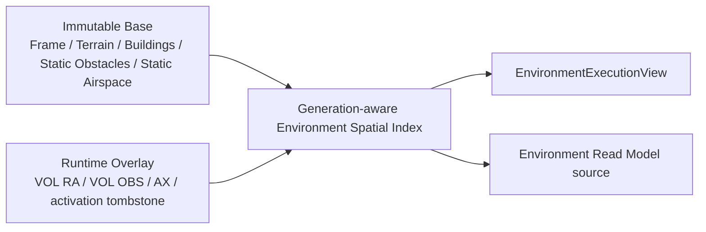
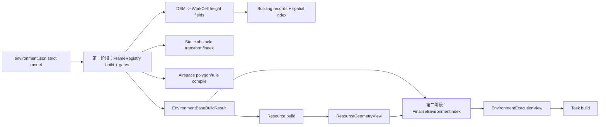
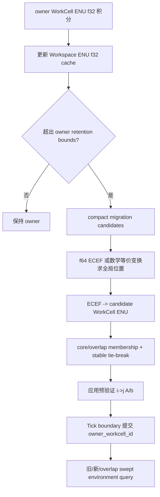
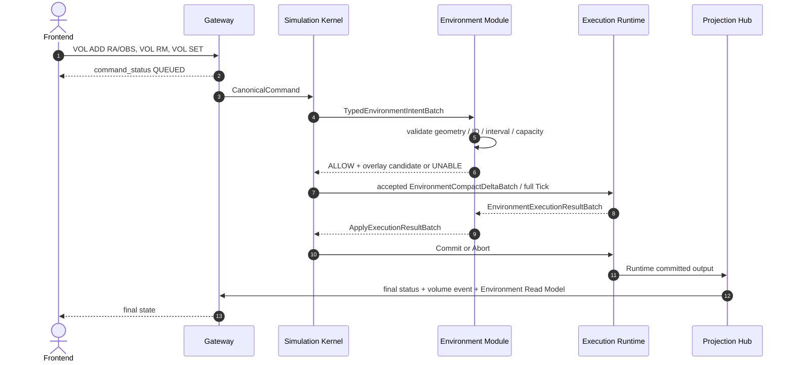
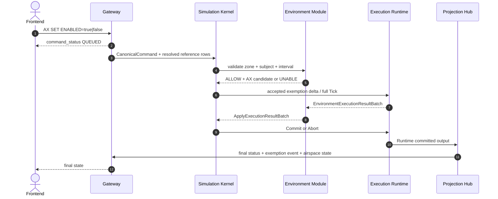
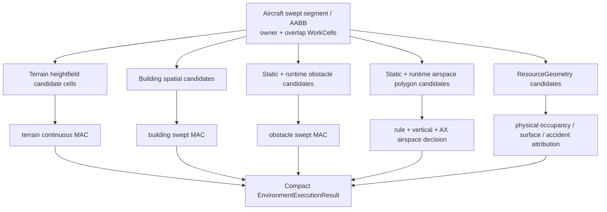
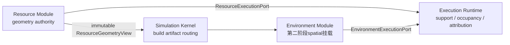

# Environment Module

定义 environment.json、FrameRegistry、terrain/building/obstacle/airspace、VOL/AX、两阶段 Build、空间查询和环境 Runtime View。

## 内容来源
- 设计：第 6 章（6. Environment Module）

> 本文件是权威输入文档的分层视图。若拆分文本与源文档发生差异，以《LightBlueSky v8.0 统一设计规范》为系统设计与公开合同权威，以《HITL 大阶段切换规范》为当前项目阶段推进与人工验收权威。

## 规范正文

## 6. Environment Module

### 6.1 模块目标

Environment Module 是坐标定义、地形、DEM、建筑物、普通静态障碍物、静态空域、运行时 VOL、AX、环境空间索引和环境碰撞默认参数的唯一权威所有者。

物理环境与规则环境严格分离：

```text
物理环境：terrain / buildings / obstacle_volumes
规则环境：airspace_zones / airspace_exemptions
```

两者不得合并为一个 volume 类型、一个判定结果或一个 event。

### 6.2 职责边界

Environment Module 负责：

```text
environment.json strict typed model
FrameRegistry / Workspace / WorkCell definition
map dataset validation / terrain height field
building and static obstacle index
static airspace index
runtime VOL / AX overlay
collision defaults
ResourceGeometryView spatial registration
EnvironmentExecutionView / query result
Environment Read Model source delta / event candidate
```

Environment Module 不拥有 Resource geometry、Aircraft capability、Task route/lifecycle 或 Aircraft motion。

### 6.3 权威状态与仿真前 JSON：`environment.json`

#### 6.3.1 权威状态

Environment Module唯一拥有FrameRegistry定义、terrain/DEM、building、ordinary obstacle、static airspace、runtime VOL/AX overlay、environment spatial index和NMAC环境默认参数。Resource geometry只通过immutable ResourceGeometryView注册；Aircraft motion和Task route只作为查询输入，不成为Environment可写状态。

#### 6.3.2 顶层

```json
{
  "schema_version": "1.0.0",
  "description": "Beijing low-altitude realtime scenario",
  "frame": {},
  "bounds": {},
  "map": {},
  "collision": {},
  "obstacle_volumes": [],
  "airspace_zones": [],
  "airspace_exemptions": [],
  "simulation": {},
  "metadata": {}
}
```

说明：示例中的`"bounds": {}`和`"map": {}`为省略写法，仅用于展示结构。实际文件必须符合附录A.8/A.9：`bounds`必须是完整的`enu_box`或`wgs84_bbox`对象；`map`必须是`flat_heightfield`（含`surface_u_m`）或`dem_dataset`，不能为空对象。

| 字段 | 必填 | 默认 | 说明 |
|---|---:|---|---|
| `schema_version` | 是 | 无 | 固定`1.0.0`。 |
| `description` | 否 | `""` | 最长4096 UTF-8 bytes。 |
| `frame` | 是 | 无 | `real_world_wgs84`或`virtual_enu`。 |
| `bounds` | 是 | 无 | scenario三维边界。 |
| `map` | 是 | 无 | DEM/building source；virtual mode可使用flat map provider。 |
| `collision` | 是 | 无 | NMAC environment defaults。 |
| `obstacle_volumes` | 否 | `[]` | 物理障碍。 |
| `airspace_zones` | 否 | `[]` | 规则空域。 |
| `airspace_exemptions` | 否 | `[]` | 初始AX。 |
| `simulation` | 否 | 完整默认值 | clock/runtime/integration/workcells/snapshot/logging。 |
| `metadata` | 否 | `{}` | 附录A。 |

整个`simulation`省略或`{}`时，必须解析为第6.10节完整默认配置。

### 6.4 Frame 与 bounds

#### 6.4.1 real world

```json
{
  "type": "real_world_wgs84",
  "horizontal_datum": "WGS84",
  "vertical_datum": "orthometric_m",
  "origin_wgs84": {
    "lon": 116.3974,
    "lat": 39.9093,
    "H_orthometric_m": 44.2
  },
  "geoid_model": "EGM2008"
}
```

- horizontal datum 固定 WGS84；
- vertical datum 固定 orthometric_m；
- lon `[-180,180]`、lat `[-90,90]`、height `[-1000,20000]`；
- geoid model 为 `EGM2008` 或 `none`，正式 real-world 场景默认 EGM2008。

Bounds：

```json
{
  "type": "wgs84_bbox",
  "west": 115.8,
  "south": 39.6,
  "east": 116.9,
  "north": 40.2,
  "min_u_m": 0.0,
  "max_u_m": 1200.0
}
```

不得跨反经线；所有 min 严格小于 max。

#### 6.4.2 virtual ENU

```json
{
  "type": "virtual_enu",
  "vertical_datum": "virtual_u",
  "origin_enu_m": [0.0, 0.0, 0.0]
}
```

Bounds：

```json
{
  "type": "enu_box",
  "min_e_m": 0.0,
  "max_e_m": 10000.0,
  "min_n_m": 0.0,
  "max_n_m": 10000.0,
  "min_u_m": 0.0,
  "max_u_m": 1000.0
}
```

两个 union 分支不得混写 WGS84、ENU、geoid 或 datum 字段。FrameRegistry 精确合同见第 2.7 节与附录 F。

### 6.5 Map、DEM 与 Buildings

```json
{
  "map_id": "beijing-demo-map",
  "dataset_root": "E:/LightBlueSky/datasets/global_wgs84_orthometric_3d_map",
  "type": "dem_dataset",
  "manifest_path": "manifest.json",
  "provenance_path": "provenance.json",
  "dem": {
    "sources": [
      {"source_id": "N39E116", "path": "terrain/beijing_N39E116_FABDEM_V1-2.cog.tif", "format": "geotiff"}
    ],
    "height_field": "terrain_H_orthometric_m",
    "horizontal_datum": "WGS84",
    "vertical_datum": "orthometric_m",
    "missing_data_policy": "error"
  },
  "buildings": {
    "sources": [
      {
        "source_id": "beijing-buildings",
        "type": "geoparquet",
        "path": "buildings/beijing.geoparquet",
        "enabled": true,
        "min_height_m": 5.0
      }
    ]
  },
  "metadata": {}
}
```

规则：

1. `dataset_root`必须位于部署配置允许的只读根目录。
2. 相对path不允许`..`、盘符、UNC或symlink逃逸。
3. `dem.sources`非空、最多4096，按`source_id` UTF-8 byte order严格递增且唯一。
4. 第一版DEM format固定`geotiff`。
5. `height_field`必须与frame匹配。
6. `missing_data_policy`为`error`或`use_min_u`；正式benchmark固定`error`。
7. Building source允许`geoparquet`或离线预处理输入；浏览器不直接解释业务源。
8. Loader/预处理从同一canonical source生成Backend heightfield、building spatial data和Frontend asset manifest；Warp和浏览器不得各自重复解码原始数据。
9. Manifest/provenance通过固定文件集合、文件名、bytes、release、datum、bbox与license guard验证；不计算或要求内容摘要。

#### 6.5.1 本机北京基准数据

标准benchmark fixture：

```text
examples/benchmark/beijing20k/
frame = real_world_wgs84
bbox = 115.4–117.6°E / 39.4–41.1°N
WorkCell count = 100
aircraft = 20,000 mixed models
route occurrences per Task = 32
active airspace ratio = 10%
random_seed = 20260724
```

本机数据目录和正式成员：

```text
datasets/global_wgs84_orthometric_3d_map/
  LOCAL_ONLY.md
  LICENSE.dataset
  ATTRIBUTION.md
  manifest.json
  provenance.json
  terrain/beijing_N39E115_FABDEM_V1-2.cog.tif
  terrain/beijing_N39E116_FABDEM_V1-2.cog.tif
  terrain/beijing_N39E117_FABDEM_V1-2.cog.tif
  terrain/beijing_N40E115_FABDEM_V1-2.cog.tif
  terrain/beijing_N40E116_FABDEM_V1-2.cog.tif
  terrain/beijing_N40E117_FABDEM_V1-2.cog.tif
  terrain/beijing_N41E115_FABDEM_V1-2.cog.tif
  terrain/beijing_N41E116_FABDEM_V1-2.cog.tif
  terrain/beijing_N41E117_FABDEM_V1-2.cog.tif
  buildings/beijing.geoparquet
```

`manifest.json`必须声明FABDEM V1-2、Overture Maps Buildings release`2026-05-20.0`、EGM2008 orthometric height和bbox`[115.4,39.4,117.6,41.1]`。`provenance.json`的数据路径集合必须与九个terrain COG和一个building GeoParquet完全一致，并为每个成员记录bytes、source和license/provenance信息。缺文件、多文件、bytes不符、datum/release不符或license guard缺失均为Build error`DATASET_INVALID`。

该目录不得进入Git、release archive、SBOM的项目代码分发或公开示例；正式fixture不得有在线数据依赖。普通unit/schema/protocol test在数据缺失时继续；标记`local_beijing`的integration/E2E/performance test明确SKIP。正式maintainer release必须在完整数据上零SKIP。

### 6.6 Collision defaults

```json
{
  "nmac_horizontal_m": 153.0,
  "nmac_vertical_m": 31.0
}
```

两者必填且 `>0`。Effective threshold：

```text
effective_nmac(aircraft) = aircraft override if present else environment default
pair horizontal = max(a.horizontal, b.horizontal)
pair vertical   = max(a.vertical, b.vertical)
ground-airborne uses airborne aircraft threshold
ground-ground has no NMAC, only MAC
```

不得增加用户可选的 collision algorithm、静态 MAC margin 或另一套 collision radius。

### 6.7 Physical environment

#### 6.7.1 Terrain

- Runtime 使用 WorkCell-local height field。
- AGL 只相对 terrain surface。
- terrain missing policy 在 Build 时确定，Tick 中不得动态切换。
- Height query 必须返回 surface U、cell ID 和 validity mask。

#### 6.7.2 Buildings

Building source 编译为 immutable building records和 WorkCell-local spatial index。第一版 physical collision 使用 conservative building AABB/prism；`building_id` 可以来自数据源稳定 key或 canonical preprocessing key。

Building 与 `obstacle_volumes` 分开：Building 是 map dataset 的静态物理实体；Obstacle 是用户定义的普通/临时物理体积。两者可以使用同一 swept AABB narrowphase primitive，但必须保留不同 object kind、ID、event 和统计。

#### 6.7.3 obstacle volumes

第一版 geometry 只支持 AABB：

```json
{
  "obstacle_id": "OBS001",
  "kind": "tower_crane",
  "geometry": {
    "type": "aabb",
    "frame": "enu",
    "min_enu_m": [1000.0, 1000.0, 44.0],
    "max_enu_m": [1100.0, 1100.0, 180.0]
  },
  "active_interval_s": [300.0, 1200.0],
  "enabled": true,
  "metadata": {}
}
```

Real-world 也可使用 WGS84 orthometric min/max。Min 逐轴小于 max。加载后转换为相关 WorkCell AABB。`kind` 只影响 UI/统计，不参与物理算法分支。

### 6.8 Rule environment：airspace

#### 6.8.1 Static zone

```json
{
  "zone_id": "NFZ001",
  "kind": "restricted_airspace",
  "geometry": {
    "type": "polygon_prism",
    "footprint_wgs84": [
      {"lon": 116.43, "lat": 39.93},
      {"lon": 116.44, "lat": 39.93},
      {"lon": 116.44, "lat": 39.94}
    ],
    "floor_m": 0.0,
    "ceiling_m": 300.0,
    "vertical_reference": "height_agl_m"
  },
  "restricted_aircraft": [
    {
      "rule_id": "R-MR-LOW-MASS",
      "model_type": "multirotor",
      "geometry": {"mass_kg": {"min": null, "max": 25.0}}
    }
  ],
  "active_interval_s": [0.0, 3600.0],
  "enabled": true,
  "metadata": {}
}
```

规则：

- `kind` 为 `restricted_airspace` 或 `no_fly_zone`；
- footprint 至少 3 个不自交顶点，polygon vertex 上限 65,535；
- vertical reference 为 `height_agl_m`、`H_orthometric_m` 或 `virtual_u`，必须与 frame 匹配；
- `restricted_aircraft` 省略表示限制全部；空数组非法；
- rules 之间 OR，单条 rule 内字段 AND，range 为闭区间；
- range object `{min:number|null,max:number|null}`，不能同时 null；
- rule 字段只能引用 Aircraft catalog 中公开数值字段，禁止 ID、gain、metadata 和内部派生量。

#### 6.8.2 Initial AX

```json
{
  "zone_id": "MEDICAL-NFZ",
  "aircraft_id": "AC-EMS-001",
  "active_interval_s": [1200.0, 1800.0],
  "reason": "medical"
}
```

`aircraft_id` 与 `task_id` 必须且只能出现一个。Interval 省略表示当前 epoch 全程。Reason 1–256 UTF-8 bytes。AX 只对该 zone 已匹配 restricted rule 的 subject 生效。

### 6.9 Immutable base 与 Runtime Overlay

**图 6-1　Immutable Environment + Runtime Overlay（权威）**



Static object 不得被 Runtime remove。Runtime object 使用 append-only ID和 tombstone；epoch 内 ID 不复用。

### 6.10 `simulation` 完整默认配置

```json
{
  "clock": {
    "dt_s": 0.1,
    "maximum_simulation_time_s": 600.0,
    "initial_time_scale": 1,
    "allowed_time_scales": [1, 2, 3, 4, 5],
    "max_catch_up_ticks": 5
  },
  "runtime": {
    "backend": "auto",
    "cuda_device": "cuda:0",
    "random_seed": 1,
    "capacity": {
      "aircraft": 20000,
      "tasks": 40000,
      "waypoints": 100000,
      "reservations": 80000,
      "runtime_volumes": 10000,
      "event_candidates_per_tick": 200000,
      "commands_per_tick": 10000
    }
  },
  "integration": {"method": "semi_implicit_euler"},
  "workcells": {
    "workspace_max_length_m": 200000.0,
    "core_size_m": 10000.0,
    "overlap_ratio": 0.1,
    "migration_at_tick_boundary": true
  },
  "snapshot": {
    "max_publish_hz": 20.0,
    "shared_memory_slot_bytes": 67108864
  },
  "logging": {
    "level": "info",
    "reliable_queue_capacity": 100000
  }
}
```

#### 6.10.1 clock

- `dt_s`只允许五档；
- `maximum_simulation_time_s`范围`(0,1e9]`；
- allowed scales严格递增unique integer，范围`1..100`，必须含1和5；
- `RATE`不接受0，暂停只能使用PAUSE；
- `max_catch_up_ticks`范围`1..1000`；
- 第一版不暴露策略选择字段。

#### 6.10.2 Backend、seed 与 capacity

- `auto`：CUDA startup self-check成功则CUDA，否则记录warning后CPU；
- `cpu`：强制CPU；失败Build error，不切CUDA；
- `cuda`：强制CUDA；初始化失败Build error，运行失败fail-stop，不切CPU；
- `random_seed`为u64；
- JNL随机常量由seed、stable `aircraft_row_u32`、`task_row_u32`和附录F的SplitMix64固定算法生成；
- capacity不小于initial resolved count，不超过附录A安全上限；
- capacity耗尽的mutation原子UNABLE `CAPACITY_EXCEEDED`。

#### 6.10.3 WorkCell

- `core_size_m>0`；
- overlap ratio`[0.05,0.5]`；
- `migration_at_tick_boundary`第一版固定true；
- overlap必须满足第2.7节最大位移gate。

#### 6.10.4 Snapshot

`max_publish_hz`第一版固定`20.0`；slot bytes为1–512 MiB、64-byte aligned，必须能容纳最大帧，否则Build error`SNAPSHOT_SLOT_TOO_SMALL`。

#### 6.10.5 Path 不进入 simulation

Scenario root、log root、temp root、token、host/port、TLS、进程数属于部署配置，不进入environment.json。

### 6.11 Build Validation 与两阶段 build/index pipeline

Environment Build Validation至少检查：

1. Frame/bounds union、datum、geoid和coordinate字段匹配；
2. Dataset root、manifest、provenance、固定file set、bytes、release和license guard合法；
3. DEM coverage、height reference和missing-data policy满足场景；
4. Building、Obstacle AABB和Airspace polygon prism geometry合法；
5. Static zone rule字段、model applicability、range和AX reference合法；
6. FrameRegistry rotation/round-trip/direct-transform/adjacency/overlap gate通过；
7. `simulation` default merge、五档dt、正time scale、Backend/capacity/workcell/snapshot/logging约束合法；
8. ResourceGeometryView可在第二阶段只读挂载到环境索引且不存在重复几何所有权；
9. Runtime overlay capacity和spatial index capacity满足配置；
10. 任一错误使Environment candidate整体失败，不保留partial frame/index/device view。

**图 6-2　Environment两阶段build/index pipeline（权威）**



### 6.12 FrameRegistry / WorkCell migration

**图 6-3　FrameRegistry / WorkCell migration 图（权威）**



最终 owner 不得只用 Workspace E/N 平面矩形判断。多个 overlap 候选时优先 core membership；仍并列选择最小 `frame_id`。迁移前后 ECEF position difference 必须满足 `<=1e-4 m` parity tolerance。

### 6.13 状态转换：Runtime VOL

#### 6.13.1 Operations

```text
VOL ADD RA
VOL ADD OBS
VOL RM
VOL SET ENABLED=true|false
VOL SHOW
VOL LIST
```

`VOL ADD RA`使用与static airspace相同的polygon prism/rule contract；`VOL ADD OBS`使用AABB contract。不存在通用`VOL ADD {discriminated payload}`语法。共同runtime volume namespace内ID唯一，删除形成tombstone。

`VOL RM`和`VOL SET`只作用于Runtime volume。Build输入中的static obstacle/zone不可删除、不可SET。

**图 6-4　VOL sequence（权威）**



### 6.14 AX

最终CLI：

```text
AX SET ZONE=MEDICAL-NFZ TASK=TASK001 ENABLED=true START=300 END=900 REASON=medical
AX SET ZONE=MEDICAL-NFZ TASK=TASK001 ENABLED=false
AXLS ZONE=MEDICAL-NFZ
```

- `aircraft_id`与`task_id`必须且只能出现一个；
- Task-scoped AX在每Tick通过Task当前执行Aircraft解析并随assignment交接；
- Aircraft-scoped AX始终跟随该Aircraft；
- Kernel使用只读`CanonicalReferenceDirectory`解析公开ID并传入stable rows；
- Environment不得直接读取TaskStore或ResourceStore；
- `ENABLED=true`对相同key+interval+reason幂等；相同key不同内容视为update；
- `ENABLED=false`对不存在项为幂等ACCEPTED `ALREADY_ABSENT`。

**图 6-5　AX sequence（权威）**



AX在生效boundary后关闭当前violation condition，但不删除或改写过去event。AX过期、禁用或撤销后仍满足限制时形成新episode。

### 6.15 空间查询

**图 6-6　空间查询 flowchart（权威）**



Broadphase 可以共享 cell/grid primitive，narrowphase 和语义结果不得合并。

### 6.16 ResourceGeometryView 生成与消费

**图 6-7　ResourceGeometryView 生成与消费图（权威）**



Environment只登记spatial reference，不获得Resource geometry写权限；Resource也不获得Environment index写权限。

### 6.17 仿真中 CLI：Environment

| Operation | 语义 |
|---|---|
| VOL ADD RA | 添加runtime restricted/no-fly polygon prism。 |
| VOL ADD OBS | 添加runtime physical AABB obstacle。 |
| VOL RM | 删除runtime object并留tombstone。 |
| VOL SET | 设置runtime object的`ENABLED=true\|false`。 |
| VOL SHOW/LIST | Query Projection cache。 |
| AX SET | grant/update/disable AX。 |
| AXLS | Query Projection cache。 |

Mutation只允许RUNNING/PAUSED；PAUSED中排队到RESUME后首个Tick。Query允许READY/RUNNING/PAUSED/STOPPED。Static obstacle/zone不可由上述命令修改。

### 6.18 Kernel Port

`EnvironmentPort`：

```text
BuildEnvironmentBase(BuildEnvironmentRequest) -> EnvironmentBaseBuildResult
FinalizeEnvironmentIndex(ResourceGeometryViewHandle) -> EnvironmentExecutionView
EvaluateIntentBatch(TypedEnvironmentIntentBatch, ShadowContext)
  -> EnvironmentDecisionBatch + EnvironmentCandidateHandles
ApplyExecutionResultBatch(EnvironmentExecutionResultBatch, generation)
  -> FinalEnvironmentDeltaBatch
Commit(generation)
Abort(generation)
GetEnvironmentProjectionSource(committed_generation)
```

### 6.19 Execution Port

`EnvironmentExecutionPort`：

```text
PublishEnvironmentExecutionView(generation, view_handle)
PublishEnvironmentCompactDeltaBatch(generation, delta_batch)
ReceiveEnvironmentExecutionResultBatch(generation, result_batch)
```

长期驻留view包括FrameRegistry、height fields、building/obstacle/airspace indices、compiled rules、AX masks和ResourceGeometry spatial references。

### 6.20 Execution Result

```text
terrain/building/obstacle MAC candidates
airspace violation condition candidates
Resource support/contact candidates
WorkCell migration candidate membership
environment query overflow/fault flags
```

Environment Module负责overlay lifecycle、AX state和environment episode source delta；FatalResult由Kernel同步交给Resource/Task形成原子后果。Runtime result不包含业务ALLOW/UNABLE。

### 6.21 Environment Read Model 和 event

#### 6.21.1 EnvironmentReadModel

```text
frame summary
bounds
map_id / dataset status
workcell count
static obstacle count
building count/index status
airspace zone count
runtime volumes[] {
  volume_id
  volume_kind
  enabled
  active_interval?
  geometry summary
}
airspace_exemptions[] {
  zone_id
  subject_kind
  subject_id
  enabled
  active_interval?
  reason
}
active environment warnings
```

新鲜度统一由外层envelope提供。

#### 6.21.2 Environment event

```text
runtime_volume_added
runtime_volume_removed
runtime_volume_changed
airspace_exemption_changed
airspace_violation
aircraft_world_object_mac
```

`aircraft_world_object_mac`的`collider_kind`区分TERRAIN、BUILDING、OBSTACLE、RESOURCE_SURFACE；Environment与Resource只提供typed candidate，Projection按统一event registry发布。

### 6.22 不变量

1. Frame、terrain、building、obstacle、airspace 只由 Environment Module 写入。
2. Facility Resource geometry 不得复制到 environment.json。
3. Building/obstacle 和 airspace 不得共享业务对象或结果类型。
4. Static object immutable；Runtime overlay append-only + tombstone。
5. AX 不追溯修改历史 violation event。
6. WorkCell owner 最终归属使用 f64 global-equivalent 判断和 stable tie-break。
7. FrameRegistry Build gate 全部通过后才可 READY。
8. Environment Module 不直接调用 Resource/Task。

### 6.23 本章状态所有权

Environment Module 唯一拥有坐标/Frame、terrain/DEM、building、obstacle、airspace、VOL、AX、环境索引和环境默认参数。

### 6.24 本章接口与不变量

正式接口只有 EnvironmentPort 与 EnvironmentExecutionPort。ResourceGeometryView 通过 Kernel build artifact routing，运行时无 Resource→Environment 调用。

### 6.25 本章性能和验收要点

- static object 建索引在 Build 阶段完成；
- Tick 查询只访问 owner/overlap WorkCell 与 compact candidate；
- polygon vertex、obstacle、zone 安全上限见附录 A；
- mandatory tests：frame round-trip/migration、dataset path/file-set/bytes、building/obstacle separation、VOL atomicity、AX episode、airspace boundary、query overflow；
- Environment discrete decisions CPU/CUDA bit-exact。

---
