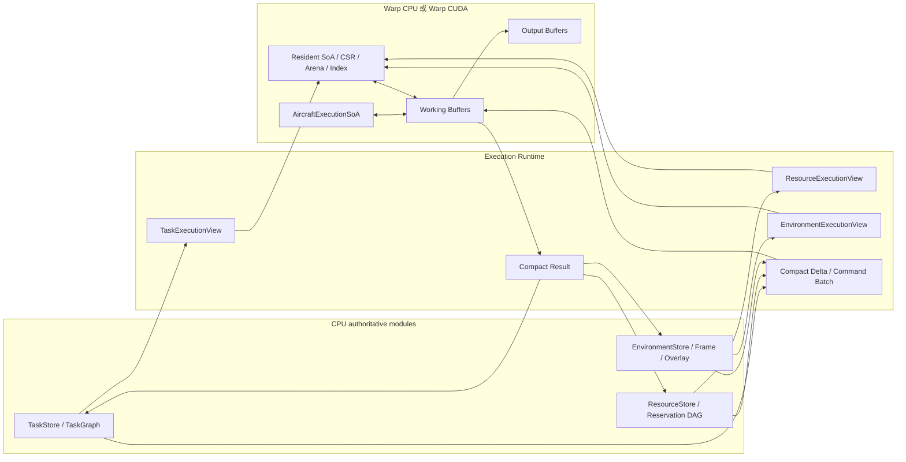
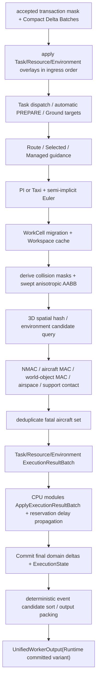
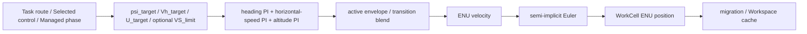
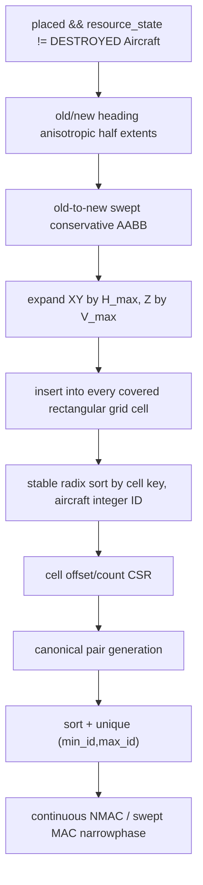
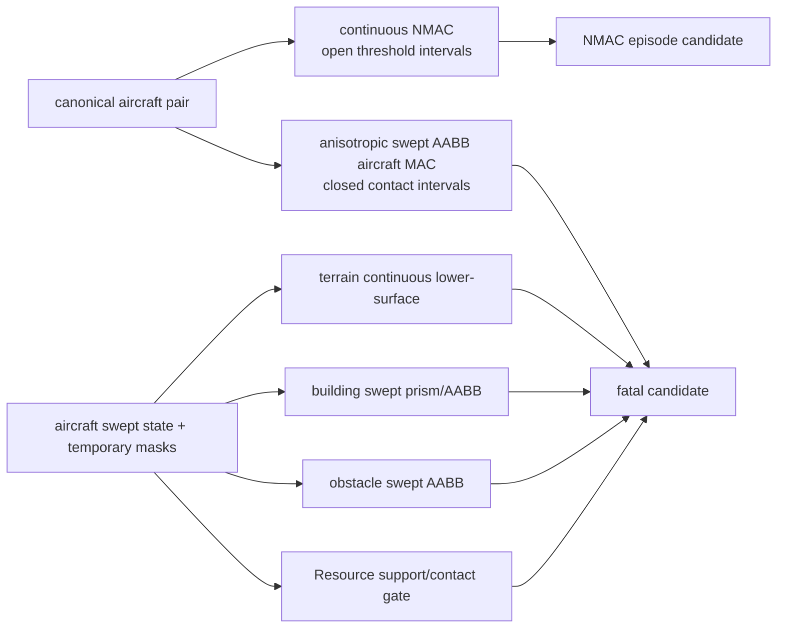
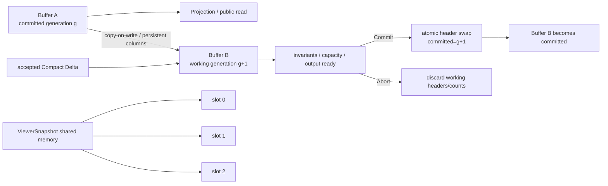
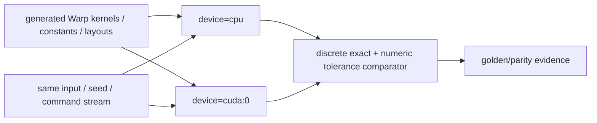

# Execution Runtime

定义 Backend 选择、AircraftExecutionState/Subphase、FlightCore、PI、RouteTracker、起降、碰撞、fatal set、resident layout、generation 与 CPU/CUDA parity。

## 内容来源
- 设计：第 7 章（7. Compute Backend / Execution Runtime）

> 本文件是权威输入文档的分层视图。若拆分文本与源文档发生差异，以《LightBlueSky v8.0 统一设计规范》为系统设计与公开合同权威，以《HITL 大阶段切换规范》为当前项目阶段推进与人工验收权威。

## 规范正文

## 7. Compute Backend / Execution Runtime

### 7.1 Execution Runtime 定位

Execution Runtime是唯一的实时计算汇聚模块。CPU Host逻辑、Warp device、resident view、kernel与buffer均是其内部组成，不再作为独立一级模块。当前device固定为：

```text
Warp CPU
或
Warp CUDA
```

Execution Runtime封装：

```text
Backend selection / startup self-check
TaskExecutionView / ResourceExecutionView / EnvironmentExecutionView
Aircraft Execution State / Subphase / controller
长期驻留SoA / CSR / Arena / index
Compact Delta Batch application
Warp kernel launch
working/output buffer
physical integration / collision / airspace / support contact
candidate sort / fatal set / output packing
working_generation / committed_generation
```

Task、Resource、Environment完整业务模块不得搬到GPU。Runtime不参与业务ALLOW/UNABLE，不提供逐命令feasibility。`RuntimeStore`只是Store、View、SoA、CSR、Arena和ExecutionState的集合称谓，不是一级业务模块。

### 7.2 Execution Runtime 内部 Host 与 device

Execution Runtime内部Host使用CPython进程内Warp API，负责：

- 选择`cpu`或`cuda:0`device；
- 分配和预热`wp.array`；
- 建立host/device mirror；
- 打包批量execution input；
- launch/synchronize必要kernel boundary；
- 接收三个Module的Compact Delta Batch；
- 返回三个ExecutionResultBatch；
- 管理generation和统一Worker output buffer。

Host不得执行per-aircraft Python loop；per-aircraft热路径必须在Warp kernel中完成。Host/device边界是内部实现细节，不改变一级模块拓扑。

### 7.3 Backend 选择与 startup self-check

| Public backend | Device | 失败行为 |
|---|---|---|
| `auto` | 优先通过 self-check 的 `cuda:0`，否则 `cpu` | 两者均失败：BUILD_FAILED `BACKEND_UNAVAILABLE`。CUDA fallback 产生 warning。 |
| `cpu` | `wp.get_device("cpu")` | 失败即 Build 失败，不切 CUDA。 |
| `cuda` | `wp.get_device("cuda:0")` | device/driver/memory/kernel smoke 失败即 Build 失败；运行失败 fail-stop。 |

Self-check 至少验证：

```text
u8/u16/u32/i32/f32/f64 layout
host/device copy
stable enum constants
generated binary codec offsets
one deterministic smoke kernel
one committed output frame
```

JIT warm-up 不计入 steady-state benchmark，compile time、cache path和compiled module revision必须单独报告。

### 7.4 三个 Runtime View 与长期驻留

**图 7-1　CPU Store 与 Backend View 数据驻留图（权威）**



Build 后长期驻留：

```text
AircraftExecutionSoA
TaskSoA hot columns
RouteOccurrenceArena / RouteConstraintArena
GroundSegmentArena / GroundPointArena
Resource geometry / reservation hot columns / occupancy rows
FrameRegistry / height fields / spatial indices
Building / obstacle / airspace compiled data
Runtime overlay capacity
working/output buffers
```

每 Tick 只传 Compact Delta、command rows 和 Compact Result，不复制完整 Store 或 JSON。

### 7.5 Aircraft Execution State 与 Subphase

Public Execution State以第5.8节为权威：

```text
GROUND
TAKEOFF
NAV
LANDING
```

Internal `AircraftSubphase`精简为：

```text
NONE
TAKEOFF_VERTICAL_CLIMB
TAKEOFF_RUNWAY_ROLL
TAKEOFF_WING_BORNE
TAKEOFF_TRANSITION
LANDING_APPROACH
LANDING_BACK_TRANSITION
LANDING_VERTICAL_DESCENT
LANDING_ROLLOUT
GROUND_RECOVERY
```

合法组合映射：

| Execution State | 合法 Subphase |
|---|---|
| GROUND | NONE、GROUND_RECOVERY |
| TAKEOFF | TAKEOFF_VERTICAL_CLIMB、TAKEOFF_RUNWAY_ROLL、TAKEOFF_WING_BORNE、TAKEOFF_TRANSITION |
| NAV | NONE |
| LANDING | LANDING_APPROACH、LANDING_BACK_TRANSITION、LANDING_VERTICAL_DESCENT、LANDING_ROLLOUT |

任何其他组合是`INTERNAL_INVARIANT_BROKEN`并fail-stop。Route tracking、off-route、ground taxi等不再编码为Subphase，分别由`LateralSource`、Ground occurrence cursor和controller mode表达。Subphase不进入public Read Model、event或ViewerSnapshot。

### 7.6 固定 Tick 计算顺序

**图 7-2　完整 Tick 计算 flowchart（权威）**



顺序不得因CPU/CUDA Backend改变：

1. 同Tick accepted command delta在movement前应用；
2. world collision临时mask在command/resource transition后、integration前确定；
3. collision使用old→new swept state；
4. 同Tick先形成全部MAC，再统一fatal set；
5. fatal consequence、Resource BLOCKED和reservation延误传播在同一generation提交；
6. event、Read Model和ViewerSnapshot观察同一committed generation。

### 7.7 FlightCore 数据通路

**图 7-3　FlightCore 数据通路图（权威）**



FlightCore 不实现完整气动或姿态动力学。Taxi 不进入三组 PI。

### 7.8 三组 PI

状态：

```text
p = [E,N,U]
v = [vE,vN,vU]
Vh  = sqrt(vE^2 + vN^2)
psi = atan2(vE,vN) unless Vh < 1e-4

e_psi = wrap_to_pi(psi_target - psi)
e_spd = Vh_target - Vh
e_alt = U_target - U

yaw_rate_cmd = heading_kp * e_psi + heading_ki * I_heading
horizontal_accel_cmd =
  horizontal_speed_kp * e_spd + horizontal_speed_ki * I_horizontal_speed
vertical_speed_cmd = altitude_kp * e_alt + altitude_ki * I_altitude
```

固定 `ControllerConstants`：

| Mode | max turn rate | accel | decel | lookahead time |
|---|---:|---:|---:|---:|
| rotor | `0.35 rad/s` | `3.0 m/s²` | `4.0 m/s²` | `3.0 s` |
| wing | `0.15 rad/s` | `2.0 m/s²` | `3.0 m/s²` | `5.0 s` |

输出：

```text
psi_next = wrap_to_pi(
  psi + clamp(yaw_rate_cmd, -max_turn_rate, max_turn_rate) * dt
)

Vh_next = clamp(
  Vh + clamp(horizontal_accel_cmd, -decel, accel) * dt,
  active_min_horizontal_speed,
  active_max_horizontal_speed
)

vU_next = clamp(vertical_speed_cmd, -max_descent_rate, max_climb_rate)
if VS_limit exists:
  vU_next = clamp(vU_next, -VS_limit, VS_limit)

vE_next = Vh_next * sin(psi_next)
vN_next = Vh_next * cos(psi_next)
v_next = [vE_next,vN_next,vU_next]
p_next = p + v_next * dt
```

`p_next` 是 semi-implicit Euler：先更新速度，再用新速度更新位置。Wing 在 NAV 的 minimum 使用 profile `min_level_flight_speed_mps`；LANDING 的 managed schedule 将 active minimum 切换为 0。Hover-capable rotor minimum 为 0。

### 7.9 Anti-windup 与 bumpless transfer

每通道 conditional integration：

```text
candidate_I = I + error * dt
candidate_output = Kp*error + Ki*candidate_I

if output at upper limit and candidate_output pushes higher:
  freeze I
else if output at lower limit and candidate_output pushes lower:
  freeze I
else:
  commit candidate_I
```

规则：

- GROUND/RESET：全部 integrator 清零；
- mode/phase 切换：按当前已应用输出反解 incoming integrator；Ki=0 时置零；
- inactive hybrid bank tracking/frozen，不自由累计；
- transition 两 bank 分别计算和 anti-windup 后再混合；
- 最终混合限幅继续冻结推动越界的 bank。

Hybrid vector blend：

```text
v_transition = (1-lambda)*v_rotor_candidate + lambda*v_wing_candidate
x = clamp(elapsed / duration, 0, 1)
lambda = x*x*(3 - 2*x)
```

按 ENU vector 混合，不线性平均 heading。Back-transition 使用对称方向。

### 7.10 Selected control

`SEL` 只在 Aircraft Execution State NAV 接受，至少包含 `SPD/DEG/ALT` 之一；`VS` 必须与 ALT 同时出现且 `>0`。超出 active envelope 为 UNABLE `ENVELOPE_EXCEEDED`，不得静默 clamp 用户目标。

- `SEL DEG`将lateral source切到`OFF_ROUTE_SELECTED`，route identity保留；
- hover-capable active mode 可以 `SPD=0`；
- wing NAV 低于 minimum 为 UNABLE；
- LANDING managed flow 中 SEL 为 UNABLE `INVALID_AIRCRAFT_PHASE`。

### 7.11 RouteCompiler 与 RouteTracker

RouteCompiler 将 occurrence sequence 编译为 legs，不展开成内部命令。连续相同位置 waypoint 形成零长 leg 时，在进入时立即完成并写 internal trace。

对非零 leg `A->B`：

```text
d = B-A
L = length(d)
t_hat = d/L
s = dot(P-A, t_hat)
P_line = A + clamp(s,0,L)*t_hat
cross_vec = P_line-P
d_cross = length(cross_vec)

lookahead_m = clamp(
  max(capture_radius_to, Vh * lookahead_time_s),
  rotor ? 10 : 50,
  rotor ? 250 : 1000
)

P_los = A + clamp(s + lookahead_m, 0, L) * t_hat
direction = normalize(P_los-P)
psi_target = atan2(direction_E, direction_N)
```

Fixed-wing turn anticipation：

```text
delta = abs(wrap_to_pi(next_leg_heading - current_leg_heading))
turn_radius = max(Vh, active_min_speed)^2 /
              max(max(Vh,1e-3)*max_turn_rate, 1e-3)
anticipation = clamp(turn_radius * tan(delta/2), 0, 1000)
```

当 `remaining_s <= max(lookahead_m,anticipation)` 时，LOS target 沿 current/next leg normalized direction 以 smoothstep 混合，不得瞬时改变 heading。

Constraint target：

- endpoint altitude：从 leg 起点当时 active U target 到 endpoint altitude 按 `clamp(s/L,0,1)` 线性插值；
- endpoint speed：本 leg 使用该 speed，否则 active mode cruise；
- target time/window：

```text
V_time = remaining_distance / max(target_t - t_s, dt_s)
```

与 speed constraint 同时存在时取较小正值，再校验 envelope。不可满足时继续 envelope-safe 飞行，并在错过时产生 constraint event candidate。

Occurrence complete：

```text
distance_to_B <= capture_radius
OR
(s >= L AND d_cross <= capture_radius)
```

每次只推进一个 occurrence，重复 ID 不跳过。Route 全部完成只更新 Task Read Model，不发布独立 route-complete event。

### 7.12 DCT 与 JNL

#### DCT

DCT只从off-route lateral source指向当前Task route的明确未完成occurrence。DCT将LOS target设为该点，capture后cursor移到该occurrence并恢复RouteTracker。off-route是`LateralSource`事实，不是AircraftSubphase。

#### JNL

JNL只汇入一对明确、正向相邻、未完成的`from->to`occurrences。固定stream：

```text
stream_id = 0x4A4E4C5F    # "JNL_"
```

`jnl_blend_k_m`使用附录F定义的SplitMix64路径，由`random_seed`、stable `aircraft_row_u32`和`task_row_u32`确定：

```text
jnl_blend_k_m = 120.0_f32 + 230.0_f32 * uniform_f32
```

同一epoch内固定，CPU/CUDA bit-exact。

若命令提供`DEG`：

```text
heading_capture_tolerance_rad = 0.035
```

先按heading PI对齐；当`abs(e_psi) < 0.035`后进入blend。该threshold固定，与seed无关。不提供DEG时直接blend。

```text
P_proj = A + clamp(dot(P-A,t_hat),0,L)*t_hat
d_cross = length(P_proj-P)
alpha = d_cross / (d_cross + jnl_blend_k_m)
route_direction = t_hat
correction_direction =
  normalize(P_proj-P) if d_cross>1e-4 else route_direction
guidance_direction =
  normalize((1-alpha)*route_direction + alpha*correction_direction)
```

Entry condition：

```text
d_cross <= max(from.capture_radius, to.capture_radius)
0 <= projection_s <= L
dot(current_horizontal_velocity, route_direction) >= 0
```

满足后切回RouteTracker并将active target设为`to`。全程不得snapping。

### 7.13 Ground Motion / Taxi

Taxi使用受限匀速P响应：

```text
K_V = 1.0 1/s
a_taxi = 1.5 m/s²
a_brake = 2.0 m/s²
e = V_cmd - V
a = clamp(K_V*e, -a_brake, a_taxi)
V_next = max(0, V+a*dt)
```

Fixed-wing目标速度为profile`runway.taxi_speed_mps`；其他机型固定`5 m/s`。U由Terrain或合法Resource support surface派生。

`TAXI`不替换原Ground Plan，而是在当前Ground occurrence序列中原子插入一个manual occurrence：

```text
current position
-> manual point
-> original planned next point
-> remaining Ground Plan
```

规则：

1. 只允许PRE_GROUND或POST_GROUND；
2. 必须存在可恢复的planned next target；
3. 一个命令插入一个manual point；
4. 使用append-only stable Ground occurrence serial；
5. 完成后tombstone，serial不复用；
6. command idempotency retry不得重复插入；
7. WGS84/ENU转换使用只读FrameRegistry；
8. Environment不参与TAXI业务ALLOW/UNABLE；非法世界接触仍由完整物理Tick检测。

Ground target capture：

```text
horizontal_distance_to_target <= max(0.5 m, aircraft_half_horizontal*0.1)
AND abs(pos_u - (target_surface_u + body_half_height_m)) <= 0.25 m
```

捕获后只推进一个occurrence；segment结束由Task Module提交phase/progress。

### 7.14 Managed takeoff

Takeoff接受gate由Task/Resource Module完成。Runtime managed flow：

#### VTOL

合法支撑时reference point目标为：

```text
U_target = assigned_pad_surface_u + body_half_height_m
```

离开支撑后，当：

```text
pos_u - assigned_pad_surface_u
  >= body_half_height_m + min_vertical_takeoff_height_above_pad_m
```

rotorcraft进入NAV；compound/tiltrotor进入TAKEOFF_TRANSITION，完成后NAV。

#### Fixed-wing

沿selected Runway End正方向执行runway roll；达到profile wing minimum speed并离开surface后进入TAKEOFF_WING_BORNE，完成initial climb后NAV。

Takeoff phase change必须在同一committed generation更新AircraftExecutionState和TaskPhase。

### 7.15 ManagedLandingPlanV1

LND不执行额外的业务可行性Provider判定，也不分配专用可行性reason；第一版始终按committed state确定性生成本节计划。

`ManagedLandingPlanV1`是Runtime内部、确定性、不可配置的第一版landing plan：

- 不是公开Schema；
- 不是Provider；
- 不参与ALLOW/UNABLE；
- 在LND transaction提交时，根据同一committed state确定性生成；
- 与LND phase/state change同一generation生效。

#### Fixed-wing

生成：

```text
assigned touchdown-zone center
final approach point
capture leg
final leg
deterministic height curve
managed speed schedule
touchdown and rollout target
```

#### Multirotor / Helicopter

生成：

```text
Pad center
over-pad horizontal capture point
deterministic horizontal speed decay
vertical descent
```

#### Compound-wing / Tiltrotor

生成：

```text
back-transition entry
wing capture segment
smoothstep back-transition
over-pad vertical descent
```

全部继续使用现有PI、active envelope和semi-implicit Euler。LND在计划初始化提交时即ACCEPTED，不等待touchdown。

### 7.16 Managed landing speed、touchdown 与 rollout

LND accepted后Runtime锁存`ManagedLandingPlanV1`，用户selected control停止生效。

Fixed-wing在LND apply boundary：

```text
d0_m = max(remaining_horizontal_path_to_touchdown_m, 1e-3)
h0_m = max(
  current_pos_u - (touchdown_surface_u + body_half_height_m),
  1e-3
)
V0_mps = current_horizontal_speed_mps
a_landing_mps2 = 3.0
V_td_mps = min(
  V0_mps,
  touchdown_max_horizontal_speed_mps,
  touchdown_max_total_speed_mps
)
```

每个LANDING Tick：

```text
d = max(remaining_horizontal_path_to_touchdown_m, 0)
h = max(current_pos_u - (touchdown_surface_u + body_half_height_m), 0)
q = max(clamp(d/d0_m,0,1), clamp(h/h0_m,0,1))
shape = q*q*(3 - 2*q)
V_shape = V_td_mps + (V0_mps - V_td_mps) * shape
V_brake_bound = sqrt(max(V_td_mps^2 + 2*a_landing_mps2*d, 0))
Vh_target = min(V_shape, V_brake_bound)
```

Landing可以低于NAV minimum。高度由ManagedLandingPlanV1控制并受max descent limit。

正常支撑目标：

```text
U_target = support_surface_u + body_half_height_m
```

触地几何判定：

```text
pos_u <= support_surface_u + body_half_height_m + numeric_tolerance
```

Terrain/Building/Obstacle/Aircraft MAC使用`collision_half_u_m`，不得把safety margin加入正常support target。

Touchdown还必须满足Resource章节的availability、permission、reservation active owner和authorized support-area gate，以及horizontal/vertical/total speed limit。若几何接触发生但任一Resource gate失败，不继续approach，而形成`aircraft_world_object_mac(RESOURCE_SURFACE)`。LND final status不被追溯修改。

Fixed-wing rollout：

```text
aircraft_half_length_m = body_half_length_m
numeric_tolerance_m = max(0.01, 8*ulp_float32(runway_length_m))
rollout_end_s = runway_length_m
                - aircraft_half_length_m
                - numeric_tolerance_m
rollout_complete = s >= rollout_end_s
```

跨过终点clamp到`rollout_end_s`。完成时public Execution State立即LANDING→GROUND，Subphase进入GROUND_RECOVERY；reservation/owner/occupancy独立继续。

### 7.17 WorkCell migration

迁移算法以图 6-3 为唯一权威。Runtime 要求：

- owner WorkCell `f32` 积分；
- migration candidate compacted；
- f64 ECEF/global-equivalent final membership；
- stable tie-break；
- owner change只在 Tick boundary提交；
- old/new/overlap cells都参与 swept environment query；
- ECEF continuity `<=1e-4 m`。

### 7.18 3D Spatial Hash

**图 7-4　3D Spatial Hash 图（权威）**



Pair threshold：

```text
H_pair = max(H_A, H_B)
V_pair = max(V_A, V_B)
```

Build全局扩张量：

```text
H_max = max(
  environment.nmac_horizontal_m,
  every aircraft nmac_horizontal override
)

V_max = max(
  environment.nmac_vertical_m,
  every aircraft nmac_vertical override
)

max_horizontal_AABB_diameter =
  max_aircraft 2 * (
    sqrt(body_half_length_m^2 + body_half_width_m^2)
    + safety_margin_m
  )

max_vertical_AABB_height =
  max_aircraft 2 * collision_half_u_m

cell_xy >= max(H_max, max_horizontal_AABB_diameter)
cell_z  >= max(V_max, max_vertical_AABB_height)
```

每架Aircraft hash插入：

1. 按old/new heading分别计算old/new`collision_half_e/n`；
2. 构造覆盖old/new AABB并连接old_pos到new_pos的swept conservative AABB；
3. XY扩张`H_max`，Z扩张`V_max`；
4. 登记扩张AABB覆盖的全部cell。

不得依赖固定26邻居。CPU/CUDA使用相同H_max/V_max、heading投影、cell覆盖和pair排序。

### 7.19 Dynamic membership 与临时碰撞 mask

所有`placed && AircraftResourceState != DESTROYED`的Aircraft进入aircraft-aircraft dynamic membership，包括GROUND、rollout和ground recovery。unplaced/destroyed不进入。

不增加新的权威碰撞状态机。每Tick根据Execution State、Ground occurrence、assigned support和Resource grant派生临时bit mask：

```text
check_terrain_mac
check_solid_world_mac
allow_assigned_support_contact
```

规则：

- TAKEOFF/NAV/LANDING：检查Terrain及solid world；
- Ground movement和Manual TAXI：Terrain/assigned Resource可以是support，但仍检查Building、Obstacle、非授权Resource和Aircraft；
- 静止合法support不重复产生Terrain MAC；
- 合法support必须属于assigned Resource且phase/owner gate允许；
- Ground-ground不判NMAC，仍判Aircraft MAC；
- 若至少一方设置`AircraftExecutionFlag.INSIDE_HANGAR`，则在Aircraft pair MAC candidate前过滤该ground-ground MAC；
- `INSIDE_HANGAR`只在Aircraft已经完成实体Hangar进入并处于机库内时设置，不得仅因取得、预留或占用Hangar logical lane而设置；
- Aircraft离开机库并开始Ground movement时清除`INSIDE_HANGAR`，自该Tick的锁定mask起恢复ground-ground Aircraft MAC检查。

mask在command/resource transition应用后、integration前锁定，并用于old→new全段；不得用Tick末状态回溯跳过本段。

### 7.20 NMAC 与 MAC narrowphase

**图 7-5　NMAC/MAC narrowphase 图（权威）**



#### 7.20.1 Aircraft-aircraft NMAC

设：

```text
r_h(t) = r_h0 + v_h*t
r_u(t) = r_u0 + v_u*t
t ∈ [0,dt]
```

求开放区间：

```text
I_h = {t | dot(r_h(t),r_h(t)) < H_pair^2}
I_v = {t | abs(r_u(t)) < V_pair}
NMAC iff I_h ∩ I_v ∩ [0,dt] 非空
```

恰好等于H或V不触发。CPU/CUDA使用相同root ordering、strict comparison、f32 input/f64 intermediate。NMAC只适用于aircraft-aircraft。

#### 7.20.2 Aircraft-aircraft MAC

对old/new heading分别计算各向异性AABB half extents，并以swept conservative slab intersection求闭区间接触。接触边界属于物理相交。双机pair必须使用canonical`(min_id,max_id)`。

#### 7.20.3 Terrain world-object MAC

- 查询swept horizontal segment覆盖的heightfield cells；
- 使用`collision_half_u_m`计算Aircraft lower surface；
- 在`check_terrain_mac`有效时，若continuous segment lower surface`<=terrain surface`则fatal；
- 合法support contact使用`body_half_height_m`目标，不使用collision margin。

#### 7.20.4 Building / Obstacle / Resource world-object MAC

在`check_solid_world_mac`有效时执行sweptAircraft AABB与Building prism/AABB、Obstacle AABB、Resource surface/volume的intersection。

Public fatal event统一为：

```text
aircraft_world_object_mac
```

Payload使用：

```text
collider_kind =
  TERRAIN | BUILDING | OBSTACLE | RESOURCE_SURFACE

contact_failure_reason? =
  RESOURCE_NOT_PREPARED
  RESOURCE_OWNER_MISMATCH
  RESOURCE_CLOSED
  RESOURCE_BLOCKED
  OPERATION_DISABLED
  OUTSIDE_AUTHORIZED_SUPPORT_AREA
```

合法assigned support contact不产生MAC。

### 7.21 Airspace query 与 episode

Aircraft reference position同时满足：

```text
horizontal polygon inside
AND vertical interval inside
AND matched restricted rule
AND no active AX
```

才进入 violation。Polygon boundary 视为 inside，vertical boundary 视为 inside，restriction range为闭区间。

Episode state：

```text
INACTIVE -> ACTIVE: condition becomes true, publish one entry event
ACTIVE -> ACTIVE: no repeated public event
ACTIVE -> INACTIVE: internal close only
INACTIVE -> ACTIVE: re-entry, new episode/event
```

Key：

```text
NMAC: sorted(aircraft_id_a, aircraft_id_b)
airspace: aircraft_id + zone_id
```

不发布 public exit event。

### 7.22 Resource physical contact 与 occupancy geometry

Execution Runtime检测：

```text
Aircraft AABB/footprint与Pad TLOF/FATO
Aircraft reference point/AABB沿Runway surface axis/width
Runway End start/touchdown zone
Hangar logical lane arrival/leave support point
Resource contact point for fatal attribution
```

实际Pad/Runway End接触前验证Resource Module提供的只读compact gate：

```text
availability OPEN
parent Facility OPEN
operation permission OPEN（Runway End）
reservation active owner state
owner task matches
PREPARE complete
inside authorized support area
```

几何结果只作为ResourceExecutionResultBatch。合法则形成occupancy/contact result；非法则形成`RESOURCE_SURFACE` world-object MAC candidate。Runtime不直接写ResourceStore。

### 7.23 Fatal set

同Tick全部MAC candidate先按：

```text
(cause kind, collider/pair key, contact time)
```

stable sort/unique，再形成fatal aircraft set。Fatal set去重后一次提交：

```text
Aircraft-aircraft MAC -> both aircraft
World-object MAC -> subject aircraft
```

World-object contact attribution优先最小接触support area，再按resource integer ID；Terrain/Building/Obstacle保留object row和collider_kind。

同一事故链固定event顺序，并由 `ordering_class,event_code` 直接实现：

```text
aircraft_aircraft_mac (0x1402) or aircraft_world_object_mac (0x1403)
-> aircraft_destroyed_by_aircraft_mac (0x1A01)
   or aircraft_destroyed_by_world_object_mac (0x1A02)
-> task_interrupted (0x1A10)
-> class 60 resource changes, including resource_availability_changed
```

已BLOCKED Resource再次事故不重复availability change event，但fatal chain其余event仍发布。

### 7.24 SoA / CSR / Arena

核心命名：

```text
AircraftResourceSoA
AircraftExecutionSoA
TaskSoA
WaypointSoA
RouteOccurrenceArena
RouteConstraintArena
GroundSegmentArena
GroundOccurrenceArena
ResourceSoA
RunwayBodySoA / RunwayExclusivityCSR
ReservationSoA
ResourceOwnerArena
PhysicalOccupancyArena
HangarSlotArena
ObstacleSoA
BuildingSoA / BuildingIndex
AirspaceZoneSoA / PolygonCSR / RestrictedRuleCSR / ExemptionArena
FrameRegistry / FrameAdjacencyCSR
```

共同规则：

- 一维contiguous`wp.array`；
- bool用u8，enum/flag用固定整数；
- optional float用quiet NaN，optional row用-1；
- Arena有`count/capacity/generation`；
- READY后static arrays immutable；
- mutable Arena append-only，terminal/delete使用tombstone；
- route和Ground occurrence serial不复用；
- Tick hot path不得device allocation/free；
- 不得用Python object/list表示per-aircraft Runtime column；
- `capability_mask`是model_type派生只读cache；
- Runtime的`current_task_i32`是Resource权威值的只读mirror；
- owner array是active reservation的派生cache，禁止独立写入。

CRC只用于跨进程IPC、shared memory和网络frame。同进程typed handle和array不计算CRC。

### 7.25 Backend mirror

CPU authoritative Store与Backend View使用：

```text
full immutable upload at Build
compact append/update delta after Build
per-column dirty range
stable generation header
```

CUDA Backend不得每Tick回传完整Aircraft/Task/Resource arrays，只返回三个ExecutionResultBatch、committed projection source和health/overflow counters。

`ResourceSoA.current_task_i32`与`AircraftExecutionSoA.current_task_i32`均保留；Runtime侧是Resource权威assignment的只读cache，随ResourceCompactDelta同步。owner cache随ReservationState同事务同步，禁止单独修改。

Warp CPU与CUDA使用同一generated layout declaration。

### 7.26 Working/Committed generation 与 buffer

**图 7-6　Commit generation / 双缓冲图（权威）**



Authoritative state至少双缓冲；Snapshot transport固定 three-slot。实现可以使用三缓冲优化 authoritative compute，但公开语义仍是单一 committed generation。

### 7.27 UnifiedWorkerOutput

Worker向Projection Hub只使用一个one-way tagged union：

```text
UnifiedWorkerOutput
  BUILD_PROGRESS
  BUILD_FAILED
  RUNTIME_COMMITTED
  WORKER_FAILED_LATCH
```

#### Runtime committed variant

至少包含：

```text
canonical epoch_id UUID 128-bit / completed tick / t_s / committed_generation
final command status rows
sorted event candidate rows
Task projection source delta
Aircraft projection source arrays
Resource projection source delta
Environment projection source delta
ViewerSnapshot complete dynamic sections
static Aircraft table reference
trace evidence
health / overflow flags
```

QUEUED不进入该buffer；它由Gateway admission作为control message发送。Runtime committed variant不得包含working pointer。

#### Build variant

Build progress/failure使用同一Worker output tagged union，不建立独立BuildOutcome接口：

```text
scenario_id
build_request_id
outcome                    # BUILD_PROGRESS / BUILD_FAILED
stage_code?
progress_permille?
issues?
build_summary?
```

Build variant没有epoch、generation、CommandStatus、event、Read Model或ViewerSnapshot。READY必须通过generation 0的Runtime committed variant发布。

#### Fault repeat

若working generation已Abort且last committed arrays仍安全可读，可以发布`WORKER_FAILED_LATCH`：

```text
last committed watermark
fault health
no command final
no domain delta
no new Snapshot
```

若无法形成该variant，Gateway supervisor发送transport-level failure notification，不伪造CommandStatus。

Static Aircraft table在epoch内固定，连接与重连时完整发送，不维护generation。第一版Runtime不会新增Aircraft identity；ADD_TASK只引用Build时已有Aircraft。

### 7.28 Deterministic candidate ordering

同Tick event candidate排序key固定为：

```text
(
  ordering_class_u8,
  event_code_u16,
  primary_subject_int_u32,
  secondary_subject_int_u32,
  task_int_u32,
  resource_int_u32,
  canonical_ingress_sequence_u64,
  candidate_local_sequence_u32
)
```

Ordering class：

| class | 内容 |
|---:|---|
| 10 | final command status event：`command_accepted` / `command_unable` |
| 20 | runtime / VOL / AX mutation fact |
| 30 | Task lifecycle/phase、route、constraint、Aircraft execution fact；不含 `task_interrupted` |
| 40 | NMAC / aircraft MAC / world-object MAC / airspace violation |
| 50 | Aircraft destroyed 与 `task_interrupted` |
| 60 | Resource reservation/state/owner/occupancy/availability consequence |
| 70 | `realtime_overrun` / diagnostics |

同一 ordering class 内，`event_code` 是稳定排序键的一部分，必须按业务因果顺序递增分配：一旦两个 event 可能在同一 generation 同时出现，必然先发生的 event 必须具有更小的 `event_code`。新增 event 必须插入到符合因果顺序的位置，不得简单追加在末尾。若当前 code 区间无法在不改变已正式发布 code 语义的情况下插入，则必须提升 event contract major version。

第一版 active registry 的 class 内审计结果：

- class 10 的 `command_accepted` 与 `command_unable` 互斥，不形成同一命令的因果链；code 只提供稳定顺序。
- class 20 的每个 runtime/VOL/AX mutation最多发布一个对应事实；不同 mutation没有强制跨对象因果先后。
- class 30 通过“首次 `task_started` 不伴随 phase event”和“terminal event 不伴随 phase event”消除了重复因果对；对应 Task phase 与 Aircraft execution phase 是同一原子提交中的并列事实，不定义 producer-before 关系，其 code 仅提供稳定顺序。
- class 40 中 `aircraft_aircraft_nmac` 的 code 小于两类 MAC；当同 Tick 同一 pair先进入 NMAC 再发生 MAC 时，NMAC 排在 MAC 前。airspace violation与碰撞无强制因果关系。
- class 50 中 `aircraft_destroyed_by_aircraft_mac=0x1A01`、`aircraft_destroyed_by_world_object_mac=0x1A02`，均小于 `task_interrupted=0x1A10`。
- class 60 固定为 reservation change、reservation state change、owner change、occupancy change、availability change 的递增 code；该顺序覆盖自动 PREPARE、关闭和 fatal Resource consequence。
- class 70 当前只有 `realtime_overrun`。

同一事故中固定顺序为：

```text
class 40 MAC
-> class 50 aircraft_destroyed (0x1A01 / 0x1A02)
-> class 50 task_interrupted (0x1A10)
-> class 60 Resource consequence
```

不再存在额外事件排序字段。QUEUED不对应event，也不参与candidate ordering。Gateway Error永远不进入candidate ordering。

### 7.29 CPU/CUDA 共用语义

**图 7-7　CPU/CUDA 共用语义图（权威）**



Production CPU与CUDA启动同一组`@wp.kernel/@wp.func`定义。SplitMix64、top24→f32、heading-based AABB、swept cell coverage和collision boundary比较必须共用同一实现路径。

Parity：

| 字段类 | 要求 |
|---|---|
| ID、enum、flags、Task/Resource state、route/ground cursor、CommandStatus、event order | bit-exact |
| time/schedule/reservation f64 | bit-exact；禁止fast-math改写 |
| local position/velocity | `max(abs)<=2e-4`或`<=4 ULP`，取较宽者 |
| heading/controller output | `max(abs)<=2e-5`或`<=4 ULP` |
| migration ECEF continuity | `<=1e-4 m` |
| SplitMix64 random_u64/top24/uniform_f32/blend_k | bit-exact |
| NMAC/aircraft MAC/world-object MAC/airspace/support decision | bit-exact |
| fatal set | bit-exact |
| trace evidence | 离散exact；数值按规定ULP bucket量化 |

影响判定的kernel禁止不受控fast-math。不得依赖无确定顺序atomic reduction产生canonical order。

### 7.30 Candidate overflow 与 fail-stop

Authoritative candidate/command/result buffer capacity在Build时预分配。以下任何overflow：

```text
event candidate
fatal candidate
command result
Task/Resource/Environment result batch
route/ground/reservation mutable Arena
required Runtime committed output section
```

必须设置overflow flag，Abort current generation并进入WORKER_FAILED，reason=`AUTHORITATIVE_CANDIDATE_OVERFLOW`或更具体system fault。不得截断、随机丢弃或只保留前N条。

预声明业务Arena在command candidate reservation阶段发现容量不足时，可以在没有写入任何row前返回业务UNABLE `CAPACITY_EXCEEDED`；一旦进入Runtime authoritative output阶段发生overflow，必须fail-stop。

ViewerSnapshot slot过小必须在Build失败，不允许运行时截断Aircraft。

### 7.31 性能预算

**图 7-8　20,000 Aircraft Tick 性能预算图（权威）**


该比例是优化预算，不允许用删除权威计算绕过。正式 pass criterion仍为 Tick p99 `<=dt_s/time_scale` 且无 backlog/overflow。

### 7.32 本章状态所有权

Execution Runtime唯一拥有AircraftExecutionState、Subphase、controller/integrator、运动状态、Runtime working arrays、spatial hash、临时collision masks、物理query candidate、ManagedLandingPlanV1、fatal set、working/committed buffer和output packing。

### 7.33 本章接口与不变量

1. 三个领域模块只通过各自Execution Port发布长期view、Compact Delta Batch并接收ExecutionResultBatch。
2. Kernel只有TickControlPort。
3. Projection Hub只读UnifiedWorkerOutput。
4. Runtime不写Task/Resource/Environment权威业务状态，不返回业务ALLOW/UNABLE。
5. RuntimeStore不是业务模块。
6. 每Tick不全量复制Store/JSON，不逐命令往返或synchronize。
7. Backend切换只能在Build，运行中不得切换。
8. CRC只用于跨进程IPC、shared memory和network；同进程typed handle不使用CRC。

### 7.34 本章性能和验收要点

- 20,000 Aircraft、200 km×200 km、RTX 3070 8 GiB为第一参考；
- CPU 1,000@1×、CUDA 4,000@5×、CUDA 20,000@1×必须通过；
- JIT warm-up、memory peak、kernel time、copy time、sort time、output pack分别报告；
- mandatory tests：PI/anti-windup、route/JNL SplitMix golden、manual TAXI occurrence、takeoff/ManagedLandingPlanV1、migration、continuous NMAC、anisotropic swept MAC、world-object MAC、fatal set、overflow、generation rollback、CPU/CUDA parity。
