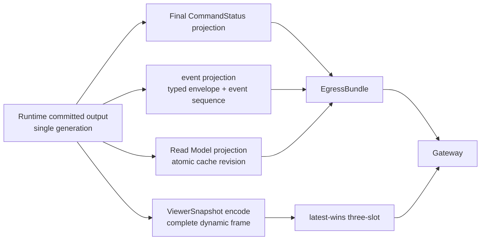
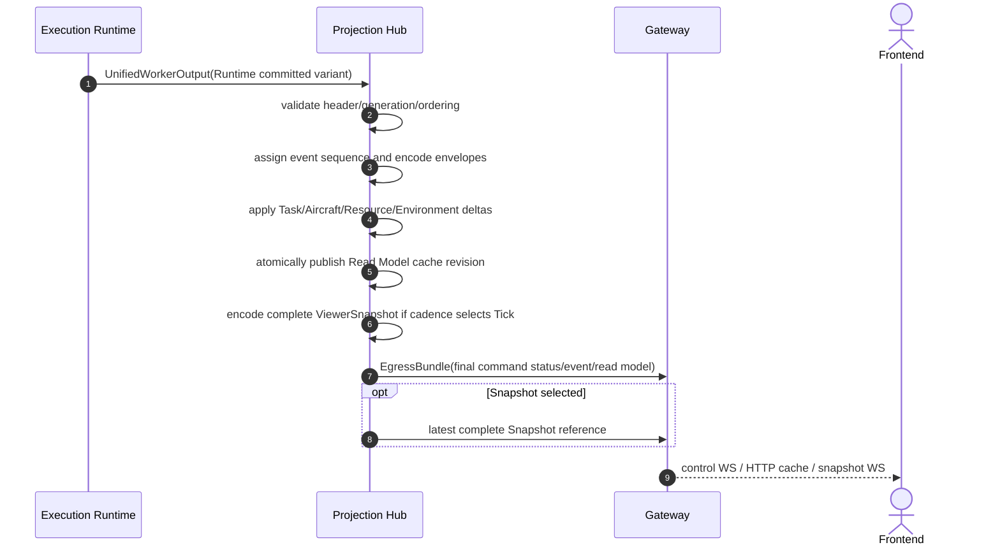
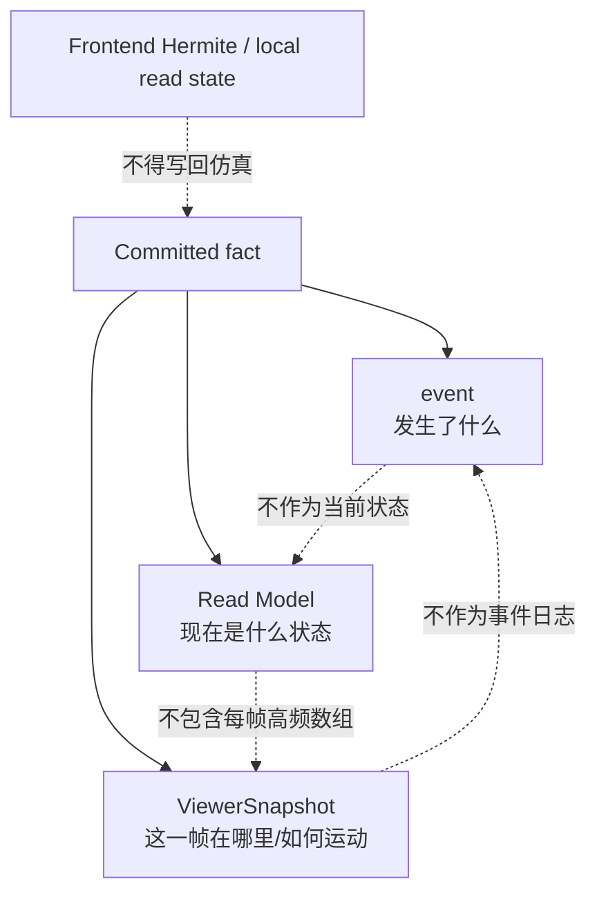
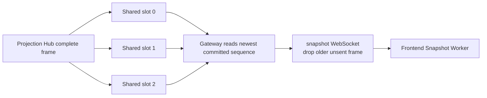

# Projection Hub

定义 UnifiedWorkerOutput 消费、CommandStatus/event/Read Model/ViewerSnapshot 投影、EgressPort、latest-wins 和 static Aircraft table。

## 内容来源
- 设计：第 8 章（8. Projection Hub）

> 本文件是权威输入文档的分层视图。若拆分文本与源文档发生差异，以《LightBlueSky v8.0 统一设计规范》为系统设计与公开合同权威，以《HITL 大阶段切换规范》为当前项目阶段推进与人工验收权威。

## 规范正文

## 8. Projection Hub

### 8.1 模块目标

Projection Hub是已提交事实到公开输出的唯一投影层。对已建立epoch的Runtime output，它只读committed generation，生成：

```text
final CommandStatus
realtime event
Task Read Model
Aircraft Read Model
Resource Read Model
Environment Read Model
Runtime Read Model
ViewerSnapshot
epoch-static Aircraft table
Gateway public query cache payload
```

Projection Hub不参与业务判断，不接受命令，不修改领域状态，不读取working generation，不向Execution Runtime反向控制，也不做浏览器插值。

统一Worker output的Build progress/failure variant只作协议校验和透传，不创建CommandStatus、event、Read Model或Snapshot。QUEUED由Gateway admission直接发送为command status control message，不经过Event Sequencer。

### 8.2 UnifiedWorkerOutput 输入

Projection Hub每次处理一个完整tagged variant。

Runtime committed variant至少验证：

```text
full epoch_id_bytes[16] matches the current canonical epoch_id
generation == expected committed_generation
tick_index/t_s monotonic or valid control-generation repeat
all required section lengths valid
final command status rows unique
candidate ordering key nondecreasing
Task/Resource/Environment source generation equal
ViewerSnapshot aircraft rows sorted
no authoritative overflow flag
```

跨进程或shared-memory物理transport还必须验证CRC；同进程typed handle不要求CRC。

任一Runtime invariant不满足属于protocol/system failure，Projection Hub不得猜测修复或输出部分状态。`WORKER_FAILED_LATCH`只更新fault/last watermark，不生成command final或覆盖Read Model。

Build variant独立验证`scenario_id/build_request_id/outcome/issues/summary`，不参与generation monotonicity。

### 8.3 输出分支

**图 8-1　Runtime committed output分支图（权威）**



Epoch-static Aircraft table不按generation增量更新；连接与重连时由Gateway从当前epoch cache完整发送。

### 8.4 Projection sequence

**图 8-2　Projection sequence（权威）**



### 8.5 Command status projection

#### 8.5.1 QUEUED

Gateway admission成功后立即：

```text
return CommandReceipt(status=QUEUED)
send control message type=command_status, status=QUEUED
store current-epoch Gateway command cache row
```

QUEUED不是event，不分配event sequence，不进入event registry，不由Projection Hub重复发布。

#### 8.5.2 Final status

每个正式命令只能有一个final：

```text
ACCEPTED
UNABLE
```

Projection Hub验证同一`command_id`：

- 恰好一个final row；
- final不会回到QUEUED；
- final reason符合operation reason allowlist；
- final`canonical_ingress_sequence`与Gateway admission record一致；
- failed Mutation除`command_unable`外不得产生领域业务event。

Projection Hub生成`command_accepted`或`command_unable`event。Gateway以final更新已有QUEUED cache row。

### 8.6 event 合同边界

event回答“已提交了什么事实”。它不是当前状态存储，也不用于重建服务器历史。

Envelope核心字段：

```text
event_id
epoch_id
sequence
tick_index
t_s
event_name
severity
task_id?
aircraft_id?
other_aircraft_id?
resource_id?
reservation_id?
waypoint_id?
building_id?
obstacle_id?
volume_id?
zone_id?
command_id?
reason_code?
message?
payload
contract_version
```

`event_name`是唯一公开事件判别字段，不再提供独立类型字段。`severity`是发布时的权威字段；registry default只在producer未显式指定时使用。

`event_id`固定为：

```text
<epoch_id>:<sequence decimal>
```

Sequence在epoch内从1开始单调增加；control generation可以与前一物理Tick共享`tick_index/t_s`，但event sequence仍严格增加。QUEUED control message不占用event sequence。

subject ID统一放envelope顶层。payload只包含事件独有字段；多主体使用`other_aircraft_id`等显式顶层字段。无关optional字段必须省略，不输出null占位。

Command event只允许：

```text
command_accepted
command_unable
```

Task event：

```text
task_started
task_phase_changed
task_completed
task_cancelled
task_interrupted
```

Task首次RUNNING只发布`task_started`；三个terminal event不伴随phase event。

Resource event：

```text
resource_reservation_changed
resource_use_phase_changed
resource_owner_changed
resource_occupancy_changed
resource_availability_changed
```

Safety event：

```text
aircraft_aircraft_nmac
aircraft_aircraft_mac
aircraft_world_object_mac
airspace_violation
aircraft_destroyed_by_aircraft_mac
aircraft_destroyed_by_world_object_mac
```

其他核心event包括Aircraft phase、route、VOL/AX和realtime_overrun。精确registry见附录D。

#### 8.6.1 实时连接限制

第一版event只在实时control连接中输出：

```text
Execution Runtime -> Projection Hub -> Gateway -> Frontend
```

- Frontend Events Pane只显示当前连接期间收到的event；
- 页面刷新、浏览器关闭或重连后不保证恢复历史event；
- Gateway不提供event历史分页或ACK写回；
- Frontend可以在当前连接内维护本地已读状态；
- event sequence gap在重连后合法，Frontend必须显示“history unavailable”。

Gateway current command/warning cache不是通用event history store。

### 8.7 Read Model

Read Model回答“当前公开状态是什么”，由同一generation原子更新。Task、Resource、Environment对象内部不重复携带freshness。

#### 8.7.1 外层 freshness

所有HTTP FreshResponse和control WS Read Model envelope携带：

```text
epoch_id
source_generation
source_tick_index
source_t_s
```

含义：

- `source_generation`：权威提交版本；
- `source_tick_index`：已完成物理Tick数；
- `source_t_s`：当前仿真时间。

三者不恒等。PAUSE、RATE、RESUME、STOP等control commit可以推进`source_generation`而不推进`source_tick_index/source_t_s`。Frontend不得混合不同`source_generation`的关联Task/Resource详情作为同一事实视图。

#### 8.7.2 RuntimeReadModel

```text
scenario_id / epoch_id
session_state
tick_index / t_s / dt_s / time_scale / resume_time_scale
backend_requested / backend_active
worker_status
committed_generation
aircraft_total / active / placed / destroyed
task counts by lifecycle/phase
warning_count / critical_count
canonical_snapshot_sequence / live_published_snapshot_sequence
snapshot_lag_s
```

#### 8.7.3 Task/Aircraft/Resource/Environment

精确字段见附录G；来源必须分别来自三个Module和ExecutionState的committed source，不得在Gateway临时拼接working数据。

### 8.8 event / Read Model / ViewerSnapshot 边界

**图 8-3　event / Read Model / ViewerSnapshot 边界图（权威）**



ViewerSnapshot不包含完整Task/Resource状态；Read Model不复制每帧Aircraft动态TypedArray；event不反复发布持续condition。

### 8.9 ViewerSnapshot cadence

在 `time_scale=1`：

| `dt_s` | Tick频率 | Snapshot频率 |
|---:|---:|---:|
| 0.05 | 20 Hz | 20 Hz |
| 0.1 | 10 Hz | 10 Hz |
| 0.2 | 5 Hz | 5 Hz |
| 0.5 | 2 Hz | 2 Hz |
| 1.0 | 1 Hz | 1 Hz |

加速运行：

```text
snapshot_publish_hz = min(time_scale / dt_s, 20 Hz)
```

规则：

1. 每个物理Tick完整计算和提交；
2. Projection Hub用确定性phase accumulator选择发布Tick；
3. 未发布Tick仍有完整权威状态，只是不生成live display frame；
4. 不得通过跳过物理Tick达到实时目标；
5. `snapshot_sequence`对每个物理Tick增加，live发布可以跳号。

**图 8-4　Tick 与 Snapshot cadence 时间轴（权威）**

```mermaid
gantt
    title dt=0.1, time_scale=5：50 physics Tick/s，最多20 Snapshot/s
    dateFormat X
    axisFormat %L
    section Physics
    Tick 1 :t1, 0, 1
    Tick 2 :t2, 1, 1
    Tick 3 :t3, 2, 1
    Tick 4 :t4, 3, 1
    Tick 5 :t5, 4, 1
    Tick 6 :t6, 5, 1
    section Snapshot
    Publish seq 1 :s1, 0, 1
    Skip seq 2 :s2, 1, 1
    Publish seq 3 :s3, 2, 1
    Skip seq 4 :s4, 3, 1
    Publish seq 5 :s5, 4, 1
```



图示只表达发布选择；实际phase accumulator必须由 `time_scale/dt_s` 和20 Hz上限确定，不得依赖wall scheduler随机性。

### 8.10 Latest-wins buffer

**图 8-5　latest-wins buffer 图（权威）**



Snapshot backpressure规则：

- writer不等待reader；
- Gateway只发送最新完整frame，可以跳过旧sequence；
- 任何torn/CRC失败frame丢弃并重读最新；
- Snapshot丢帧不得影响command/event/Read Model；
- 如果完整frame超过slot capacity，Build失败，不允许运行时截断；
- Projection Hub不生成补帧。

### 8.11 Epoch-static Aircraft table

ViewerSnapshot只携带integer Aircraft ID。Control WS发送：

```text
snapshot_static_table
  contract_version
  epoch_id
  entries[] {
    aircraft_int_u32
    aircraft_id
    profile_id
    model_type
    display_name
  }
```

Entries按integer ID严格递增且唯一。第一版Aircraft catalog在Build时固定，Runtime命令不能新增Aircraft identity，因此该table在epoch内固定，不维护generation。连接和重连时完整发送。

Frontend遇到未知integer ID必须暂停该frame并请求full-state resync，不得猜测映射。

### 8.12 Gateway public query cache

Projection Hub通过`EgressPort`提交atomic cache revision。Gateway只读该内部cache响应：

```text
/state
/tasks
/tasks/{task_id}
/tasks/{task_id}/flight
/tasks/{task_id}/ground-tasks
/resources
/aircraft
/environment
/warnings
/commands/{command_id}
```

Gateway cache是内部数据结构，不是额外业务状态所有者。Gateway不得读取GPU working array，也不提供`exact=true`或阻塞device gather。

### 8.13 Reliable control output

Projection Hub→Gateway使用bounded reliable Worker IPC：

- FIFO、CRC、protocol major握手；
- authoritative EgressBundle不能丢；
- 2 s内无法写入Gateway queue时fail-stop`RELIABLE_EGRESS_STALLED`；
- Gateway与Frontend control WS连接存在时按序发送final CommandStatus、event和Read Model；
- QUEUED status由Gateway admission立即发送，不经过该IPC往返；
- 慢客户端超过per-connection queue上限时Gateway断开该客户端，模拟可继续；
- 断开后event不保存供恢复；
- CommandStatus仍可从当前epoch command cache查询。

### 8.14 第一版无历史和持久化

Projection Hub不得：

```text
写event history
写trajectory history
写Snapshot artifact
创建Recorder/Replay数据
实现ACK server overlay
实现seek/replay timeline
```

任何未来持久化只能按第11部分重新设计，不得在第一版保留隐藏字段或接口。

### 8.15 本章状态所有权

Projection Hub唯一拥有公开event sequence、投影cache revision和ViewerSnapshot encoding/publish selection；epoch-static Aircraft table由Build事实派生并完整缓存。Projection Hub不拥有任何业务状态或QUEUED admission状态。

### 8.16 本章接口与不变量

1. 输入只有UnifiedWorkerOutput。
2. 输出只有EgressPort和Snapshot shared-memory writer。
3. 运行期只读committed generation；Build variant只允许progress/failure透传。
4. 同generation的final CommandStatus、event、Read Model、Snapshot必须一致。
5. QUEUED不是event，不占用event sequence。
6. Projection Hub不插值、不判断业务、不接受命令。
7. event无服务器历史恢复保证。

### 8.17 本章性能和验收要点

- Projection cache apply、Snapshot encode/shared copy、Gateway mirror latency分别报告；
- snapshot encode+shared copy p95 `<=5 ms`；
- no torn frame、latest-wins、sequence gap、static mapping gate是mandatory tests；
- Egress queue stall必须fail-stop；
- no-history/reconnect行为必须E2E验证。

---
