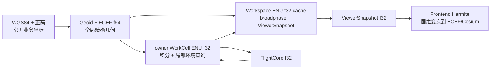
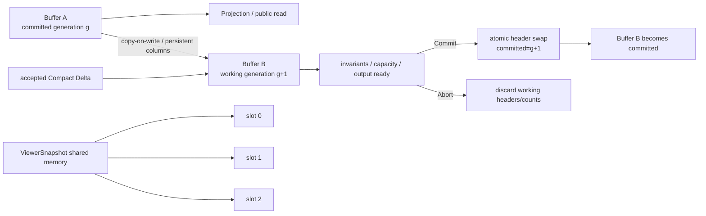

# 通用数据布局

集中定义 mixed precision、FrameRegistry、stable ID、SoA/CSR/Arena 共同规则、各 Store 布局、mutable transaction header、SplitMix64 golden 和 generation 一致性。

## 内容来源
- 设计：2.7–2.9、2.11
- 设计：7.24–7.26
- 设计附录 F.1–F.9、F.17

> 本文件是权威输入文档的分层视图。若拆分文本与源文档发生差异，以《LightBlueSky v8.0 统一设计规范》为系统设计与公开合同权威，以《HITL 大阶段切换规范》为当前项目阶段推进与人工验收权威。

## 关联文档

- [Binary Layouts](../appendices/03-binary-layouts.md)
- [Execution Runtime](04-execution-runtime.md)

## 规范正文

### 2.7 坐标、精度、高度与 heading

#### 2.7.1 单位与 mixed precision

| 字段类 | 单位 | Public JSON | Runtime |
|---|---|---|---|
| `_m` | m | finite number | local dynamic `f32`；frame/geodesy `f64` |
| `_mps` | m/s | finite number | `f32` |
| `_mps2` | m/s² | finite number | `f32` |
| `_s` | simulation second | finite number | schedule/time `f64` |
| `_deg` | degree | finite number | boundary `f64`，hot path rad `f32` |
| ID/count/code | 无 | string/integer | `u8/u16/u32/u64/i32` |

JSON 不允许 `NaN`、`Infinity` 或 `-Infinity`。内部尚未发生的可选时间使用 quiet NaN sentinel，公开序列化时省略字段。

#### 2.7.2 三层坐标职责

**图 2-5　坐标关系图（权威）**



- WorkCell ENU：FlightCore 积分、terrain/building/obstacle 查询和局部 narrowphase。
- Workspace ENU：200 km 场景级位置/速度缓存，用于 3D spatial hash、aircraft broadphase 和 ViewerSnapshot。不得把 Workspace U 当作整个场景统一的当地 Up。
- ECEF：真实地图 frame 构建、迁移候选最终归属、跨 frame 连续性和 Cesium 变换；不得建立永久同步的 per-aircraft production ECEF SoA。
- `virtual_enu`：沙盘全局 ENU；单 WorkCell 时可以 identity 映射且不启用 geoid。

#### 2.7.3 FrameRegistry 机器语义

矩阵 row-major `f64`，向量使用 `[E,N,U]` 或 `[X,Y,Z]`：

```text
FrameRecord
  frame_id_u32
  frame_kind_u8                 # WORKSPACE=1 / WORKCELL=2
  parent_frame_id_i32           # workspace 为 -1
  origin_ecef_f64[3]
  enu_to_ecef_rotation_f64[9]
  ecef_to_enu_rotation_f64[9]
  core_min_enu_f64[3]
  core_max_enu_f64[3]
  overlap_min_enu_f64[3]
  overlap_max_enu_f64[3]
  direct_to_workspace_A_f64[9]
  direct_to_workspace_b_f64[3]

FrameAdjacencyCSR
  offsets_u32[frame_count + 1]
  neighbor_frame_id_u32[]
  direct_i_to_j_A_f64[][9]
  direct_i_to_j_b_f64[][3]
```

变换：

```text
p_ecef = origin_ecef + R_enu_to_ecef * p_enu
p_enu  = R_ecef_to_enu * (p_ecef - origin_ecef)
p_target = A_source_to_target * p_source + b_source_to_target
```

Build gate：

1. `max_abs(R * R^T - I) <= 1e-12`；
2. `abs(det(R) - 1) <= 1e-12`；
3. 8 个 bounds corner 的 ENU→ECEF→ENU round-trip `<= 1e-6 m`；
4. direct A/b 与完整 ECEF 链差 `<= 1e-5 m`；
5. adjacency 对称；overlap 覆盖一个 Tick 最大允许位移加最大 aircraft AABB half extent；
6. `frame_id` 按 canonical frame key 稳定分配，输入数组无语义重排不得改变 ID。

#### 2.7.4 坐标输入模式

`frame.type` 只允许：

| 值 | 输入 | Runtime |
|---|---|---|
| `real_world_wgs84` | WGS84 lon/lat + 正高 | geoid→ellipsoid→ECEF→ENU |
| `virtual_enu` | 米制 ENU | 直接形成 Workspace/WorkCell |

真实地图高度关系：

```text
h_ellipsoid_m = H_orthometric_m + N_geoid
H_orthometric_m = h_ellipsoid_m - N_geoid
```

默认 GeoidProvider 必须离线、固定版本，并记录 provider ID、dataset version、插值算法和 missing policy。正式场景缺失必要 geoid 数据是 Build error；受控测试可以显式使用 `geoid_model=none`。

#### 2.7.5 高度语义

| 字段 | 语义 |
|---|---|
| `H_orthometric_m` | 真实地图公开正高。 |
| `h_ellipsoid_m` | 椭球高，仅用于 geodesy/诊断。 |
| `height_agl_m` | aircraft local U − terrain local U。 |
| `height_above_pad_m` | aircraft local U − assigned pad surface U。 |
| `height_above_runway_m` | aircraft local U − runway surface U。 |
| `local_u_m` | owner WorkCell ENU Up。 |
| `virtual_u` | `virtual_enu` 公开高度。 |

建筑物屋顶不作为 AGL 地面；屋顶 Pad 使用 Pad surface。公开 `ALT` 在真实地图表示正高，在 `virtual_enu` 表示 `virtual_u`，进入 Runtime 前解析为 local U target。

#### 2.7.6 heading

航空 heading：北为 0/360°，顺时针为正。

```text
u_hdg(psi) = [sin(psi), cos(psi)]     # [E,N]
psi = atan2(v_E, v_N)
wrap_to_pi(x) ∈ [-pi, pi)
```

`Vh < 1e-4 m/s` 时不得用 `atan2(0,0)` 改写 heading，必须保留最近合法值。输入 heading 范围 `[0,360)`；输入 360 是 validation error，不得保留两种等价写法。

### 2.8 时间、Tick 与步长

#### 2.8.1 时间字段

```text
scenario_id             Gateway 创建 staged session 时生成

epoch_id                每次 Build 成功或 RESET 生成

tick_index              epoch 内 u64，从 0 开始

t_s                     f64；t_s = tick_index * dt_s

canonical_ingress_sequence
                        epoch 内正式命令 admission 单调 u64

event sequence          epoch 内 Projection Hub 单调 u64

snapshot sequence       每个已提交物理 Tick 单调 u64
```

`epoch_id` 是公开且唯一的 epoch 身份，必须使用非 nil canonical UUID。JSON、HTTP、WebSocket 和日志使用小写 `8-4-4-4-12` UUID string；二进制边界使用完整 `epoch_id_bytes[16]`：移除 canonical string 中的连字符后，按从左到右的十六进制字节顺序解码为 16 octets。该字段是身份本身，不是整数、token、摘要或哈希；不得由 `epoch_id` 截断、折叠或派生第二套 epoch identity，也不得对 UUID 字段执行整数端序交换。Build 尚未建立 epoch 的 tagged variant省略该字段，或在固定二进制槽中使用全零 16 bytes 表示 absent；Runtime variant中的全零值非法。

`t_s` 必须由 `tick_index * dt_s` 确定性计算，不得用 `float32` 累加。

#### 2.8.2 固定步长

只允许：

| `dt_s` | 定位 |
|---:|---|
| 0.05 | 高精度 |
| 0.1 | 标准默认 |
| 0.2 | 中等精度 |
| 0.5 | 低精度 |
| 1.0 | 粗粒度预览 |

默认 `dt_s = 0.1`。一个 epoch 内不得修改 dt。

#### 2.8.3 time scale

`time_scale` 只影响 wall pacing，不改变 dt、仿真时间、事件时间或物理算法。第一版默认 allowed scales 为 `[1,2,3,4,5]`，配置可以在 `1..100` 内给出严格递增 unique integer 集合，但必须包含 `1` 和 `5`。`RATE` 只接受正值；暂停必须使用 `PAUSE`，不得提交 `RATE 0`。

### 2.9 稳定 ID 与 integer row

用户定义 ID 使用：

```regex
^[A-Za-z][A-Za-z0-9._:-]{0,63}$
```

`@` 是 route occurrence reference 的保留分隔符，禁止出现在用户定义 waypoint ID 中。

规则：

1. 公开合同保留 string ID；Runtime relation 使用 integer row。
2. Build 按 `(kind, canonical_key UTF-8 byte order)` 稳定分配 `u32`。
3. Runtime 新对象按 canonical ingress sequence append-only 分配。
4. epoch 内 string ID、integer ID、occurrence serial 和 Arena row 均不复用。
5. `0xFFFFFFFF` 为无效 `u32` sentinel，`i32=-1` 表示无 row。
6. 不得直接把 string hash 作为公开或 Runtime `u32` identity。
7. 等价 JSON 数组无语义重排不得改变 mapping；route sequence 本身有序，不得重排。


### 2.11 CPU/GPU 数据驻留概览

1. Task、Resource、Environment 三个完整业务模块始终 CPU 常驻。
2. Execution Runtime 持有三个长期驻留 Runtime View 和 Aircraft Execution State。
3. 每 Tick 只传输 Compact Delta、Command Batch 和必要 Compact Result。
4. 不得每 Tick 复制完整 JSON、TaskGraph、ResourceStore 或 EnvironmentStore。
5. 静态数组 Build 后 immutable；mutable Arena append-only，取消/完成使用 tombstone。
6. 所有 Store 和 Backend View 使用统一 `commit_generation` 保证同 Tick 原子一致性。

---


### 7.24 SoA / CSR / Arena

核心命名：

```text
AircraftResourceSoA
AircraftExecutionSoA
TaskSoA
WaypointSoA
RouteOccurrenceArena
RouteConstraintArena
GroundSegmentArena
GroundOccurrenceArena
ResourceSoA
RunwayBodySoA / RunwayExclusivityCSR
ReservationSoA
ResourceOwnerArena
PhysicalOccupancyArena
HangarSlotArena
ObstacleSoA
BuildingSoA / BuildingIndex
AirspaceZoneSoA / PolygonCSR / RestrictedRuleCSR / ExemptionArena
FrameRegistry / FrameAdjacencyCSR
```

共同规则：

- 一维contiguous`wp.array`；
- bool用u8，enum/flag用固定整数；
- optional float用quiet NaN，optional row用-1；
- Arena有`count/capacity/generation`；
- READY后static arrays immutable；
- mutable Arena append-only，terminal/delete使用tombstone；
- route和Ground occurrence serial不复用；
- Tick hot path不得device allocation/free；
- 不得用Python object/list表示per-aircraft Runtime column；
- `capability_mask`是model_type派生只读cache；
- Runtime的`current_task_i32`是Resource权威值的只读mirror；
- owner array是active reservation的派生cache，禁止独立写入。

CRC只用于跨进程IPC、shared memory和网络frame。同进程typed handle和array不计算CRC。

### 7.25 Backend mirror

CPU authoritative Store与Backend View使用：

```text
full immutable upload at Build
compact append/update delta after Build
per-column dirty range
stable generation header
```

CUDA Backend不得每Tick回传完整Aircraft/Task/Resource arrays，只返回三个ExecutionResultBatch、committed projection source和health/overflow counters。

`ResourceSoA.current_task_i32`与`AircraftExecutionSoA.current_task_i32`均保留；Runtime侧是Resource权威assignment的只读cache，随ResourceCompactDelta同步。owner cache随ReservationState同事务同步，禁止单独修改。

Warp CPU与CUDA使用同一generated layout declaration。

### 7.26 Working/Committed generation 与 buffer

**图 7-6　Commit generation / 双缓冲图（权威）**



Authoritative state至少双缓冲；Snapshot transport固定 three-slot。实现可以使用三缓冲优化 authoritative compute，但公开语义仍是单一 committed generation。


### F.1 共同布局规则

- Binary均little-endian。
- 不依赖编译器packing或隐式padding；offset为固定ABI。
- Warp array为一维contiguous`wp.array`。
- Bool使用u8；enum/flag使用本附录指定整数。
- Optional float使用quiet NaN；Optional row使用i32=-1。
- `0xFFFFFFFF`为invalid u32。
- 二进制epoch identity固定为`epoch_id_bytes[16]`。它按第2.8.1节从canonical UUID string逐字节解码，是opaque 16-octet identity；不得哈希、截断、折叠、转换为u64或按整数端序交换。Runtime header中的全零16 bytes非法；仅Build-before-epoch tagged variant可以用全零表示absent。
- Variable payload offset相对buffer起点，至少8-byte aligned；ViewerSnapshot section为64-byte aligned。
- CRC32C只用于跨进程IPC、shared memory和network frame。同进程typed handle/array不计算CRC；对应CRC字段必须为0。
- 跨边界CRC覆盖完整buffer，计算时仅CRC字段自身视为0。
- Reserved字段必须为0；非0为`PROTOCOL_INCOMPATIBLE`。
- 改变size/offset/required section必须提升major。

### F.2 StableIdRegistry 与确定性 SplitMix64

```text
StableIdEntry
  kind_u8
  int_id_u32
  canonical_key_utf8
  display_id_utf8
```

Build按`(kind,canonical_key UTF-8 byte order)`分配u32。Runtime append-only。第一版Runtime不增加Aircraft identity。

JNL使用固定SplitMix64：

```text
stream_id = 0x4A4E4C5F   # "JNL_"
MASK64 = 0xFFFFFFFFFFFFFFFF

mix64(z):
    z = ((z ^ (z >> 30)) * 0xBF58476D1CE4E5B9) & MASK64
    z = ((z ^ (z >> 27)) * 0x94D049BB133111EB) & MASK64
    return (z ^ (z >> 31)) & MASK64

deterministic_u64(seed, aircraft_row_u32, task_row_u32):
    state = (
        seed
        ^ ((aircraft_row_u32 as u64 * 0x9E3779B97F4A7C15) & MASK64)
        ^ ((task_row_u32   as u64 * 0xBF58476D1CE4E5B9) & MASK64)
        ^ ((stream_id      as u64 * 0x94D049BB133111EB) & MASK64)
    ) & MASK64
    return mix64(state)

random_u64 = deterministic_u64(seed, aircraft_row_u32, task_row_u32)
top24 = (random_u64 >> 40) & 0xFFFFFF
uniform_f32 = f32(top24) * f32(1.0 / 16777216.0)
jnl_blend_k_m = f32(120.0) + f32(230.0) * uniform_f32
```

乘法、异或和shift均使用u64 wraparound。`top24`到f32精确可表示，CPU/CUDA必须使用同一路径。

Golden：

| seed | aircraft_row | task_row | random_u64 | top24 | uniform_f32 bits | blend_k_f32 bits |
|---:|---:|---:|---:|---:|---:|---:|
| 1 | 0 | 0 | `0x50A2D60FDF5A3145` | `0x50A2D6` | `0x3EA145AC` | `0x4340724C` |
| 20260724 | 0 | 0 | `0x53AF82A813BE198D` | `0x53AF82` | `0x3EA75F04` | `0x43432FAF` |
| 20260724 | 17 | 31 | `0xD902FFAD8875C22C` | `0xD902FF` | `0x3F5902FF` | `0x439D7C58` |
| `0xFFFFFFFFFFFFFFFF` | `0xFFFFFFFF` | `0xFFFFFFFF` | `0xC3D82302578DF0DE` | `0xC3D823` | `0x3F43D823` | `0x4393FA18` |

### F.3 FrameRegistry

```text
FrameRecord
  frame_id_u32
  frame_kind_u8
  parent_frame_id_i32
  origin_ecef_f64[3]
  enu_to_ecef_rotation_f64[9]
  ecef_to_enu_rotation_f64[9]
  core_min_enu_f64[3]
  core_max_enu_f64[3]
  overlap_min_enu_f64[3]
  overlap_max_enu_f64[3]
  direct_to_workspace_A_f64[9]
  direct_to_workspace_b_f64[3]

FrameAdjacencyCSR
  offsets_u32[frame_count+1]
  neighbor_frame_id_u32[]
  direct_i_to_j_A_f64[][9]
  direct_i_to_j_b_f64[][3]
```

### F.4 AircraftResourceSoA

```text
AircraftResourceSoA
  count_u32 / capacity_u32 / generation_u64
  aircraft_id_u32[]
  profile_id_u32[]
  model_type_u8[]
  resource_state_u8[]
  capability_mask_u16[]          # model_type derived, read-only
  assigned_task_i32[]

  geometry_mass_f32[]
  geometry_length_f32[]
  geometry_width_f32[]
  geometry_height_f32[]
  wingspan_f32[]                 # absent NaN
  safety_margin_f32[]

  nmac_horizontal_f32[]
  nmac_vertical_f32[]

  rotor_cruise_f32[]
  rotor_max_speed_f32[]
  rotor_max_climb_f32[]
  rotor_max_descent_f32[]

  wing_min_level_f32[]
  wing_cruise_f32[]
  wing_max_speed_f32[]
  wing_max_climb_f32[]
  wing_max_descent_f32[]

  transition_type_u8[]
  transition_duration_f32[]
  back_transition_duration_f32[]
  tilt_rate_f32[]

  taxi_speed_f32[]
  touchdown_max_horizontal_f32[]
  touchdown_max_vertical_f32[]
  touchdown_max_total_f32[]
  min_vertical_takeoff_height_f32[]

  gain_bank_start_u32[]
  gain_bank_count_u8[]
```

Static profile columns Build后immutable；`resource_state/assigned_task/generation` mutable。

### F.5 AircraftExecutionSoA

```text
AircraftExecutionSoA
  count_u32 / capacity_u32 / generation_u64
  aircraft_id_u32[]
  execution_state_u8[]
  subphase_u8[]
  flags_u16[]                     # PLACED / INSIDE_HANGAR
  owner_workcell_u32[]

  pos_e_f32[] / pos_n_f32[] / pos_u_f32[]
  vel_e_f32[] / vel_n_f32[] / vel_u_f32[]

  workspace_e_f32[] / workspace_n_f32[] / workspace_u_f32[]
  workspace_ve_f32[] / workspace_vn_f32[] / workspace_vu_f32[]
  heading_rad_f32[]

  body_half_height_f32[]
  body_half_length_f32[]
  body_half_width_f32[]
  collision_half_u_f32[]
  safety_margin_f32[]

  current_task_i32[]              # Resource authority read-only mirror
  assigned_origin_resource_i32[]
  assigned_destination_resource_i32[]

  selected_hdg_rad_f32[]
  selected_alt_u_f32[]
  selected_spd_f32[]
  selected_vs_limit_f32[]
  lateral_source_u8[]

  active_route_occurrence_i32[]
  active_leg_from_occurrence_i32[]
  active_leg_to_occurrence_i32[]

  jnl_state_u8[]
  jnl_from_occurrence_i32[]
  jnl_to_occurrence_i32[]
  jnl_heading_goal_rad_f32[]
  jnl_blend_k_m_f32[]

  rotor_integrator_heading_f32[]
  rotor_integrator_speed_f32[]
  rotor_integrator_altitude_f32[]
  wing_integrator_heading_f32[]
  wing_integrator_speed_f32[]
  wing_integrator_altitude_f32[]

  transition_elapsed_f32[]
  landing_plan_kind_u8[]
  landing_d0_f32[]
  landing_h0_f32[]
  landing_v0_f32[]

  ground_segment_i32[]
  ground_occurrence_cursor_i32[]
```

删除`acc_e/n/u`。`collision_half_e/n`不持久化，由`body_half_length/body_half_width/safety_margin/heading_rad`在碰撞查询前即时计算。

`flags_u16`中的`INSIDE_HANGAR`由Execution Runtime依据已提交的Hangar进入/离开事实设置或清除。它表示Aircraft处于实体机库内，不得由Hangar logical lane的分配状态直接推导；lane分配但尚未完成进入时，该bit必须为0。

### F.6 Task / Route / Ground

```text
TaskSoA
  count_u32 / capacity_u32 / generation_u64
  task_id_u32[]
  aircraft_row_i32[]
  lifecycle_u8[]
  phase_internal_u8[]             # NONE sentinel or public phase
  held_u8[]
  blocking_reason_u16[]
  remaining_route_count_u32[]     # derived read-only cache

  scheduled_takeoff_s_f64[]
  scheduled_landing_s_f64[]       # absent NaN
  planned_arrival_anchor_s_f64[]
  completion_t_s_f64[]

  origin_resource_i32[]
  destination_resource_i32[]
  route_start_u32[] / route_len_u32[]
  constraint_start_u32[] / constraint_len_u32[]
  ground_segment_start_u32[] / ground_segment_len_u32[]
  current_ground_segment_i32[]
  departure_reservation_i32[]
  arrival_reservation_i32[]
```

```text
WaypointSoA
  count_u32 / capacity_u32 / generation_u64
  waypoint_id_u32[]
  workspace_e_f32[] / workspace_n_f32[]
  capture_radius_f32[]
  source_u8[]                      # DOCUMENT / RUNTIME
```

```text
RouteOccurrenceArena
  count_u32 / capacity_u32 / generation_u64
  task_row_u32[]
  waypoint_row_u32[]
  stable_serial_u64[]
  enabled_u8[]
  completed_u8[]
  tombstone_u8[]
```

```text
RouteConstraintArena
  count_u32 / capacity_u32 / generation_u64
  occurrence_row_u32[]
  altitude_u_f32[]                # absent NaN
  speed_f32[]
  target_time_s_f64[]
  window_from_s_f64[]
  window_until_s_f64[]
```

```text
GroundSegmentArena
  count_u32 / capacity_u32 / generation_u64
  ground_segment_id_u32[]
  task_row_u32[]
  phase_u8[]
  occurrence_start_u32[]
  occurrence_len_u32[]
  scheduled_start_s_f64[]
  target_arrival_s_f64[]
```

```text
GroundOccurrenceArena
  count_u32 / capacity_u32 / generation_u64
  task_row_u32[]
  ground_segment_row_i32[]
  stable_serial_u64[]
  source_u8[]                     # PLANNED / MANUAL
  target_kind_u8[]
  target_row_i32[]
  workspace_e_f32[]
  workspace_n_f32[]
  workspace_u_f32[]
  surface_reference_u8[]
  completed_u8[]
  tombstone_u8[]
```

TAXI append一个MANUAL occurrence；完成后tombstone，serial不复用。GroundSegment无state column。

### F.7 Resource / Reservation / Occupancy

```text
FacilitySoA
  count_u32 / generation_u64
  facility_id_u32[]
  availability_u8[]
  center_workspace_f32[][3]
```

```text
ResourceSoA
  count_u32 / capacity_u32 / generation_u64
  resource_id_u32[]
  resource_kind_u8[]              # HANGAR / PAD / RUNWAY_END
  facility_row_u32[]
  runway_body_row_i32[]
  availability_u8[]
  capacity_u16[]
  geometry_row_u32[]
  compatibility_mask_u16[]
  supports_departure_u8[]
  supports_arrival_u8[]
  departure_open_u8[]
  arrival_open_u8[]
  current_task_i32[]              # active owner derived cache
  owner_start_u32[] / owner_count_u16[]
  occupant_start_u32[] / occupant_count_u16[]
  hangar_slot_start_u32[]
```

```text
RunwayBodySoA
  count_u32
  runway_id_u32[]
  facility_row_u32[]
  exclusivity_group_u32[]
  end_a_resource_row_u32[]
  end_b_resource_row_u32[]
  axis_e_f32[] / axis_n_f32[]
  length_f32[] / width_f32[]
  min_u_f32[] / max_u_f32[]
```

```text
ResourceGeometrySoA
  resource_row_u32[]
  owner_workcell_u32[]
  min_e_f32[] / min_n_f32[] / min_u_f32[]
  max_e_f32[] / max_n_f32[] / max_u_f32[]
  center_e_f32[] / center_n_f32[] / center_u_f32[]
  axis_e_f32[] / axis_n_f32[]
  length_f32[] / width_f32[]
  shape_code_u8[]
  touchdown_param_start_u32[]
  operation_zone_param_start_u32[]
```

```text
ReservationSoA
  count_u32 / capacity_u32 / generation_u64
  reservation_id_u32[]
  canonical_ingress_sequence_u64[]
  task_row_i32[]
  aircraft_row_i32[]
  resource_row_i32[]
  exclusivity_group_i32[]
  capacity_lane_u16[]
  operation_u8[]
  anchor_s_f64[]
  reserved_from_s_f64[] / reserved_until_s_f64[]
  effective_from_s_f64[] / effective_until_s_f64[]
  prepare_end_s_f64[] / recovery_end_s_f64[]
  actual_start_s_f64[] / actual_end_s_f64[]
  state_u8[]
  blocking_reason_u16[]
```

删除`lifecycle_u8[]`与`resource_use_phase_u8[]`。

```text
ReservationDependencyCSR
  offsets_u32[reservation_count+1]
  downstream_reservation_row_u32[]
  dependency_kind_u8[]
```

```text
ResourceOwnerArena
  count_u32 / capacity_u32 / generation_u64
  resource_row_u32[]
  reservation_row_u32[]
  task_row_u32[]
  capacity_lane_u16[]
```

该Arena是active reservation派生cache，与ReservationState同事务更新。

```text
PhysicalOccupancyArena
  count_u32 / capacity_u32 / generation_u64
  resource_row_u32[]              # PAD / RUNWAY_END only
  reservation_row_u32[]
  aircraft_row_u32[]
  occupancy_flags_u16[]
```

```text
HangarSlotArena
  count_u32 / capacity_u32 / generation_u64
  resource_row_u32[]
  slot_index_u16[]
  occupying_aircraft_row_i32[]    # logical lane; free=-1
```

HangarSlotArena不等于PhysicalOccupancy。

```text
FacilityHoldingStore
  capacity_u32 / generation_u64
  facility_row_u32[]
  holding_kind_u8[]
  hangar_resource_row_i32[]
  hangar_lane_i32[]
```

### F.8 Environment layouts

```text
ObstacleSoA
  count_u32 / capacity_u32 / generation_u64
  obstacle_id_u32[]
  kind_code_u16[]
  min_e_f32[] / min_n_f32[] / min_u_f32[]
  max_e_f32[] / max_n_f32[] / max_u_f32[]
  active_from_s_f64[] / active_until_s_f64[]
  enabled_u8[]
  source_u8[]
  tombstone_u8[]
```

```text
BuildingSoA
  count_u32
  building_id_u32[]
  owner_workcell_u32[]
  min_e_f32[] / min_n_f32[] / min_u_f32[]
  max_e_f32[] / max_n_f32[] / max_u_f32[]
  source_feature_row_u64[]
```

```text
AirspaceZoneSoA
  count_u32 / capacity_u32 / generation_u64
  zone_id_u32[]
  kind_u8[]
  vertical_reference_u8[]
  floor_f32[] / ceiling_f32[]
  polygon_start_u32[] / polygon_len_u32[]
  rule_start_u32[] / rule_len_u32[]
  exemption_start_u32[] / exemption_len_u32[]
  active_from_s_f64[] / active_until_s_f64[]
  enabled_u8[]
  source_u8[]
  tombstone_u8[]

PolygonCSR
  offsets_u32[]
  polygon_e_f32[] / polygon_n_f32[]

RestrictedRuleCSR
  offsets_u32[]
  compiled_rule_code_u16[]
  field_code_u16[]
  min_f32[] / max_f32[]
  bound_flags_u8[]

ExemptionArena
  zone_row_u32[]
  subject_kind_u8[]
  subject_row_u32[]
  active_from_s_f64[] / active_until_s_f64[]
  reason_string_id_u32[]
  enabled_u8[]
```

```text
TerrainHeightField
  workcell_row_u32
  origin_e_f64 / origin_n_f64
  spacing_e_f32 / spacing_n_f32
  width_u32 / height_u32
  height_u_f32[]
  validity_u8[]
```

Spatial index使用sorted cell key + CSR offset/count；object row按stable integer ID排序。

### F.9 Mutable transaction header

```text
StoreHeader
  committed_count_u32
  working_count_u32
  capacity_u32
  reserved_u32
  committed_generation_u64
  working_generation_u64
```

Commit原子更新count/generation。Abort恢复working header，不擦除不可见shadow bytes。


### F.17 Generation consistency assertions

每次Commit后必须断言：

```text
TaskStore.generation
= ResourceStore.generation
= EnvironmentStore.generation
= AircraftExecutionSoA.generation
= UnifiedWorkerOutput.runtime.generation
= Projection cache source_generation
```

ViewerSnapshot可以因cadence未发布，但不能引用其他epoch static table。
