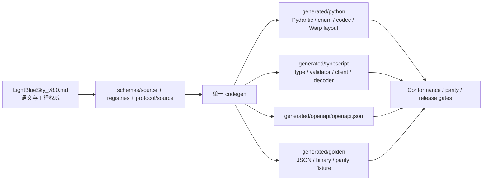
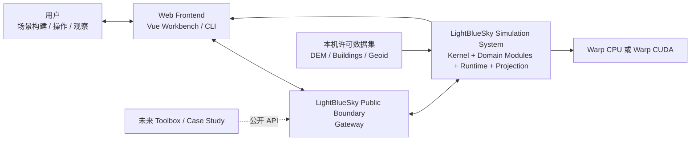
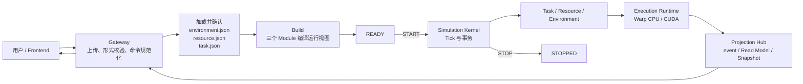
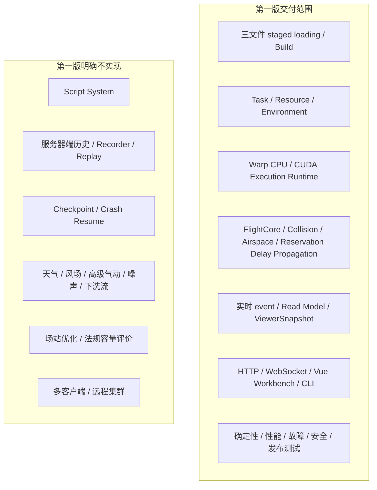
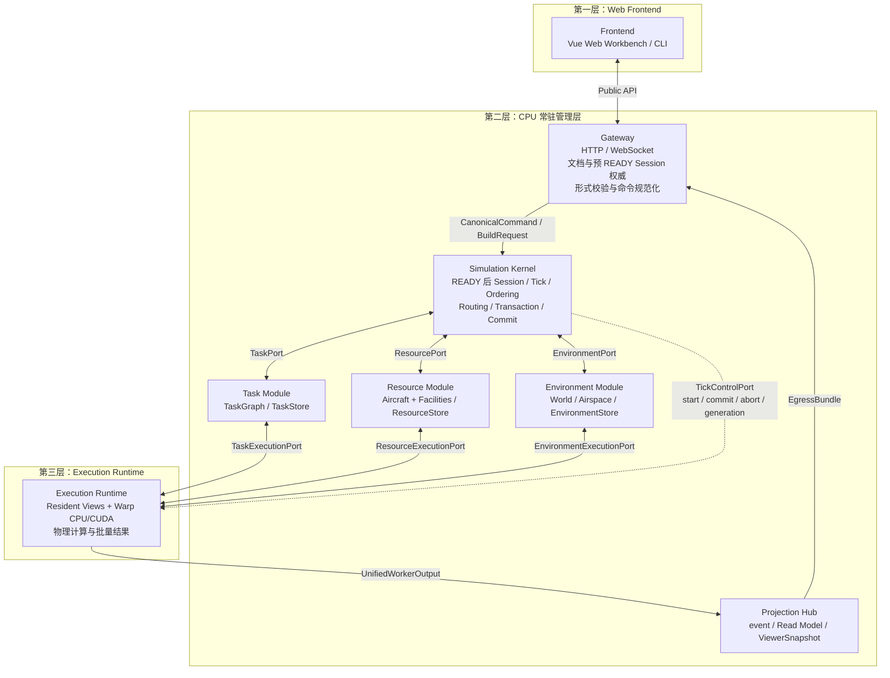
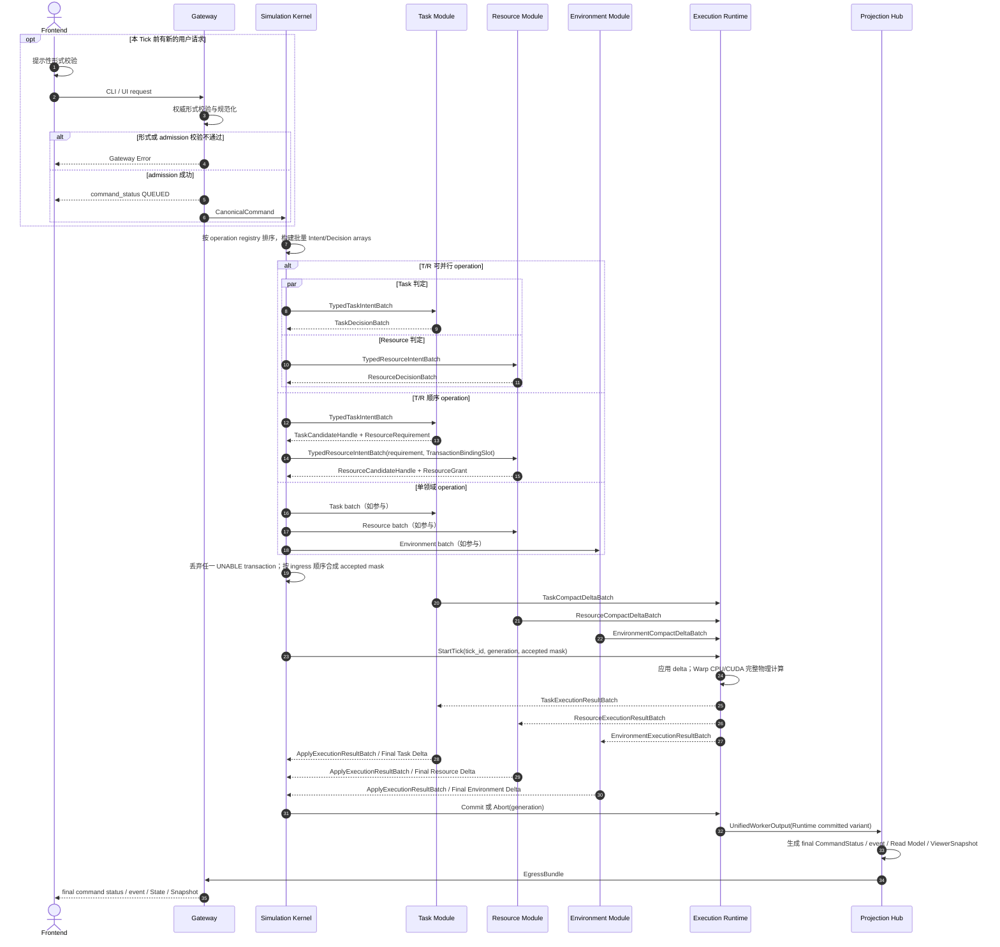
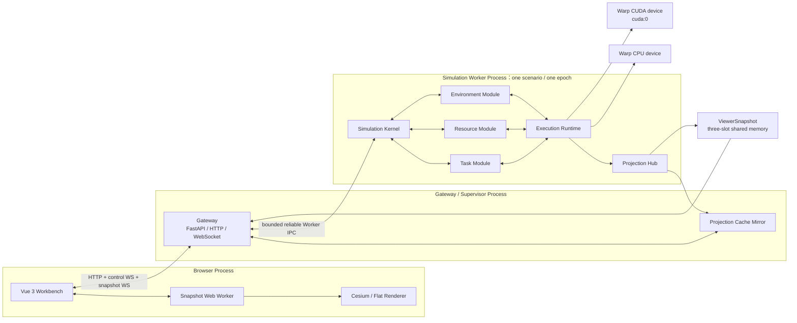
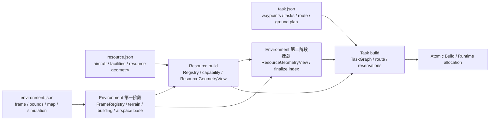
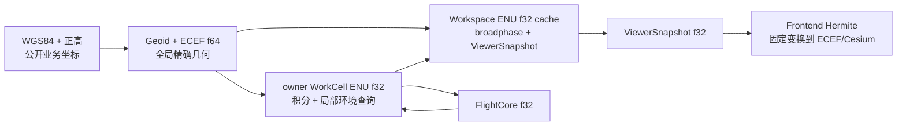

# 系统概述

说明平台定位、业务目标、核心业务对象、系统上下文、三层架构、状态所有权、输入边界、第一版范围、确定性和可测试性目标，并收录三份输入 Schema 的公共规则。

## 内容来源
- 设计：前置说明 P.1–P.6
- 设计：第 1 章
- 设计：第 2 章
- 设计：附录 A

> 本文件是权威输入文档的分层视图。若拆分文本与源文档发生差异，以《LightBlueSky v8.0 统一设计规范》为系统设计与公开合同权威，以《HITL 大阶段切换规范》为当前项目阶段推进与人工验收权威。

## 关联文档

- [核心状态机](01-core-state-machines.md)
- [端到端流程](02-end-to-end-flow.md)

## 规范正文

### 前置说明

#### P.1 文档地位

本文完整定义 LightBlueSky 第一版的业务语义、模块边界、状态所有权、输入合同、公开 API、命令系统、实时计算、输出投影、前端行为、二进制协议、性能目标、故障策略和发布验收。实现、代码生成器、Schema、OpenAPI、TypeScript 类型、Python model、Warp layout、registry、golden fixture、测试和发布证据均必须从本文派生。

本文不是版本差异说明，也不提供旧输入合同、双合同运行、兼容适配或迁移工具。任何实现不得以既有代码行为覆盖本文；任何生成物不得引入本文未定义的公开字段、状态、命令、event 或接口方向。

#### P.2 规范用语

| 用语 | 约束强度 | 工程含义 |
|---|---:|---|
| 必须 / 不得 | 强制 | 违反即为规范不一致，CI 和发布门禁必须失败。 |
| 应 / 应当 | 默认强制 | 仅可在本文明确列出的例外中偏离。 |
| 可以 | 可选 | 可以实现，但不得改变公开合同、确定性或状态所有权。 |
| 第一版 | 本文定义的首个可发布实现 | 除第 11 部分明确延期项外均属于交付范围。 |
| 公开 / public | 稳定外部合同 | 包括 JSON Schema、HTTP、WebSocket、CLI、event、Read Model、ViewerSnapshot 和 UI 可见行为。 |
| 内部 / internal | 非公开实现细节 | 不承诺第三方兼容，但仍必须满足确定性、故障、安全和测试约束。 |
| 权威状态 | 可决定业务事实并参与原子提交的状态 | 只有表明所有权的模块可以写入。 |
| 投影状态 | 从已提交权威状态派生的只读视图 | 不得反向修改领域状态。 |

正文中的字段名、枚举字面量、operation code、event code、reason code、路径、状态转换、公式、时间区间、字节偏移、容差和验收门槛均为规范性内容。示例省略可选字段不代表可以绕过字段表或校验规则。

#### P.3 第一版的含义

1. 本文虽然使用项目版本 `v8.0`，但所有公开机器合同从 `1.0.0` 起步。
2. 第一版只有三个必需输入文件：`environment.json`、`resource.json`、`task.json`。
3. 第一版不实现服务器端 event 历史、轨迹历史、Snapshot artifact、Recorder、回放、Script System 或检查点恢复。
4. 第一版不承诺远程集群、多客户端控制权协调或公网部署。
5. 第一版使用 Warp CPU 作为完整语义基线，Warp CUDA 作为生产加速后端；二者运行同一离散语义。
6. 第一版公开事件统一称为 **event**。消息内部可以携带 `contract_version`，但产品概念、类型名和文档术语不得使用版本后缀替代 event。
7. 本文仍处于首个 `1.0.0` 机器合同正式发布前的冻结阶段；此前草案中的64-bit epoch占位字段、辅助事件排序字段和manifest修订标签不构成已发布合同。实现必须以本文定义的首发 `1.0.0` ABI、event code 和 manifest schema 重新生成。若任何旧草案合同已经对外正式发布，则不得继续标记为 `1.0.0`，必须按受影响合同提升 major version。

#### P.4 公开合同与内部实现

公开合同包括：

- 三个输入 Schema；
- `/api/v1` HTTP API；
- control WebSocket 与 snapshot WebSocket；
- `CanonicalCommand`、CommandStatus、Gateway Error；
- event envelope、event registry 与 reason registry；
- Task、Aircraft、Resource、Environment 和 Runtime Read Model；
- ViewerSnapshot 二进制布局；
- CLI grammar 与 operation registry；
- UI 可见状态、使能规则和实时插值边界。

内部实现包括：

- CPU Store、SoA、CSR、Arena、bit mask、stable integer row；
- WorkCell owner、internal subphase、PI integrator、gain bank；
- Warp kernel launch、working buffer、candidate buffer；
- `working_generation`、`committed_generation` 和临时索引；
- 调试 trace 与性能计数器。

内部实现可以优化，但不得改变公开状态、事件顺序、确定性、公式边界或接口方向。

#### P.5 术语和缩写

| 术语 | 定义 |
|---|---|
| Task | 贯穿 PRE_GROUND、TAKEOFF、NAV、LANDING、POST_GROUND 的统一业务对象。 |
| flight | Task 内部的飞行阶段定义与公开子视图，不是独立顶层业务对象。 |
| Ground Plan | `ground_tasks.mode != none` 时完整、连续、可执行的地面段序列。 |
| Resource | Aircraft 或 Facility Resource 的统一目录项；二者不强行共用同一状态机。 |
| Facility Resource | Hangar、Pad 或 Runway End；Runway 本体是共享物理几何与互斥组，不建立第二条 reservation。 |
| Execution Runtime | 唯一计算汇聚模块，包含 Host 与当前 Warp device 的内部实现，封装数据驻留、kernel launch 和计算缓冲区。 |
| Projection Hub | 运行期只读消费已提交 generation，生成 event、Read Model 与 ViewerSnapshot；Build progress/failure 只透传统一 Worker egress 的 Build variant。 |
| Workspace ENU | 场景级 `float32` 位置缓存，用于 broadphase 和 ViewerSnapshot。 |
| WorkCell ENU | 局部 `float32` 积分和环境查询坐标。 |
| ECEF | `float64` 地心地固坐标，用于精确 frame 构建、迁移归属和全局几何。 |
| NMAC | aircraft-aircraft 的近距接近 episode，不造成销毁。 |
| MAC | 物理相交，产生 fatal set 和原子事故后果。 |
| VOL | 运行时环境覆盖对象，可表示限制空域或物理障碍物。 |
| AX | 空域豁免。 |
| reservation 延误传播 | reservation 延误在同资源、同 Task 和同 Aircraft 后续 Task 间的确定性传播。 |
| SoA / CSR / Arena | Structure of Arrays、Compressed Sparse Row、预分配追加式变长存储。 |
| ALLOW / UNABLE | 领域模块对已正式进入系统的命令作出的唯一两种业务判定。 |

#### P.6 设计到机器合同的派生原则



`generated/manifest.json` 只记录 `generator_version`、`contract_versions` 和 `artifacts[]`；每个 artifact 只记录 `artifact_relative_path`、`source_relative_paths[]` 与 `source_clause_ids[]`。不得记录设计修订号、机器源修订号、生成物修订号、内容摘要或哈希。一致性不依赖 manifest 中的身份或完整性字段，而由确定性 codegen、clean checkout、重新生成后工作树无差异和 CI gate 共同保证。修改语义时必须先修改本文，再修改结构化机器源并重新生成；不得手工修补生成物。


## 1. 业务逻辑和目标

### 1.1 平台定位

LightBlueSky 是面向低空和 UAM 场景的三维实时仿真平台。平台提供可复现、可批量运行、可视化、Warp CPU/CUDA 可比、状态所有权明确、命令与 event 语义稳定的底层仿真能力。

平台负责：

- 三维坐标、高度、地图、地形、建筑物、静态障碍物和空域；
- Aircraft 资源注册、能力、分配和销毁；
- Task 生命周期、飞行阶段、Ground Plan、route 和 schedule；
- Hangar、Pad、Runway End 的 reservation、owner、occupancy、availability、recovery 和确定性延误传播；
- FlightCore、PI、Taxi、takeoff、NAV、landing、数值积分和 WorkCell migration；
- NMAC、MAC、airspace violation 和 fatal consequence；
- 实时命令、event、Read Model、ViewerSnapshot、HTTP/WebSocket 和正式前端。

平台不负责 ATC 运行办法、法规认证、场站优化、航路规划算法本身、高级气动/姿态、天气、风场、噪声和下洗流。上述能力属于上层 toolbox、case study 或第 11 部分未来版本。

### 1.2 核心业务对象

| 对象 | 主公开 ID | 权威所有者 | 核心事实 |
|---|---|---|---|
| Task | `task_id` | Task Module | lifecycle、phase、flight、ground segments、route、schedule、held/delayed/blocking。 |
| Aircraft Resource | `aircraft_id` | Resource Module | 注册、机型、能力、assignment、AVAILABLE/ASSIGNED/EXECUTING/DESTROYED。 |
| Aircraft Execution | `aircraft_id` 对应 integer row | Execution Runtime | 位置、速度、heading、controller、GROUND/TAKEOFF/NAV/LANDING。 |
| Facility Resource | canonical `resource_id` | Resource Module | geometry、capacity、ReservationState、owner、occupancy、availability、operation permission。 |
| Environment Object | `obstacle_id`、`zone_id` | Environment Module | terrain、building、obstacle、airspace、VOL、AX、空间索引。 |
| Command | `command_id` | Simulation Kernel（状态），Projection Hub（输出） | QUEUED、ACCEPTED、UNABLE。 |
| event | `event_id` | Projection Hub | 对已提交事实的实时、有序、只读通知。 |

Task 是唯一贯穿完整业务链的对象：

```text
PRE_GROUND -> TAKEOFF -> NAV -> LANDING -> POST_GROUND
```

flight 只存在于 Task 内部，描述 origin、destination、schedule、route 和 route constraints；Ground 只存在于 Task 的 PRE_GROUND 和 POST_GROUND 阶段。

### 1.3 用户角色

第一版只有一个控制客户端和一个 scenario worker 的控制语义：

- 场景构建者：上传、校验、确认三个文件并触发 Build；
- 仿真操作者：START、PAUSE、RESUME、RATE、STOP、RESET，提交领域命令；
- 观察者：查看 Map、Task、Resources、实时 event、Read Model 和 Snapshot；
- 工程开发者/测试者：使用同一合同执行 CPU/CUDA parity、故障、性能和发布验证。

第一版不实现多客户端控制权仲裁。

### 1.4 系统上下文

**图 1-1　系统上下文图（权威）**



### 1.5 核心业务闭环

**图 1-2　核心业务闭环图（权威）**



该图只定义业务闭环；每 Tick 内部时序由图 2-2 和第 3 部分定义。

### 1.6 第一版范围边界

**图 1-3　第一版范围边界图（权威）**



### 1.7 场景规模与实时目标

正式最大目标：

```text
Workspace 最大范围：200 km × 200 km
active airborne aircraft：20,000
第一参考设备：NVIDIA RTX 3070 8 GiB
第二阶段压力设备：NVIDIA RTX 5080（第 11 部分）
```

第一版参考性能档位：

| 档位 | Backend | active aircraft | `time_scale` | Viewer |
|---|---|---:|---:|---|
| CPU 语义基线 | Warp CPU | 1,000 | 1 | 可关闭；开启时单独报告。 |
| CUDA 普通规模 | Warp CUDA | 4,000 | 5 | 开启并报告 FPS/frame time。 |
| CUDA 最大目标 | Warp CUDA | 20,000 | 1 | 与仿真共享 RTX 3070，稳态不低于 30 FPS。 |

实时循环不得通过跳过物理 Tick 达标。Projection Hub 可以丢弃过时显示帧，但每个物理 Tick 必须完整计算、原子提交并形成一致的权威状态。

### 1.8 确定性目标

1. 相同输入、seed、Backend 和 command stream 必须产生相同离散结果。
2. stable string ID 到 integer row 的映射不得受无语义数组重排影响。
3. 同 Tick 命令按 canonical ingress sequence 排序。
4. event candidate 按固定 stable key 排序、去重和归约。
5. CPU/CUDA 的 ID、enum、flags、Task/Resource 状态、route cursor、CommandStatus、event 顺序、NMAC/MAC/airspace 判定和 fatal set 必须 bit-exact。
6. 浮点运动结果使用第 7 部分和附录 I 的严格容差，不要求所有 CPU/CUDA 浮点逐位一致。
7. 失败事务不得消费 ID、serial、Arena row、reservation 或 generation。

### 1.9 可测试性目标

每个公开字段、operation、event、reason、binary offset 和状态转换必须具有：

- 设计条款 ID；
- 机器源位置；
- 正例、反例和边界 fixture；
- Warp CPU 与 CUDA parity case（适用时）；
- 原子回滚 case；
- 前端类型/显示 case（公开项）；
- 发布门禁映射。

### 1.10 第一版完成定义

第一版只有同时满足以下条件才算完成：

1. 三个 Schema、OpenAPI、registry、Port、IPC 和 ViewerSnapshot 与本文一致；
2. Warp CPU 完整业务路径通过，Warp CUDA parity 通过；
3. Task、Resource、Environment 的所有权无重复事实；
4. 所有保留 operation 和 event 具备完整 conformance matrix；
5. 20,000 架目标、实时 Snapshot、前端渲染和故障门槛通过；
6. 延期功能没有第一版字段、API、命令、event、Read Model、UI 或发布依赖；
7. 第一版只包含紧凑 active registry；未正式发布的旧空洞或延期 numeric code 不保留，只有正式发布过的 code 才受不可复用保护；
8. 文档、机器源、生成物、代码、测试和发布证据无语义分叉。

---


## 2. 主体架构与基础设定

### 2.1 三层架构

平台采用三层结构：

1. Web Frontend；
2. CPU 常驻管理层；
3. Execution Runtime。

CPU 常驻模块固定为：Gateway、Simulation Kernel、Task Module、Resource Module、Environment Module、Projection Hub。Execution Runtime 是唯一计算汇聚模块，Host 与 Warp CPU/CUDA device 均为其内部组成，不再作为独立一级模块。

**图 2-1　权威总体架构图**



**图 2-2　每 Tick 权威数据流图**



图 2-2 的强制语义：

1. Operation Registry 明确列出参与模块；`ADD_TASK`、`TKF`、`TAXI`、`LND`、`DIVERT` 只参与 Task/Resource，不以 Environment 作为业务 ALLOW/UNABLE 判定者。
2. EnvironmentExecutionView 长期驻留 Runtime。terrain、building、obstacle、airspace、VOL 和 AX 始终参与命令生效后的完整物理 Tick。
3. Runtime 不返回业务 ALLOW/UNABLE，不存在逐命令 Runtime feasibility 往返；Runtime 只返回批量计算结果或系统故障。
4. 任一参与模块返回 UNABLE 时，该 transaction 的全部 Candidate Delta 被丢弃，最终状态为 UNABLE；正常物理 Tick 继续。
5. T/R 顺序 operation 使用 `TransactionBindingSlot` 绑定 Task candidate、ResourceRequirement、Resource candidate 和 ResourceGrant；不进行第三次 Task 业务判定。
6. 所有参与模块 ALLOW、Runtime 完整计算成功且 final delta 通过不变量后，Kernel 才能原子提交。
7. Runtime 内部故障不是业务 UNABLE，必须进入 WORKER_FAILED/fail-stop。
8. 所有运行输出必须沿 `Execution Runtime -> Projection Hub -> Gateway -> Frontend` 发布。

### 2.2 强制接口方向与唯一接口原则

允许的逻辑方向只有：

```text
Frontend <-> Gateway
Gateway -> Simulation Kernel
Simulation Kernel <-> Task Module
Simulation Kernel <-> Resource Module
Simulation Kernel <-> Environment Module
Task Module <-> Execution Runtime
Resource Module <-> Execution Runtime
Environment Module <-> Execution Runtime
Simulation Kernel <-> Execution Runtime（仅 TickControlPort）
Execution Runtime -> Projection Hub
Projection Hub -> Gateway
```

禁止：

```text
Frontend -> Simulation Kernel
Frontend -> Execution Runtime
Gateway -> Execution Runtime
Simulation Kernel -> Gateway 的直接运行状态输出
Task Module -> Resource Module
Task Module -> Environment Module
Resource Module -> Environment Module
Projection Hub -> Simulation Kernel
Projection Hub -> 领域状态写入
Projection Hub -> Execution Runtime 的反向控制
```

Gateway 产生的形式校验 Error 可以直接返回 Frontend，因为请求尚未进入正式命令系统。一旦命令进入 QUEUED，后续最终状态只能沿：

```text
Execution Runtime -> Projection Hub -> Gateway -> Frontend
```

每两个一级模块之间最多一个正式逻辑接口，固定名称见附录 E。

### 2.3 物理部署

**图 2-3　物理部署图（权威）**



部署规则：

1. Gateway 不执行 FlightCore、碰撞、空域或 Warp Tick。
2. 一个 worker 同时只运行一个 scenario/epoch；一台设备可以启动多个隔离 worker，但第一版不承诺 GPU memory 自动仲裁。
3. Worker 内包含 Kernel、三个领域模块、Projection Hub 和 Execution Runtime；Host 逻辑与 Warp device 只是其内部组成。
4. Worker crash 不得终止 Gateway。若Kernel仍能提交fault latch，由Kernel权威进入WORKER_FAILED；若为无输出的hard process loss，Gateway只把transport `worker_status`标记为FAILED、拒绝新Mutation并保留最后Projection cache，不得合成SessionState或Command final。
5. 第一版正式本机平台以 Windows 为一级支持；Linux 可运行，macOS 延期。
6. 浏览器和 Warp CUDA 不允许直接连接；Gateway 是唯一公共边界。

### 2.4 状态所有权矩阵

公开 `SessionState` 只有一份，但按生命周期分段移交权威所有权：

| 状态/事实 | 唯一写入者 | 只读消费者 |
|---|---|---|
| `EMPTY / LOADING / BUILDING / BUILD_FAILED`、DocumentSlot、`preview_revision_u64`、`slot_revision_u64`；worker teardown 后的 `CLOSED` | Gateway | Frontend、Build worker |
| `READY / RUNNING / PAUSED / STOPPED / WORKER_FAILED`、Tick、ordering、transaction、commit_generation | Simulation Kernel | Gateway、三个 Module、Execution Runtime、Projection Hub |
| TaskGraph、TaskLifecycle、TaskPhase、route、held、blocking | Task Module | Kernel、Execution Runtime、Projection Hub |
| Aircraft Resource State、Facility Resource、reservation、owner 派生缓存、PhysicalOccupancy、availability、permission、延误传播 | Resource Module | Kernel、Execution Runtime、Projection Hub |
| Frame、terrain、building、obstacle、airspace、VOL、AX、environment index | Environment Module | Kernel、Execution Runtime、Projection Hub |
| Aircraft Execution State、subphase、PI、运动、broadphase、NMAC/MAC、物理接触检测 | Execution Runtime | 三个 Module、Projection Hub |
| event、Read Model、ViewerSnapshot、Gateway query cache payload | Projection Hub | Gateway、Frontend |
| 浏览器 camera、layout、follow、layer、selection | Frontend local state | Frontend only |

Build 成功并提交 generation 0 时，Gateway 将公开 SessionState 的权威控制从 `BUILDING` 原子移交给 Kernel，首个 Kernel 权威状态为 `READY`。Gateway 随后只缓存 Projection 结果，不得拥有第二份 Runtime SessionState。

`RuntimeStore` 不是一级模块，只是 TaskStore、ResourceStore、EnvironmentStore、ExecutionState 及其 SoA/CSR/Arena 的集合称谓。

### 2.5 三个输入文件

```text
environment.json
resource.json
task.json
```

三个文件均为必需文件，`schema_version` 固定从 `1.0.0` 开始。顶层结构：

```text
environment.json
├── schema_version
├── description
├── frame
├── bounds
├── map
├── collision
├── obstacle_volumes[]
├── airspace_zones[]
├── airspace_exemptions[]
├── simulation{}
└── metadata

resource.json
├── schema_version
├── aircraft[]
├── facilities[]
│   ├── hangars[]
│   ├── pads[]
│   └── runways[]                 # Runway 本体几何 + 独立 Runway End Resource
└── metadata

task.json
├── schema_version
├── waypoints[]
├── tasks[]
└── metadata
```

**图 2-4　三文件依赖与两阶段 Environment Build 图（权威）**



最终 Build 顺序固定为：

```text
Environment 第一阶段（基础层）
-> Resource build
-> Environment 第二阶段（挂载 ResourceGeometryView）
-> Task build
-> Runtime allocation / self-check / generation 0
```

文件位置不代表运行时状态所有权：

| 配置 | 实际消费者 |
|---|---|
| `simulation.clock`、time scale | Simulation Kernel |
| `simulation.runtime.backend/capacity/seed` | Execution Runtime |
| `simulation.integration` | Execution Runtime |
| `simulation.workcells` | Environment Module + Execution Runtime |
| `simulation.snapshot` | Projection Hub |
| `simulation.logging` | Gateway + Worker |
| terrain、building、obstacle、airspace、collision | Environment Module |
| aircraft、Facility、Runway body / Runway End、capacity、compatibility | Resource Module |
| tasks、route、ground segments、schedule | Task Module |

### 2.6 几何唯一归属

Resource Module 唯一拥有：

```text
aircraft geometry
facility and Facility Resource geometry
hangar geometry
pad geometry
runway body geometry
runway end start/touchdown zone
resource capacity
resource compatibility
resource initial_availability
runway-end static capability and runtime operation permission
```

Environment Module 唯一拥有：

```text
coordinate frame
terrain / DEM
buildings
ordinary static obstacles
static airspace
runtime VOL
airspace exemption AX
environment spatial index
NMAC/MAC default environment parameters
```

同一 Hangar、Pad、Runway body 或 Runway End 几何不得同时出现在两个文件。Resource Build 生成 immutable `ResourceGeometryView`；Environment 第二阶段只将其挂载到空间索引，Execution Runtime 通过 ResourceExecutionPort 消费其支撑面、互斥组和事故归属信息。该传递不构成 Resource Module 到 Environment Module 的运行时接口。

建筑物和物理障碍物属于物理环境；禁飞区和限制空域属于规则环境。两者不得合并为同一对象或空域判定，但 Terrain、Building、Obstacle 与非法 Resource 接触的 fatal public event 统一投影为 `aircraft_world_object_mac`。

### 2.7 坐标、精度、高度与 heading

#### 2.7.1 单位与 mixed precision

| 字段类 | 单位 | Public JSON | Runtime |
|---|---|---|---|
| `_m` | m | finite number | local dynamic `f32`；frame/geodesy `f64` |
| `_mps` | m/s | finite number | `f32` |
| `_mps2` | m/s² | finite number | `f32` |
| `_s` | simulation second | finite number | schedule/time `f64` |
| `_deg` | degree | finite number | boundary `f64`，hot path rad `f32` |
| ID/count/code | 无 | string/integer | `u8/u16/u32/u64/i32` |

JSON 不允许 `NaN`、`Infinity` 或 `-Infinity`。内部尚未发生的可选时间使用 quiet NaN sentinel，公开序列化时省略字段。

#### 2.7.2 三层坐标职责

**图 2-5　坐标关系图（权威）**



- WorkCell ENU：FlightCore 积分、terrain/building/obstacle 查询和局部 narrowphase。
- Workspace ENU：200 km 场景级位置/速度缓存，用于 3D spatial hash、aircraft broadphase 和 ViewerSnapshot。不得把 Workspace U 当作整个场景统一的当地 Up。
- ECEF：真实地图 frame 构建、迁移候选最终归属、跨 frame 连续性和 Cesium 变换；不得建立永久同步的 per-aircraft production ECEF SoA。
- `virtual_enu`：沙盘全局 ENU；单 WorkCell 时可以 identity 映射且不启用 geoid。

#### 2.7.3 FrameRegistry 机器语义

矩阵 row-major `f64`，向量使用 `[E,N,U]` 或 `[X,Y,Z]`：

```text
FrameRecord
  frame_id_u32
  frame_kind_u8                 # WORKSPACE=1 / WORKCELL=2
  parent_frame_id_i32           # workspace 为 -1
  origin_ecef_f64[3]
  enu_to_ecef_rotation_f64[9]
  ecef_to_enu_rotation_f64[9]
  core_min_enu_f64[3]
  core_max_enu_f64[3]
  overlap_min_enu_f64[3]
  overlap_max_enu_f64[3]
  direct_to_workspace_A_f64[9]
  direct_to_workspace_b_f64[3]

FrameAdjacencyCSR
  offsets_u32[frame_count + 1]
  neighbor_frame_id_u32[]
  direct_i_to_j_A_f64[][9]
  direct_i_to_j_b_f64[][3]
```

变换：

```text
p_ecef = origin_ecef + R_enu_to_ecef * p_enu
p_enu  = R_ecef_to_enu * (p_ecef - origin_ecef)
p_target = A_source_to_target * p_source + b_source_to_target
```

Build gate：

1. `max_abs(R * R^T - I) <= 1e-12`；
2. `abs(det(R) - 1) <= 1e-12`；
3. 8 个 bounds corner 的 ENU→ECEF→ENU round-trip `<= 1e-6 m`；
4. direct A/b 与完整 ECEF 链差 `<= 1e-5 m`；
5. adjacency 对称；overlap 覆盖一个 Tick 最大允许位移加最大 aircraft AABB half extent；
6. `frame_id` 按 canonical frame key 稳定分配，输入数组无语义重排不得改变 ID。

#### 2.7.4 坐标输入模式

`frame.type` 只允许：

| 值 | 输入 | Runtime |
|---|---|---|
| `real_world_wgs84` | WGS84 lon/lat + 正高 | geoid→ellipsoid→ECEF→ENU |
| `virtual_enu` | 米制 ENU | 直接形成 Workspace/WorkCell |

真实地图高度关系：

```text
h_ellipsoid_m = H_orthometric_m + N_geoid
H_orthometric_m = h_ellipsoid_m - N_geoid
```

默认 GeoidProvider 必须离线、固定版本，并记录 provider ID、dataset version、插值算法和 missing policy。正式场景缺失必要 geoid 数据是 Build error；受控测试可以显式使用 `geoid_model=none`。

#### 2.7.5 高度语义

| 字段 | 语义 |
|---|---|
| `H_orthometric_m` | 真实地图公开正高。 |
| `h_ellipsoid_m` | 椭球高，仅用于 geodesy/诊断。 |
| `height_agl_m` | aircraft local U − terrain local U。 |
| `height_above_pad_m` | aircraft local U − assigned pad surface U。 |
| `height_above_runway_m` | aircraft local U − runway surface U。 |
| `local_u_m` | owner WorkCell ENU Up。 |
| `virtual_u` | `virtual_enu` 公开高度。 |

建筑物屋顶不作为 AGL 地面；屋顶 Pad 使用 Pad surface。公开 `ALT` 在真实地图表示正高，在 `virtual_enu` 表示 `virtual_u`，进入 Runtime 前解析为 local U target。

#### 2.7.6 heading

航空 heading：北为 0/360°，顺时针为正。

```text
u_hdg(psi) = [sin(psi), cos(psi)]     # [E,N]
psi = atan2(v_E, v_N)
wrap_to_pi(x) ∈ [-pi, pi)
```

`Vh < 1e-4 m/s` 时不得用 `atan2(0,0)` 改写 heading，必须保留最近合法值。输入 heading 范围 `[0,360)`；输入 360 是 validation error，不得保留两种等价写法。

### 2.8 时间、Tick 与步长

#### 2.8.1 时间字段

```text
scenario_id             Gateway 创建 staged session 时生成

epoch_id                每次 Build 成功或 RESET 生成

tick_index              epoch 内 u64，从 0 开始

t_s                     f64；t_s = tick_index * dt_s

canonical_ingress_sequence
                        epoch 内正式命令 admission 单调 u64

event sequence          epoch 内 Projection Hub 单调 u64

snapshot sequence       每个已提交物理 Tick 单调 u64
```

`epoch_id` 是公开且唯一的 epoch 身份，必须使用非 nil canonical UUID。JSON、HTTP、WebSocket 和日志使用小写 `8-4-4-4-12` UUID string；二进制边界使用完整 `epoch_id_bytes[16]`：移除 canonical string 中的连字符后，按从左到右的十六进制字节顺序解码为 16 octets。该字段是身份本身，不是整数、token、摘要或哈希；不得由 `epoch_id` 截断、折叠或派生第二套 epoch identity，也不得对 UUID 字段执行整数端序交换。Build 尚未建立 epoch 的 tagged variant省略该字段，或在固定二进制槽中使用全零 16 bytes 表示 absent；Runtime variant中的全零值非法。

`t_s` 必须由 `tick_index * dt_s` 确定性计算，不得用 `float32` 累加。

#### 2.8.2 固定步长

只允许：

| `dt_s` | 定位 |
|---:|---|
| 0.05 | 高精度 |
| 0.1 | 标准默认 |
| 0.2 | 中等精度 |
| 0.5 | 低精度 |
| 1.0 | 粗粒度预览 |

默认 `dt_s = 0.1`。一个 epoch 内不得修改 dt。

#### 2.8.3 time scale

`time_scale` 只影响 wall pacing，不改变 dt、仿真时间、事件时间或物理算法。第一版默认 allowed scales 为 `[1,2,3,4,5]`，配置可以在 `1..100` 内给出严格递增 unique integer 集合，但必须包含 `1` 和 `5`。`RATE` 只接受正值；暂停必须使用 `PAUSE`，不得提交 `RATE 0`。

### 2.9 稳定 ID 与 integer row

用户定义 ID 使用：

```regex
^[A-Za-z][A-Za-z0-9._:-]{0,63}$
```

`@` 是 route occurrence reference 的保留分隔符，禁止出现在用户定义 waypoint ID 中。

规则：

1. 公开合同保留 string ID；Runtime relation 使用 integer row。
2. Build 按 `(kind, canonical_key UTF-8 byte order)` 稳定分配 `u32`。
3. Runtime 新对象按 canonical ingress sequence append-only 分配。
4. epoch 内 string ID、integer ID、occurrence serial 和 Arena row 均不复用。
5. `0xFFFFFFFF` 为无效 `u32` sentinel，`i32=-1` 表示无 row。
6. 不得直接把 string hash 作为公开或 Runtime `u32` identity。
7. 等价 JSON 数组无语义重排不得改变 mapping；route sequence 本身有序，不得重排。

### 2.10 浏览器本地偏好

以下只存于 `localStorage`、IndexedDB 或 Pinia persisted state：

```text
initial view / camera / layout
show buildings / show airspace / layer filters
focus / follow / selection
panel widths / theme / renderer quality preference
```

这些偏好不进入任何输入Schema、不参与场景语义输入比较、不参与Build、不进入Kernel/Execution Runtime、不影响确定性。

### 2.11 CPU/GPU 数据驻留概览

1. Task、Resource、Environment 三个完整业务模块始终 CPU 常驻。
2. Execution Runtime 持有三个长期驻留 Runtime View 和 Aircraft Execution State。
3. 每 Tick 只传输 Compact Delta、Command Batch 和必要 Compact Result。
4. 不得每 Tick 复制完整 JSON、TaskGraph、ResourceStore 或 EnvironmentStore。
5. 静态数组 Build 后 immutable；mutable Arena append-only，取消/完成使用 tombstone。
6. 所有 Store 和 Backend View 使用统一 `commit_generation` 保证同 Tick 原子一致性。

---


## 附录 A：三个 JSON Schema 的公共规则

### A.1 Schema source 与 `$id`

结构化机器源固定为：

```text
schemas/source/environment.schema.json
schemas/source/resource.schema.json
schemas/source/task.schema.json
schemas/source/common.schema.json
schemas/registries/command_registry.yaml
schemas/registries/event_registry.yaml
schemas/registries/reason_registry.yaml
schemas/registries/runtime_enum_registry.yaml
protocol/source/execution_input.yaml
protocol/source/execution_output.yaml
protocol/source/committed_output.yaml
protocol/source/viewer_snapshot.yaml
protocol/source/worker_ipc.yaml
```

三个Schema使用JSON Schema 2020-12，`$id`：

```text
https://lightbluesky.dev/schema/v1/environment.schema.json
https://lightbluesky.dev/schema/v1/resource.schema.json
https://lightbluesky.dev/schema/v1/task.schema.json
```

所有顶层 `schema_version` 固定 `1.0.0`。未知major拒绝；第一版不实现旧major适配。

### A.2 Strict object

所有正式JSON object默认：

```json
{"additionalProperties": false}
```

只有显式 `metadata` 容器允许任意JSON value。Parser必须拒绝duplicate object key。Unknown field是validation error，不得忽略。

### A.3 Metadata

每个metadata：

```text
canonical JSON size <= 16 KiB
max depth = 8
key length = 1..64
no control characters
```

Metadata不得包含token、password、private key或可执行代码；不进入physics、排序、command validity、stable ID或determinism。Metadata可以作为受管文档的一部分展示，但不得改变Runtime结果。

### A.4 ID

用户定义domain ID：

```regex
^[A-Za-z][A-Za-z0-9._:-]{0,63}$
```

Namespace：

```text
aircraft
task
facility
facility-local hangar/pad/runway/runway_end_resource
waypoint
obstacle
zone
runtime_volume
ground_segment
```

规则：

- 大小写敏感；
- namespace内唯一；
- `@`禁止出现在waypoint ID；
- public string ID不使用hash替代；
- UUID、integer ID、canonical composite key不受该regex约束；
- Resource canonical key：

```text
hangar:      facility_id + "/" + hangar_id
pad:         facility_id + "/" + pad_id
runway_body: facility_id + "/" + runway_id
runway_end:  facility_id + "/" + runway_end_resource_id
```

Task的Runway引用只使用`facility_id + runway_end_resource_id`，不携带runway body ID。

### A.5 Number、null 与单位

1. 所有number必须finite。
2. 距离、速度、时长、capacity、count默认非负；明确要求strict positive的字段必须 `>0`。
3. lon `[-180,180]`、lat `[-90,90]`。
4. heading `[0,360)`；360非法。
5. 除range `{min,max}`明确允许null外，正式字段不得用null替代省略。
6. Public JSON不输出NaN/Infinity。
7. Unit后缀必须与语义一致；不得使用无后缀模糊物理量。

### A.6 时间区间

所有时间区间使用半开：

```text
[from_s, until_s)
from_s < until_s
```

Range rule的数值边界为闭区间，与时间active interval不同。

### A.7 Array 与安全上限

```text
facilities <= 10_000
facility resources total <= 100_000
aircraft <= 100_000
tasks <= 1_000_000
waypoints <= 1_000_000
route occurrences per task <= 4_096
route constraints per task <= 4_096
ground segments per task <= 1_024
ground points per segment <= 4_096
obstacle_volumes <= 1_000_000
airspace_zones <= 100_000
polygon vertices per zone <= 65_535
runtime volumes <= configured capacity <= 100_000
commands per tick <= configured capacity <= 100_000
event candidates per tick <= configured capacity <= 1_000_000
```

超过为validation error `DOCUMENT_LIMIT_EXCEEDED`或Runtime UNABLE `CAPACITY_EXCEEDED`；不得部分装载。

空数组只有字段明确允许时合法。`restricted_aircraft: []` 非法。

### A.8 Coordinate union

`CoordinatePoint`根据frame discriminated union：

```text
real_world_wgs84:
  {lon, lat, H_orthometric_m?}

virtual_enu:
  [e_m,n_m,u_m] or field-specific 2D [e_m,n_m]
```

同一object不得同时出现WGS84和ENU字段。Resource/Task坐标必须与Environment frame匹配。

### A.9 Map union

Real-world map：`type=dem_dataset`，规则见第6.5节。

Virtual map允许：

```json
{
  "map_id": "virtual-flat",
  "type": "flat_heightfield",
  "surface_u_m": 0.0,
  "buildings": {"sources": []},
  "metadata": {}
}
```

`flat_heightfield`只在virtual_enu合法，surface finite；不存在dataset_root/manifest/provenance/datum字段。

### A.10 Geometry union

#### AABB

```text
min[3] and max[3]
min axis < max axis
```

#### Circle

```text
radius_m > 0
```

#### Rectangle

```text
length_m > 0
width_m > 0
heading_deg in [0,360)
```

#### Polygon prism

```text
>=3 vertices
simple non-self-intersecting ring
floor_m < ceiling_m
frame/vertical reference compatible
```

Geometry全部finite。Build不得自动修复自交polygon、反向min/max或不闭合Resource geometry。

### A.11 Path safety

后端path只允许：

- 部署配置许可根下的规范化绝对路径；或
- 相对许可root的安全相对路径。

拒绝：

```text
..
UNC escape
unexpected drive prefix
symlink escape
NUL/control character
path after normalization outside root
```

Client不能提交worker本机任意输出path。Log/temp/cache root属于部署配置。

### A.12 `simulation` default merge

`simulation`省略或`{}`使用第6.10节完整默认。Partial object按字段递归应用default；explicit null非法。Default resolution发生在Gateway validation/Build package中，Worker重新验证resolved result。第一版clock不包含策略选择字段，allowed time scales均为正数。

### A.13 Canonical JSON 与字节比较

- CanonicalCommand public payload使用RFC 8785 JSON Canonicalization Scheme编码为确定性UTF-8 bytes；
- Command idempotency不计算内容摘要，直接比较保存的canonical payload bytes；
- DocumentSlot不计算文档内容摘要；修订只使用单调`slot_revision_u64`；
- Warning确认绑定当前slot revisions；
- Scenario确定性比较使用三个resolved typed document的canonical bytes，metadata不参与Runtime语义比较；
- 不以其他内容哈希算法替代上述直接字节比较。

### A.14 Generated outputs

```text
generated/
  manifest.json
  python/lightbluesky_contracts/
    models/
    enums/
    registries/
    protocol/
    warp/
  typescript/lightbluesky-contracts/
    types/
    validators/
    protocol/
    client/
  openapi/openapi.json
  schemas/bundled/
  golden/
```

`generated/manifest.json` 的 strict 结构只允许：

```text
generator_version
contract_versions
artifacts[] {
  artifact_relative_path
  source_relative_paths[]
  source_clause_ids[]
}
```

不得增加 design revision、machine-source revision、artifact revision、摘要或哈希字段。每个文本生成文件必须包含：

```text
DO NOT EDIT.
Source: schemas/... or registries/... or protocol/source/...
Design: LightBlueSky_v8.0.md
Contract version: ...
Generator version: ...
Source clause IDs: ...
```

生成一致性只由确定性 codegen、clean checkout、CI重新生成和逐字节工作树无差异检查保证。手工编辑generated member、dirty checkout生成、重新生成产生差异或manifest出现未允许字段均为CI失败；改变语义必须先改本文和机器源，再重新生成。
