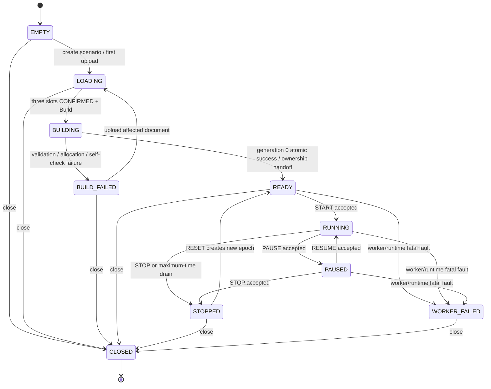
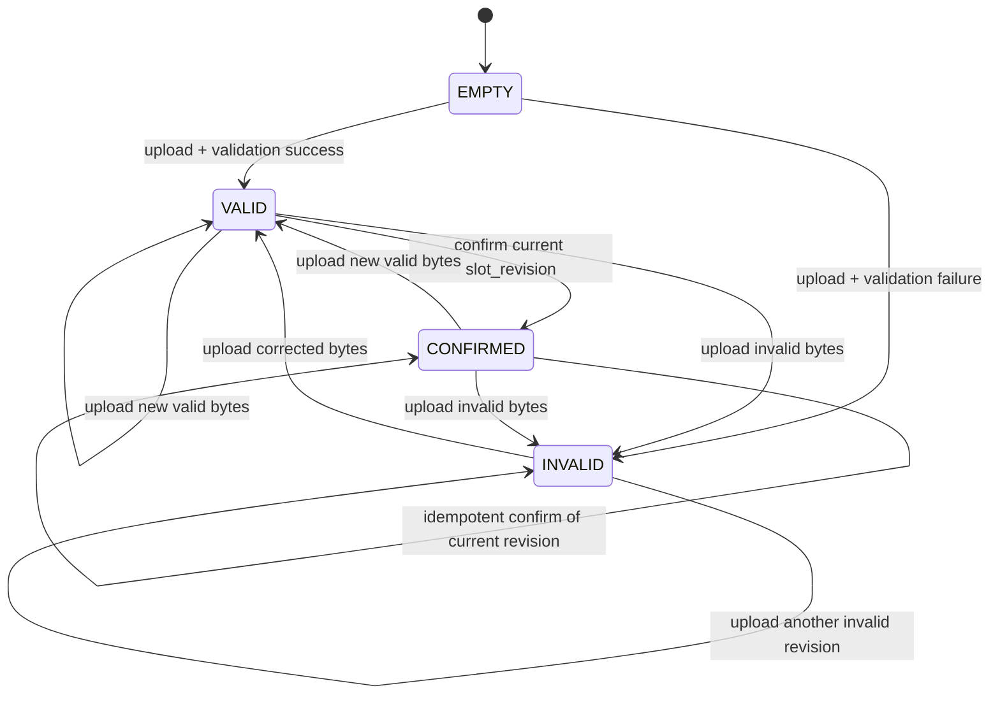
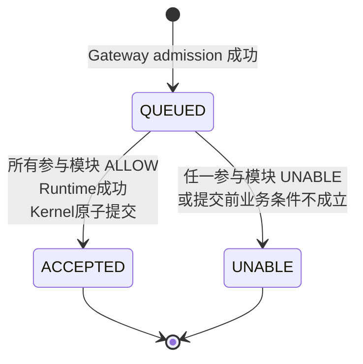
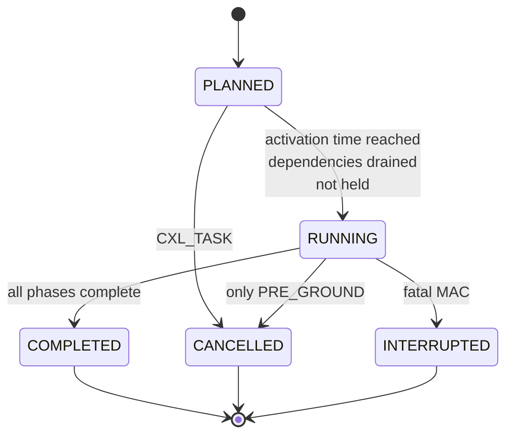
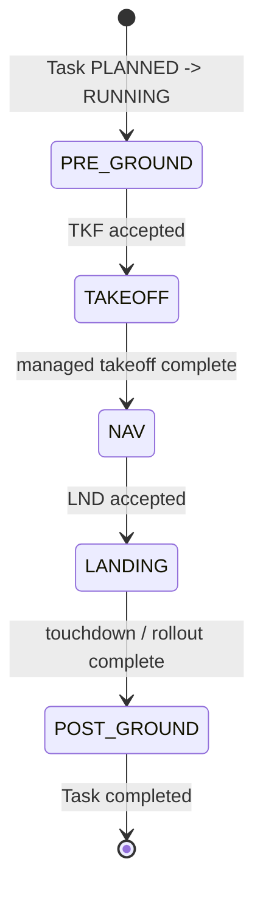
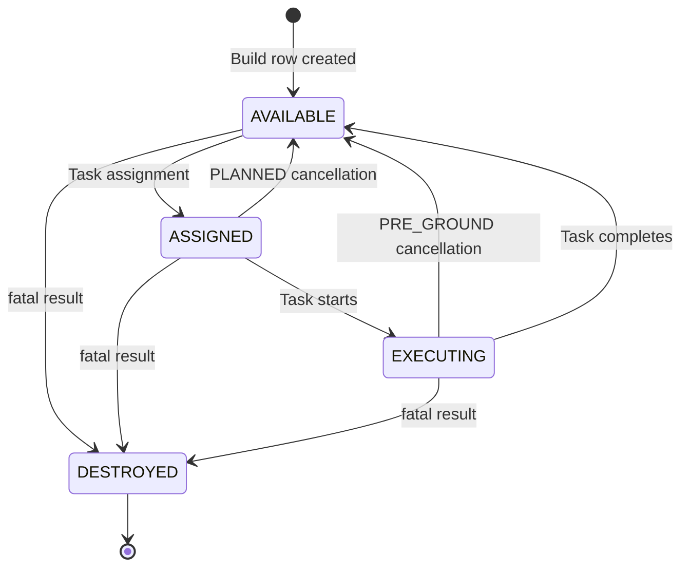
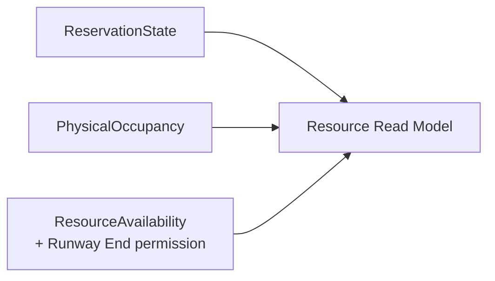

# 核心状态机

集中列出 Session、DocumentSlot、Command、Task、Aircraft、Reservation、Resource Availability、Subphase 与 episode 的权威转换、状态所有权和枚举值。

## 内容来源
- 设计：3.2、3.3、3.7
- 设计：4.6–4.7
- 设计：5.7–5.9
- 设计：7.5、7.21
- 设计附录 B 相关枚举

> 本文件是权威输入文档的分层视图。若拆分文本与源文档发生差异，以《LightBlueSky v8.0 统一设计规范》为系统设计与公开合同权威，以《HITL 大阶段切换规范》为当前项目阶段推进与人工验收权威。

## 关联文档

- [枚举与 flags 完整表](../appendices/00-enums-and-flags.md)
- [Kernel](../backend/00-kernel.md)

## 规范正文

## 状态机总索引

| 状态机 / 状态集合 | 权威写入者 | 终态 / 恢复边界 |
|---|---|---|
| SessionState | Gateway（Build 前）/ Kernel（READY 后） | CLOSED 终态；WORKER_FAILED 只能关闭；STOPPED 可 RESET 到新 epoch READY |
| DocumentSlotState | Gateway | 上游重传可把下游强制清空到 EMPTY；Confirm 绑定当前 revision |
| CommandStatus | Gateway 创建 QUEUED；Projection 发布 final | ACCEPTED / UNABLE 终态；Gateway Error 不进入状态机 |
| TaskLifecycle / TaskPhase | Task Module | COMPLETED/CANCELLED/INTERRUPTED 终态；RUNNING 必须有公开 phase |
| AircraftResourceState | Resource Module | DESTROYED 在 epoch 内不可逆 |
| AircraftExecutionState / Subphase | Execution Runtime | GROUND→TAKEOFF→NAV→LANDING→GROUND；非法组合 fail-stop |
| ReservationState | Resource Module | CONSUMED/CANCELLED 终态；事故可把 active 状态取消 |
| ResourceAvailability | Resource Module | OPEN↔CLOSED；事故进入 BLOCKED，只有 RESET 清除 |
| Airspace/NMAC episode | Execution Runtime / Environment source | ACTIVE 退出只内部关闭；再次进入形成新 episode |


### 3.2 Session 状态机

公开 `SessionState` 固定为：

```text
EMPTY
LOADING
BUILDING
BUILD_FAILED
READY
RUNNING
PAUSED
STOPPED
WORKER_FAILED
CLOSED
```

其中 `EMPTY/LOADING/BUILDING/BUILD_FAILED` 由 Gateway 权威拥有；`READY/RUNNING/PAUSED/STOPPED/WORKER_FAILED` 由 Kernel 权威拥有；worker teardown 完成后的 `CLOSED` 再由 Gateway 权威拥有。`LOADING` 由三个 DocumentSlot 的当前状态派生，不单独保存第二份可写状态。

**图 3-1　Session 状态机与所有权移交（权威）**



状态约束：

| State | 文档修改 | START | Mutation | Query | STOP | RESET |
|---|---:|---:|---:|---:|---:|---:|
| EMPTY/LOADING | 是 | 否 | 否 | staged preview only | 否 | 否 |
| BUILDING | 否 | 否 | 否 | build progress | 否 | 否 |
| BUILD_FAILED | 是 | 否 | 否 | issues/build report | 否 | 否 |
| READY | 否 | 是 | **否** | 是，tick 0 | 否 | 否 |
| RUNNING | 否 | 否 | 是 | 是 | 是 | 否 |
| PAUSED | 否 | 否 | 是；在下一次 RESUME 后首个 Tick apply | 是 | 是 | 否 |
| STOPPED | 否 | 否 | 否 | 是 | 否 | 是 |
| WORKER_FAILED | 否 | 否 | 否 | 最后缓存状态 | 否 | 否 |
| CLOSED | 否 | 否 | 否 | 否 | 否 | 否 |

READY query 读取 `tick_index=0,t_s=0` 的 Projection cache，不推进 Tick。未放置 Aircraft 的动态字段必须省略，不得使整个对象查询失败。


### 3.3 DocumentSlot 状态机

每个输入文件对应一个独立 `DocumentSlot`，固定状态：

```text
EMPTY
VALID
INVALID
CONFIRMED
```

**图 3-2　DocumentSlot 状态机（权威）**



每个 slot 只保存当前上传，不保存历史版本：

```text
slot_revision_u64
current_bytes?
current_validation_report?
state
```

规则：

1. 每次上传，无论 VALID 或 INVALID，先令该 slot 的 `slot_revision_u64 += 1`，再保存当前 bytes 并校验。
2. 不计算文档摘要，不保留历史revision或下游旧文档。
3. INVALID bytes 不得被猜测、修复或部分转换成可 Build 数据。
4. 上传 environment 后，resource slot 与 task slot立即重置为 `EMPTY`；上传 resource 后，task slot立即重置为 `EMPTY`。用户必须重新上传下游文件。
5. Confirm 请求必须携带目标 slot 当前 `slot_revision_u64` 和所有上游 slot 当前 `slot_revision_u64`；任一不一致返回 HTTP 409 `REVISION_MISMATCH`。
6. Scenario 维护独立的 `preview_revision_u64`。每次 upload、validation result、confirm、上游清空、Build progress/result或其他改变 staged UI 可见事实的操作都严格加 1。
7. Staged summary、collection、detail 和 issue page 都必须携带同一个 `preview_revision_u64`；客户端提供的 `expected_preview_revision_u64` 过期时返回 `PREVIEW_REVISION_CHANGED`，本轮分页结果全部丢弃并从 summary 重取。


### 3.7 CommandStatus 与 DomainDecision

#### 3.7.1 CommandStatus

第一版只允许：

```text
QUEUED
ACCEPTED
UNABLE
```

**图 3-6　CommandStatus 状态机（权威）**



Gateway Error 不属于该状态机。QUEUED 由 Gateway 作为 `command_status` control message立即发送，不是 event；Projection Hub 只投影最终 ACCEPTED/UNABLE 及其 command event。

#### 3.7.2 DomainDecision

Task、Resource、Environment 只允许返回：

```text
ALLOW
UNABLE
```

ALLOW 表示该模块允许命令进入后续计算，并能提供 Candidate Delta 或 Runtime View。UNABLE 表示命令已正式进入系统，但不能提交。UNABLE 必须携带注册的 `reason_code` 和结构化 diagnostics。

典型 reason：

```text
ID_NOT_FOUND
TASK_TERMINAL
INVALID_TASK_PHASE
RESOURCE_NOT_FOUND
RESOURCE_OCCUPIED
RESOURCE_CLOSED
RESOURCE_BLOCKED
CAPABILITY_UNSUPPORTED
RESERVATION_CONFLICT
ROUTE_NOT_COMPLETE
GEOMETRY_INVALID
ROUTE_CONTEXT_INVALID
```

UNABLE 可以表示永久不可执行、当前条件不可执行、修改输入后可重试或等待状态变化后可重试；性质由 reason 和 diagnostics 表达，不增加状态枚举。

#### 3.7.3 系统故障

以下不得包装为业务 UNABLE：

```text
数组越界
运行时不变量破坏
内部协议损坏
CUDA runtime failure
worker crash
无法提交 authoritative output
candidate buffer authoritative overflow
```

这类问题进入 WORKER_FAILED/fail-stop。若last committed arrays仍可读，Execution Runtime只可按附录F.12生成`WORKER_FAILED_LATCH` fault repeat，经Projection Hub/Gateway通知Frontend；该buffer不得生成受影响命令的ACCEPTED/UNABLE。若无法形成该buffer，Gateway supervisor只发送transport-level failure notification，不伪造CommandStatus。


### 4.6 状态转换：TaskLifecycle

固定公开枚举：

```text
PLANNED
RUNNING
COMPLETED
CANCELLED
INTERRUPTED
```

**图 4-1　TaskLifecycle 状态机（权威）**



不存在公开`READY` lifecycle。Runtime可以维护临时`ready_mask`用于批量调度，但不得进入Schema、Read Model、event或ViewerSnapshot。

Task激活时间固定为：

```text
mode=auto / explicit:
  first PRE_GROUND GroundSegment.scheduled_start_s

mode=none:
  scheduled_takeoff_s
```

实际`PLANNED -> RUNNING`还必须满足该boundary之前所有上游Task/reservation依赖已由Kernel排空。`held=true`时不得启动；解除hold后在下一个Tick重新评估。

Terminal lifecycle一旦提交不可变。`COMPLETED`、`CANCELLED`、`INTERRUPTED`互斥。


### 4.7 TaskPhase

固定公开枚举：

```text
PRE_GROUND
TAKEOFF
NAV
LANDING
POST_GROUND
```

`NONE`只允许作为内部sentinel，表示Task当前不处于RUNNING；不得出现在公开Schema、Read Model或event。

**图 4-2　TaskPhase 状态机（权威）**



约束：

- RUNNING Task必须有五个公开phase之一；
- PLANNED或terminal Task内部phase sentinel必须为NONE；
- `held`和`blocking_reason`是独立字段；
- 不得创建组合状态枚举。


### 5.7 Aircraft Resource State

固定枚举：

```text
AVAILABLE
ASSIGNED
EXECUTING
DESTROYED
```

**图 5-2　Aircraft Resource 状态机（权威）**



Build generation 0为每架catalog Aircraft建立稳定row并进入AVAILABLE；随后按Task chronology选择最早Task执行initial assignment。存在该Task时同一generation进入ASSIGNED。未被Task引用者保持AVAILABLE且`placed=false`。

`registered`由row存在派生；`active`由`resource_state==EXECUTING && placed`派生；`destroyed`由`resource_state==DESTROYED`派生，不保存冗余flag。

#### 5.7.1 放置、holding 与复用

1. `resource.json.aircraft[]`不包含初始位置。
2. explicit/auto：首个PRE_GROUND segment开始时放到Ground Plan首点。
3. none：departure reservation进入PREPARE时原子放到origin support。
4. 实体Hangar holding使用逻辑lane，不写PhysicalOccupancy；Aircraft可保持`placed=true`。
5. internal virtual holding保持`placed=false`，不是公开Resource。
6. 同一Aircraft连续Task必须保持facility continuity；不得跨facility teleport。
7. 从实体/virtual holding开始下一none Task时，在departure PREPARE boundary原子转入origin support。
8. 只有DESTROYED永久退出可执行集合；稳定ID和row在epoch内不复用。


### 5.8 Aircraft Execution State 边界

公开Execution State固定为：

```text
GROUND
TAKEOFF
NAV
LANDING
```

该状态机由Execution Runtime拥有。Resource Module只消费committed `AircraftExecutionSummary`，不得写Execution State。


### 5.9 Resource 三类正交事实

#### 5.9.1 ReservationState

固定枚举：

```text
PLANNED
PREPARE
IN_PROGRESS
OCCUPIED
RECOVERY
CONSUMED
CANCELLED
```

正常转换：

```text
PLANNED -> PREPARE
PLANNED -> CANCELLED
PREPARE -> IN_PROGRESS
PREPARE -> CANCELLED
IN_PROGRESS -> OCCUPIED
OCCUPIED -> RECOVERY
RECOVERY -> CONSUMED
```

事故中止允许：

```text
PLANNED / PREPARE / IN_PROGRESS / OCCUPIED / RECOVERY -> CANCELLED
```

进入PREPARE时取得owner并写`actual_start_s`。进入CONSUMED或CANCELLED时释放该reservation的owner。不存在旧的双枚举reservation/use-phase模型或空闲占位状态。

#### 5.9.2 ResourceAvailability

```text
OPEN
CLOSED
BLOCKED
```

输入只允许OPEN/CLOSED；BLOCKED只能由Runtime已提交事故后果产生，只有RESET清除。

#### 5.9.3 PhysicalOccupancy 与 owner cache

PhysicalOccupancy独立保存：

```text
resource_row -> occupying_aircraft_rows[]
```

第一版仅Pad和Runway End产生PhysicalOccupancy；Hangar只使用逻辑lane。

owner cache独立保存：

```text
resource_row -> active reservation rows / owner task_rows[]
```

owner cache是active reservation的派生缓存，与reservation state同事务更新，禁止独立写入。不得从owner推导occupancy，也不得从occupancy反向改写reservation。

**图 5-3　资源三维正交状态图（权威）**



一致性：

- `ReservationState==OCCUPIED`时，该reservation对应Pad/Runway End的PhysicalOccupancy必须非空；
- `PLANNED/CONSUMED/CANCELLED`且无其他reservation产生占用时，不得残留其occupancy；
- PREPARE、IN_PROGRESS、RECOVERY期间occupancy可为空或非空，以Aircraft实际位置为准。


### 7.5 Aircraft Execution State 与 Subphase

Public Execution State以第5.8节为权威：

```text
GROUND
TAKEOFF
NAV
LANDING
```

Internal `AircraftSubphase`精简为：

```text
NONE
TAKEOFF_VERTICAL_CLIMB
TAKEOFF_RUNWAY_ROLL
TAKEOFF_WING_BORNE
TAKEOFF_TRANSITION
LANDING_APPROACH
LANDING_BACK_TRANSITION
LANDING_VERTICAL_DESCENT
LANDING_ROLLOUT
GROUND_RECOVERY
```

合法组合映射：

| Execution State | 合法 Subphase |
|---|---|
| GROUND | NONE、GROUND_RECOVERY |
| TAKEOFF | TAKEOFF_VERTICAL_CLIMB、TAKEOFF_RUNWAY_ROLL、TAKEOFF_WING_BORNE、TAKEOFF_TRANSITION |
| NAV | NONE |
| LANDING | LANDING_APPROACH、LANDING_BACK_TRANSITION、LANDING_VERTICAL_DESCENT、LANDING_ROLLOUT |

任何其他组合是`INTERNAL_INVARIANT_BROKEN`并fail-stop。Route tracking、off-route、ground taxi等不再编码为Subphase，分别由`LateralSource`、Ground occurrence cursor和controller mode表达。Subphase不进入public Read Model、event或ViewerSnapshot。


### 7.21 Airspace query 与 episode

Aircraft reference position同时满足：

```text
horizontal polygon inside
AND vertical interval inside
AND matched restricted rule
AND no active AX
```

才进入 violation。Polygon boundary 视为 inside，vertical boundary 视为 inside，restriction range为闭区间。

Episode state：

```text
INACTIVE -> ACTIVE: condition becomes true, publish one entry event
ACTIVE -> ACTIVE: no repeated public event
ACTIVE -> INACTIVE: internal close only
INACTIVE -> ACTIVE: re-entry, new episode/event
```

Key：

```text
NMAC: sorted(aircraft_id_a, aircraft_id_b)
airspace: aircraft_id + zone_id
```

不发布 public exit event。


### B.1 Session / Document / Backend

| Enum | Value |
|---|---:|
| `SessionState.EMPTY` | 0 |
| `LOADING` | 1 |
| `BUILDING` | 2 |
| `BUILD_FAILED` | 3 |
| `READY` | 4 |
| `RUNNING` | 5 |
| `PAUSED` | 6 |
| `STOPPED` | 7 |
| `WORKER_FAILED` | 8 |
| `CLOSED` | 9 |

| Enum | Value |
|---|---:|
| `DocumentSlotState.EMPTY` | 0 |
| `VALID` | 1 |
| `INVALID` | 2 |
| `CONFIRMED` | 3 |

| Enum | Value |
|---|---:|
| `Backend.AUTO` | 0 |
| `CPU` | 1 |
| `CUDA` | 2 |

| Enum | Value |
|---|---:|
| `FrameKind.WORKSPACE` | 1 |
| `WORKCELL` | 2 |


### B.3 Task

| `TaskLifecycle` | Value |
|---|---:|
| `PLANNED` | 0 |
| `RUNNING` | 1 |
| `COMPLETED` | 2 |
| `CANCELLED` | 3 |
| `INTERRUPTED` | 4 |

| `TaskPhaseInternal` | Value |
|---|---:|
| `NONE` | 0 |
| `PRE_GROUND` | 1 |
| `TAKEOFF` | 2 |
| `NAV` | 3 |
| `LANDING` | 4 |
| `POST_GROUND` | 5 |

`NONE`只在内部使用；Public TaskPhase只允许1..5对应字符串。

| `GroundMode` | Value |
|---|---:|
| `NONE` | 0 |
| `AUTO` | 1 |
| `EXPLICIT` | 2 |

| `GroundSegmentPhase` | Value |
|---|---:|
| `PRE_GROUND` | 0 |
| `POST_GROUND` | 1 |

Task不定义公开等待状态或可派生的delay/ground-plan/route-complete flags。held使用独立u8；其余值由权威数据派生。


### B.4 Aircraft Resource / Execution

| `AircraftResourceState` | Value |
|---|---:|
| `AVAILABLE` | 0 |
| `ASSIGNED` | 1 |
| `EXECUTING` | 2 |
| `DESTROYED` | 3 |

| `AircraftExecutionState` | Value |
|---|---:|
| `GROUND` | 0 |
| `TAKEOFF` | 1 |
| `NAV` | 2 |
| `LANDING` | 3 |

| `AircraftSubphase` | Value |
|---|---:|
| `NONE` | 0 |
| `TAKEOFF_VERTICAL_CLIMB` | 1 |
| `TAKEOFF_RUNWAY_ROLL` | 2 |
| `TAKEOFF_WING_BORNE` | 3 |
| `TAKEOFF_TRANSITION` | 4 |
| `LANDING_APPROACH` | 5 |
| `LANDING_BACK_TRANSITION` | 6 |
| `LANDING_VERTICAL_DESCENT` | 7 |
| `LANDING_ROLLOUT` | 8 |
| `GROUND_RECOVERY` | 9 |

| `AircraftExecutionFlag` | Bit |
|---|---:|
| `PLACED` | `1<<0` |
| `INSIDE_HANGAR` | `1<<1` |

`INSIDE_HANGAR`表示Aircraft已经完成实体Hangar进入并处于机库内；它不表示仅取得、预留或占用Hangar logical lane。进入完成时设置，离开机库并开始Ground movement时清除。

`registered/active/destroyed`由row和AircraftResourceState派生，不占flag。

| `LateralSource` | Value |
|---|---:|
| `ROUTE_TRACKING` | 0 |
| `DIRECT_TO_WAYPOINT` | 1 |
| `OFF_ROUTE_SELECTED` | 2 |
| `JOIN_ROUTE` | 3 |


### B.5 Resource / Reservation

| `ReservationState` | Value |
|---|---:|
| `PLANNED` | 0 |
| `PREPARE` | 1 |
| `IN_PROGRESS` | 2 |
| `OCCUPIED` | 3 |
| `RECOVERY` | 4 |
| `CONSUMED` | 5 |
| `CANCELLED` | 6 |

| `ReservationOperation` | Value |
|---|---:|
| `DEPARTURE` | 0 |
| `ARRIVAL` | 1 |
| `GROUND_PRE` | 2 |
| `GROUND_POST` | 3 |

| `ResourceAvailability` | Value |
|---|---:|
| `OPEN` | 0 |
| `CLOSED` | 1 |
| `BLOCKED` | 2 |

| `ResourceKind` | Value |
|---|---:|
| `HANGAR` | 1 |
| `PAD` | 2 |
| `RUNWAY_END` | 3 |

| `DependencyKind` | Value |
|---|---:|
| `SAME_RESOURCE_OR_EXCLUSIVITY_GROUP` | 1 |
| `SAME_TASK` | 2 |
| `NEXT_TASK_SAME_AIRCRAFT` | 3 |

| `FacilityHoldingKind` | Value |
|---|---:|
| `NONE` | 0 |
| `PHYSICAL_HANGAR` | 1 |
| `VIRTUAL_HOLDING` | 2 |


### B.6 Command / Decision / Severity

| `CommandStatus` | Value |
|---|---:|
| `QUEUED` | 0 |
| `ACCEPTED` | 1 |
| `UNABLE` | 2 |

| `DomainDecision` | Value |
|---|---:|
| `ALLOW` | 0 |
| `UNABLE` | 1 |

| `OperationClass` | Value |
|---|---:|
| `MUTATION` | 1 |
| `CONTROL` | 2 |
| `QUERY` | 3 |

| `CommandSource` | Value |
|---|---:|
| `UI` | 1 |
| `CLI` | 2 |
| `HTTP` | 3 |
| `SCHEDULER_INTERNAL` | 4 |

| `Severity` | Value |
|---|---:|
| `INFO` | 0 |
| `WARNING` | 1 |
| `ERROR` | 2 |
| `CRITICAL` | 3 |
