# 端到端流程

按 staged loading、原子 Build、Generation 0、START/PAUSE/RESUME/RATE/STOP/RESET、每 Tick 批处理、Task 起降闭环、Projection 与关键 Golden Tick trace 组织完整业务路径。

## 内容来源
- 设计：1.5、2.1、2.5
- 设计：3.4–3.5、3.10、3.14
- 设计：4.11–4.12、7.6、8.4、9.6
- 设计：附录 K 全部

> 本文件是权威输入文档的分层视图。若拆分文本与源文档发生差异，以《LightBlueSky v8.0 统一设计规范》为系统设计与公开合同权威，以《HITL 大阶段切换规范》为当前项目阶段推进与人工验收权威。

## 关联文档

- [Kernel](../backend/00-kernel.md)
- [Committed Output](../contracts/internal/02-committed-output.md)

## 规范正文

### 1.5 核心业务闭环

**图 1-2　核心业务闭环图（权威）**

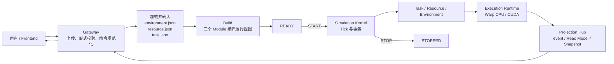

该图只定义业务闭环；每 Tick 内部时序由图 2-2 和第 3 部分定义。


### 2.1 三层架构

平台采用三层结构：

1. Web Frontend；
2. CPU 常驻管理层；
3. Execution Runtime。

CPU 常驻模块固定为：Gateway、Simulation Kernel、Task Module、Resource Module、Environment Module、Projection Hub。Execution Runtime 是唯一计算汇聚模块，Host 与 Warp CPU/CUDA device 均为其内部组成，不再作为独立一级模块。

**图 2-1　权威总体架构图**

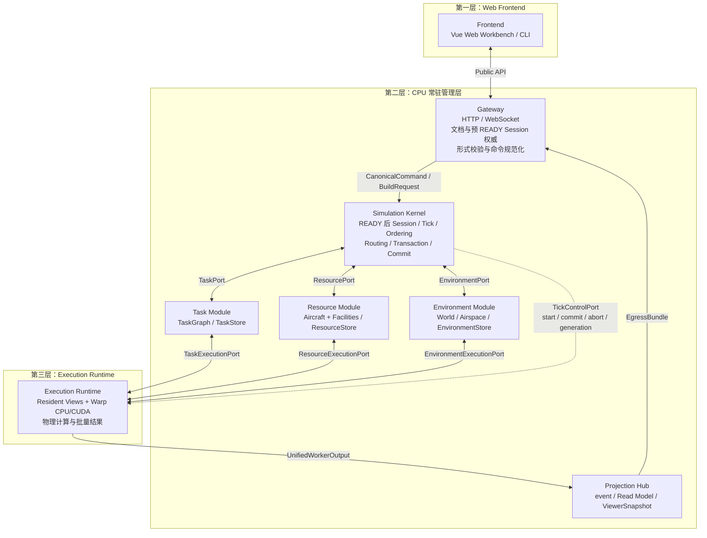

**图 2-2　每 Tick 权威数据流图**

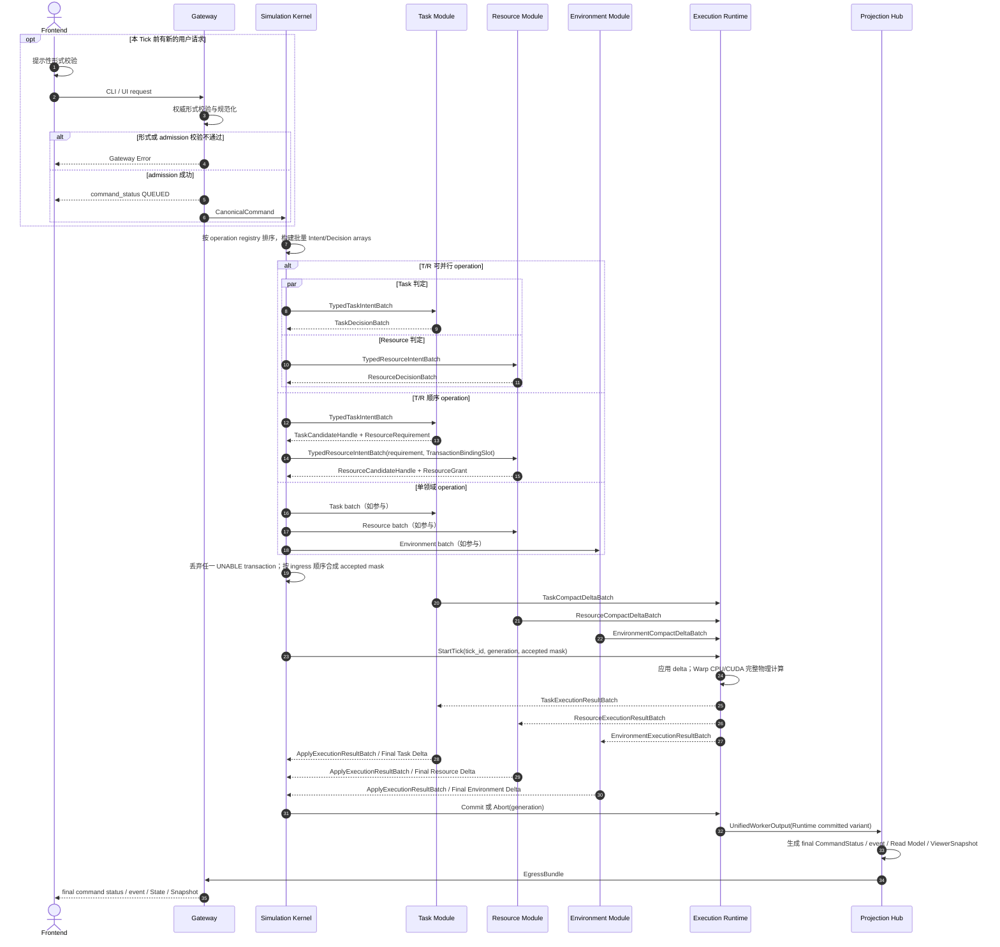

图 2-2 的强制语义：

1. Operation Registry 明确列出参与模块；`ADD_TASK`、`TKF`、`TAXI`、`LND`、`DIVERT` 只参与 Task/Resource，不以 Environment 作为业务 ALLOW/UNABLE 判定者。
2. EnvironmentExecutionView 长期驻留 Runtime。terrain、building、obstacle、airspace、VOL 和 AX 始终参与命令生效后的完整物理 Tick。
3. Runtime 不返回业务 ALLOW/UNABLE，不存在逐命令 Runtime feasibility 往返；Runtime 只返回批量计算结果或系统故障。
4. 任一参与模块返回 UNABLE 时，该 transaction 的全部 Candidate Delta 被丢弃，最终状态为 UNABLE；正常物理 Tick 继续。
5. T/R 顺序 operation 使用 `TransactionBindingSlot` 绑定 Task candidate、ResourceRequirement、Resource candidate 和 ResourceGrant；不进行第三次 Task 业务判定。
6. 所有参与模块 ALLOW、Runtime 完整计算成功且 final delta 通过不变量后，Kernel 才能原子提交。
7. Runtime 内部故障不是业务 UNABLE，必须进入 WORKER_FAILED/fail-stop。
8. 所有运行输出必须沿 `Execution Runtime -> Projection Hub -> Gateway -> Frontend` 发布。


### 2.5 三个输入文件

```text
environment.json
resource.json
task.json
```

三个文件均为必需文件，`schema_version` 固定从 `1.0.0` 开始。顶层结构：

```text
environment.json
├── schema_version
├── description
├── frame
├── bounds
├── map
├── collision
├── obstacle_volumes[]
├── airspace_zones[]
├── airspace_exemptions[]
├── simulation{}
└── metadata

resource.json
├── schema_version
├── aircraft[]
├── facilities[]
│   ├── hangars[]
│   ├── pads[]
│   └── runways[]                 # Runway 本体几何 + 独立 Runway End Resource
└── metadata

task.json
├── schema_version
├── waypoints[]
├── tasks[]
└── metadata
```

**图 2-4　三文件依赖与两阶段 Environment Build 图（权威）**

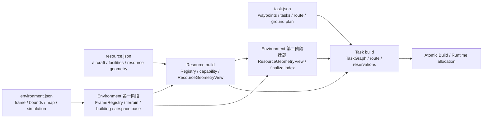

最终 Build 顺序固定为：

```text
Environment 第一阶段（基础层）
-> Resource build
-> Environment 第二阶段（挂载 ResourceGeometryView）
-> Task build
-> Runtime allocation / self-check / generation 0
```

文件位置不代表运行时状态所有权：

| 配置 | 实际消费者 |
|---|---|
| `simulation.clock`、time scale | Simulation Kernel |
| `simulation.runtime.backend/capacity/seed` | Execution Runtime |
| `simulation.integration` | Execution Runtime |
| `simulation.workcells` | Environment Module + Execution Runtime |
| `simulation.snapshot` | Projection Hub |
| `simulation.logging` | Gateway + Worker |
| terrain、building、obstacle、airspace、collision | Environment Module |
| aircraft、Facility、Runway body / Runway End、capacity、compatibility | Resource Module |
| tasks、route、ground segments、schedule | Task Module |


### 3.4 三文件 staged loading

装载顺序固定为：

```text
environment -> resource -> task -> Build
```

- Environment 必须先确认，因为 Resource geometry 和 Task waypoint 依赖 FrameRegistry。
- Resource 必须在 Task 前确认，因为 Task 引用 Aircraft 和 Facility Resource。
- Task 确认后才能 Build。
- Build 成功后禁止热重载；必须关闭 session 并重新 staged loading。

**图 3-3　三文件 staged loading sequence（权威）**

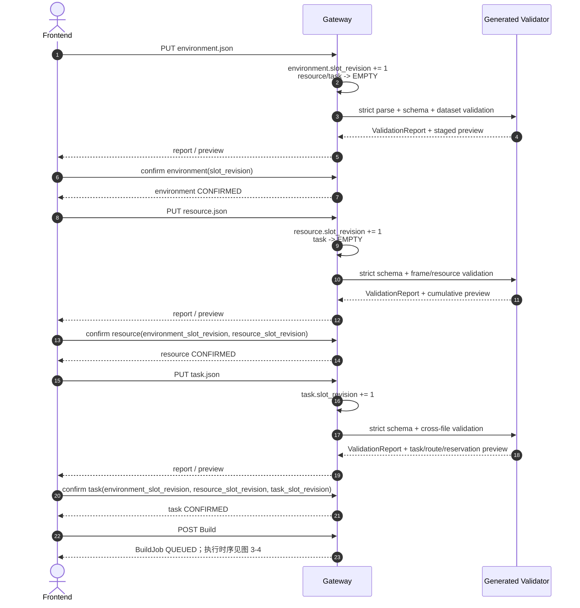

Confirm body 的 binding 固定为：

```text
environment:
  environment_slot_revision_u64

resource:
  environment_slot_revision_u64
  resource_slot_revision_u64

task:
  environment_slot_revision_u64
  resource_slot_revision_u64
  task_slot_revision_u64
```

Warning仍必须展示并要求用户显式确认当前revision。任一 revision binding 不一致返回 `REVISION_MISMATCH`；存在 validation error 返回 `DOCUMENT_NOT_VALID`。


### 3.5 原子 Build

Build 输入必须是三个 exact confirmed `slot_revision_u64` 对应的当前 bytes。Build 在临时对象中依次完成：

```text
Environment base definition + FrameRegistry
Resource Registry + Aircraft catalog + ResourceGeometryView
Environment index finalization with ResourceGeometryView
TaskGraph + route occurrence + Ground Plan + initial reservation graph
StableIdRegistry + host layouts
Execution Runtime View + Backend allocation
Warp startup self-check
initial committed generation 0
Projection initial Read Model / static Aircraft table / ViewerSnapshot metadata
```

**图 3-4　Build sequence（权威）**

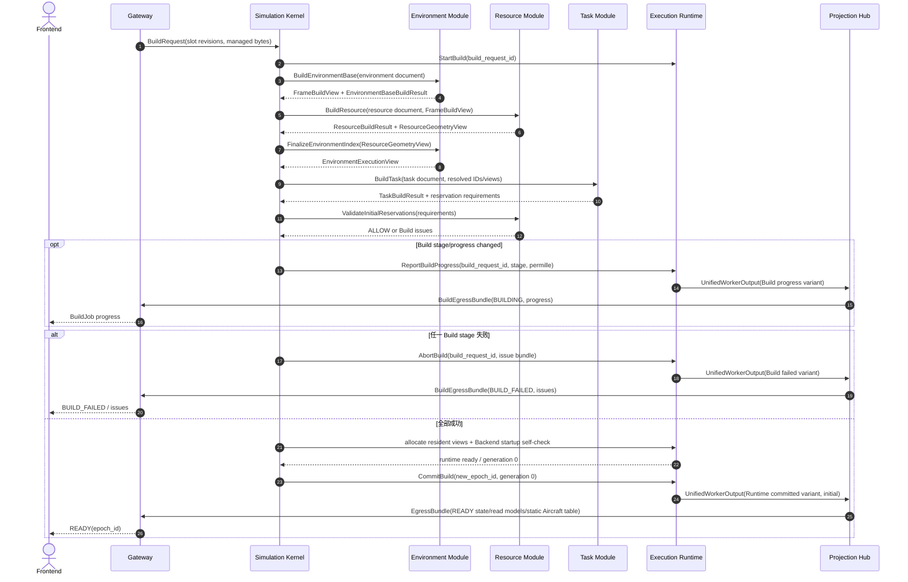

原子性：任何阶段失败不得留下可被下一次 Build 复用的半成品 ID、Arena row、reservation、device allocation、index 或 generation。BUILD_FAILED 修正后必须重新上传受影响文档及被清空的下游文档，并从三个当前 confirmed inputs 全量重建临时对象。

Build progress、failure 与 Runtime committed output 使用同一个 Worker egress tagged union。Build variant 不创建 CommandStatus、event、Read Model 或 ViewerSnapshot；READY 必须由 generation 0 的 Runtime committed variant发布。


### 3.10 两阶段计算与原子 Commit/Abort

#### 3.10.1 Working generation

每 Tick：

```text
next_generation = committed_generation + 1
working_generation = next_generation
```

三个 Module 和 Execution Runtime 只写 working buffers。公开读取和 Projection Hub 只能读取 committed buffers。

#### 3.10.2 批量领域判定与执行结果应用

领域判定在 Runtime 计算前完成：

```text
Typed Intent batches
-> DomainDecision batches
-> accepted_transaction_mask
-> Compact Delta batches
```

Execution Runtime按 ingress sequence应用 accepted delta并执行一次完整物理 Tick，随后分别返回 `TaskExecutionResultBatch`、`ResourceExecutionResultBatch`、`EnvironmentExecutionResultBatch`。三个 Module以 Tick级 `ApplyExecutionResultBatch` 生成 Final Delta；不得逐命令往返，不得由 Runtime决定业务 ACCEPTED/UNABLE。

#### 3.10.3 Commit 条件

必须全部满足：

```text
所有 accepted transaction 的参与模块为 ALLOW
所有 domain Final Delta 通过 invariant check
Execution Runtime 完整计算成功
无 authoritative overflow
Task/Resource/Environment generation 一致
UnifiedWorkerOutput 可安全发布
```

**图 3-7　Commit / Abort 图（权威）**

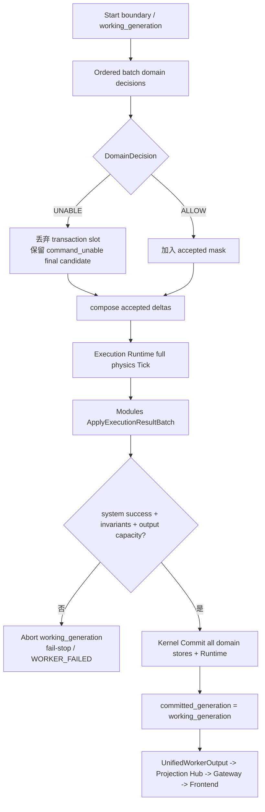

Abort 必须使所有 working count/header/generation 回到上一个 committed 状态。不得只回滚某一 Store 而保留其他 Store 的新 generation。failed Mutation不得留下任何领域业务 event；`command_unable` 是该失败命令的合法最终 command event，不属于部分领域 mutation。

#### 3.10.4 完整 Tick sequence

第 3 部分的完整 Kernel Tick 时序直接引用图 2-2，不重复绘制第二张同义权威图。


### 3.14 START、PAUSE、RESUME、RATE、STOP、RESET

#### START

- 只允许 READY；
- READY 期间不允许任何 Mutation；
- 通过 TickControlPort 设置 RUNNING；
- 第一个物理 Tick 从 `tick_index=0,t_s=0` 的 committed state开始；
- final ACCEPTED 与 `runtime_started` 从首个相关 committed output统一投影。

#### PAUSE

- 只在 committed Tick boundary生效；
- 不推进 `tick_index/t_s`；
- PAUSED 中 Mutation 可以继续 QUEUED，但必须等 RESUME 后首个 Tick apply；
- Query 继续可用；
- 不接受 `RATE 0` 作为替代语法。

#### RESUME

- 只允许 PAUSED；
- 不携带 RATE 参数；
- 当前 resume rate由最近一次合法 RATE 决定；
- 不允许单步模式。

#### RATE

- 允许 RUNNING/PAUSED；
- 参数必须为正整数且属于当前场景 `allowed_time_scales`；
- RUNNING 中在下一个 control boundary生效；
- PAUSED 中只更新 resume rate，不隐式运行；
- `TS` 不是 alias，必须返回 unknown operation；
- `RATE 0` 非法，必须使用 PAUSE。

#### STOP

固定顺序：

```text
停止接收新的 Mutation admission
-> 等待当前 working Tick完成并提交，或在尚未启动时保持最后 committed generation
-> 将尚未 apply 的 QUEUED Mutation 按 ingress sequence结束为 UNABLE / SESSION_STOPPED_BEFORE_APPLY
-> 提交 STOP command final status
-> 输出最终当前状态和 event
-> SessionState = STOPPED
```

STOP 不执行任何历史落盘、artifact flush 或回放目录创建。

#### RESET

- 只允许 STOPPED；
- admission先按第 3.6.3 节查询旧 stopped epoch的 RESET 幂等索引，再比较 current epoch；
- 旧记录以 canonical payload bytes直接比较；
- 在旧 epoch输出 RESET command final ACCEPTED；
- 创建新 `epoch_id`、新的普通 command table、`tick_index=0,t_s=0,generation=0`；
- 从三个 confirmed current document bytes的 immutable Build basis重新初始化 mutable Task、Resource、Environment overlay和ExecutionState；
- 清除 runtime-added Task、VOL、AX、tombstone active set、destroyed/block latch；
- 不删除浏览器本地偏好；
- 不保留服务器历史事实。


### 4.11 PRE_GROUND 到 TAKEOFF

**图 4-6　PRE_GROUND → TAKEOFF sequence（权威）**

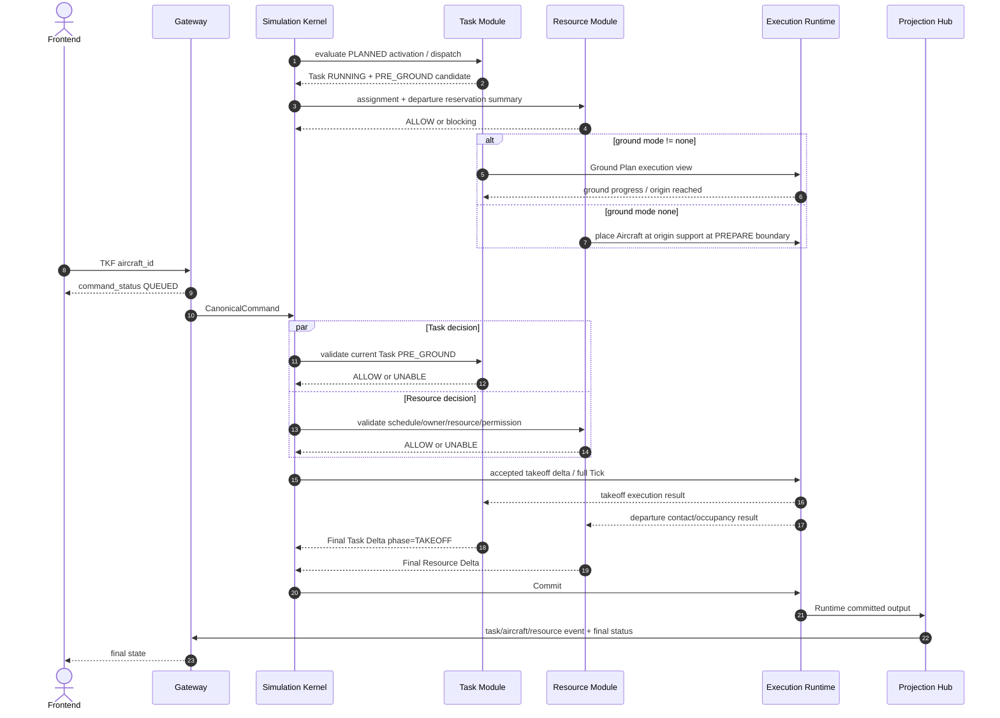


### 4.12 LANDING 到完成

**图 4-7　LANDING → POST_GROUND → COMPLETED sequence（权威）**

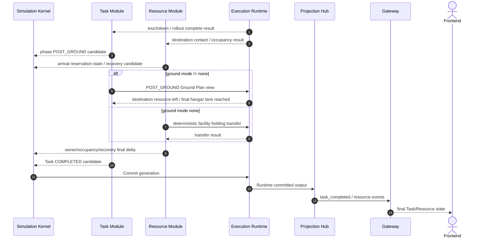

Task completion必须等待：

```text
POST_GROUND完成
AND destination physical occupancy已安全转移/清除
AND Task所需Resource handoff已提交
```

Task进入COMPLETED时只发布`task_completed`，不额外发布终态phase变化event。Resource RECOVERY可以在Task completed后继续，但不得把Aircraft伪装为仍占用destination operation surface。


### 7.6 固定 Tick 计算顺序

**图 7-2　完整 Tick 计算 flowchart（权威）**

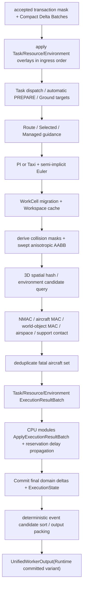

顺序不得因CPU/CUDA Backend改变：

1. 同Tick accepted command delta在movement前应用；
2. world collision临时mask在command/resource transition后、integration前确定；
3. collision使用old→new swept state；
4. 同Tick先形成全部MAC，再统一fatal set；
5. fatal consequence、Resource BLOCKED和reservation延误传播在同一generation提交；
6. event、Read Model和ViewerSnapshot观察同一committed generation。


### 8.4 Projection sequence

**图 8-2　Projection sequence（权威）**

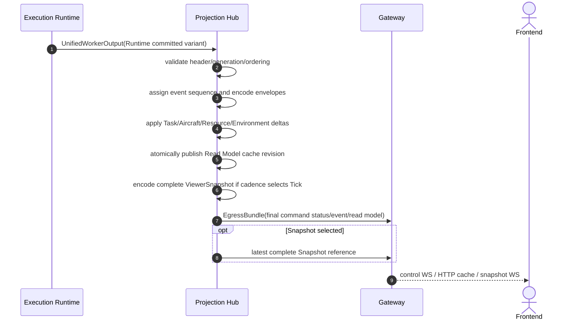


### 9.6 CLI完整往返

**图 9-2　CLI完整往返 sequence（权威）**

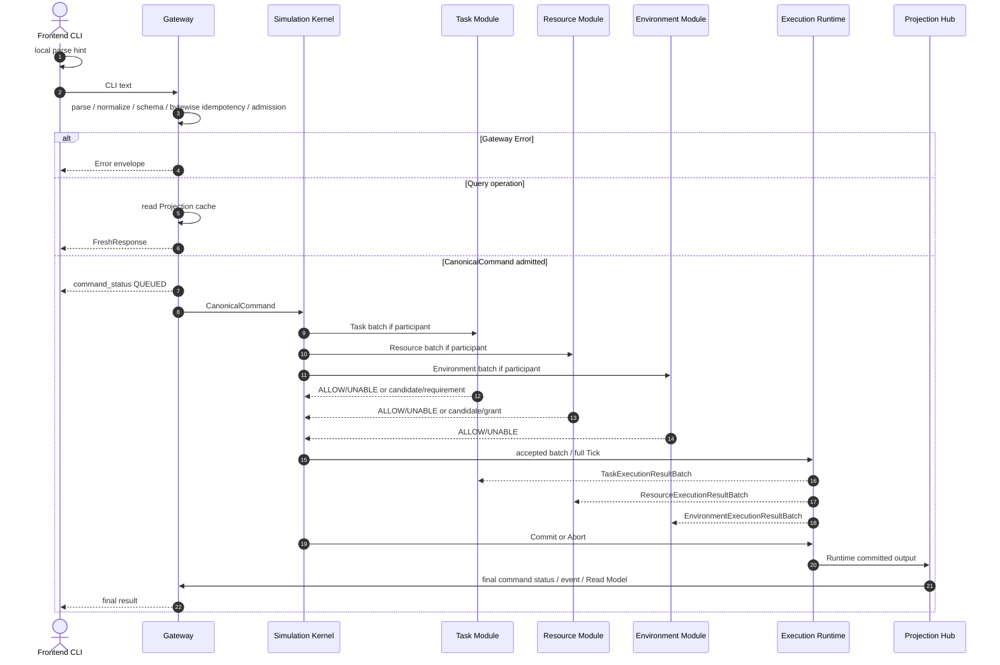


## 附录 K：完整业务示例和关键 Tick trace

### K.1 最小三文件场景

以下示例展示关键字段；完整文件仍受附录A约束。

#### `environment.json`

```json
{
  "schema_version": "1.0.0",
  "description": "Minimal deterministic vertiport scenario",
  "frame": {
    "type": "virtual_enu",
    "vertical_datum": "virtual_u",
    "origin_enu_m": [0.0, 0.0, 0.0]
  },
  "bounds": {
    "type": "enu_box",
    "min_e_m": 0.0,
    "max_e_m": 10000.0,
    "min_n_m": 0.0,
    "max_n_m": 10000.0,
    "min_u_m": 0.0,
    "max_u_m": 1000.0
  },
  "map": {
    "map_id": "virtual-flat",
    "type": "flat_heightfield",
    "surface_u_m": 0.0,
    "buildings": {"sources": []},
    "metadata": {}
  },
  "collision": {
    "nmac_horizontal_m": 153.0,
    "nmac_vertical_m": 31.0
  },
  "obstacle_volumes": [],
  "airspace_zones": [],
  "airspace_exemptions": [],
  "simulation": {
    "clock": {
      "dt_s": 0.1,
      "maximum_simulation_time_s": 1800.0,
      "initial_time_scale": 1,
      "allowed_time_scales": [1, 2, 3, 4, 5],
      "max_catch_up_ticks": 5
    },
    "runtime": {
      "backend": "auto",
      "cuda_device": "cuda:0",
      "random_seed": 20260724,
      "capacity": {
        "aircraft": 100,
        "tasks": 100,
        "waypoints": 1000,
        "reservations": 400,
        "runtime_volumes": 100,
        "event_candidates_per_tick": 10000,
        "commands_per_tick": 1000
      }
    },
    "integration": {"method": "semi_implicit_euler"},
    "workcells": {
      "workspace_max_length_m": 200000.0,
      "core_size_m": 10000.0,
      "overlap_ratio": 0.1,
      "migration_at_tick_boundary": true
    },
    "snapshot": {
      "max_publish_hz": 20.0,
      "shared_memory_slot_bytes": 8388608
    },
    "logging": {"level": "info", "reliable_queue_capacity": 100000}
  },
  "metadata": {}
}
```

#### `resource.json`

```json
{
  "schema_version": "1.0.0",
  "aircraft": [
    {
      "aircraft_id": "AC101",
      "profile_id": "MR-DEFAULT",
      "display_name": "AC101",
      "model_type": "multirotor",
      "geometry": {
        "mass_kg": 1200.0,
        "length_m": 4.0,
        "width_m": 4.0,
        "height_m": 1.8
      },
      "collision": {"type": "aabb_from_geometry", "safety_margin_m": 1.0},
      "rotor_envelope": {
        "cruise_speed_mps": 15.0,
        "max_speed_mps": 25.0,
        "max_climb_rate_mps": 8.0,
        "max_descent_rate_mps": 5.0
      },
      "takeoff_landing": {
        "min_vertical_takeoff_height_above_pad_m": 15.0,
        "touchdown_max_horizontal_speed_mps": 2.0,
        "touchdown_max_vertical_speed_mps": 1.5,
        "touchdown_max_total_speed_mps": 2.5
      },
      "gain_provider": {"mode": "model_type_default"},
      "metadata": {}
    }
  ],
  "facilities": [
    {
      "facility_id": "VPORT-A",
      "type": "vertiport",
      "name": "Origin Vertiport",
      "center_enu_m": [1000.0, 1000.0, 0.0],
      "initial_availability": "OPEN",
      "hangars": [
        {
          "hangar_id": "H01",
          "label": "Hangar 01",
          "center_enu_m": [950.0, 1000.0, 0.0],
          "capacity_aircraft": 2,
          "initial_availability": "OPEN"
        }
      ],
      "pads": [
        {
          "pad_id": "PAD-A",
          "label": "Pad A",
          "center_enu_m": [1050.0, 1000.0, 0.0],
          "touchdown_area": {"shape": "circle", "radius_m": 6.0},
          "fato_area": {"shape": "circle", "radius_m": 12.0},
          "limits": {
            "max_mass_kg": 2400.0,
            "max_wingspan_m": 10.0,
            "allowed_model_types": ["multirotor", "helicopter", "compound_wing", "tiltrotor"]
          },
          "resource_use_defaults": {
            "departure": {"prepare_duration_s": 60.0, "operation_duration_s": 30.0, "recovery_duration_s": 30.0},
            "arrival": {"prepare_duration_s": 30.0, "operation_duration_s": 45.0, "recovery_duration_s": 60.0}
          },
          "initial_availability": "OPEN"
        }
      ],
      "runways": [],
      "metadata": {}
    },
    {
      "facility_id": "VPORT-B",
      "type": "vertiport",
      "name": "Destination Vertiport",
      "center_enu_m": [8000.0, 8000.0, 0.0],
      "initial_availability": "OPEN",
      "hangars": [
        {
          "hangar_id": "H01",
          "label": "Hangar 01",
          "center_enu_m": [8050.0, 8000.0, 0.0],
          "capacity_aircraft": 2,
          "initial_availability": "OPEN"
        }
      ],
      "pads": [
        {
          "pad_id": "PAD-B",
          "label": "Pad B",
          "center_enu_m": [7950.0, 8000.0, 0.0],
          "touchdown_area": {"shape": "circle", "radius_m": 6.0},
          "fato_area": {"shape": "circle", "radius_m": 12.0},
          "limits": {
            "max_mass_kg": 2400.0,
            "max_wingspan_m": 10.0,
            "allowed_model_types": ["multirotor", "helicopter", "compound_wing", "tiltrotor"]
          },
          "resource_use_defaults": {
            "departure": {"prepare_duration_s": 60.0, "operation_duration_s": 30.0, "recovery_duration_s": 30.0},
            "arrival": {"prepare_duration_s": 30.0, "operation_duration_s": 45.0, "recovery_duration_s": 60.0}
          },
          "initial_availability": "OPEN"
        }
      ],
      "runways": [],
      "metadata": {}
    }
  ],
  "metadata": {}
}
```

#### `task.json`

```json
{
  "schema_version": "1.0.0",
  "waypoints": [
    {"waypoint_id": "WP010", "position_enu_m": [3000.0, 2500.0], "capture_radius_m": 50.0},
    {"waypoint_id": "WP020", "position_enu_m": [5500.0, 5500.0], "capture_radius_m": 50.0}
  ],
  "tasks": [
    {
      "task_id": "TASK001",
      "aircraft_id": "AC101",
      "flight": {
        "origin": {"type": "pad", "facility_id": "VPORT-A", "pad_id": "PAD-A"},
        "destination": {"type": "pad", "facility_id": "VPORT-B", "pad_id": "PAD-B"},
        "schedule": {"scheduled_takeoff_s": 300.0, "scheduled_landing_s": 900.0},
        "route": ["WP010", "WP020"],
        "route_constraints": [
          {"occurrence_ref": "WP020@1", "altitude_constraint_m": 160.0, "speed_constraint_mps": 15.0}
        ]
      },
      "ground_tasks": {"mode": "auto", "segments": []},
      "metadata": {}
    }
  ],
  "metadata": {}
}
```

Build为auto生成完整PRE/POST Ground Plan；无法解析时Build失败`GROUND_AUTO_UNRESOLVED`，不退化为none。

### K.2 Loader到READY

```mermaid
sequenceDiagram
    autonumber
    actor F as Frontend
    participant G as Gateway
    participant K as Simulation Kernel
    participant E as Environment Module
    participant R as Resource Module
    participant T as Task Module
    participant X as Execution Runtime
    participant P as Projection Hub
    F->>G: PUT environment
    G->>G: environment revision++; resource/task EMPTY
    G-->>F: ValidationReport
    F->>G: confirm environment revision
    F->>G: PUT resource
    G->>G: resource revision++; task EMPTY
    G-->>F: ValidationReport
    F->>G: confirm resource revisions
    F->>G: PUT task + confirm revisions
    F->>G: POST build
    G->>K: BuildRequest
    K->>E: BuildEnvironmentBase
    E-->>K: EnvironmentBaseBuildResult
    K->>R: BuildResource
    R-->>K: ResourceGeometryView
    K->>E: FinalizeEnvironmentIndex
    E-->>K: EnvironmentExecutionView
    K->>T: BuildTask
    T-->>K: TaskBuildResult
    K->>X: Allocate Runtime / self-check
    K->>X: CommitBuild generation 0
    X->>P: Runtime committed output
    P->>G: READY full state + epoch static table
    G-->>F: READY
```

任何阶段失败销毁临时对象。

### K.3 START 与首次Task激活

START admission后Gateway发送QUEUED command status；final ACCEPTED由Projection发布。Task没有READY lifecycle。

到activation boundary且依赖已排空：

```text
TaskLifecycle PLANNED -> RUNNING
TaskPhase internal NONE -> PRE_GROUND
AircraftResourceState ASSIGNED -> EXECUTING
```

公开只发布`task_started`，不同时发布首次`task_phase_changed`。

### K.4 Command accepted trace

提交：

```text
HOLD_TASK TASK001
```

允许前提为Task PLANNED或RUNNING/PRE_GROUND。Gateway返回QUEUED status；Task ALLOW后正常Tick提交：

```text
Task.held = true
blocking_reason = TASK_HELD
ReservationState PLANNED remains PLANNED
CommandStatus = ACCEPTED
event = command_accepted
```

不产生QUEUED event。

### K.5 Command UNABLE trace

Aircraft已NAV时：

```text
CXL_TASK TASK001
```

Task返回UNABLE`INVALID_TASK_PHASE`。Candidate丢弃，normal Tick继续，最终只产生：

```text
command_unable
```

不产生task_cancelled或phase event。

### K.6 Gateway Error trace

未知operation：

```text
FOO TASK001
```

Gateway返回`UNKNOWN_OPERATION`，不分配ingress sequence、不显示QUEUED、不创建event。

### K.7 Route clear与LND gate

当前route：

```text
WP010@1 completed
WP020@1 active
WP030@1 future
```

提交：

```text
RTE REPLACE AC101 WPTS=[]
```

成功：

```text
WP020@1 / WP030@1 tombstoned
remaining_route_count = 0
route_complete = true
```

随后LND可以通过route gate。若再执行RTE ADD，remaining count增加，LND重新被`ROUTE_NOT_COMPLETE`阻止。

### K.8 SLOT与RSRCUSE职责

计划修改：

```text
SLOT TASK001 TKF=900 DEP_PREPARE=840 DEP_RECOVERY=990
```

实际阶段结束修改：

```text
RSRCUSE END TASK001 OP=DEP PREPARE=870
```

SLOT不修改operation_duration；任一字段gate失败则整条SLOT UNABLE。

### K.9 reservation延误传播

上游departure实际结束延后120 s：

```text
same Task arrival右移
same Runway exclusivity/resource successor右移
successor Task downstream reservation右移
same Aircraft next Task右移
```

稳定顺序不交换。只有PLANNED后项可以合法向左回收到base window。

### K.10 Managed landing 与Resource后变BLOCKED

LND decision时destination为OPEN、reservation PLANNED、route complete，因此LND ACCEPTED并进入LANDING。随后Resource事故BLOCKED：

```text
ManagedLandingPlanV1继续
不go-around
不回NAV
不修改LND final
```

Aircraft实际接触时形成：

```text
aircraft_world_object_mac (class 40, 0x1403;
                           collider_kind=RESOURCE_SURFACE,
                           contact_failure_reason=RESOURCE_BLOCKED)
aircraft_destroyed_by_world_object_mac (class 50, 0x1A02)
task_interrupted (class 50, 0x1A10)
class 60 Resource consequence
```

### K.11 Aircraft MAC同Tick

两架Aircraft在一个Tick高速交叉，continuous path先满足NMAC再swept AABB相交。固定输出：

```text
aircraft_aircraft_nmac (class 40, 0x1401)
aircraft_aircraft_mac (class 40, 0x1402)
aircraft_destroyed_by_aircraft_mac(lower stable ID; class 50, 0x1A01)
aircraft_destroyed_by_aircraft_mac(higher stable ID; class 50, 0x1A01)
task_interrupted (class 50, 0x1A10)
class 60 resource_* consequence
```

同Tick先汇总全部MAC再形成去重fatal set。

### K.12 AX example

```text
VOL ADD RA ZONE=MEDICAL-NFZ ...
AX SET ZONE=MEDICAL-NFZ TASK=TASK-EMS-001 ENABLED=true START=300 END=900 REASON=medical
```

Task-scoped AX随Task当前Aircraft。禁用或到期后若仍在zone内，形成新episode；不发布exit event。

### K.13 STOP

STOP固定：

```text
stop new Mutation admission
finish current working Tick
finalize pending commands in ingress order
publish final state/event
Session -> STOPPED
```

不执行history/artifact/recording工作。

### K.14 RESET

RESET创建新epoch，从confirmed current document bytes重建mutable state。专用幂等索引保存original canonical payload bytes；旧epoch相同command_id和完全相同bytes重试返回第一次相同result，不同bytes返回`COMMAND_ID_REUSE_MISMATCH`。

### K.15 Frontend Hermite

权威Snapshot`S0/S1`之间只插值position/velocity/derived heading。TaskLifecycle、TaskPhase、Aircraft states、ReservationState、availability、VOL/AX、destroyed和event保持离散，不外推未来。

### K.16 Canonical committed Tick evidence

Golden Tick bundle至少包含：

```text
input epoch_id/tick/generation
ordered CanonicalCommand bytes and ingress sequences
participant masks and DomainDecision
Task/Resource candidate binding rows
ExecutionInput/Output byte fixtures
SplitMix64 vector
fatal set
committed generation
final CommandStatus rows
event ordered canonical JSON bytes
Read Model canonical bytes
ViewerSnapshot bytes
CPU/CUDA trace comparison
```

该bundle是测试证据，不是public history API。

---

**文档结束。**
