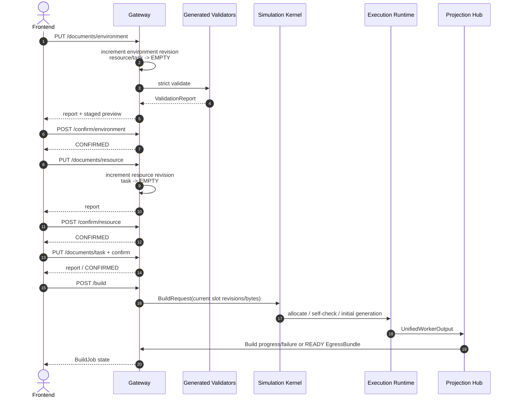
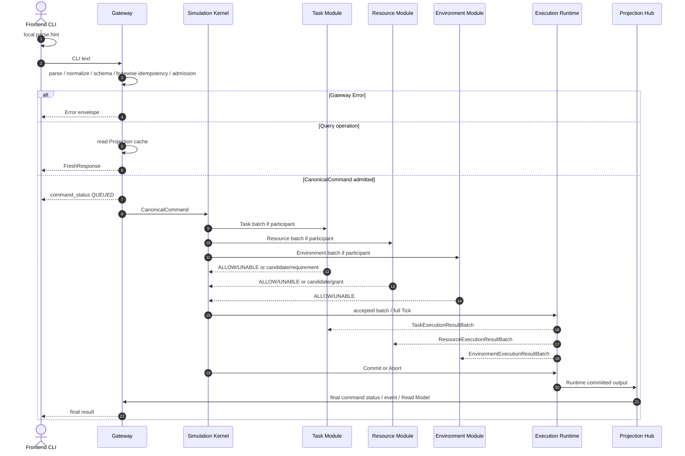
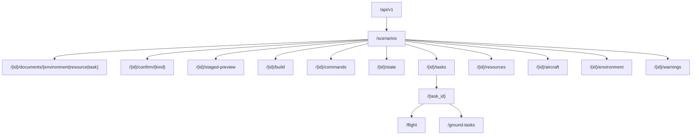

# HTTP API 外部合同

定义 `/api/v1` 路由、三文件上传/确认/Build、StagedPreview、ValidationReport、Command admission、Query、FreshResponse、Read Model 查询、Gateway Error 与 HTTP 安全边界。

## 内容来源
- 设计：9.1–9.8
- 设计附录 G.1–G.17、G.22
- 设计附录 H 全部

> 本文件是权威输入文档的分层视图。若拆分文本与源文档发生差异，以《LightBlueSky v8.0 统一设计规范》为系统设计与公开合同权威，以《HITL 大阶段切换规范》为当前项目阶段推进与人工验收权威。

## 关联文档

- [命令与 event](03-event-and-command.md)
- [Read Model](02-read-model.md)

## 规范正文

## 9. Gateway 与 Frontend 通信（HTTP 分拆）

## 附录 G：HTTP、WebSocket 与 CanonicalCommand 消息模型（HTTP/公共模型分拆）

### 9.1 Gateway 职责

Gateway 是唯一 public boundary，负责：

```text
HTTP / WebSocket
scenario/session management
三个文件上传和受管revision存储
ValidationReport / staged preview / Confirm / Build
Frontend/CLI request规范化
权威形式校验和Gateway Error
CanonicalCommand admission / idempotency / bounded queue
Projection cache mirror和public query
control WS可靠传输
snapshot WS latest-wins传输
worker lifecycle / IPC health / protocol handshake
受管日志与静态文件服务
```

Gateway 不负责：

```text
FlightCore / Warp Tick
Task/Resource/Environment业务判定
直接访问Execution Runtime
直接读取GPU working array
生成event业务事实
修改Read Model
浏览器插值
服务器端历史/Recorder/Replay/Script
```

### 9.2 三文件上传、ValidationReport、Confirm 与 Build

文件上传content type为`application/json`，每个文件最大256 MiB，UTF-8，duplicate key必须拒绝。Gateway每个slot只保存当前bytes；每次上传先递增`slot_revision_u64`，不保留历史版本、不计算文档摘要。

ValidationReport：

```json
{
  "valid": false,
  "slot_revision_u64": 7,
  "preview_revision_u64": 12,
  "schema_version": "1.0.0",
  "errors": [
    {
      "severity": "error",
      "code": "SCHEMA_REQUIRED_FIELD",
      "document_kind": "task",
      "json_pointer": "/tasks/0/flight/origin/pad_id",
      "object_kind": "task",
      "object_id": "TASK001",
      "message": "pad_id is required when origin.type is pad"
    }
  ],
  "warnings": []
}
```

Confirm body：

```json
{
  "slot_revision_u64": 7,
  "upstream_slot_revisions": {
    "environment": 3,
    "resource": 5
  }
}
```

- environment confirm省略`upstream_slot_revisions`或使用空object；
- resource只携带environment；
- task携带environment和resource；
- 无关upstream key必须省略；
- 任一revision不一致返回409`REVISION_MISMATCH`；
- warning仍需显式确认当前revision。

**图 9-1　三文件上传与 Build public sequence（权威）**



### 9.3 Staged Preview

Staged Preview只由Gateway根据三个slot的当前VALID/CONFIRMED内容派生，不创建epoch、Runtime、integer row、CommandStatus或event。

顶层：

```text
contract_version = 1.0.0
scenario_id
preview_revision_u64
session_state
preview_stage
build_eligible
slot_revisions
confirmations
coordinate_summary
extent
layer_availability
object_counts
issue_summary
links
superseded_by_epoch_id?
```

Collection：

```text
facilities
resources
obstacles
airspace_zones
airspace_exemptions
aircraft_catalog
tasks
routes
constraints
reservations
```

分页limit`1..1000`，默认200；cursor为opaque token。Response必须回显`preview_revision_u64`。客户端携带过期`expected_preview_revision_u64`时返回409`PREVIEW_REVISION_CHANGED`，不得拼接不同revision页面。

上游重新上传时下游slot直接EMPTY，对应preview layer与selection在一个Pinia commit中清除；上游变化后不保留或自动重用旧下游文档。Build成功后preview冻结并带`superseded_by_epoch_id`；Frontend切换到Runtime Read Model。

### 9.4 Frontend提示性校验与Gateway权威校验

Frontend提示性校验只能改善交互。Gateway权威形式校验遵循第3.6节。Error envelope：

```json
{
  "error": {
    "code": "EPOCH_MISMATCH",
    "message": "The command epoch does not match the current session epoch.",
    "details": {
      "expected_epoch_id": "018f...01",
      "received_epoch_id": "018f...00"
    }
  }
}
```

HTTP status建议：

| 条件 | Status |
|---|---:|
| syntax/schema/argument/unknown operation | 400 |
| scenario/path object not found | 404 |
| epoch/idempotency/revision/session conflict | 409 |
| payload too large | 413 |
| command queue full | 429 |
| worker unavailable/protocol handshake failed | 503 |

这些均为Gateway Error，不产生Command row/event。

### 9.5 CommandReceipt 与 CommandStatusView

Admission成功：

```json
{
  "command_id": "018f...",
  "epoch_id": "018f...",
  "canonical_ingress_sequence": 42,
  "status": "QUEUED",
  "operation": "set_selected"
}
```

Gateway同时通过control WS发送同一`command_status: QUEUED`。该消息不是event，不含event sequence。

Final view：

```json
{
  "command_id": "018f...",
  "epoch_id": "018f...",
  "canonical_ingress_sequence": 42,
  "status": "ACCEPTED",
  "operation": "set_selected",
  "final_generation": 1201,
  "final_tick_index": 1200,
  "final_t_s": 120.0,
  "reason_code": "NONE",
  "message": "Selected control was committed.",
  "result": {}
}
```

UNABLE必须有非NONE reason。Gateway不自行构造final；只转发Projection cache中的final并更新原QUEUED cache row。

### 9.6 CLI完整往返

**图 9-2　CLI完整往返 sequence（权威）**



### 9.7 HTTP API

Base：`/api/v1`。

| Method / Path | 作用 |
|---|---|
| `POST /scenarios` | 创建EMPTY scenario session。 |
| `GET /scenarios/{scenario_id}` | 当前session/document/runtime摘要。 |
| `DELETE /scenarios/{scenario_id}` | 关闭session；RUNNING/PAUSED必须先STOP。 |
| `PUT /scenarios/{id}/documents/{environment\|resource\|task}` | 上传raw JSON。 |
| `POST /scenarios/{id}/confirm/{environment\|resource\|task}` | 确认exact revision binding。 |
| `GET /scenarios/{id}/staged-preview` | Preview摘要。 |
| `GET /scenarios/{id}/staged-preview/collections/{kind}` | 分页collection。 |
| `GET /scenarios/{id}/staged-preview/issues` | 分页validation issues。 |
| `POST /scenarios/{id}/build` | 异步Build。 |
| `POST /scenarios/{id}/commands` | Command admission。 |
| `GET /scenarios/{id}/commands/{command_id}` | 当前CommandStatusView。 |
| `GET /scenarios/{id}/state` | RuntimeReadModel。 |
| `GET /scenarios/{id}/tasks` | Task list。 |
| `GET /scenarios/{id}/tasks/{task_id}` | Task detail。 |
| `GET /scenarios/{id}/tasks/{task_id}/flight` | Task flight子视图。 |
| `GET /scenarios/{id}/tasks/{task_id}/ground-tasks` | Task ground子视图。 |
| `GET /scenarios/{id}/resources` | Facility Resource list。 |
| `GET /scenarios/{id}/resources/{resource_id}` | Resource detail。 |
| `GET /scenarios/{id}/aircraft` | Aircraft list。 |
| `GET /scenarios/{id}/aircraft/{aircraft_id}` | Aircraft detail。 |
| `GET /scenarios/{id}/environment` | Environment summary/overlay。 |
| `GET /scenarios/{id}/warnings` | Current warning/critical projection。 |

不提供：

```text
独立flight顶层资源
event历史分页
Replay/Artifact/Script API
public exact GPU gather
```

### 9.8 API资源树

**图 9-3　API资源树（权威）**




### 9.17 本章状态所有权

Gateway拥有外部连接、Build前SessionState、DocumentSlot current bytes/slot revision、admission/idempotency边界、current command cache、public cache mirror和transport queue；不拥有READY后的仿真业务状态。

### 9.18 本章接口与不变量

1. Public请求只进入Gateway。
2. Formal Error不进入Kernel。
3. QUEUED由Gateway作为command status发送，不是event。
4. QUEUED后final必须来自Projection Hub。
5. Query只读Projection cache。
6. control与snapshot通道语义分离。
7. 重连不恢复event历史。
8. Gateway不访问Execution Runtime working arrays。
9. Gateway不保存DocumentSlot历史版本或内容摘要。

### 9.19 本章性能和验收要点

- upload/validation限制、path traversal、duplicate key、queue full、idempotency、protocol mismatch mandatory；
- API/OpenAPI与generated client byte/shape conformance；
- control WS order、slow-client disconnect、reconnect full-state/no-event-history；
- snapshot copy/CRC/browser decode p95门槛见附录I。

---


### G.1 ScenarioSession

```json
{
  "scenario_id": "018f...",
  "state": "EMPTY",
  "document_slots": {
    "environment": {
      "state": "EMPTY",
      "slot_revision_u64": 0
    },
    "resource": {
      "state": "EMPTY",
      "slot_revision_u64": 0
    },
    "task": {
      "state": "EMPTY",
      "slot_revision_u64": 0
    }
  },
  "preview_revision_u64": 0,
  "epoch_id": null
}
```

每个slot只对应当前upload，不包含latest/active/confirmed历史指针。`CONFIRMED`由state表达。

### G.2 ValidationIssue

```text
severity                  # error / warning / info
code
message
document_kind
slot_revision_u64
json_pointer
object_kind?
object_id?
feature_ref?
line_number?
column_number?
related_ids[]
```

Message使用英文；Frontend可以按code本地化，但必须保留原始message。

### G.3 ValidationReport

```text
valid
slot_revision_u64
preview_revision_u64
schema_version
errors[]
warnings[]
infos[]
```

`valid=true` iff errors为空。Warning不阻止VALID，但Confirm必须绑定当前slot revision。

### G.4 StagedPreview

#### Summary

```text
contract_version
scenario_id
preview_revision_u64
session_state
preview_stage
build_eligible
slot_revisions
confirmations
coordinate_summary?
extent?
layer_availability
object_counts
issue_summary
links
superseded_by_epoch_id?
```

#### Collection page

```text
contract_version
scenario_id
preview_revision_u64
collection_kind
items[]
next_cursor?
```

#### Preview geometry

```text
coordinate_space
geometry_type
coordinates
```

Preview不得包含epoch、tick、dynamic position/velocity/phase、owner、occupant、actual interval或Runtime integer row。

### G.5 BuildJob / BuildResult

```json
{
  "build_job_id": "018f...",
  "scenario_id": "018f...",
  "state": "QUEUED",
  "input_slot_revisions": {
    "environment": 3,
    "resource": 5,
    "task": 7
  }
}
```

Progress：

```text
state                     # BUILDING
scenario_id
build_job_id
stage_code
progress_permille
summary?
issues[]
```

Final：

```text
state                     # READY / BUILD_FAILED
scenario_id
epoch_id?                 # READY only
backend_requested?
backend_active?
resolved_counts?
issues[]
build_timing_ms?
```

Build不是CanonicalCommand。Build progress/failure使用UnifiedWorkerOutput Build variant；READY使用generation 0 Runtime committed variant。

### G.6 Confirm request

```text
slot_revision_u64
upstream_slot_revisions {
  environment?
  resource?
}
```

environment无upstream，resource只绑定environment，task绑定environment/resource。任一不一致返回409`REVISION_MISMATCH`。

### G.7 CanonicalCommand

```text
contract_version
command_id
epoch_id
operation
args
```

Gateway内部保存RFC 8785 canonical UTF-8 bytes并直接用于幂等比较，不计算payload摘要。

### G.8 CanonicalQuery

```text
contract_version
epoch_id
operation
args
```

Query不要求command_id，不产生CommandStatus/event。

### G.9 Gateway Error

```text
error {
  code
  message
  details
}
```

Details strict per code，不得返回stack trace、secret path、token或raw internal exception。

### G.10 CommandReceipt / CommandStatusView

Receipt：

```text
command_id
epoch_id
canonical_ingress_sequence
status = QUEUED
operation
```

Gateway通过HTTP response和control WS`command_status`发送Receipt。QUEUED不是event。

Final：

```text
command_id
epoch_id
canonical_ingress_sequence
status                      # ACCEPTED / UNABLE
operation
final_generation
final_tick_index
final_t_s
reason_code
message
result
```

普通命令相同key重试直接比较canonical payload bytes。RESET专用索引同样保存并比较原bytes。

### G.11 FreshResponse

```text
epoch_id
source_generation
source_tick_index
source_t_s
data
```

WORKER_FAILED stale cache增加：

```text
stale=true
stale_reason=WORKER_FAILED
```

对象内不重复携带freshness。

### G.12 RuntimeReadModel

```text
scenario_id
epoch_id
session_state
tick_index
t_s
dt_s
time_scale
resume_time_scale
backend_requested
backend_active
worker_status
committed_generation
aircraft_total / active / placed / destroyed
task_counts_by_lifecycle
task_counts_by_phase
warning_count / critical_count
canonical_snapshot_sequence
live_published_snapshot_sequence
snapshot_lag_s
```

### G.13 TaskReadModel

```text
task_id
aircraft_id
lifecycle                    # PLANNED/RUNNING/COMPLETED/CANCELLED/INTERRUPTED
phase?                       # RUNNING only
held
delayed                      # derived
blocking_reason?
flight {
  origin_resource_id
  destination_resource_id
  schedule {
    scheduled_takeoff_s
    scheduled_landing_s?
    planned_arrival_anchor_s
  }
  route_progress {
    completed_occurrences
    total_occurrences
    remaining_route_count
    active_occurrence_ref?
    occurrences[] {
      occurrence_ref
      waypoint_id
      status                  # COMPLETED / ACTIVE / FUTURE
    }
    tombstoned_occurrence_refs[]
  }
  constraints[] {
    occurrence_ref
    altitude_constraint_m?
    speed_constraint_mps?
    target_time_s?
    time_window_s?
    current_status?
  }
}
ground_tasks {
  mode
  segments[] {
    ground_segment_id
    phase
    occurrence_count
    scheduled_start_s?
    target_arrival_s?
  }
  current_ground_segment_id?
  ground_occurrence_cursor?
  progress_0_1?
  associated_resource_ids[]
}
completion_t_s?
cancelled_reason?
interrupted_reason?
```

### G.14 AircraftReadModel

```text
aircraft_id
profile_id
display_name?
model_type
resource_state
capabilities
registered                    # derived
active                        # derived
placed
destroyed                     # derived
current_task_id?
execution_state?
workspace_position_enu_m?[3]
workspace_velocity_enu_mps?[3]
H_orthometric_m? or virtual_u?
wgs84_position?
heading_deg?
horizontal_speed_mps?
vertical_speed_mps?
active_leg? {
  from_occurrence_ref
  to_occurrence_ref
  progress_0_1
}
destroyed_cause_event_id?
```

不含selected control、Subphase、integrator、gain或对象内freshness。

### G.15 ResourceReadModel

```text
resource_id
facility_id
resource_kind                # HANGAR / PAD / RUNWAY_END
label?
availability
capacity
static_capability? {
  supports_departure
  supports_arrival
}
operation_permission? {
  departure_open
  arrival_open
}
owner_task_ids[]
occupying_aircraft_ids[]
hangar_lanes? {
  lane
  aircraft_id?
}
current_reservations[] {
  reservation_id
  task_id
  operation
  state
  capacity_lane
  base_window {from_s,until_s}
  effective_window {from_s,until_s}
  actual_interval? {from_s,until_s?}
  delayed
  blocking_reason?
}
next_reservation?
warning_count
```

无服务端聚合状态标签、旧双枚举reservation模型或对象内freshness。

### G.16 EnvironmentReadModel

```text
frame {
  type
  workspace_frame_id
  workcell_count
  origin / bounds summary
}
map {
  map_id
  dataset_status
  terrain_status
  building_count
}
static_obstacle_count
static_airspace_zone_count
runtime_volumes[]
airspace_exemptions[]
active_environment_warnings[]
```

### G.17 Warning projection

```text
episode_id
event_id
event_name
subjects
active
started_tick
started_t_s
closed_tick?
closed_t_s?
severity
```

Server不存ACK。`local_acknowledged`仅在Frontend store。


### G.22 HTTP security headers / local binding

第一版默认只绑定loopback。响应至少设置：

```text
Content-Type准确
X-Content-Type-Options: nosniff
Cache-Control: no-store for dynamic API
Content-Security-Policy for Workbench
```

远程认证/TLS在第11部分。


## 附录 H：Cross-file Validation 与错误码

### H.1 Validation layers

```text
Current UTF-8 bytes
-> duplicate-key rejecting JSON parser
-> JSON Schema 2020-12
-> generated strict typed model
-> document-local semantic validation
-> upstream slot revision binding
-> cross-file references
-> capability / geometry / frame
-> Task schedule / route / Ground Plan
-> Resource reservation / exclusivity / chronology
-> FrameRegistry / Environment index / Runtime capacity
-> atomic Build report
```

Gateway preview validator与Worker Build validator必须由同一generated model/registry实现。Worker重新验证三个current managed bytes和slot revision，不接收Gateway Python object作为权威输入。

### H.2 Issue severity

| Severity | Effect |
|---|---|
| error | 不得Confirm/Build/apply。 |
| warning | 可以继续，但Confirm必须绑定当前slot revision。 |
| info | 派生说明，不要求用户操作。 |

### H.3 Document-local validation

#### Environment

- frame/bounds/map union；
- datum/coordinate range；
- path/dataset/manifest/provenance file set、bytes、release、license；
- obstacle/airspace geometry；
- simulation default/allowed values；
- 无策略选择字段；
- object limits。

#### Resource

- Aircraft model discriminated union；
- geometry/envelope/transition/gain；
- Facility initial availability；
- Hangar/Pad/Runway body/Runway End结构；
- Pad containment；
- Runway End capability/permission/zone/default duration；
- no`enabled`或input BLOCKED；
- capacity/compatibility。

#### Task

- Task/waypoint structure；
- schedule/route/constraint/Ground Plan shape；
- Runway End direct reference；
- occurrence input reference；
- array limits。

### H.4 Cross-file identity/reference validation

必须检查：

1. Task`aircraft_id`存在且唯一对应一个Aircraft。
2. origin/destination Pad或Runway End Resource存在。
3. Runway End Resource能唯一解析到一个Runway body/exclusivity group。
4. route waypoint存在；constraint target在该Task route。
5. AX zone/aircraft/task reference存在。
6. Explicit Ground point Resource存在且Facility continuity合法。
7. Resource/Task坐标与Environment frame匹配。
8. Runtime capacity不小于resolved count。
9. 所有canonical composite key唯一。
10. 上游slot revision与Confirm binding一致。

Runtime command中的missing ID为UNABLE；Query target不存在为HTTP Error。

### H.5 Capability validation

- fixed-wing只能使用Runway End；
- Pad禁止fixed-wing；
- non-runway-capable Aircraft不能使用Runway End；
- Pad model/mass/wingspan limit满足；
- Runway End static capability支持operation；
- Runway End operation permission的initial值不得打开静态不支持operation；
- Hangar compatibility满足；
- selected target在active envelope；
- hybrid transition字段完整；
- GainProvider仅gain_pack/model_type_default。

### H.6 Geometry / Frame validation

1. FrameRegistry全部gate通过。
2. Bounds不反转、不跨反经线。
3. Resource geometry finite、nondegenerate、可转换到WorkCell。
4. FATO包含touchdown area；Safety Area若有包含FATO。
5. Runway body length/width和两个End zone合法。
6. `height_m`为垂直bounding-box高度；body half dimensions可派生。
7. Obstacle AABB min<max。
8. Airspace polygon simple、floor<ceiling、vertical reference兼容。
9. WorkCell overlap覆盖最大Tick位移+最大collision AABB half extent。
10. ResourceGeometryView与Resource typed geometry逐字段一致。
11. Building/terrain/resource support关系不存在未声明深度穿透。

### H.7 Schedule / TaskGraph validation

- `scheduled_takeoff_s>=0`；
- landing若存在`>takeoff`；
- 同Aircraft有后续Task时前序landing必填；
- Task windows不重叠；
- previous destination与next origin facility连续，或Ground Plan完整连接；
- explicit dependency无悬空、自环或反向chronology；
- 所有Task初始PLANNED；
- auto必须完整生成PRE/POST plan，否则`GROUND_AUTO_UNRESOLVED`；
- explicit plan首尾、连续、时间合法，否则`GROUND_PLAN_INVALID`；
- none跨Facility连续Task非法；
- activation time按第4.6节定义。

### H.8 Route / Ground occurrence validation

- route occurrence`<=4096`；
- constraint`<=4096`；
- `route_index`在range；
- Runtime基础waypoint shorthand仅唯一候选；
- target time落在time window；
- RTE ADD exactly one BEFORE/AFTER；
- RTE REPLACE WPTS可以为空，并从active occurrence开始；
- JNL pair正向相邻，DEG范围合法；
- TAXI仅PRE/POST_GROUND且存在planned next target；
- failed mutation不消费route或ground serial。

Route穿越Obstacle/Airspace、constraint看似不可达可以warning；结构错误必须error/UNABLE。

### H.9 Resource reservation validation

Candidate同时检查：

```text
base/effective interval
Runway End exclusivity group
current ReservationState
owner derived cache
PhysicalOccupancy
Resource/Facility availability
Runway End permission/capability
compatibility
chronology invariant
Task/Aircraft continuity
```

冲突不创建额外lifecycle；Build error或Runtime UNABLE`RESERVATION_CONFLICT`。

CLOSED且未引用的Facility/Resource合法；被Task引用时Build error`RESOURCE_CLOSED`。BLOCKED不得出现在输入。

### H.10 Build errors（最低集合）

1. Schema/version/unknown field/duplicate key/limit。
2. ID/reference不存在或重复。
3. Slot revision binding变化。
4. Frame/coordinate/datum不匹配。
5. Dataset root/path/file set/bytes/release/license guard失败。
6. Resource geometry非法或引用CLOSED Resource。
7. Aircraft/Resource capability不兼容。
8. Pad containment或Runway geometry/End capability失败。
9. 同Aircraft Task window重叠。
10. 连续Task facility/Ground Plan不连续。
11. 有后续Task的前序landing time缺失。
12. Route/constraint/occurrence非法。
13. Auto Ground Plan无法生成`GROUND_AUTO_UNRESOLVED`。
14. Explicit/input Ground Plan非法`GROUND_PLAN_INVALID`。
15. Initial reservation/exclusivity冲突。
16. Airspace rule字段/范围非法。
17. FrameRegistry/WorkCell overlap gate失败。
18. Backend/device/memory/shared-memory self-check失败。
19. Generated contract/version/revision不一致。

### H.11 Build warnings（最低集合）

- route穿过Obstacle/Airspace；
- constraint在包线内看似不可达；
- landing time省略并派生arrival anchor；
- optional building source显式disabled；
- `auto` Backend CUDA self-check失败并回退CPU；
- Resource recovery可能超过nominal horizon。

Auto Ground Plan失败不是warning，不允许fallback none。第一版不产生未定义模型加载或landing provider类warning。

### H.12 Runtime ADD_TASK validation

除等价Build校验外：

1. 只允许RUNNING/PAUSED；
2. `task_id`在epoch内从未使用；
3. Aircraft已存在、未DESTROYED、AVAILABLE或合法future assignment；
4. `scheduled_takeoff_s>=apply t_s`；
5. 同batch按ingress sequence看到前一成功candidate；
6. current owner/occupancy/availability同时检查；
7. route/Ground/Task/reservation Arena capacity全部shadow预留；
8. auto Ground Plan完整生成；
9. Task candidate/Resource requirement/grant全部通过；
10. transaction失败全部rollback。

形式/schema问题在Gateway前置Error；业务ID/state/capability/resource/capacity问题进入UNABLE。

### H.13 Runtime mutation mapping

| Condition | Outcome |
|---|---|
| Unknown operation / malformed args | Gateway Error。 |
| Epoch/idempotency/queue/worker admission failure | Gateway Error。 |
| Target ID missing after valid envelope | UNABLE。 |
| Task phase/resource/capability/geometry当前不允许 | UNABLE。 |
| Runtime/Module internal invariant/protocol/CUDA fault | WORKER_FAILED。 |
| Query target不存在 | HTTP Query Error。 |
| IllegalResource actual contact | world-object MAC，不回溯修改command final。 |

### H.14 Atomic validation transaction

所有Build/Runtime mutation：

```text
validate all
-> reserve shadow ranges/serial/reservation
-> materialize invisible rows
-> build candidate indices/edges
-> bind T/R candidate and grant
-> final cross-check
-> mark transaction ALLOW
-> execute one full Tick
-> Commit generation once
```

失败恢复shadow count/header，禁止发布ID或领域event。`command_unable`是合法final event。

### H.15 Error code stability

ValidationIssue code优先使用Reason Registry symbol。增加细分code时必须：

- 不改变已发布code语义；
- OpenAPI/TypeScript/Python同时生成；
- 正反例fixture齐全；
- public message稳定英文；
- no UNKNOWN fallback。

只有正式发布过的code受不可复用保护。

### H.16 Security validation

- 上传大小、UTF-8、depth、array limit；
- zip/archive不作为输入；
- path traversal/symlink；
- metadata secret scan；
- JSON parser resource exhaustion；
- polygon/route worst-case limit；
- CLI length；
- WebSocket frame length/CRC；
- no arbitrary filesystem output。
