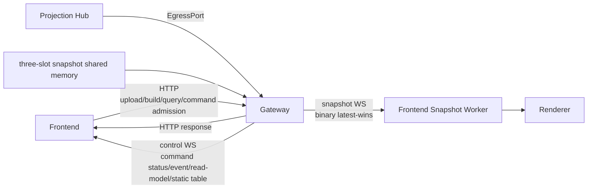
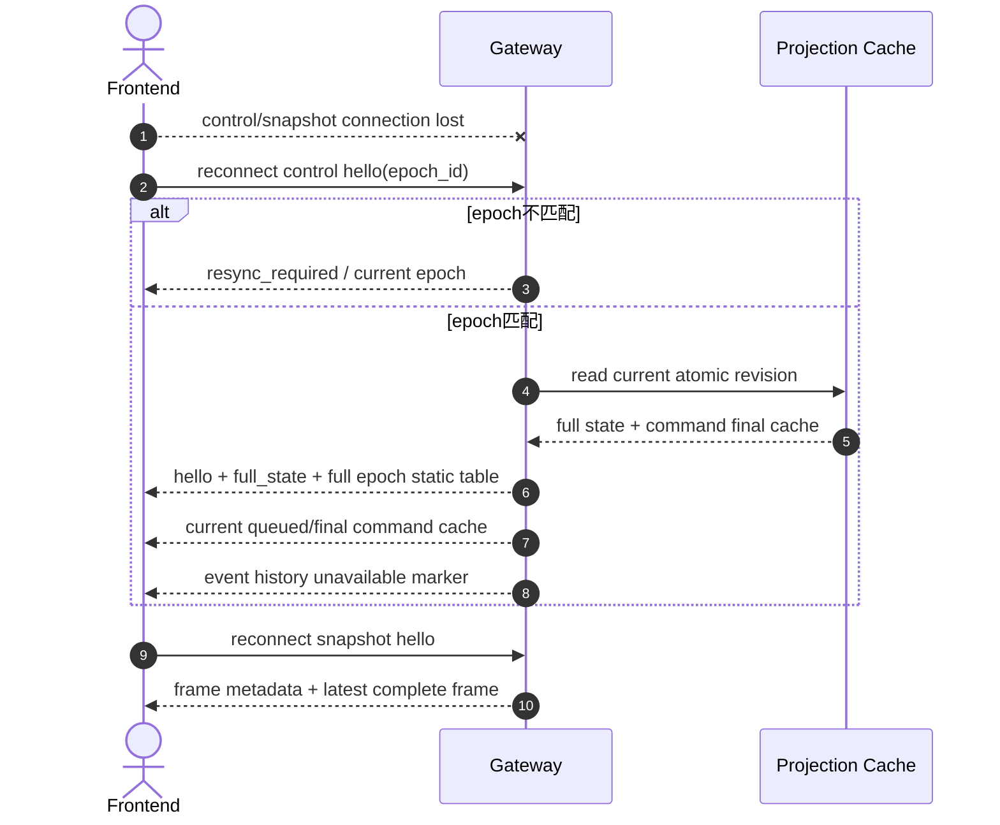
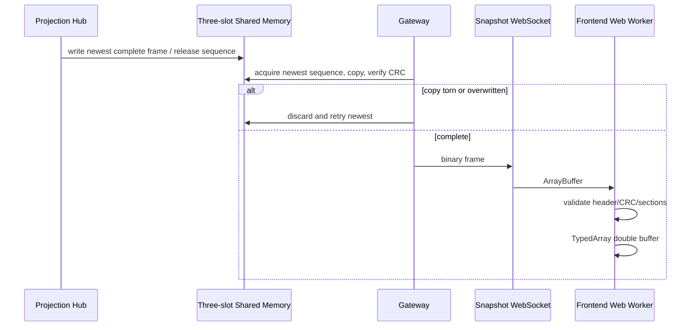
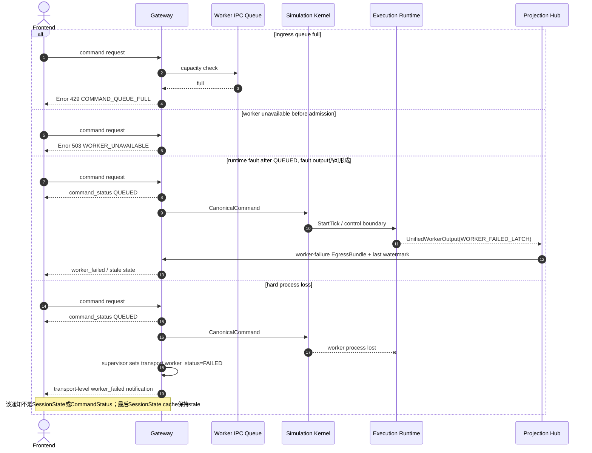

# WebSocket 外部合同

定义 control WS 与 snapshot WS 的 hello、full_state、event、command_status、read_model_delta、static table、重连、heartbeat、resync、可靠控制输出和 latest-wins backpressure。

## 内容来源
- 设计：9.9–9.15
- 设计：8.13
- 设计附录 G.18–G.20

> 本文件是权威输入文档的分层视图。若拆分文本与源文档发生差异，以《LightBlueSky v8.0 统一设计规范》为系统设计与公开合同权威，以《HITL 大阶段切换规范》为当前项目阶段推进与人工验收权威。

## 关联文档

- [ViewerSnapshot](04-viewer-snapshot.md)
- [前端需求](../../frontend/00-requirements.md)

## 规范正文

### 9.9 HTTP、control WS 与 snapshot WS

**图 9-4　HTTP + control WS + snapshot WS图（权威）**



Endpoints：

```text
/ws/v1/scenarios/{scenario_id}/control
/ws/v1/scenarios/{scenario_id}/snapshot
```

### 9.10 control WebSocket

Client hello：

```json
{
  "type": "hello",
  "protocol_version": "1.0.0",
  "epoch_id": "..."
}
```

Server message type：

```text
hello
full_state
snapshot_static_table
event
command_status
read_model_delta
resync_required
heartbeat
worker_failed
protocol_error
```

每条携带`protocol_version`和`epoch_id`；event携带event sequence，其他有序control message使用独立control sequence。Unknown mandatory type或major mismatch断开。

连接建立时Gateway发送：

```text
hello
full_state(current atomic Read Model revision)
snapshot_static_table(full epoch table)
current nonterminal/recent CommandStatus cache
current warning projection
```

不发送断线前event历史。QUEUED CommandStatus可能来自Gateway admission cache；final来自Projection cache。

Heartbeat：server每5 s ping，15 s无响应断开。

### 9.11 Reconnect

**图 9-5　重连 sequence（权威）**



Frontend重连后清空旧连接Events Pane或明确分段显示；不得把新连接event与旧连接误当连续完整历史。

### 9.12 Snapshot binary transport

**图 9-6　Snapshot binary transport sequence（权威）**



Gateway不逐Aircraft创建对象，只验证transport header/length/CRC并转发完整bytes。

### 9.13 Backpressure

#### Command ingress

- queue满：HTTP 429`COMMAND_QUEUE_FULL`；
- 不分配ingress sequence，不创建状态/event；
- Client按Error处理，不得显示QUEUED。

#### Internal authoritative egress

- Projection→Gateway queue 2 s无法写入：worker fail-stop；
- 不允许丢final CommandStatus、event或Read Model revision。

#### Client control WS

- per-connection queue满：Gateway断开慢客户端并记录日志；
- 模拟继续；断线期间event不保存供恢复；
- QUEUED/final CommandStatus可通过HTTP current cache查询。

#### Snapshot WS

- 只保留最新完整frame；
- 旧unsent frame直接替换；
- 不反压物理Tick。

### 9.14 Queue full / worker failure

**图 9-7　queue full / worker failure sequence（权威）**



### 9.15 Protocol version

| 合同 | 第一版 |
|---|---|
| input Schema | `1.0.0` |
| HTTP/OpenAPI | `/api/v1`, contract `1.0.0` |
| Staged Preview | `1.0.0` |
| CanonicalCommand | `1.0.0` |
| event | `1.0.0` |
| control WS | `1.0.0` |
| ViewerSnapshot | `1.0.0` |
| Worker IPC | `1.0.0` |

本次将草案中的64-bit epoch占位字段改为完整128-bit `epoch_id`，并删除辅助事件排序字段、调整event code，发生在首个 `1.0.0` 正式发布前，因此上表仍定义首发 `1.0.0`。不存在需要兼容的已发布旧布局。正式发布后，同major只能增加明确optional字段/消息；改变required字段、枚举意义、binary offset、event code语义或接口方向必须提升major。未知major明确拒绝。


### G.18 control WS hello/full state

#### Client hello

```text
type = hello
protocol_version = 1.0.0
epoch_id
```

#### Server hello

```text
type = hello
protocol_version
epoch_id
session_state
current_control_sequence
source_generation
history_available = false
```

#### full_state

```text
type = full_state
protocol_version
epoch_id
source_generation
source_tick_index
source_t_s
runtime
all_or_paged_task_summary
all_or_paged_resource_summary
environment
warning_projection
command_activity_watermark
```

Large lists可通过HTTP分页。

### G.19 control WS event / command / delta

```text
type = event
event = <D.1 envelope>
```

```text
type = command_status
status = <G.10 receipt or final>
control_sequence
```

```text
type = read_model_delta
epoch_id
source_generation
source_tick_index
source_t_s
task_upserts[] / task_removals[]
aircraft_upserts[]
resource_upserts[]
environment_delta?
runtime_delta?
```

Delta只能从一个previous generation应用；gap必须full resync。

### G.20 Snapshot WS hello

Client：

```text
type = hello
protocol_version = 1.0.0
epoch_id
```

Server先发送JSON metadata：

```text
type = snapshot_hello
protocol_version
epoch_id
viewer_snapshot_contract_version
workspace_origin_ecef_f64[3]
workspace_enu_to_ecef_rotation_f64[9]
latest_sequence
```

随后只发送binary ViewerSnapshot frame。Static table通过control WS完整发送，无generation。


### 8.13 Reliable control output

Projection Hub→Gateway使用bounded reliable Worker IPC：

- FIFO、CRC、protocol major握手；
- authoritative EgressBundle不能丢；
- 2 s内无法写入Gateway queue时fail-stop`RELIABLE_EGRESS_STALLED`；
- Gateway与Frontend control WS连接存在时按序发送final CommandStatus、event和Read Model；
- QUEUED status由Gateway admission立即发送，不经过该IPC往返；
- 慢客户端超过per-connection queue上限时Gateway断开该客户端，模拟可继续；
- 断开后event不保存供恢复；
- CommandStatus仍可从当前epoch command cache查询。
