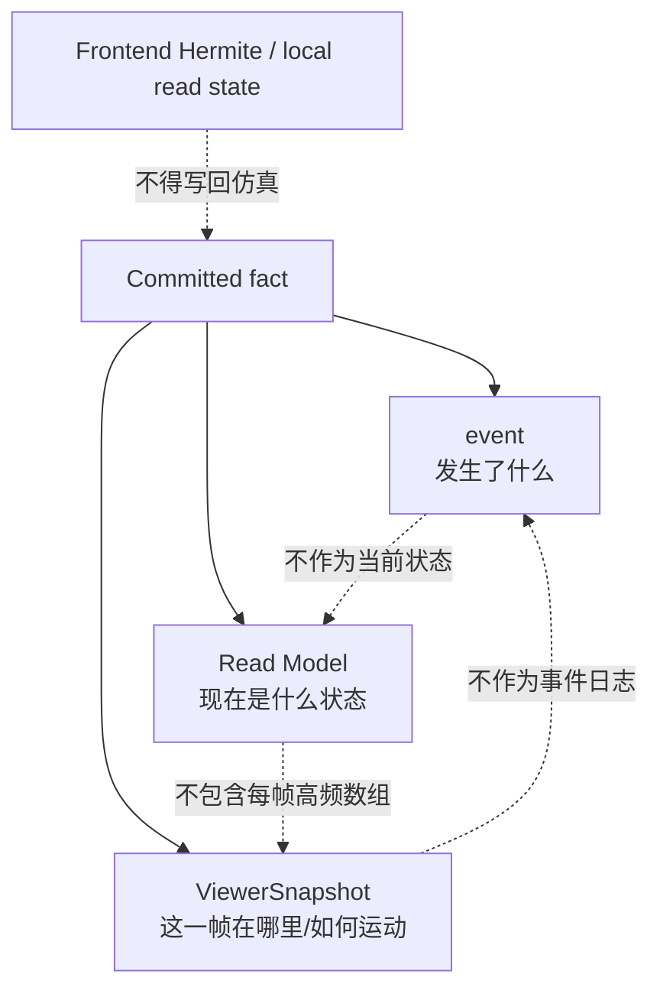

# Read Model 外部合同

集中定义 FreshResponse、RuntimeReadModel、TaskReadModel、AircraftReadModel、ResourceReadModel、EnvironmentReadModel 和 WarningProjection，以及 generation/tick/time freshness 规则。

## 内容来源
- 设计：8.7–8.8
- 设计：4.17、5.24、6.21
- 设计附录 G.11–G.17

> 本文件是权威输入文档的分层视图。若拆分文本与源文档发生差异，以《LightBlueSky v8.0 统一设计规范》为系统设计与公开合同权威，以《HITL 大阶段切换规范》为当前项目阶段推进与人工验收权威。

## 关联文档

- [HTTP API](00-http-api.md)
- [Projection Hub](../../backend/05-projection-hub.md)

## 规范正文

### 8.7 Read Model

Read Model回答“当前公开状态是什么”，由同一generation原子更新。Task、Resource、Environment对象内部不重复携带freshness。

#### 8.7.1 外层 freshness

所有HTTP FreshResponse和control WS Read Model envelope携带：

```text
epoch_id
source_generation
source_tick_index
source_t_s
```

含义：

- `source_generation`：权威提交版本；
- `source_tick_index`：已完成物理Tick数；
- `source_t_s`：当前仿真时间。

三者不恒等。PAUSE、RATE、RESUME、STOP等control commit可以推进`source_generation`而不推进`source_tick_index/source_t_s`。Frontend不得混合不同`source_generation`的关联Task/Resource详情作为同一事实视图。

#### 8.7.2 RuntimeReadModel

```text
scenario_id / epoch_id
session_state
tick_index / t_s / dt_s / time_scale / resume_time_scale
backend_requested / backend_active
worker_status
committed_generation
aircraft_total / active / placed / destroyed
task counts by lifecycle/phase
warning_count / critical_count
canonical_snapshot_sequence / live_published_snapshot_sequence
snapshot_lag_s
```

#### 8.7.3 Task/Aircraft/Resource/Environment

精确字段见附录G；来源必须分别来自三个Module和ExecutionState的committed source，不得在Gateway临时拼接working数据。

### 8.8 event / Read Model / ViewerSnapshot 边界

**图 8-3　event / Read Model / ViewerSnapshot 边界图（权威）**



ViewerSnapshot不包含完整Task/Resource状态；Read Model不复制每帧Aircraft动态TypedArray；event不反复发布持续condition。


### 4.17 Read Model 和 event

#### 4.17.1 TaskReadModel

```text
task_id
aircraft_id
lifecycle
phase?                       # 仅RUNNING时出现
held
delayed                      # Projection根据reservation base/effective window派生
blocking_reason?
flight {
  origin_resource_id
  destination_resource_id
  schedule {
    scheduled_takeoff_s
    scheduled_landing_s?
    planned_arrival_anchor_s
  }
  route_progress {
    completed_occurrences
    total_occurrences
    remaining_route_count     # RouteOccurrenceArena统计的派生只读计数器
    active_occurrence_ref?
    occurrences[] { occurrence_ref, waypoint_id, status }
    tombstoned_occurrence_refs[]
  }
  constraints[]
}
ground_tasks {
  mode
  segments[]
  current_ground_segment_id?
  point_cursor?
  progress_0_1?
  associated_resource_ids[]
}
completion_t_s?
cancelled_reason?
interrupted_reason?
```

新鲜度不嵌入TaskReadModel，统一由外层FreshResponse或control delta envelope携带。

#### 4.17.2 Task event

固定业务event：

```text
task_started
task_phase_changed
task_completed
task_cancelled
task_interrupted
```

发布规则：

1. Task首次进入RUNNING只发布`task_started`，不同时发布`task_phase_changed(NONE->PRE_GROUND)`。
2. `task_completed`、`task_cancelled`、`task_interrupted`是完整终态event，不伴随额外phase变化event。
3. 普通非终态phase变化才发布`task_phase_changed`。
4. Route event为：
   - `route_waypoint_added`
   - `route_waypoint_deleted`
   - `route_replaced`
   - `route_diverted`
   - `route_constraint_set`

Task Module只生成compact candidate；Projection Hub生成公开envelope和sequence。


### 5.24 Resource Read Model 和 event

#### 5.24.1 AircraftReadModel 的资源视角

```text
aircraft_id
profile_id
display_name?
model_type
resource_state
registered                    # derived from row existence
active                        # derived from EXECUTING && placed
placed
destroyed                     # derived from resource_state
current_task_id?
capabilities
compatibility_summary
execution_info? {
  state
  workspace_position
  velocity
}
destroyed_cause_event_id?
```

新鲜度由外层envelope提供。

#### 5.24.2 Facility ResourceReadModel

```text
resource_id
facility_id
resource_kind                 # HANGAR / PAD / RUNWAY_END
label?
availability
capacity
static_capability? {
  supports_departure
  supports_arrival
}
operation_permission? {
  departure_open
  arrival_open
}
owner_task_ids[]              # derived cache
occupying_aircraft_ids[]      # Hangar固定为空
hangar_lanes? {
  lane
  aircraft_id?
}
current_reservations[] {
  reservation_id
  task_id
  operation
  state
  capacity_lane
  base_window
  effective_window
  actual_interval?
  delayed                     # derived
  blocking_reason?
}
next_reservation?
warning_count
```

删除服务端聚合状态标签字段。Frontend从availability、owner、occupancy、permission自行派生标签。

#### 5.24.3 Resource event

Resource event收敛为：

```text
resource_reservation_changed
resource_use_phase_changed
resource_owner_changed
resource_occupancy_changed
resource_availability_changed
```

Payload使用`change_kind/from/to`表达planned/replanned/cancelled/delayed、state推进、owner/occupancy和availability/permission变化。Hangar lane变化不发布occupancy event。


### 6.21 Environment Read Model 和 event

#### 6.21.1 EnvironmentReadModel

```text
frame summary
bounds
map_id / dataset status
workcell count
static obstacle count
building count/index status
airspace zone count
runtime volumes[] {
  volume_id
  volume_kind
  enabled
  active_interval?
  geometry summary
}
airspace_exemptions[] {
  zone_id
  subject_kind
  subject_id
  enabled
  active_interval?
  reason
}
active environment warnings
```

新鲜度统一由外层envelope提供。

#### 6.21.2 Environment event

```text
runtime_volume_added
runtime_volume_removed
runtime_volume_changed
airspace_exemption_changed
airspace_violation
aircraft_world_object_mac
```

`aircraft_world_object_mac`的`collider_kind`区分TERRAIN、BUILDING、OBSTACLE、RESOURCE_SURFACE；Environment与Resource只提供typed candidate，Projection按统一event registry发布。


### G.11 FreshResponse

```text
epoch_id
source_generation
source_tick_index
source_t_s
data
```

WORKER_FAILED stale cache增加：

```text
stale=true
stale_reason=WORKER_FAILED
```

对象内不重复携带freshness。

### G.12 RuntimeReadModel

```text
scenario_id
epoch_id
session_state
tick_index
t_s
dt_s
time_scale
resume_time_scale
backend_requested
backend_active
worker_status
committed_generation
aircraft_total / active / placed / destroyed
task_counts_by_lifecycle
task_counts_by_phase
warning_count / critical_count
canonical_snapshot_sequence
live_published_snapshot_sequence
snapshot_lag_s
```

### G.13 TaskReadModel

```text
task_id
aircraft_id
lifecycle                    # PLANNED/RUNNING/COMPLETED/CANCELLED/INTERRUPTED
phase?                       # RUNNING only
held
delayed                      # derived
blocking_reason?
flight {
  origin_resource_id
  destination_resource_id
  schedule {
    scheduled_takeoff_s
    scheduled_landing_s?
    planned_arrival_anchor_s
  }
  route_progress {
    completed_occurrences
    total_occurrences
    remaining_route_count
    active_occurrence_ref?
    occurrences[] {
      occurrence_ref
      waypoint_id
      status                  # COMPLETED / ACTIVE / FUTURE
    }
    tombstoned_occurrence_refs[]
  }
  constraints[] {
    occurrence_ref
    altitude_constraint_m?
    speed_constraint_mps?
    target_time_s?
    time_window_s?
    current_status?
  }
}
ground_tasks {
  mode
  segments[] {
    ground_segment_id
    phase
    occurrence_count
    scheduled_start_s?
    target_arrival_s?
  }
  current_ground_segment_id?
  ground_occurrence_cursor?
  progress_0_1?
  associated_resource_ids[]
}
completion_t_s?
cancelled_reason?
interrupted_reason?
```

### G.14 AircraftReadModel

```text
aircraft_id
profile_id
display_name?
model_type
resource_state
capabilities
registered                    # derived
active                        # derived
placed
destroyed                     # derived
current_task_id?
execution_state?
workspace_position_enu_m?[3]
workspace_velocity_enu_mps?[3]
H_orthometric_m? or virtual_u?
wgs84_position?
heading_deg?
horizontal_speed_mps?
vertical_speed_mps?
active_leg? {
  from_occurrence_ref
  to_occurrence_ref
  progress_0_1
}
destroyed_cause_event_id?
```

不含selected control、Subphase、integrator、gain或对象内freshness。

### G.15 ResourceReadModel

```text
resource_id
facility_id
resource_kind                # HANGAR / PAD / RUNWAY_END
label?
availability
capacity
static_capability? {
  supports_departure
  supports_arrival
}
operation_permission? {
  departure_open
  arrival_open
}
owner_task_ids[]
occupying_aircraft_ids[]
hangar_lanes? {
  lane
  aircraft_id?
}
current_reservations[] {
  reservation_id
  task_id
  operation
  state
  capacity_lane
  base_window {from_s,until_s}
  effective_window {from_s,until_s}
  actual_interval? {from_s,until_s?}
  delayed
  blocking_reason?
}
next_reservation?
warning_count
```

无服务端聚合状态标签、旧双枚举reservation模型或对象内freshness。

### G.16 EnvironmentReadModel

```text
frame {
  type
  workspace_frame_id
  workcell_count
  origin / bounds summary
}
map {
  map_id
  dataset_status
  terrain_status
  building_count
}
static_obstacle_count
static_airspace_zone_count
runtime_volumes[]
airspace_exemptions[]
active_environment_warnings[]
```

### G.17 Warning projection

```text
episode_id
event_id
event_name
subjects
active
started_tick
started_t_s
closed_tick?
closed_t_s?
severity
```

Server不存ACK。`local_acknowledged`仅在Frontend store。
