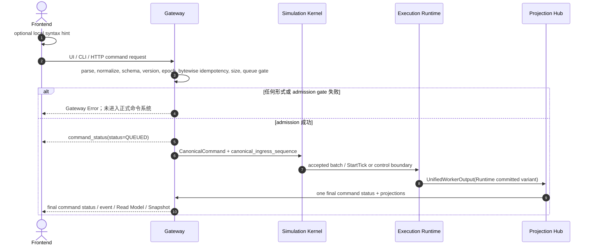
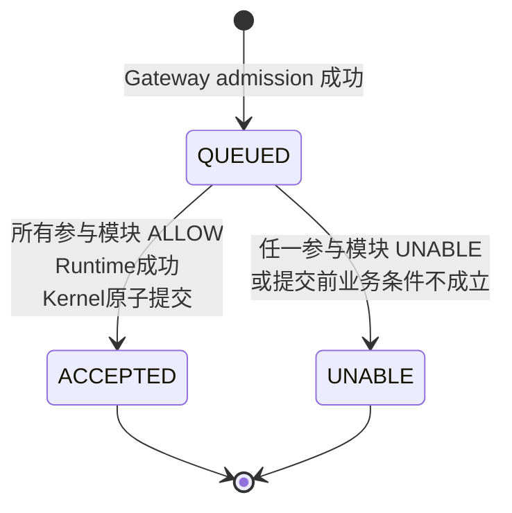

# 命令与 Event 外部合同

定义 CanonicalCommand/CanonicalQuery、CommandReceipt、CommandStatusView、Gateway Error、admission/idempotency、event envelope、Event Registry、Reason Registry、ordering 与失败边界。

## 内容来源
- 设计：3.6–3.9
- 设计：8.5–8.6
- 设计附录 G.7–G.10
- 设计附录 D 全部

> 本文件是权威输入文档的分层视图。若拆分文本与源文档发生差异，以《LightBlueSky v8.0 统一设计规范》为系统设计与公开合同权威，以《HITL 大阶段切换规范》为当前项目阶段推进与人工验收权威。

## 关联文档

- [Command Registry](../../appendices/01-command-registry.md)
- [Event/Reason Registry](../../appendices/02-event-registry.md)

## 规范正文

### 3.6 Gateway 与 Kernel 边界

#### 3.6.1 Frontend 提示性形式校验

Frontend 可以检查：

```text
CLI 可解析性
必填参数是否填写
数字格式
枚举字面量
JSON 基本形状
```

该校验只用于即时提示，不是权威结论；其他 HTTP 客户端可以绕过 Frontend。

#### 3.6.2 Gateway 权威形式校验

Gateway 是外部请求的正式合同边界，负责：

```text
CLI 文本解析
UI/HTTP request 规范化
operation 是否存在
参数 Schema、字段类型、必填字段、字段组合
protocol/contract version
command_id / epoch_id
请求大小
canonical payload bytes
幂等记录直接字节比较
入口队列容量
CanonicalCommand 生成
```

形式或 admission 校验失败统一返回 **Error**。Error 表示请求没有进入正式命令系统，因此：

```text
不进入 Kernel
不分配 canonical_ingress_sequence
不创建 Command 状态记录
不产生 event
不产生 QUEUED
```

典型 Error：

```text
缺少必填参数
数字格式错误
未知 operation
Command Schema 不合法
epoch mismatch
同 command_id 不同 canonical payload bytes
payload 过大
command queue full
worker unavailable
```

#### 3.6.3 CanonicalCommand

```json
{
  "contract_version": "1.0.0",
  "command_id": "018f5ee1-6d47-7d6c-b559-8d59f6d3a042",
  "epoch_id": "018f5ed0-eceb-7b9a-8e5e-acde00000001",
  "operation": "set_selected",
  "args": {
    "aircraft_id": "AC101",
    "spd_mps": 45.0,
    "deg": 90.0,
    "alt_m": 160.0,
    "vs_mps": 2.0
  }
}
```

Gateway admission 后补充内部字段：

```text
operation_code_u16
operation_class_u8
participant_mask_u8
source_u8
canonical_ingress_sequence_u64
accepted_wall_time_utc
canonical_payload_bytes
```

`canonical_payload_bytes` 是规范化后的 CanonicalCommand public payload 的确定性 UTF-8 bytes。命令幂等不计算内容摘要，直接比较保存的 bytes。`source_u8` 只记录来源，不提供优先级。UI、CLI 和直接 HTTP 只要表达同一 operation，就使用同一参数合同、同一 admission gate 和同一 canonical ordering；不得给人工按钮、CLI 或任一客户端隐式插队。

`command_id` 是 UUID string；客户端可以提供，省略时 Gateway 生成 UUIDv7。普通命令 key 为 `(epoch_id,command_id)`：

- 相同 key + 完全相同 `canonical_payload_bytes`：返回原 receipt/当前状态，不重新执行；
- 相同 key + bytes 不同：Gateway Error `COMMAND_ID_REUSE_MISMATCH`；
- key miss：完成所有 admission gate 后才分配 ingress sequence。

RESET 使用进程期幂等索引 `(scenario_id, stopped_epoch_id, command_id)`。Gateway 对 RESET 的顺序固定为：

```text
parse / normalize / canonical payload bytes
-> lookup (scenario_id, request.epoch_id, command_id) before current-epoch comparison
-> matching stored bytes: return original receipt/final/result bytes
-> different stored bytes: Gateway Error COMMAND_ID_REUSE_MISMATCH
-> key miss: require request.epoch_id == current epoch and SessionState == STOPPED
-> allocate ingress sequence, QUEUED, execute RESET
```

成功 result 固定为 `{old_epoch_id,new_epoch_id,state:"READY"}`。该索引只服务 scenario 进程生命周期内的幂等性，不是 event history、持久化或 Replay 存储；Scenario CLOSED 后可以释放。新 epoch 使用新的普通 command table。

#### 3.6.4 Query 边界

`TIME`、`POS`、`SHOW_TASK`、`SHOW_ROUTE`、`LIST_TASKS`、`LIST_WARNINGS`、`VOL SHOW`、`VOL LIST`、`AXLS`、`RSRC` 和 `HELP` 属于 Query operation。它们由 Gateway 规范化为 `CanonicalQuery`，只读 Projection cache：

- 不进入 CommandStatus 状态机；
- 不分配 canonical ingress sequence；
- 不产生 command event；
- 不触发 GPU gather；
- 响应必须携带 freshness。

所有 Mutation 和 Control operation 均使用 `CanonicalCommand`、QUEUED 和最终 CommandStatus。

#### 3.6.5 Gateway admission sequence

**图 3-5　Gateway admission sequence（权威）**



Gateway Error 分支是唯一允许不经过 Kernel 和 Projection Hub 直接返回 Frontend 的分支。QUEUED 是 Gateway control message，不是 event，不分配 event sequence。命令一旦 QUEUED，最终 ACCEPTED/UNABLE 只能来自已提交输出，经 Projection Hub 和 Gateway 发布。

### 3.7 CommandStatus 与 DomainDecision

#### 3.7.1 CommandStatus

第一版只允许：

```text
QUEUED
ACCEPTED
UNABLE
```

**图 3-6　CommandStatus 状态机（权威）**



Gateway Error 不属于该状态机。QUEUED 由 Gateway 作为 `command_status` control message立即发送，不是 event；Projection Hub 只投影最终 ACCEPTED/UNABLE 及其 command event。

#### 3.7.2 DomainDecision

Task、Resource、Environment 只允许返回：

```text
ALLOW
UNABLE
```

ALLOW 表示该模块允许命令进入后续计算，并能提供 Candidate Delta 或 Runtime View。UNABLE 表示命令已正式进入系统，但不能提交。UNABLE 必须携带注册的 `reason_code` 和结构化 diagnostics。

典型 reason：

```text
ID_NOT_FOUND
TASK_TERMINAL
INVALID_TASK_PHASE
RESOURCE_NOT_FOUND
RESOURCE_OCCUPIED
RESOURCE_CLOSED
RESOURCE_BLOCKED
CAPABILITY_UNSUPPORTED
RESERVATION_CONFLICT
ROUTE_NOT_COMPLETE
GEOMETRY_INVALID
ROUTE_CONTEXT_INVALID
```

UNABLE 可以表示永久不可执行、当前条件不可执行、修改输入后可重试或等待状态变化后可重试；性质由 reason 和 diagnostics 表达，不增加状态枚举。

#### 3.7.3 系统故障

以下不得包装为业务 UNABLE：

```text
数组越界
运行时不变量破坏
内部协议损坏
CUDA runtime failure
worker crash
无法提交 authoritative output
candidate buffer authoritative overflow
```

这类问题进入 WORKER_FAILED/fail-stop。若last committed arrays仍可读，Execution Runtime只可按附录F.12生成`WORKER_FAILED_LATCH` fault repeat，经Projection Hub/Gateway通知Frontend；该buffer不得生成受影响命令的ACCEPTED/UNABLE。若无法形成该buffer，Gateway supervisor只发送transport-level failure notification，不伪造CommandStatus。

### 3.8 Operation Registry 与参与模块路由

每个 operation registry row 必须声明：

```text
operation_code_u16
canonical_name
primary_cli_spelling
operation_class             # MUTATION / CONTROL / QUERY
allowed_session_states
allowed_task/aircraft phases
participant_mask            # TASK / RESOURCE / ENVIRONMENT
orchestration_mode          # SINGLE / PARALLEL_TR / SEQUENTIAL_TR
argument_schema
result_schema
reason_allowlist
```

Kernel 严格按 registry 路由：

- Task-only：HOLD_TASK、REL_TASK、SEL、DCT、JNL、RTE、AT；
- Resource-only：RSRC SET；
- Environment-only：VOL ADD/RM/SET、AX SET；
- Task+Resource 并行：TKF、TAXI、CXL_TASK、LND；
- Task+Resource 顺序：ADD_TASK、SLOT、CHGRES、CHGAC、DIVERT、RSRCUSE END；
- Control：START、PAUSE、RESUME、RATE、STOP、RESET；
- Query 不进入 Kernel。

`ADD_TASK`、`TKF`、`TAXI`、`LND`、`DIVERT` 不再包含 Environment participant。EnvironmentExecutionView 仍长期驻留 Runtime，并在后续完整物理 Tick 中参与环境查询和碰撞。

T/R 并行 operation在同一轮分发两个 batch并等待两边决定。T/R 顺序 operation固定为：

```text
Kernel -> Task
Task -> Kernel:
  TaskCandidateHandle
  operation-specific ResourceRequirement

Kernel -> Resource:
  ResourceRequirement + TransactionBindingSlot
Resource -> Kernel:
  ResourceCandidateHandle
  operation-specific ResourceGrant
```

不建立 Task→Resource 直接接口，不进行第三次 Task 业务判定。Kernel 只绑定 handles、合成 accepted mask并执行 Commit/Abort，不实现领域规则。实现必须使用批量 Intent/Decision arrays，禁止逐命令 JSON 序列化、逐命令 IPC 或逐命令 CUDA synchronize。

### 3.9 命令排序与 shadow transaction

Kernel 维护全部 admitted pending command。每个 control/physics boundary先确定满足时间门禁的 eligible set，再按 `canonical_ingress_sequence` 严格递增处理；尚未满足门禁的命令保持 QUEUED，但不得造成 head-of-line blocking。前一条最终 ALLOW 的 Candidate Delta 对同一 boundary 后一条的 shadow preflight可见；前一条 UNABLE 的 Candidate Delta不可见。

普通 Mutation 的时间门禁通常为下一个物理 Tick。早于 `scheduled_takeoff_s` admission 的 `TKF` 保留原 ingress sequence，在第一个 `t_s >= scheduled_takeoff_s` 的物理 boundary才进入当前条件判定。STOP 按第 3.14 节将仍未 eligible/apply 的命令结束为 `SESSION_STOPPED_BEFORE_APPLY`。

每条命令分配：

```text
transaction_slot_u32
TransactionBindingSlot
```

Candidate Delta 写入隔离的预分配区域。流程：

```text
registry lookup
-> ordered shadow state
-> batch participant decision
-> for sequential T/R: bind Task candidate/requirement to Resource candidate/grant
-> accepted transaction mask
-> compose accepted deltas in ingress order
-> one complete physics Tick
-> module ApplyExecutionResultBatch
-> atomic generation commit
```

Execution Runtime 不参与业务 preflight，也不产生逐命令业务判定结果。失败命令不得消费 stable ID、route/ground occurrence serial、reservation row、capacity lane、Arena count 或 generation。


### 8.5 Command status projection

#### 8.5.1 QUEUED

Gateway admission成功后立即：

```text
return CommandReceipt(status=QUEUED)
send control message type=command_status, status=QUEUED
store current-epoch Gateway command cache row
```

QUEUED不是event，不分配event sequence，不进入event registry，不由Projection Hub重复发布。

#### 8.5.2 Final status

每个正式命令只能有一个final：

```text
ACCEPTED
UNABLE
```

Projection Hub验证同一`command_id`：

- 恰好一个final row；
- final不会回到QUEUED；
- final reason符合operation reason allowlist；
- final`canonical_ingress_sequence`与Gateway admission record一致；
- failed Mutation除`command_unable`外不得产生领域业务event。

Projection Hub生成`command_accepted`或`command_unable`event。Gateway以final更新已有QUEUED cache row。

### 8.6 event 合同边界

event回答“已提交了什么事实”。它不是当前状态存储，也不用于重建服务器历史。

Envelope核心字段：

```text
event_id
epoch_id
sequence
tick_index
t_s
event_name
severity
task_id?
aircraft_id?
other_aircraft_id?
resource_id?
reservation_id?
waypoint_id?
building_id?
obstacle_id?
volume_id?
zone_id?
command_id?
reason_code?
message?
payload
contract_version
```

`event_name`是唯一公开事件判别字段，不再提供独立类型字段。`severity`是发布时的权威字段；registry default只在producer未显式指定时使用。

`event_id`固定为：

```text
<epoch_id>:<sequence decimal>
```

Sequence在epoch内从1开始单调增加；control generation可以与前一物理Tick共享`tick_index/t_s`，但event sequence仍严格增加。QUEUED control message不占用event sequence。

subject ID统一放envelope顶层。payload只包含事件独有字段；多主体使用`other_aircraft_id`等显式顶层字段。无关optional字段必须省略，不输出null占位。

Command event只允许：

```text
command_accepted
command_unable
```

Task event：

```text
task_started
task_phase_changed
task_completed
task_cancelled
task_interrupted
```

Task首次RUNNING只发布`task_started`；三个terminal event不伴随phase event。

Resource event：

```text
resource_reservation_changed
resource_use_phase_changed
resource_owner_changed
resource_occupancy_changed
resource_availability_changed
```

Safety event：

```text
aircraft_aircraft_nmac
aircraft_aircraft_mac
aircraft_world_object_mac
airspace_violation
aircraft_destroyed_by_aircraft_mac
aircraft_destroyed_by_world_object_mac
```

其他核心event包括Aircraft phase、route、VOL/AX和realtime_overrun。精确registry见附录D。

#### 8.6.1 实时连接限制

第一版event只在实时control连接中输出：

```text
Execution Runtime -> Projection Hub -> Gateway -> Frontend
```

- Frontend Events Pane只显示当前连接期间收到的event；
- 页面刷新、浏览器关闭或重连后不保证恢复历史event；
- Gateway不提供event历史分页或ACK写回；
- Frontend可以在当前连接内维护本地已读状态；
- event sequence gap在重连后合法，Frontend必须显示“history unavailable”。

Gateway current command/warning cache不是通用event history store。


### G.7 CanonicalCommand

```text
contract_version
command_id
epoch_id
operation
args
```

Gateway内部保存RFC 8785 canonical UTF-8 bytes并直接用于幂等比较，不计算payload摘要。

### G.8 CanonicalQuery

```text
contract_version
epoch_id
operation
args
```

Query不要求command_id，不产生CommandStatus/event。

### G.9 Gateway Error

```text
error {
  code
  message
  details
}
```

Details strict per code，不得返回stack trace、secret path、token或raw internal exception。

### G.10 CommandReceipt / CommandStatusView

Receipt：

```text
command_id
epoch_id
canonical_ingress_sequence
status = QUEUED
operation
```

Gateway通过HTTP response和control WS`command_status`发送Receipt。QUEUED不是event。

Final：

```text
command_id
epoch_id
canonical_ingress_sequence
status                      # ACCEPTED / UNABLE
operation
final_generation
final_tick_index
final_t_s
reason_code
message
result
```

普通命令相同key重试直接比较canonical payload bytes。RESET专用索引同样保存并比较原bytes。


## 附录 D：event Registry 与 Reason Registry

### D.1 event envelope

Strict public envelope：

```json
{
  "event_id": "018f...:1201",
  "epoch_id": "018f...",
  "sequence": 1201,
  "tick_index": 600,
  "t_s": 60.0,
  "event_name": "aircraft_navigation_started",
  "severity": "info",
  "contract_version": "1.0.0",
  "task_id": "TASK001",
  "aircraft_id": "AC101",
  "reason_code": "NONE",
  "message": "Aircraft AC101 entered NAV.",
  "payload": {
    "from_state": "TAKEOFF",
    "to_state": "NAV"
  }
}
```

Required：

```text
event_id epoch_id sequence tick_index t_s
event_name severity contract_version payload
```

Optional association：

```text
task_id aircraft_id other_aircraft_id resource_id reservation_id
waypoint_id building_id obstacle_id volume_id zone_id command_id reason_code message
```

无关字段必须省略，不输出null占位；不提供独立事件类型字段。Subject ID只放envelope顶层；payload只放事件独有字段。`severity`是发布事实，default severity只是producer缺省值。

### D.2 Registry row

```text
event_code_u16
symbol
event_name
producer
ordering_class
default_severity
payload_schema
contract_version
dedup_key
```

`ordering_class` 必须引用第 7.28 节唯一权威表。`event_code` 全局唯一，并在同一 ordering class 内承担业务因果顺序：可能同时出现且必然先发生的 event 必须使用更小 code。新增 event 必须插入正确位置；若已正式发布 code 之间没有可用位置且不能保持既有语义，必须提升 event contract major version。不同 ordering class 之间的 code 数值没有排序含义，主顺序始终由 `ordering_class` 决定。第一版正式发布前可以按本文重生成 active code；只有正式发布过的 code 建立不可复用保护。

### D.3 Public event Registry

#### D.3.1 Command final status

| Code | Class | event_name | Default severity | Payload |
|---:|---:|---|---|---|
| `0x1001` | 10 | `command_accepted` | info | `command_status.v1` |
| `0x1002` | 10 | `command_unable` | error | `command_status.v1` |

QUEUED不对应event。

#### D.3.2 Runtime status

| Code | Class | event_name | Default severity | Payload |
|---:|---:|---|---|---|
| `0x1101` | 20 | `runtime_ready` | info | `runtime_status.v1` |
| `0x1102` | 20 | `runtime_started` | info | `runtime_status.v1` |
| `0x1103` | 20 | `runtime_paused` | info | `runtime_status.v1` |
| `0x1104` | 20 | `runtime_resumed` | info | `runtime_status.v1` |
| `0x1105` | 20 | `runtime_stopped` | info | `runtime_status.v1` |
| `0x1106` | 20 | `runtime_time_scale_changed` | info | `runtime_status.v1` |

#### D.3.3 Runtime volume

| Code | Class | event_name | Default severity | Payload |
|---:|---:|---|---|---|
| `0x1201` | 20 | `runtime_volume_added` | info | `volume_change.v1` |
| `0x1202` | 20 | `runtime_volume_removed` | info | `volume_change.v1` |
| `0x1203` | 20 | `runtime_volume_changed` | info | `volume_change.v1` |

#### D.3.4 Aircraft execution phase

| Code | Class | event_name | Default severity | Payload |
|---:|---:|---|---|---|
| `0x1301` | 30 | `aircraft_takeoff_started` | info | `aircraft_phase.v1` |
| `0x1302` | 30 | `aircraft_navigation_started` | info | `aircraft_phase.v1` |
| `0x1303` | 30 | `aircraft_landing_started` | info | `aircraft_phase.v1` |

#### D.3.5 Safety and airspace

| Code | Class | event_name | Default severity | Payload |
|---:|---:|---|---|---|
| `0x1401` | 40 | `aircraft_aircraft_nmac` | warning | `collision.v1` |
| `0x1402` | 40 | `aircraft_aircraft_mac` | critical | `collision.v1` |
| `0x1403` | 40 | `aircraft_world_object_mac` | critical | `collision.v1` |
| `0x1404` | 40 | `airspace_violation` | critical | `airspace_violation.v1` |

#### D.3.6 Airspace exemption

| Code | Class | event_name | Default severity | Payload |
|---:|---:|---|---|---|
| `0x1501` | 20 | `airspace_exemption_changed` | info | `exemption_change.v1` |

#### D.3.7 Resource

| Code | Class | event_name | Default severity | Payload |
|---:|---:|---|---|---|
| `0x1601` | 60 | `resource_reservation_changed` | info | `resource_change.v1` |
| `0x1602` | 60 | `resource_use_phase_changed` | info | `resource_change.v1` |
| `0x1603` | 60 | `resource_owner_changed` | info | `resource_change.v1` |
| `0x1604` | 60 | `resource_occupancy_changed` | info | `resource_change.v1` |
| `0x1605` | 60 | `resource_availability_changed` | info | `resource_change.v1` |

Producer可以按具体事实将severity提升为warning/critical。Class 60 的 code 顺序直接编码以下可能同时出现的业务链：reservation定义/取消、ReservationState变化、owner变化、occupancy变化、availability变化。

#### D.3.8 Route

| Code | Class | event_name | Default severity | Payload |
|---:|---:|---|---|---|
| `0x1701` | 30 | `route_waypoint_added` | info | `route.v1` |
| `0x1702` | 30 | `route_waypoint_deleted` | info | `route.v1` |
| `0x1703` | 30 | `route_replaced` | info | `route.v1` |
| `0x1704` | 30 | `route_diverted` | info | `route.v1` |
| `0x1705` | 30 | `route_constraint_set` | info | `route.v1` |

#### D.3.9 Task（非 fatal）

| Code | Class | event_name | Default severity | Payload |
|---:|---:|---|---|---|
| `0x1801` | 30 | `task_started` | info | `task_status.v1` |
| `0x1802` | 30 | `task_phase_changed` | info | `task_status.v1` |
| `0x1803` | 30 | `task_completed` | info | `task_status.v1` |
| `0x1804` | 30 | `task_cancelled` | info | `task_status.v1` |

`task_started`不伴随首次phase event；terminal event不伴随phase event。`task_interrupted`属于fatal class 50，见D.3.10。

#### D.3.10 Constraint / performance / fatal consequence

| Code | Class | event_name | Default severity | Payload |
|---:|---:|---|---|---|
| `0x1901` | 30 | `route_altitude_constraint_missed` | warning | `constraint_missed.v1` |
| `0x1902` | 30 | `route_speed_constraint_missed` | warning | `constraint_missed.v1` |
| `0x1903` | 30 | `route_time_constraint_missed` | warning | `constraint_missed.v1` |
| `0x1904` | 70 | `realtime_overrun` | warning | `overrun.v1` |
| `0x1A01` | 50 | `aircraft_destroyed_by_aircraft_mac` | critical | `aircraft_destroyed.v1` |
| `0x1A02` | 50 | `aircraft_destroyed_by_world_object_mac` | critical | `aircraft_destroyed.v1` |
| `0x1A10` | 50 | `task_interrupted` | critical | `task_status.v1` |

Class 50 的 code 保留 destroyed 与 interrupted 之间的插入空间，但未分配的数值不是 event，不得生成。`0x1A01/0x1A02 < 0x1A10` 直接保证同一事故中 Aircraft destruction 排在 Task interruption 前。

#### D.3.11 Ordering-class audit

- class 10：两个final结果互斥。
- class 20：同一mutation只产生一个对应事实；无跨对象必然因果对。
- class 30：首次与terminal抑制规则消除重复过渡；其他可能同时出现的事实无强制producer先后，按code稳定排序。
- class 40：`0x1401` NMAC先于`0x1402/0x1403` MAC；`0x1404` airspace violation独立。
- class 50：`0x1A01/0x1A02` destroyed先于`0x1A10` interrupted。
- class 60：`0x1601..0x1605`符合reservation/state/owner/occupancy/availability因果链。
- class 70：当前只有`0x1904`。

### D.4 Payload schemas

#### `command_status.v1`

Required：

```text
operation
status                    # ACCEPTED / UNABLE
canonical_ingress_sequence
final_generation
final_tick_index
```

Optional：

```text
args_summary
result
```

#### `runtime_status.v1`

```text
from_state
to_state
old_time_scale?
new_time_scale?
stop_reason?
old_epoch_id?
new_epoch_id?
```

#### `volume_change.v1`

```text
change_kind               # ADDED / REMOVED / ENABLED / DISABLED / UPDATED
volume_kind               # RESTRICTED_AIRSPACE / OBSTACLE
active_from_s?
active_until_s?
```

`volume_id`在envelope顶层。

#### `aircraft_phase.v1`

```text
from_state
to_state
```

只允许public AircraftExecutionState。

#### `collision.v1`

Required：

```text
condition_kind            # NMAC / AIRCRAFT_MAC / WORLD_OBJECT_MAC
```

Optional：

```text
episode_id
collider_kind             # TERRAIN / BUILDING / OBSTACLE / RESOURCE_SURFACE
contact_workspace_enu_m[3]
relative_speed_mps
min_horizontal_m
min_vertical_m
contact_t_within_tick_s
contact_failure_reason
```

`aircraft_id`、`other_aircraft_id`、`resource_id`、`building_id`和`obstacle_id`等关联ID放envelope顶层。

#### `airspace_violation.v1`

```text
episode_id
position_workspace_enu_m[3]
matched_rule_id?
height_value_m?
vertical_reference?
```

`zone_id`和`aircraft_id`在envelope顶层。

#### `exemption_change.v1`

```text
change_kind               # GRANTED / UPDATED / DISABLED
subject_kind              # AIRCRAFT / TASK
enabled
active_from_s?
active_until_s?
exemption_reason?
```

`zone_id`以及subject对应的`aircraft_id`或`task_id`在envelope顶层。

#### `resource_change.v1`

```text
change_kind
from?
to?
operation?
capacity_lane?
base_window?
effective_window?
actual_interval?
delay_s?
owner_task_ids?
occupying_aircraft_ids?
departure_open?
arrival_open?
blocking_reason?
cause_event_id?
```

`resource_id`、`reservation_id`与主`task_id/aircraft_id`在envelope顶层。`from/to`对reservation state使用`PLANNED/PREPARE/IN_PROGRESS/OCCUPIED/RECOVERY/CONSUMED/CANCELLED`。

#### `route.v1`

```text
mutation_kind
new_occurrence_ref?
before_occurrence_ref?
after_occurrence_ref?
deleted_occurrence_refs[]?
tombstoned_occurrence_refs[]?
remaining_occurrence_refs[]?
remaining_route_count
constraint?
```

`task_id`与`waypoint_id`在envelope顶层。

#### `task_status.v1`

```text
from_lifecycle?
to_lifecycle?
from_phase?
to_phase?
completion_t_s?
interruption_cause_event_id?
```

`task_id`在envelope顶层。Terminal payload不要求phase transition字段。

#### `constraint_missed.v1`

```text
occurrence_ref
constraint_kind
target_value
actual_value
window_from_s?
window_until_s?
```

`task_id`与`waypoint_id`在envelope顶层。

#### `overrun.v1`

```text
backlog_ticks
wall_lag_s
time_scale
tick_wall_time_ms?
```

#### `aircraft_destroyed.v1`

```text
cause_event_id
cancelled_future_task_ids[]
cancelled_reservation_ids[]
collider_kind?
```

`aircraft_id`、`other_aircraft_id`、当前`task_id`以及相关`resource_id/building_id/obstacle_id`在envelope顶层。ID arrays即使为空也显式输出，并按canonical integer ID对应string ID升序。

### D.5 Condition close 与 fatal-chain ordering

NMAC和airspace episode退出只写internal episode store close metadata，不发布public exit event。Frontend current warning view通过Read Model投影active/closed状态。

Fatal chain不使用额外事件排序字段。Event Sequencer只按第7.28节的key排序；D.3中的class/code必须得到：

```text
0x1402 / 0x1403 MAC (class 40)
-> 0x1A01 / 0x1A02 Aircraft destroyed (class 50)
-> 0x1A10 task_interrupted (class 50)
-> 0x1601..0x1605 Resource consequence (class 60)
```

Registry loader必须验证第7.28节与D.3.11明确列出的同class causal pair均满足`predecessor.event_code < successor.event_code`；违反时codegen和CI失败。

### D.6 Reason Registry

Public使用symbol string，compact protocol使用u16。任何public failure不得返回UNKNOWN reason。

#### D.6.1 Success/no-op

| Code | Symbol | Default semantics |
|---:|---|---|
| `0x0000` | `NONE` | 无附加原因。 |
| `0x0001` | `ALREADY_IN_STATE` | 目标已在请求状态，幂等成功。 |
| `0x0002` | `ALREADY_ABSENT` | 待删除/禁用对象不存在，幂等成功。 |
| `0x0003` | `NO_CHANGE` | 规范化后没有变化。 |

#### D.6.2 Gateway / Schema / Document

| Code | Symbol | Default semantics |
|---:|---|---|
| `0x0101` | `INVALID_JSON` | JSON无法解析。 |
| `0x0102` | `DUPLICATE_JSON_KEY` | Object出现重复key。 |
| `0x0103` | `SCHEMA_VERSION_UNSUPPORTED` | Schema major/version不支持。 |
| `0x0104` | `SCHEMA_REQUIRED_FIELD` | 缺少必填字段。 |
| `0x0105` | `SCHEMA_UNKNOWN_FIELD` | Strict object出现unknown field。 |
| `0x0106` | `INVALID_ARGUMENT` | 参数值或组合非法。 |
| `0x0107` | `MISSING_ARGUMENT` | CLI/Command缺少参数。 |
| `0x0108` | `INVALID_NUMBER` | 非finite、范围或单位错误。 |
| `0x0109` | `DOCUMENT_LIMIT_EXCEEDED` | 超过安全上限。 |
| `0x010A` | `PATH_NOT_ALLOWED` | Path不在许可root或逃逸。 |
| `0x010B` | `DOCUMENT_NOT_VALID` | 当前slot仍有validation error。 |
| `0x010C` | `PAYLOAD_TOO_LARGE` | 请求超过大小上限。 |
| `0x010D` | `UNKNOWN_OPERATION` | Operation/CLI spelling不存在。 |
| `0x010E` | `PROTOCOL_VERSION_UNSUPPORTED` | Public contract/protocol version不支持。 |

#### D.6.3 Identity / Revision

| Code | Symbol | Default semantics |
|---:|---|---|
| `0x0201` | `ID_NOT_FOUND` | 引用ID不存在。 |
| `0x0202` | `ID_DUPLICATE` | Namespace内重复。 |
| `0x0203` | `WAYPOINT_IDENTITY_CONFLICT` | 同waypoint ID的位置/radius不一致。 |
| `0x0204` | `COMMAND_ID_REUSE_MISMATCH` | 同command ID的canonical payload bytes不同。 |
| `0x0205` | `EPOCH_MISMATCH` | Command/connection epoch不匹配。 |
| `0x0206` | `OCCURRENCE_REQUIRED` | 多个waypoint候选，必须显式@serial。 |
| `0x0207` | `REVISION_MISMATCH` | Confirm绑定slot revision变化。 |
| `0x0208` | `PREVIEW_REVISION_CHANGED` | Preview expected revision已过期。 |

#### D.6.4 State / Phase

| Code | Symbol | Default semantics |
|---:|---|---|
| `0x0301` | `INVALID_SESSION_STATE` | Session state不接受操作。 |
| `0x0302` | `INVALID_AIRCRAFT_PHASE` | AircraftExecutionState不接受操作。 |
| `0x0303` | `INVALID_TASK_PHASE` | TaskPhase不接受操作。 |
| `0x0304` | `TASK_ALREADY_STARTED` | 只允许Task开始前的mutation。 |
| `0x0305` | `TASK_TERMINAL` | Task已terminal。 |
| `0x0306` | `RESERVATION_PHASE_COMPLETED` | 目标reservation阶段已完成。 |
| `0x0307` | `SESSION_STOPPED_BEFORE_APPLY` | Command已排队但STOP前未apply。 |
| `0x0308` | `RUNTIME_ALREADY_BUILT` | 已创建epoch，不能修改staged documents。 |
| `0x0309` | `TASK_DEPENDENCY_UNSATISFIED` | Task dependency未满足。 |
| `0x030A` | `TASK_HELD` | Task处于hold。 |
| `0x030B` | `ROUTE_NOT_COMPLETE` | LND前仍有remaining occurrence。 |

#### D.6.5 Capability / Geometry / FlightCore

| Code | Symbol | Default semantics |
|---:|---|---|
| `0x0401` | `CAPABILITY_UNSUPPORTED` | Model/mode无能力。 |
| `0x0402` | `ENVELOPE_EXCEEDED` | 目标超active envelope。 |
| `0x0403` | `ROUTE_CONTEXT_INVALID` | Active route/occurrence不允许操作。 |
| `0x0404` | `JNL_GEOMETRY_UNREACHABLE` | 当前包线无法连续汇入。 |
| `0x0405` | `TAKEOFF_GATED` | Schedule/release/position/resource gate未满足。 |
| `0x0406` | `GEOMETRY_INVALID` | Candidate geometry不合法。 |
| `0x0407` | `OUTSIDE_AUTHORIZED_SUPPORT_AREA` | 实际接触不在合法支撑面。 |

#### D.6.6 Resource / Task schedule

| Code | Symbol | Default semantics |
|---:|---|---|
| `0x0501` | `RESOURCE_NOT_FOUND` | Resource ID不存在。 |
| `0x0502` | `RESOURCE_CLOSED` | Resource或parent Facility普通关闭。 |
| `0x0503` | `RESOURCE_BLOCKED` | Resource事故锁存。 |
| `0x0504` | `RESOURCE_OCCUPIED` | Active reservation/physical occupancy不允许操作。 |
| `0x0505` | `RESOURCE_CAPACITY_EXCEEDED` | owner/occupant/lane超过capacity。 |
| `0x0506` | `RESOURCE_INCOMPATIBLE` | Aircraft与Resource不兼容。 |
| `0x0507` | `RESERVATION_CONFLICT` | Candidate interval与accepted计划冲突。 |
| `0x0508` | `CHRONOLOGY_INVALID` | Task/Aircraft accepted window非正向。 |
| `0x0509` | `AIRCRAFT_SCHEDULE_OVERLAP` | 同Aircraft Task window重叠。 |
| `0x050A` | `GROUND_PLAN_INVALID` | 显式/输入Ground Plan结构非法。 |
| `0x050B` | `GROUND_AUTO_UNRESOLVED` | 系统无法自动生成完整可执行Ground Plan。 |
| `0x050C` | `AIRCRAFT_NOT_AVAILABLE` | AircraftResourceState不可分配。 |
| `0x050D` | `OPERATION_DISABLED` | Runway End operation permission关闭或静态不支持。 |
| `0x050E` | `RESOURCE_NOT_PREPARED` | 实际接触时reservation/PREPARE gate未完成。 |
| `0x050F` | `RESOURCE_OWNER_MISMATCH` | 实际接触时owner Task不匹配。 |

#### D.6.7 Capacity / Queue / Output

| Code | Symbol | Default semantics |
|---:|---|---|
| `0x0601` | `CAPACITY_EXCEEDED` | 预声明业务Arena capacity不足。 |
| `0x0602` | `COMMAND_QUEUE_FULL` | Ingress backpressure。 |
| `0x0603` | `RELIABLE_EGRESS_STALLED` | Authoritative egress无法安全排队。 |
| `0x0604` | `SNAPSHOT_SLOT_TOO_SMALL` | Slot无法容纳最大完整frame。 |
| `0x0605` | `SEQUENCE_EXHAUSTED` | Sequence达到允许上限。 |
| `0x0606` | `AUTHORITATIVE_CANDIDATE_OVERFLOW` | Runtime required candidate/result buffer overflow。 |
| `0x0607` | `WORKER_UNAVAILABLE` | Gateway admission时worker不可用。 |

#### D.6.8 Backend / Protocol / Dataset / Invariant

| Code | Symbol | Default semantics |
|---:|---|---|
| `0x0701` | `CUDA_UNAVAILABLE` | CUDA初始化不可用。 |
| `0x0702` | `CUDA_RUNTIME_FAILURE` | CUDA production run失败。 |
| `0x0703` | `WORKER_FAILED` | Worker退出或失联。 |
| `0x0704` | `PROTOCOL_INCOMPATIBLE` | IPC/WS/Binary major不兼容。 |
| `0x0705` | `CRC_MISMATCH` | 跨进程/message/frame损坏。 |
| `0x0706` | `DATASET_MISSING` | 必要map/asset不可读。 |
| `0x0707` | `GEOID_MISSING` | 必要geoid数据不可用。 |
| `0x0708` | `DATASET_INVALID` | Manifest/file set/bytes/release/license guard不一致。 |
| `0x0709` | `BACKEND_UNAVAILABLE` | 请求Backend或AUTO全部候选失败。 |
| `0x070A` | `INTERNAL_INVARIANT_BROKEN` | Runtime内部不变量破坏。 |
| `0x070B` | `ARRAY_BOUNDS_VIOLATION` | Internal array bounds violation。 |

#### D.6.9 Scheduling / Diagnostics

| Code | Symbol | Default semantics |
|---:|---|---|
| `0x0801` | `EARLY_OPERATION_NOT_ALLOWED` | Operation不允许time-gated pending却要求提前生效。 |
| `0x0802` | `MAXIMUM_TIME_DRAINED` | Nominal horizon后工作已排空。 |
| `0x0803` | `OUTPUT_DEGRADED` | 非权威display transport跳帧。 |
| `0x0804` | `ARRIVAL_TIME_DERIVED` | Landing time省略，使用派生anchor。 |
| `0x0805` | `BUILD_VALIDATION_FAILED` | Build candidate存在错误。 |

### D.7 Reason使用边界

- Gateway Error使用schema/identity/admission类别；
- Build error可以使用validation/dataset/geometry/capacity code；
- Command UNABLE使用operation allowlist，不使用system fault code；
- System fault使用0x06/0x07类别并进入WORKER_FAILED；
- world-object MAC payload可使用`RESOURCE_NOT_PREPARED`、`RESOURCE_OWNER_MISMATCH`、`RESOURCE_CLOSED`、`RESOURCE_BLOCKED`、`OPERATION_DISABLED`、`OUTSIDE_AUTHORIZED_SUPPORT_AREA`作为contact failure reason；
- Warning使用`ARRIVAL_TIME_DERIVED`等，不改变CommandStatus。
