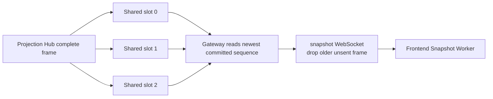
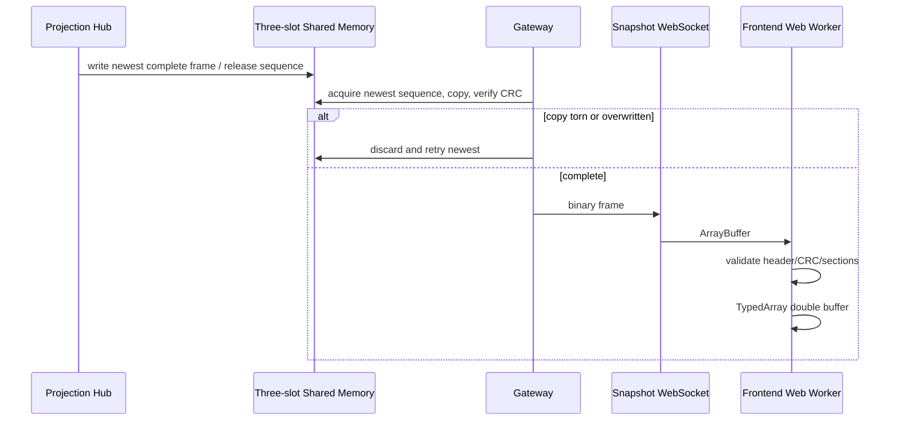
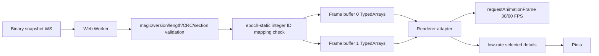
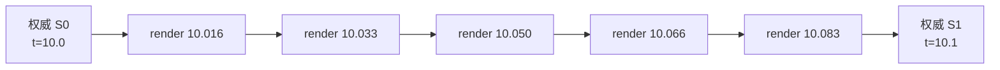

# ViewerSnapshot 外部合同

定义 ViewerSnapshot 帧、二进制 section、三槽共享内存、epoch-static Aircraft table、发布 cadence、latest-wins、Snapshot Worker 解码与浏览器 Hermite 补帧边界。

## 内容来源
- 设计：8.9–8.11
- 设计：9.12–9.13
- 设计：10.13–10.14
- 设计附录 F.14–F.16
- 设计附录 G.20

> 本文件是权威输入文档的分层视图。若拆分文本与源文档发生差异，以《LightBlueSky v8.0 统一设计规范》为系统设计与公开合同权威，以《HITL 大阶段切换规范》为当前项目阶段推进与人工验收权威。

## 关联文档

- [Binary Layouts](../../appendices/03-binary-layouts.md)
- [WebSocket](01-websocket.md)

## 规范正文

### 8.9 ViewerSnapshot cadence

在 `time_scale=1`：

| `dt_s` | Tick频率 | Snapshot频率 |
|---:|---:|---:|
| 0.05 | 20 Hz | 20 Hz |
| 0.1 | 10 Hz | 10 Hz |
| 0.2 | 5 Hz | 5 Hz |
| 0.5 | 2 Hz | 2 Hz |
| 1.0 | 1 Hz | 1 Hz |

加速运行：

```text
snapshot_publish_hz = min(time_scale / dt_s, 20 Hz)
```

规则：

1. 每个物理Tick完整计算和提交；
2. Projection Hub用确定性phase accumulator选择发布Tick；
3. 未发布Tick仍有完整权威状态，只是不生成live display frame；
4. 不得通过跳过物理Tick达到实时目标；
5. `snapshot_sequence`对每个物理Tick增加，live发布可以跳号。

**图 8-4　Tick 与 Snapshot cadence 时间轴（权威）**

```mermaid
gantt
    title dt=0.1, time_scale=5：50 physics Tick/s，最多20 Snapshot/s
    dateFormat X
    axisFormat %L
    section Physics
    Tick 1 :t1, 0, 1
    Tick 2 :t2, 1, 1
    Tick 3 :t3, 2, 1
    Tick 4 :t4, 3, 1
    Tick 5 :t5, 4, 1
    Tick 6 :t6, 5, 1
    section Snapshot
    Publish seq 1 :s1, 0, 1
    Skip seq 2 :s2, 1, 1
    Publish seq 3 :s3, 2, 1
    Skip seq 4 :s4, 3, 1
    Publish seq 5 :s5, 4, 1
```



图示只表达发布选择；实际phase accumulator必须由 `time_scale/dt_s` 和20 Hz上限确定，不得依赖wall scheduler随机性。

### 8.10 Latest-wins buffer

**图 8-5　latest-wins buffer 图（权威）**



Snapshot backpressure规则：

- writer不等待reader；
- Gateway只发送最新完整frame，可以跳过旧sequence；
- 任何torn/CRC失败frame丢弃并重读最新；
- Snapshot丢帧不得影响command/event/Read Model；
- 如果完整frame超过slot capacity，Build失败，不允许运行时截断；
- Projection Hub不生成补帧。

### 8.11 Epoch-static Aircraft table

ViewerSnapshot只携带integer Aircraft ID。Control WS发送：

```text
snapshot_static_table
  contract_version
  epoch_id
  entries[] {
    aircraft_int_u32
    aircraft_id
    profile_id
    model_type
    display_name
  }
```

Entries按integer ID严格递增且唯一。第一版Aircraft catalog在Build时固定，Runtime命令不能新增Aircraft identity，因此该table在epoch内固定，不维护generation。连接和重连时完整发送。

Frontend遇到未知integer ID必须暂停该frame并请求full-state resync，不得猜测映射。


### 9.12 Snapshot binary transport

**图 9-6　Snapshot binary transport sequence（权威）**



Gateway不逐Aircraft创建对象，只验证transport header/length/CRC并转发完整bytes。


### 9.13 Backpressure

#### Command ingress

- queue满：HTTP 429`COMMAND_QUEUE_FULL`；
- 不分配ingress sequence，不创建状态/event；
- Client按Error处理，不得显示QUEUED。

#### Internal authoritative egress

- Projection→Gateway queue 2 s无法写入：worker fail-stop；
- 不允许丢final CommandStatus、event或Read Model revision。

#### Client control WS

- per-connection queue满：Gateway断开慢客户端并记录日志；
- 模拟继续；断线期间event不保存供恢复；
- QUEUED/final CommandStatus可通过HTTP current cache查询。

#### Snapshot WS

- 只保留最新完整frame；
- 旧unsent frame直接替换；
- 不反压物理Tick。


### 10.13 Snapshot Worker 与 TypedArray

**图 10-6　Snapshot Worker → TypedArray → Renderer图（权威）**



Worker不得逐Aircraft建立普通JS对象。ArrayBuffer使用transferable ownership；renderer保持最近两个完整权威frame。Static Aircraft table在epoch内固定，连接和重连时完整替换。

### 10.14 Hermite补帧

只插值：

```text
Workspace position
Workspace velocity
由运动数据派生的heading
horizontal speed
vertical speed
```

不得插值：

```text
TaskLifecycle
TaskPhase
Aircraft Execution State
Aircraft Resource State
ReservationState / availability
VOL / AX state
destroyed
event
```

公式：

```text
s = clamp((render_t-t0)/(t1-t0),0,1)

p(s) =
  (2s^3-3s^2+1)p0
  +(s^3-2s^2+s)(t1-t0)v0
  +(-2s^3+3s^2)p1
  +(s^3-s^2)(t1-t0)v1
```

**图 10-7　Hermite补帧时间轴（权威）**



规则：

1. 只在相邻两个权威Snapshot之间插值；
2. 不外推未来；无新frame时保持最后状态；
3. 离散字段取已到达的最近权威frame；
4. RESET、重连、首次放置、销毁、teleport直接切换；
5. Hermite结果超出两端AABB加 `max_speed*(t1-t0)`包络时退化linear；
6. 中间frame只存在浏览器，不成为仿真事实；
7. Projection Hub不补帧。


### F.14 ViewerSnapshot three-slot shared memory

```text
SharedMemory
├── GlobalHeader 128 bytes
├── Slot 0: SlotHeader 64 + payload[slot_bytes]
├── Slot 1: SlotHeader 64 + payload[slot_bytes]
└── Slot 2: SlotHeader 64 + payload[slot_bytes]
```

GlobalHeader：

```text
+00 magic_u32                  # "LBS3" = 0x3353424C
+04 protocol_major_u16
+06 protocol_minor_u16
+08 header_bytes_u16          # 128
+10 slot_count_u16            # exactly 3
+12 slot_bytes_u32
+16 epoch_id_bytes[16]        # canonical UUID bytes
+32 published_sequence_u64
+40 writer_heartbeat_u64
+48 reader_last_sequence_u64
+56 dropped_snapshot_count_u64
+64 reserved[64]
```

SlotHeader：

```text
+00 committed_sequence_u64
+08 payload_bytes_u32
+12 crc32c_u32
+16 tick_index_u64
+24 t_s_f64
+32 viewer_major_u16
+34 viewer_minor_u16
+36 flags_u32
+40 epoch_id_bytes[16]        # must equal GlobalHeader epoch_id
+56 reserved[8]
```

Writer/reader使用release-acquire、before/copy/after双读和CRC；任何不一致丢弃并重读最新。

### F.15 ViewerSnapshot frame

Header 72 bytes：

| Offset | Type | Field |
|---:|---|---|
| 0 | u32 | magic`"LBSV" = 0x5653424C` |
| 4 | u16 | major=1 |
| 6 | u16 | minor=0 |
| 8 | u16 | header_bytes=72 |
| 10 | u16 | flags |
| 12 | u32 | frame_id |
| 16 | bytes[16] | `epoch_id_bytes`（canonical UUID） |
| 32 | u64 | sequence |
| 40 | u64 | tick_index |
| 48 | f64 | t_s |
| 56 | u32 | aircraft_count |
| 60 | u16 | section_count |
| 62 | u16 | directory_entry_bytes=16 |
| 64 | u32 | payload_bytes |
| 68 | u32 | crc32c |

Required sections：

| Code | Field | Type/components |
|---:|---|---|
| `0x0001` | aircraft_id | U32/1 |
| `0x0002` | task_id | I32/1 |
| `0x0003` | workspace_position | F32/3 |
| `0x0004` | workspace_velocity | F32/3 |
| `0x0005` | heading_rad | F32/1 |
| `0x0006` | horizontal_speed_mps | F32/1 |
| `0x0007` | vertical_speed_mps | F32/1 |
| `0x0008` | aircraft_execution_state | U8/1 |
| `0x000A` | flags | U16/1 |
| `0x000B` | owner_workcell_id | U32/1 |

`0x0009`保留。Row按Aircraft integer ID升序，只包含`placed && resource_state != DESTROYED`。ViewerSnapshot不包含Subphase、TaskLifecycle/TaskPhase、AircraftResourceState、reservation、event或controller。

### F.16 Snapshot static table

Control WS JSON，strict：

```json
{
  "type": "snapshot_static_table",
  "protocol_version": "1.0.0",
  "epoch_id": "...",
  "contract_version": "1.0.0",
  "entries": [
    {
      "aircraft_int": 17,
      "aircraft_id": "AC101",
      "profile_id": "FW-A",
      "model_type": "fixed_wing",
      "display_name": "AC101"
    }
  ]
}
```

Entries按aircraft_int严格递增且唯一。无`generation`字段；epoch内固定。


### G.20 Snapshot WS hello

Client：

```text
type = hello
protocol_version = 1.0.0
epoch_id
```

Server先发送JSON metadata：

```text
type = snapshot_hello
protocol_version
epoch_id
viewer_snapshot_contract_version
workspace_origin_ecef_f64[3]
workspace_enu_to_ecef_rotation_f64[9]
latest_sequence
```

随后只发送binary ViewerSnapshot frame。Static table通过control WS完整发送，无generation。
