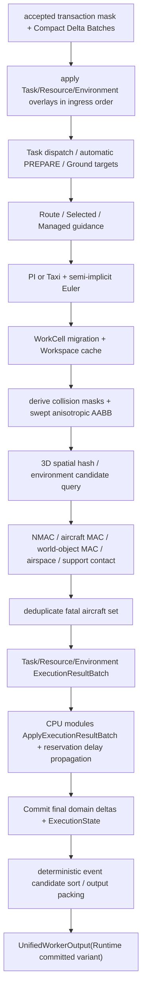

# Execution Batch 二进制合同

定义 ExecutionInputBatch、DomainDeltaRow、ExecutionOutputBatch、CompactEventCandidate、CommandResultRow、固定 Tick 顺序、候选排序与 authoritative overflow 语义。

## 内容来源
- 设计：7.6、7.28、7.30
- 设计附录 F.10–F.11

> 本文件是权威输入文档的分层视图。若拆分文本与源文档发生差异，以《LightBlueSky v8.0 统一设计规范》为系统设计与公开合同权威，以《HITL 大阶段切换规范》为当前项目阶段推进与人工验收权威。

## 关联文档

- [Committed Output](02-committed-output.md)
- [Binary Layouts](../../appendices/03-binary-layouts.md)

## 规范正文

### 7.6 固定 Tick 计算顺序

**图 7-2　完整 Tick 计算 flowchart（权威）**



顺序不得因CPU/CUDA Backend改变：

1. 同Tick accepted command delta在movement前应用；
2. world collision临时mask在command/resource transition后、integration前确定；
3. collision使用old→new swept state；
4. 同Tick先形成全部MAC，再统一fatal set；
5. fatal consequence、Resource BLOCKED和reservation延误传播在同一generation提交；
6. event、Read Model和ViewerSnapshot观察同一committed generation。


### 7.28 Deterministic candidate ordering

同Tick event candidate排序key固定为：

```text
(
  ordering_class_u8,
  event_code_u16,
  primary_subject_int_u32,
  secondary_subject_int_u32,
  task_int_u32,
  resource_int_u32,
  canonical_ingress_sequence_u64,
  candidate_local_sequence_u32
)
```

Ordering class：

| class | 内容 |
|---:|---|
| 10 | final command status event：`command_accepted` / `command_unable` |
| 20 | runtime / VOL / AX mutation fact |
| 30 | Task lifecycle/phase、route、constraint、Aircraft execution fact；不含 `task_interrupted` |
| 40 | NMAC / aircraft MAC / world-object MAC / airspace violation |
| 50 | Aircraft destroyed 与 `task_interrupted` |
| 60 | Resource reservation/state/owner/occupancy/availability consequence |
| 70 | `realtime_overrun` / diagnostics |

同一 ordering class 内，`event_code` 是稳定排序键的一部分，必须按业务因果顺序递增分配：一旦两个 event 可能在同一 generation 同时出现，必然先发生的 event 必须具有更小的 `event_code`。新增 event 必须插入到符合因果顺序的位置，不得简单追加在末尾。若当前 code 区间无法在不改变已正式发布 code 语义的情况下插入，则必须提升 event contract major version。

第一版 active registry 的 class 内审计结果：

- class 10 的 `command_accepted` 与 `command_unable` 互斥，不形成同一命令的因果链；code 只提供稳定顺序。
- class 20 的每个 runtime/VOL/AX mutation最多发布一个对应事实；不同 mutation没有强制跨对象因果先后。
- class 30 通过“首次 `task_started` 不伴随 phase event”和“terminal event 不伴随 phase event”消除了重复因果对；对应 Task phase 与 Aircraft execution phase 是同一原子提交中的并列事实，不定义 producer-before 关系，其 code 仅提供稳定顺序。
- class 40 中 `aircraft_aircraft_nmac` 的 code 小于两类 MAC；当同 Tick 同一 pair先进入 NMAC 再发生 MAC 时，NMAC 排在 MAC 前。airspace violation与碰撞无强制因果关系。
- class 50 中 `aircraft_destroyed_by_aircraft_mac=0x1A01`、`aircraft_destroyed_by_world_object_mac=0x1A02`，均小于 `task_interrupted=0x1A10`。
- class 60 固定为 reservation change、reservation state change、owner change、occupancy change、availability change 的递增 code；该顺序覆盖自动 PREPARE、关闭和 fatal Resource consequence。
- class 70 当前只有 `realtime_overrun`。

同一事故中固定顺序为：

```text
class 40 MAC
-> class 50 aircraft_destroyed (0x1A01 / 0x1A02)
-> class 50 task_interrupted (0x1A10)
-> class 60 Resource consequence
```

不再存在额外事件排序字段。QUEUED不对应event，也不参与candidate ordering。Gateway Error永远不进入candidate ordering。


### 7.30 Candidate overflow 与 fail-stop

Authoritative candidate/command/result buffer capacity在Build时预分配。以下任何overflow：

```text
event candidate
fatal candidate
command result
Task/Resource/Environment result batch
route/ground/reservation mutable Arena
required Runtime committed output section
```

必须设置overflow flag，Abort current generation并进入WORKER_FAILED，reason=`AUTHORITATIVE_CANDIDATE_OVERFLOW`或更具体system fault。不得截断、随机丢弃或只保留前N条。

预声明业务Arena在command candidate reservation阶段发现容量不足时，可以在没有写入任何row前返回业务UNABLE `CAPACITY_EXCEEDED`；一旦进入Runtime authoritative output阶段发生overflow，必须fail-stop。

ViewerSnapshot slot过小必须在Build失败，不允许运行时截断Aircraft。


### F.10 ExecutionInputBatch

Header 72 bytes：

```text
+00 magic_u32                    # "LBIN" = 0x4E49424C
+04 protocol_major_u16           # 1
+06 protocol_minor_u16           # 0
+08 header_bytes_u16             # 72
+10 flags_u16
+12 reserved0_u32                # zero
+16 epoch_id_bytes[16]           # canonical UUID bytes；不得截断或折叠
+32 apply_tick_u64
+40 transaction_count_u32
+44 delta_row_count_u32
+48 row_table_offset_u32
+52 int_payload_offset_u32
+56 float_payload_offset_u32
+60 byte_payload_offset_u32
+64 total_bytes_u32
+68 crc32c_u32                    # zero in-process
```

`DomainDeltaRow` 48 bytes：

```text
+00 operation_code_u16
+02 participant_mask_u8
+03 domain_kind_u8               # TASK=1 RESOURCE=2 ENVIRONMENT=3 CONTROL=4
+04 transaction_slot_u32
+08 canonical_ingress_sequence_u64
+16 target_id_i32
+20 flags_u32
+24 int_offset_u32
+28 int_count_u16
+30 reserved0_u16
+32 float_offset_u32
+36 float_count_u16
+38 reserved1_u16
+40 byte_offset_u32
+44 byte_count_u16
+46 reserved2_u16
```

Backend不解析JSON。


### F.11 ExecutionOutputBatch

Header 88 bytes：

```text
+00 magic_u32                    # "LBOT" = 0x544F424C
+04 protocol_major_u16
+06 protocol_minor_u16
+08 header_bytes_u16             # 88
+10 flags_u16
+12 crc32c_u32                   # zero in-process
+16 epoch_id_bytes[16]           # canonical UUID bytes
+32 completed_tick_u64
+40 working_generation_u64
+48 trace_token_u64
+56 event_candidate_count_u32
+60 command_result_count_u32
+64 task_result_count_u32
+68 resource_result_count_u32
+72 environment_result_count_u32
+76 row_table_offset_u32
+80 total_bytes_u32
+84 overflow_flags_u32
```

`CompactEventCandidate` 32 bytes：

```text
+00 event_code_u16
+02 severity_u8
+03 flags_u8
+04 subject_kind_u8
+05 related_kind_u8
+06 payload_schema_u16
+08 subject_id_i32
+12 related_id_i32
+16 task_id_i32
+20 resource_id_i32
+24 payload_offset_u32
+28 payload_bytes_u16
+30 reason_code_u16
```

`CommandResultRow` 32 bytes：

```text
+00 transaction_slot_u32
+04 status_u8                    # ACCEPTED / UNABLE only
+05 flags_u8
+06 reason_code_u16
+08 canonical_ingress_sequence_u64
+16 result_offset_u32
+20 result_bytes_u32
+24 final_generation_u64
```

`overflow_flags!=0`为authoritative fault。
