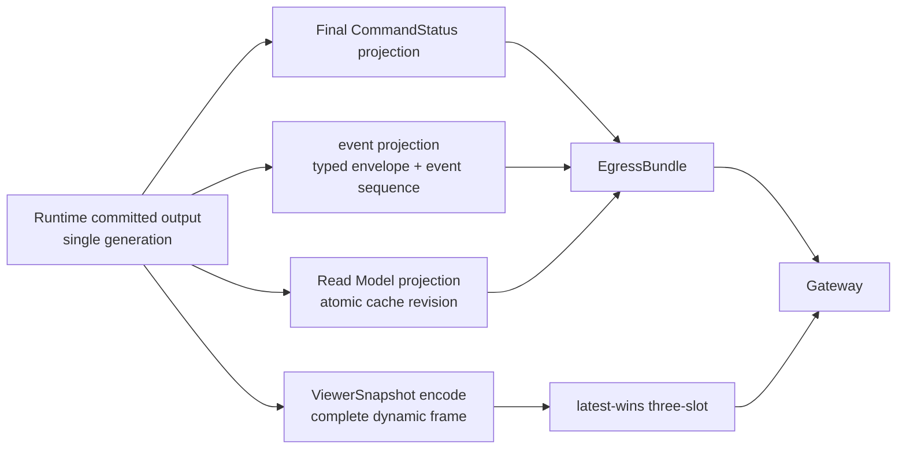
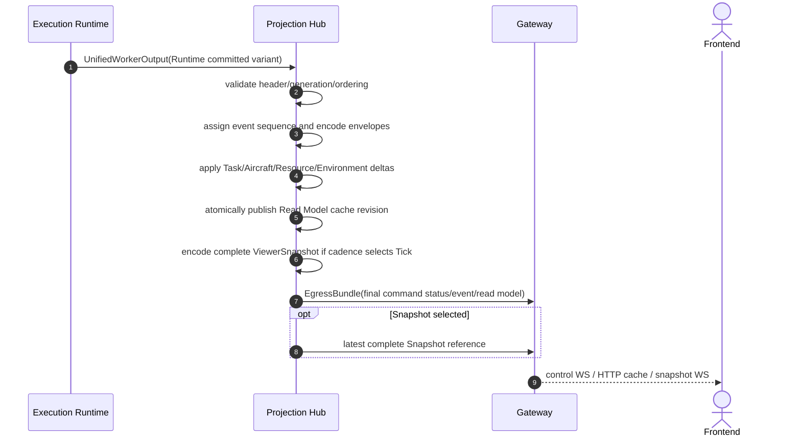

# Committed Output 合同

定义 UnifiedWorkerOutput 的 Build progress、Build failed、Runtime committed、Worker failed latch 四种 variant，以及 EgressBundle、generation validation 和 fault repeat。

## 内容来源
- 设计：7.27
- 设计：8.1–8.4
- 设计附录 F.12
- 设计附录 G.21

> 本文件是权威输入文档的分层视图。若拆分文本与源文档发生差异，以《LightBlueSky v8.0 统一设计规范》为系统设计与公开合同权威，以《HITL 大阶段切换规范》为当前项目阶段推进与人工验收权威。

## 关联文档

- [Projection Hub](../../backend/05-projection-hub.md)
- [Worker IPC](03-worker-ipc.md)

## 规范正文

### 7.27 UnifiedWorkerOutput

Worker向Projection Hub只使用一个one-way tagged union：

```text
UnifiedWorkerOutput
  BUILD_PROGRESS
  BUILD_FAILED
  RUNTIME_COMMITTED
  WORKER_FAILED_LATCH
```

#### Runtime committed variant

至少包含：

```text
canonical epoch_id UUID 128-bit / completed tick / t_s / committed_generation
final command status rows
sorted event candidate rows
Task projection source delta
Aircraft projection source arrays
Resource projection source delta
Environment projection source delta
ViewerSnapshot complete dynamic sections
static Aircraft table reference
trace evidence
health / overflow flags
```

QUEUED不进入该buffer；它由Gateway admission作为control message发送。Runtime committed variant不得包含working pointer。

#### Build variant

Build progress/failure使用同一Worker output tagged union，不建立独立BuildOutcome接口：

```text
scenario_id
build_request_id
outcome                    # BUILD_PROGRESS / BUILD_FAILED
stage_code?
progress_permille?
issues?
build_summary?
```

Build variant没有epoch、generation、CommandStatus、event、Read Model或ViewerSnapshot。READY必须通过generation 0的Runtime committed variant发布。

#### Fault repeat

若working generation已Abort且last committed arrays仍安全可读，可以发布`WORKER_FAILED_LATCH`：

```text
last committed watermark
fault health
no command final
no domain delta
no new Snapshot
```

若无法形成该variant，Gateway supervisor发送transport-level failure notification，不伪造CommandStatus。

Static Aircraft table在epoch内固定，连接与重连时完整发送，不维护generation。第一版Runtime不会新增Aircraft identity；ADD_TASK只引用Build时已有Aircraft。


### 8.1 模块目标

Projection Hub是已提交事实到公开输出的唯一投影层。对已建立epoch的Runtime output，它只读committed generation，生成：

```text
final CommandStatus
realtime event
Task Read Model
Aircraft Read Model
Resource Read Model
Environment Read Model
Runtime Read Model
ViewerSnapshot
epoch-static Aircraft table
Gateway public query cache payload
```

Projection Hub不参与业务判断，不接受命令，不修改领域状态，不读取working generation，不向Execution Runtime反向控制，也不做浏览器插值。

统一Worker output的Build progress/failure variant只作协议校验和透传，不创建CommandStatus、event、Read Model或Snapshot。QUEUED由Gateway admission直接发送为command status control message，不经过Event Sequencer。

### 8.2 UnifiedWorkerOutput 输入

Projection Hub每次处理一个完整tagged variant。

Runtime committed variant至少验证：

```text
full epoch_id_bytes[16] matches the current canonical epoch_id
generation == expected committed_generation
tick_index/t_s monotonic or valid control-generation repeat
all required section lengths valid
final command status rows unique
candidate ordering key nondecreasing
Task/Resource/Environment source generation equal
ViewerSnapshot aircraft rows sorted
no authoritative overflow flag
```

跨进程或shared-memory物理transport还必须验证CRC；同进程typed handle不要求CRC。

任一Runtime invariant不满足属于protocol/system failure，Projection Hub不得猜测修复或输出部分状态。`WORKER_FAILED_LATCH`只更新fault/last watermark，不生成command final或覆盖Read Model。

Build variant独立验证`scenario_id/build_request_id/outcome/issues/summary`，不参与generation monotonicity。

### 8.3 输出分支

**图 8-1　Runtime committed output分支图（权威）**



Epoch-static Aircraft table不按generation增量更新；连接与重连时由Gateway从当前epoch cache完整发送。

### 8.4 Projection sequence

**图 8-2　Projection sequence（权威）**




### F.12 UnifiedWorkerOutput

Common header 96 bytes：

```text
+00 magic_u32                    # "LBWO" = 0x4F57424C
+04 contract_major_u16           # 1
+06 contract_minor_u16           # 0
+08 header_bytes_u16             # 96
+10 variant_u8                   # 1 PROGRESS / 2 FAILED / 3 RUNTIME / 4 FAULT
+11 flags_u8
+12 crc32c_u32                   # zero in-process; populated for IPC bytes
+16 epoch_id_bytes[16]           # all zero for Build variants; nonzero canonical UUID for Runtime/Fault
+32 generation_u64               # zero for Build variants
+40 tick_index_u64               # zero for Build variants
+48 t_s_f64                      # zero for Build variants
+56 section_count_u16
+58 directory_entry_bytes_u16    # 24
+60 directory_offset_u32
+64 total_bytes_u32
+68 reserved0_u32
+72 trace_token_u64
+80 reserved1_u64
+88 reserved2_u64
```

Directory entry 24 bytes：

```text
+00 section_code_u16
+02 element_type_u8
+03 components_u8
+04 offset_u32
+08 count_u32
+12 byte_length_u32
+16 source_generation_u64
```

Build sections：

| Code | Section |
|---:|---|
| `0x0101` | scenario_id UTF-8 |
| `0x0102` | build_request_id UTF-8 |
| `0x0103` | progress/summary canonical JSON |
| `0x0104` | issues canonical JSON |

Runtime sections：

| Code | Section |
|---:|---|
| `0x1001` | final CommandStatus rows |
| `0x1002` | sorted event candidates |
| `0x2001` | Task projection source delta |
| `0x2002` | Aircraft projection source arrays |
| `0x2003` | Resource projection source delta |
| `0x2004` | Environment projection source delta |
| `0x3001` | ViewerSnapshot dynamic source arrays |
| `0x4001` | Runtime health/overrun counters |

Fault variant只允许`0x4001`。Build variants不包含epoch/generation/CommandStatus/event/Read Model/Snapshot。


### G.21 EgressBundle internal model

Build variant：

```text
contract_version
scenario_id
build_request_id
outcome                    # BUILDING / BUILD_FAILED
issues[]
build_summary?
```

Runtime variant：

```text
contract_version
epoch_id
committed_generation
control_sequence_from
control_sequence_until
final_command_status_messages[]
events[]
read_model_cache_revision
read_model_delta?
latest_snapshot_sequence?
```

QUEUED command status不在Runtime Egress中。
