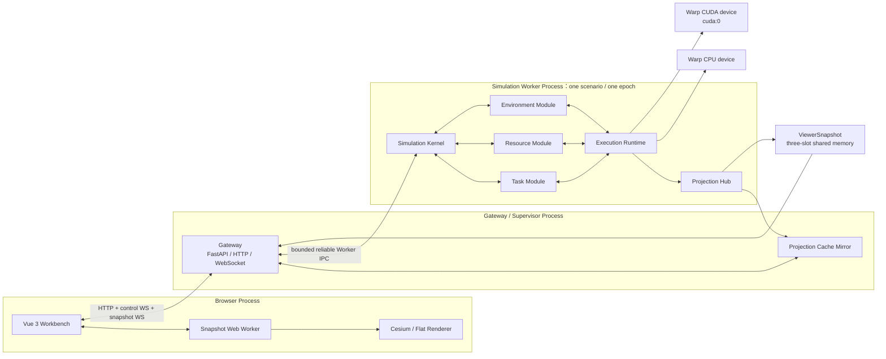
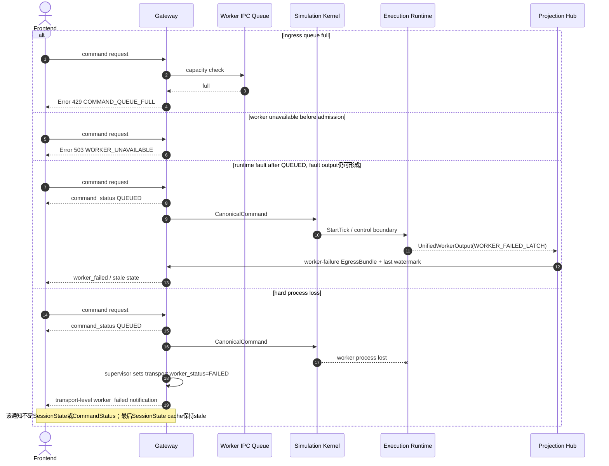

# Worker IPC 合同

定义 Gateway/Supervisor 与 Worker 之间的 ReliableMessageHeader、消息类型、FIFO sequence、CRC32C、协议版本、可靠 egress、queue stall 与 worker failure。

## 内容来源
- 设计：2.3
- 设计：8.13
- 设计：9.13–9.15
- 设计附录 F.13

> 本文件是权威输入文档的分层视图。若拆分文本与源文档发生差异，以《LightBlueSky v8.0 统一设计规范》为系统设计与公开合同权威，以《HITL 大阶段切换规范》为当前项目阶段推进与人工验收权威。

## 关联文档

- [Module Ports](00-module-ports.md)
- [Committed Output](02-committed-output.md)

## 规范正文

### 2.3 物理部署

**图 2-3　物理部署图（权威）**



部署规则：

1. Gateway 不执行 FlightCore、碰撞、空域或 Warp Tick。
2. 一个 worker 同时只运行一个 scenario/epoch；一台设备可以启动多个隔离 worker，但第一版不承诺 GPU memory 自动仲裁。
3. Worker 内包含 Kernel、三个领域模块、Projection Hub 和 Execution Runtime；Host 逻辑与 Warp device 只是其内部组成。
4. Worker crash 不得终止 Gateway。若Kernel仍能提交fault latch，由Kernel权威进入WORKER_FAILED；若为无输出的hard process loss，Gateway只把transport `worker_status`标记为FAILED、拒绝新Mutation并保留最后Projection cache，不得合成SessionState或Command final。
5. 第一版正式本机平台以 Windows 为一级支持；Linux 可运行，macOS 延期。
6. 浏览器和 Warp CUDA 不允许直接连接；Gateway 是唯一公共边界。


### 8.13 Reliable control output

Projection Hub→Gateway使用bounded reliable Worker IPC：

- FIFO、CRC、protocol major握手；
- authoritative EgressBundle不能丢；
- 2 s内无法写入Gateway queue时fail-stop`RELIABLE_EGRESS_STALLED`；
- Gateway与Frontend control WS连接存在时按序发送final CommandStatus、event和Read Model；
- QUEUED status由Gateway admission立即发送，不经过该IPC往返；
- 慢客户端超过per-connection queue上限时Gateway断开该客户端，模拟可继续；
- 断开后event不保存供恢复；
- CommandStatus仍可从当前epoch command cache查询。


### 9.13 Backpressure

#### Command ingress

- queue满：HTTP 429`COMMAND_QUEUE_FULL`；
- 不分配ingress sequence，不创建状态/event；
- Client按Error处理，不得显示QUEUED。

#### Internal authoritative egress

- Projection→Gateway queue 2 s无法写入：worker fail-stop；
- 不允许丢final CommandStatus、event或Read Model revision。

#### Client control WS

- per-connection queue满：Gateway断开慢客户端并记录日志；
- 模拟继续；断线期间event不保存供恢复；
- QUEUED/final CommandStatus可通过HTTP current cache查询。

#### Snapshot WS

- 只保留最新完整frame；
- 旧unsent frame直接替换；
- 不反压物理Tick。

### 9.14 Queue full / worker failure

**图 9-7　queue full / worker failure sequence（权威）**



### 9.15 Protocol version

| 合同 | 第一版 |
|---|---|
| input Schema | `1.0.0` |
| HTTP/OpenAPI | `/api/v1`, contract `1.0.0` |
| Staged Preview | `1.0.0` |
| CanonicalCommand | `1.0.0` |
| event | `1.0.0` |
| control WS | `1.0.0` |
| ViewerSnapshot | `1.0.0` |
| Worker IPC | `1.0.0` |

本次将草案中的64-bit epoch占位字段改为完整128-bit `epoch_id`，并删除辅助事件排序字段、调整event code，发生在首个 `1.0.0` 正式发布前，因此上表仍定义首发 `1.0.0`。不存在需要兼容的已发布旧布局。正式发布后，同major只能增加明确optional字段/消息；改变required字段、枚举意义、binary offset、event code语义或接口方向必须提升major。未知major明确拒绝。


### F.13 ReliableMessageHeader（Worker IPC）

32 bytes：

```text
+00 magic_u32                    # "LBIP" = 0x5049424C
+04 protocol_major_u16
+06 protocol_minor_u16
+08 message_type_u16
+10 flags_u16
+12 reserved0_u32
+16 sequence_u64
+24 payload_bytes_u32
+28 crc32c_u32
```

Message type：

| Code | Type |
|---:|---|
| `0x0001` | BUILD_REQUEST |
| `0x0002` | WORKER_OUTPUT_BUILD |
| `0x0010` | CANONICAL_COMMAND |
| `0x0011` | CONTROL_REQUEST |
| `0x0020` | EGRESS_BUILD |
| `0x0021` | EGRESS_RUNTIME |
| `0x0030` | HEARTBEAT |
| `0x0031` | WORKER_HEALTH |
| `0x00F0` | SHUTDOWN_REQUEST |
| `0x00F1` | SHUTDOWN_ACK |
| `0x00FF` | PROTOCOL_FAULT |

FIFO按header sequence。Unknown major拒绝handshake。所有跨进程payload验证CRC。
