# 前端需求

定义第一版 Vue Workbench、Loader、Workbench 核心视图、交互、状态显示、HTTP/WS 对接、浏览器渲染、TypedArray 与 Hermite 边界。当前 HITL Backend/Core 阶段延期实现，但需求本身仍完整保留。

## 内容来源
- HITL：0 范围说明、7.1 当前不测试内容
- 设计：第 10 章 Frontend 设计
- 设计：9.9–9.16 HTTP/WS 浏览器对接
- 设计附录 I.6、I.11 前端性能与合同测试

> 本文件是权威输入文档的分层视图。若拆分文本与源文档发生差异，以《LightBlueSky v8.0 统一设计规范》为系统设计与公开合同权威，以《HITL 大阶段切换规范》为当前项目阶段推进与人工验收权威。

## 关联文档

- [HTTP API](../contracts/external/00-http-api.md)
- [WebSocket](../contracts/external/01-websocket.md)
- [ViewerSnapshot](../contracts/external/04-viewer-snapshot.md)

## 规范正文

## 当前阶段延期声明

### 0. 范围说明

本文用于划分 LightBlueSky 的大开发阶段，并定义每个阶段切换前应由 AI 完成的测试和应提交给人的审查材料。

当前明确延期：

- HTTP Adapter；
- control WebSocket Adapter；
- snapshot WebSocket Adapter；
- Vue Workbench；
- 浏览器 Snapshot Worker；
- Cesium/Flat Renderer；
- 浏览器插值、交互和可视化测试。

当前仍必须实现和验证：

- Gateway Core；
- CanonicalCommand、CanonicalQuery 和 Gateway Error；
- CommandReceipt 和 CommandStatusView；
- event registry、event candidate、event ordering 和 event envelope；
- Read Model；
- EgressBundle；
- ViewerSnapshot binary ABI；
- snapshot static table；
- Python、TypeScript 和 Warp 的合同一致性。

所有测试均通过机器可观察的输入和输出完成，不依赖前端界面或视觉判断。

通过本文全部阶段表示核心后端达到 **Backend/Core Milestone**，不等同于设计规范定义的完整第一版产品发布。

---


### 7.1 当前不测试的内容

因为 HTTP、WebSocket 和前端延期，本阶段不测试：

- HTTP route 和 status；
- control WS；
- snapshot WS；
- 网络重连和慢客户端；
- 浏览器 Snapshot decode；
- Vue/Pinia；
- Cesium/Flat Renderer；
- FPS/frame time；
- Hermite；
- accessibility；
- 浏览器 CSP/CORS。

这些项目只能标记为延期，不得标记为通过。


## 10. Frontend 设计

### 10.1 技术栈与边界

第一版正式前端：

```text
Vue 3
TypeScript strict
Pinia
Naive UI
CesiumJS for real_world_wgs84
custom Canvas/WebGL Flat Viewer for virtual_enu
Web Worker + TypedArray for ViewerSnapshot
Vitest + Vue Test Utils + Playwright
```

Frontend只拥有提示性校验、显示、交互和本地偏好。它不得拥有权威Task/Resource状态，不得直接连接Kernel/Execution Runtime，不得把插值结果写回仿真。

第一版产品静态UI文本、公开reason/message、日志和正式示例统一使用英文；本文继续用中文约束语义。Windows一级支持浏览器为当前受支持的Chromium系Microsoft Edge与Google Chrome，正式E2E/发布证据必须记录实际版本。

高频Aircraft数组不得进入Vue/Pinia深层响应式对象。

### 10.2 工作台布局

```text
┌─────────────────────────────────────────────────────────────────────────┐
│ Loader / Runtime Status / Controls                                      │
├──────────────────┬────────────────────────────────┬─────────────────────┤
│ Realtime Events  │ Map                            │ Task / Resources    │
│                  │                                │ board               │
├──────────────────┴────────────────────────────────┴─────────────────────┤
│ CLI / Command Activity / Query Result                                  │
└─────────────────────────────────────────────────────────────────────────┘
```

建议尺寸：

```text
topbar: 72px
body columns: events 320px | map minmax(480px,1fr) | entity 440px
command dock: clamp(180px,28vh,320px)
formal workstation viewport: >=1280×720
```

Panel宽度和Dock高度可拖动并存浏览器本地偏好。

### 10.3 Frontend component tree

**图 10-1　Frontend component tree（权威）**

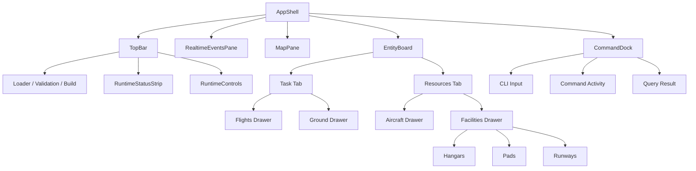

### 10.4 Pinia Store 边界

**图 10-2　Pinia Store 边界图（权威）**

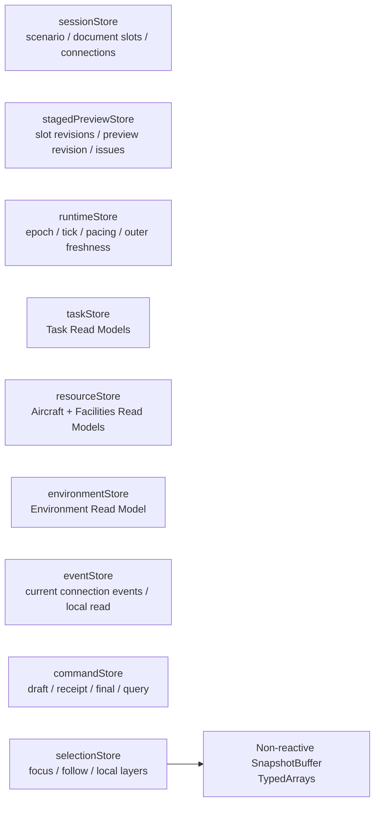

| Store | 可以包含 | 禁止 |
|---|---|---|
| sessionStore | scenario、DocumentSlot、Build/connection | Aircraft dynamic arrays |
| stagedPreviewStore | slot revisions、preview revision、layer、issue、selection detail | 历史下游文档、epoch/Tick |
| runtimeStore | epoch、tick、t_s、time scale、Backend、outer freshness | device state |
| taskStore | Task list/detail/flight/ground subview | per-frame position array、对象内freshness |
| resourceStore | Aircraft资源视角、Facility Resource | controller/integrator、服务端聚合状态标签 |
| environmentStore | map/overlay/index summary | raw DEM/building data |
| eventStore | 当前连接event、filters、本地已读 | server ACK/history assumption |
| commandStore | original/canonical、Error/QUEUED/final、Query result | hidden default Aircraft |
| selectionStore | selected IDs、camera、follow、layer | CanonicalCommand side effect |

SnapshotBuffer位于Web Worker/renderer adapter，不由Pinia深度跟踪。

### 10.5 前端数据流

**图 10-3　HTTP/control WS/snapshot WS前端数据流图（权威）**

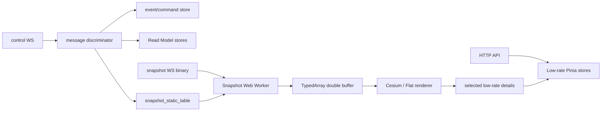

Staged loading期间只启用HTTP→stagedPreviewStore→Map/Entity/ValidationIssueList，不建立Runtime control/snapshot WS。

### 10.6 Loader / staged loading UI

**图 10-4　staged loading UI flowchart（权威）**

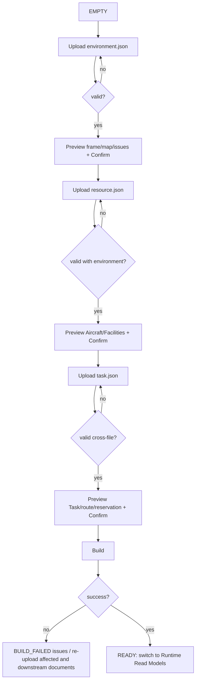

每个step显示：

```text
file name / bytes / schema version
slot_revision_u64
DocumentSlotState
validation counts
confirm/re-upload action
```

规则：

- 有error禁用Confirm；有warning时Confirm文案明确接受当前slot revision；
- environment重新上传时resource/task立即清空；resource重新上传时task立即清空；
- 不保留旧下游文档，不自动重新校验；
- summary、collection、detail、issue必须同一preview revision；
- BUILDING冻结upload，只显示progress/issues；
- READY清空staged交互状态并切换Runtime cache。

### 10.7 Runtime Controls

| SessionState | Start | Pause | Resume | Rate | Stop | Reset | Domain command | Query |
|---|---:|---:|---:|---:|---:|---:|---:|---:|
| staged/build | 否 | 否 | 否 | 否 | 否 | 否 | 否 | preview only |
| READY | 是 | 否 | 否 | 否 | 否 | 否 | **否** | 是 |
| RUNNING | 否 | 是 | 否 | 正allowed scale | 是 | 否 | 是 | 是 |
| PAUSED | 否 | 否 | 是 | 保存正resume rate | 是 | 否 | 可提交，等待Resume | 是 |
| STOPPED | 否 | 否 | 否 | 否 | 否 | 是 | 否 | 是 |
| WORKER_FAILED | 否 | 否 | 否 | 否 | 否 | 否 | 否 | last stale cache |

- 不提供Step、上一Tick、下一Tick控件。
- RATE 0不显示也不提交；暂停使用PAUSE。
- RESUME不携带RATE参数；用户先RATE再RESUME。

Stop确认：

```text
Stop simulation?
This ends the current epoch and it cannot be resumed. The current committed
state will be published. No server-side history or replay artifact is created.
[Cancel] [Stop]
```

Reset确认：

```text
Reset simulation?
This creates a new epoch from the confirmed three-file build basis. Runtime-added
Tasks, VOL/AX overlays, destruction latches and tombstones do not carry over.
[Cancel] [Reset]
```

### 10.8 Map

Local controls：

```text
2D/3D / FIT / zoom / pan / rotate
Focus / Follow / Unfollow
Aircraft / trail / route / Facility / building / obstacle / airspace / event layers
model / Task phase / warning / selected-only filters
```

全部是Frontend local state。Obstacle和airspace必须不同图层/图例；real-world显示正高，virtual显示virtual_u。

Map selection只能填充命令草稿，不得自动提交mutation。

### 10.9 Task 看板

```text
Task
├── Flights
└── Ground
```

#### Flights drawer

显示：

```text
task_id
TaskLifecycle
TaskPhase（仅RUNNING）
aircraft_id
origin / destination
schedule
route / active occurrence / constraints
remaining_route_count
held / delayed(derived) / blocking_reason
outer freshness watermark
```

#### Ground drawer

显示：

```text
PRE_GROUND / POST_GROUND
ground mode
ground segments
current ground segment
point/manual occurrence cursor / progress
associated Facility Resource
blocking_reason
outer freshness watermark
```

Flights和Ground是同一Task的两个视图；不得创建独立顶层身份或状态。对象内部不保存freshness副本。

### 10.10 Resources 看板

```text
Resources
├── Aircraft
└── Facilities
    ├── Hangars
    ├── Pads
    └── Runway Ends
```

#### Aircraft drawer

资源视角：

```text
resource_state
model/capability/compatibility
AVAILABLE / ASSIGNED / EXECUTING / DESTROYED
current task_id
placed
registered/active/destroyed derived labels
linked execution state/position/velocity
cause of destruction
outer freshness watermark
```

#### Facilities drawer

```text
availability
Runway End static capability
Runway End operation permission
reservation state/base/effective/actual
owner task IDs
occupancy Aircraft IDs
Hangar logical lanes
blocking reason
outer freshness watermark
```

Frontend从availability、permission、owner和occupancy派生显示label；服务端不提供聚合状态标签字段。点击Resource只focus/highlight/open detail；Mutation通过CLI中的`RSRC SET`等操作。

### 10.11 Realtime Events Pane

显示当前连接期间的event：

```text
t_s / event sequence
severity
event_name
primary subject
reason/message
local read state
```

支持severity/event_name/object/time/local-read filters。点击event：

1. 本地focus subject；
2. 切换对应Task/Resources drawer；
3. 打开detail；
4. 不向服务器写ACK。

重连后显示明确connection boundary；不得声称旧event已恢复。QUEUED command status只显示在Command Activity，不进入Events Pane。

### 10.12 CLI Dock 与 Command Activity

CLI输入无hidden default Aircraft。Selection可以显式填充草稿，提交前可编辑。

Command Activity显示：

```text
command_id
original CLI / canonical operation
source
canonical_ingress_sequence?
submitted wall time / t_s snapshot
Gateway Error（若未入队）
QUEUED                    # Gateway command_status，不是event
唯一final ACCEPTED或UNABLE
reason_code/message/result
```

Query Result独立显示outer freshness，不进入CommandStatus timeline。

**图 10-5　CLI Command Activity sequence（权威）**

```mermaid
sequenceDiagram
    autonumber
    actor F as Frontend
    participant G as Gateway
    participant K as Simulation Kernel
    participant X as Execution Runtime
    participant P as Projection Hub
    F->>F: local parse hint / create draft row
    F->>G: CLI request
    alt Gateway Error
        G-->>F: Error; activity row marked not queued
    else Query
        G-->>F: FreshResponse; render Query Result
    else Command admitted
        G-->>F: command_status QUEUED; activity row queued
        G->>K: CanonicalCommand
        K->>X: accepted batch / generation
        X->>P: Runtime committed output
        P->>G: final command status + command event
        G-->>F: final ACCEPTED/UNABLE; update same row
    end
```

### 10.13 Snapshot Worker 与 TypedArray

**图 10-6　Snapshot Worker → TypedArray → Renderer图（权威）**

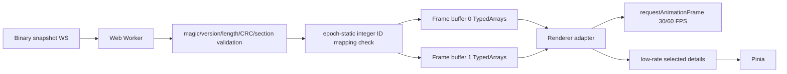

Worker不得逐Aircraft建立普通JS对象。ArrayBuffer使用transferable ownership；renderer保持最近两个完整权威frame。Static Aircraft table在epoch内固定，连接和重连时完整替换。

### 10.14 Hermite补帧

只插值：

```text
Workspace position
Workspace velocity
由运动数据派生的heading
horizontal speed
vertical speed
```

不得插值：

```text
TaskLifecycle
TaskPhase
Aircraft Execution State
Aircraft Resource State
ReservationState / availability
VOL / AX state
destroyed
event
```

公式：

```text
s = clamp((render_t-t0)/(t1-t0),0,1)

p(s) =
  (2s^3-3s^2+1)p0
  +(s^3-2s^2+s)(t1-t0)v0
  +(-2s^3+3s^2)p1
  +(s^3-s^2)(t1-t0)v1
```

**图 10-7　Hermite补帧时间轴（权威）**

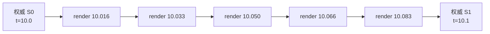

规则：

1. 只在相邻两个权威Snapshot之间插值；
2. 不外推未来；无新frame时保持最后状态；
3. 离散字段取已到达的最近权威frame；
4. RESET、重连、首次放置、销毁、teleport直接切换；
5. Hermite结果超出两端AABB加 `max_speed*(t1-t0)`包络时退化linear；
6. 中间frame只存在浏览器，不成为仿真事实；
7. Projection Hub不补帧。

### 10.15 Local state 与 Simulation state

**图 10-8　本地状态与仿真状态边界图（权威）**

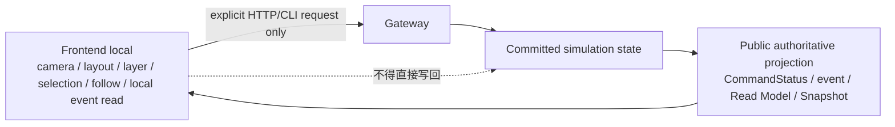

本地偏好存于localStorage/IndexedDB/Pinia persisted state，不参与Schema、Build或确定性结果。

### 10.16 Error 与连接状态

不可自动消失banner：

```text
worker disconnected / WORKER_FAILED
protocol mismatch
snapshot stale
control disconnected
event history unavailable after reconnect
Build failed
unknown snapshot static ID
upstream document changed; downstream upload required
```

不存在旧下游文档复用分支。

Snapshot freshness门槛：

- `lag <= 2/max(snapshot_publish_hz,1)`：normal；
- 超过该值：stale indicator；
- control断开：冻结最后frame并显示disconnected；
- epoch变化：清空旧buffers和selection映射。

### 10.17 可访问性

- 所有按钮有可见label与ARIA name；
- keyboard focus order完整；
- severity同时使用icon/text，不只靠颜色；
- virtual list提供screen-reader row summary；
- WCAG 2.1 AA对比度；
- map-only信息必须在drawer/text中有等价描述；
- Reduced motion preference可以降低本地动画，但不改变Snapshot/仿真频率。

### 10.18 本章状态所有权

Frontend只拥有本地交互、显示buffer、连接状态和提示性校验；所有仿真事实来自Gateway公开投影。

### 10.19 本章接口与不变量

1. Frontend只连接Gateway。
2. Snapshot arrays不进入深层Pinia。
3. Hermite不插值离散状态、不外推、不写回。
4. Task与Resources一级标签结构固定。
5. Events Pane只保证当前连接。
6. 无Replay/Recorder/Script控件。

### 10.20 本章性能和验收要点

- 20,000 Aircraft同卡稳态FPS `>=30`，frame-time p95 `<=33.3 ms`；
- browser snapshot decode p95 `<=8 ms`；
- 目标渲染30/60 FPS，Snapshot与renderer cadence解耦；
- mandatory tests：store边界、TypedArray零对象热路径、Hermite边界、staged revision atomic swap、CLI三分支、reconnect/no-history、a11y。

---


### 9.9 HTTP、control WS 与 snapshot WS

**图 9-4　HTTP + control WS + snapshot WS图（权威）**

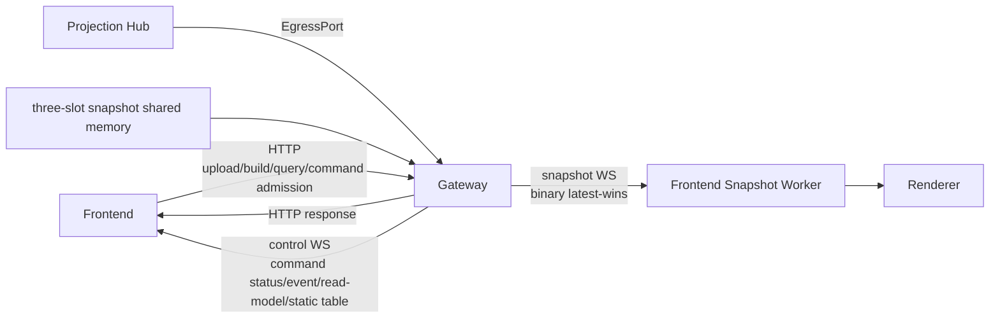

Endpoints：

```text
/ws/v1/scenarios/{scenario_id}/control
/ws/v1/scenarios/{scenario_id}/snapshot
```

### 9.10 control WebSocket

Client hello：

```json
{
  "type": "hello",
  "protocol_version": "1.0.0",
  "epoch_id": "..."
}
```

Server message type：

```text
hello
full_state
snapshot_static_table
event
command_status
read_model_delta
resync_required
heartbeat
worker_failed
protocol_error
```

每条携带`protocol_version`和`epoch_id`；event携带event sequence，其他有序control message使用独立control sequence。Unknown mandatory type或major mismatch断开。

连接建立时Gateway发送：

```text
hello
full_state(current atomic Read Model revision)
snapshot_static_table(full epoch table)
current nonterminal/recent CommandStatus cache
current warning projection
```

不发送断线前event历史。QUEUED CommandStatus可能来自Gateway admission cache；final来自Projection cache。

Heartbeat：server每5 s ping，15 s无响应断开。

### 9.11 Reconnect

**图 9-5　重连 sequence（权威）**

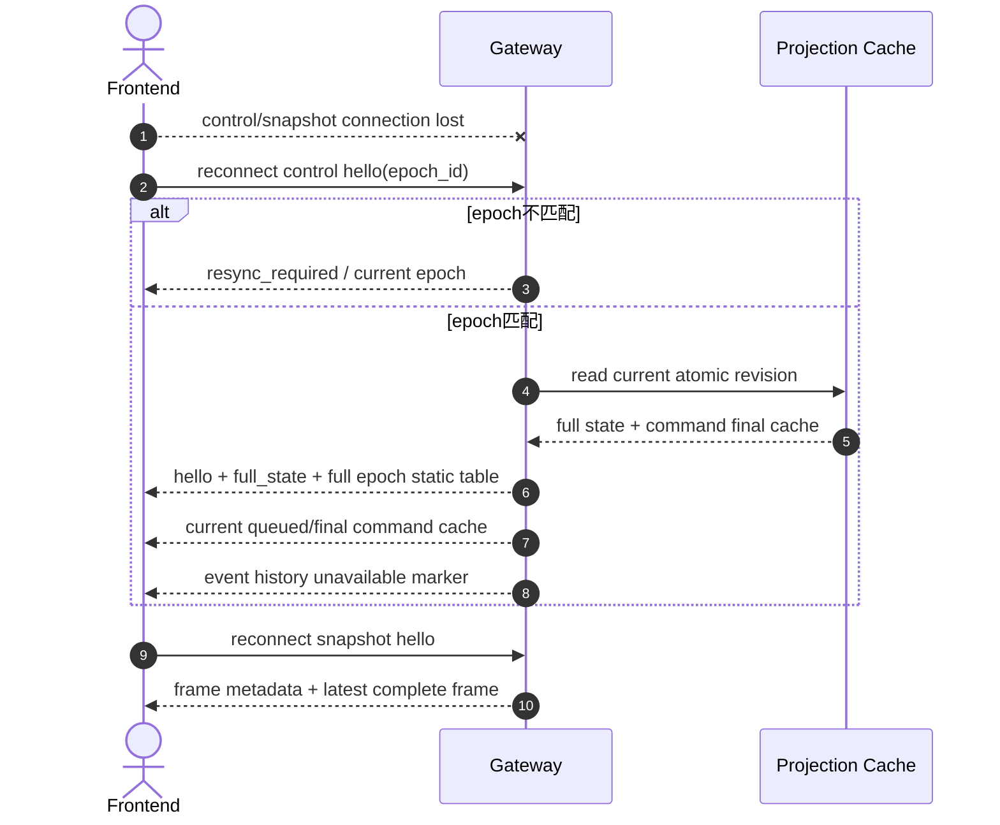

Frontend重连后清空旧连接Events Pane或明确分段显示；不得把新连接event与旧连接误当连续完整历史。

### 9.12 Snapshot binary transport

**图 9-6　Snapshot binary transport sequence（权威）**

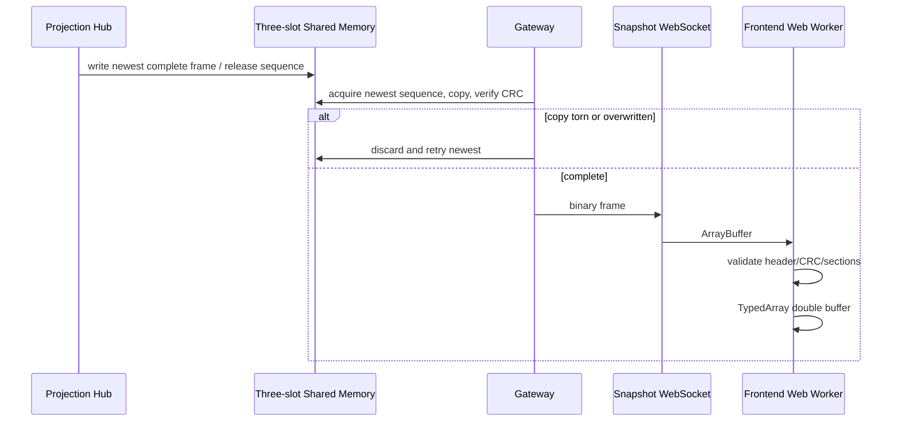

Gateway不逐Aircraft创建对象，只验证transport header/length/CRC并转发完整bytes。

### 9.13 Backpressure

#### Command ingress

- queue满：HTTP 429`COMMAND_QUEUE_FULL`；
- 不分配ingress sequence，不创建状态/event；
- Client按Error处理，不得显示QUEUED。

#### Internal authoritative egress

- Projection→Gateway queue 2 s无法写入：worker fail-stop；
- 不允许丢final CommandStatus、event或Read Model revision。

#### Client control WS

- per-connection queue满：Gateway断开慢客户端并记录日志；
- 模拟继续；断线期间event不保存供恢复；
- QUEUED/final CommandStatus可通过HTTP current cache查询。

#### Snapshot WS

- 只保留最新完整frame；
- 旧unsent frame直接替换；
- 不反压物理Tick。

### 9.14 Queue full / worker failure

**图 9-7　queue full / worker failure sequence（权威）**

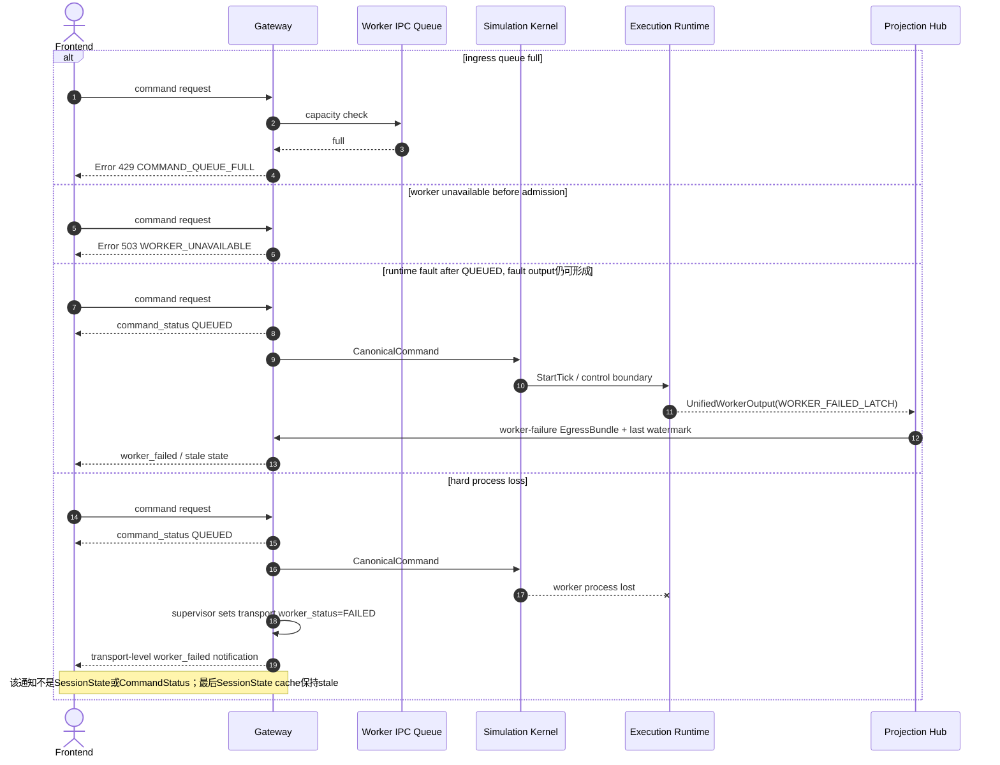

### 9.15 Protocol version

| 合同 | 第一版 |
|---|---|
| input Schema | `1.0.0` |
| HTTP/OpenAPI | `/api/v1`, contract `1.0.0` |
| Staged Preview | `1.0.0` |
| CanonicalCommand | `1.0.0` |
| event | `1.0.0` |
| control WS | `1.0.0` |
| ViewerSnapshot | `1.0.0` |
| Worker IPC | `1.0.0` |

本次将草案中的64-bit epoch占位字段改为完整128-bit `epoch_id`，并删除辅助事件排序字段、调整event code，发生在首个 `1.0.0` 正式发布前，因此上表仍定义首发 `1.0.0`。不存在需要兼容的已发布旧布局。正式发布后，同major只能增加明确optional字段/消息；改变required字段、枚举意义、binary offset、event code语义或接口方向必须提升major。未知major明确拒绝。

### 9.16 Gateway不读取GPU working array

所有public query只读Projection cache。Gateway不得提供：

```text
exact=true
device pointer/gather endpoint
blocking synchronize query
raw working generation dump
```

调试工具若需要内部gather，必须在非public build flag下通过独立internal message type，并且不得改变production timing/contract。


### I.6 性能通过标准

| Test | Pass criteria |
|---|---|
| Warp CPU 1,000 @ 1× | Tick wall time p99`<=dt_s`；10 min无backlog；离散parity通过。 |
| Warp CUDA 4,000 @ 5× | Tick wall time p99`<=dt_s/5`；10 min无backlog。 |
| Warp CUDA 20,000 @ 1× | Tick wall time p99`<=dt_s`；10 min无backlog。 |
| Viewer 20,000，同RTX 3070 | steady FPS`>=30`；frame-time p95`<=33.3 ms`。 |
| Snapshot server path | encode+shared-copy p95`<=5 ms`；无torn frame。 |
| Browser Snapshot Worker | CRC/section validation+TypedArray decode p95`<=8 ms`。 |
| Reliable control egress | final command/event/read-model bundle admission p99不超过一个Tick预算；不得丢失或重排。 |
| Three-file Build, 20k | 全部validation/index/allocation/self-check通过；报告peak memory和stage time。 |
| STOP drain | 无active工作时一个control boundary完成；有propagation/Recovery时按条件排空。 |

性能不足不得通过降低规定工作量或删除authoritative output绕过。


### I.11 Gateway、API与前端合同测试

- OpenAPI与generated client一致；
- API tree不含top-level Flight、history、artifact、Replay、Script；
- upload/confirm/Build、slot revision、upstream clearing、revision mismatch；
- HTTP Error与CommandStatus分离；
- CLI exact spellings，removed spellings拒绝；
- RATE positive、RESUME无参数、READY no mutation；
- control WS hello/full_state/event/command_status/read_model_delta/resync；
- QUEUED不进入event pane；
- Snapshot static table无generation；
- no GPU working-array query；
- Pinia不保存高频arrays或对象内freshness；
- Resource UI无服务端聚合状态标签；
- Hermite只连续字段；
- reconnect无event history；
- accessibility门槛。
